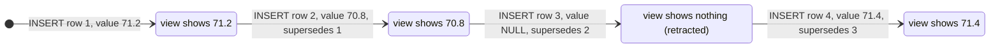
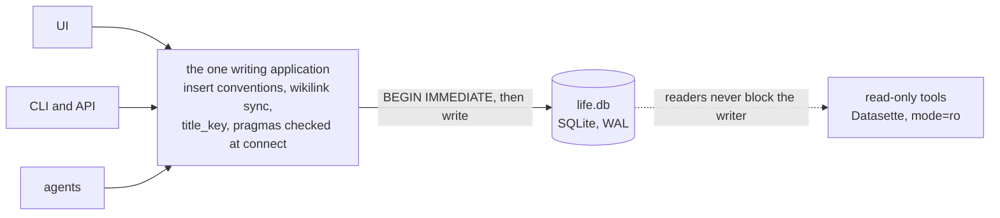
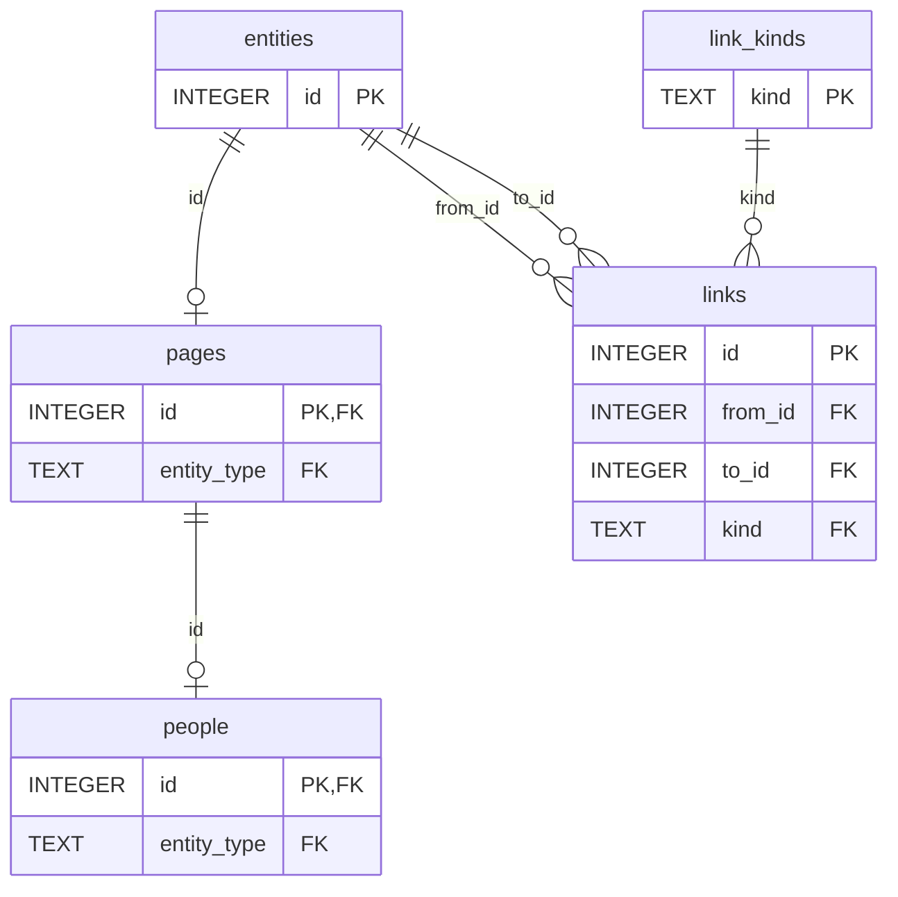
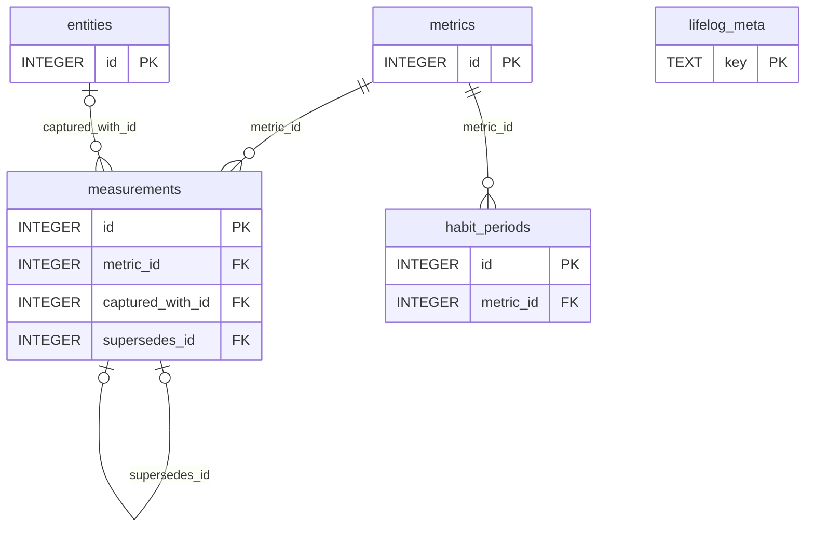
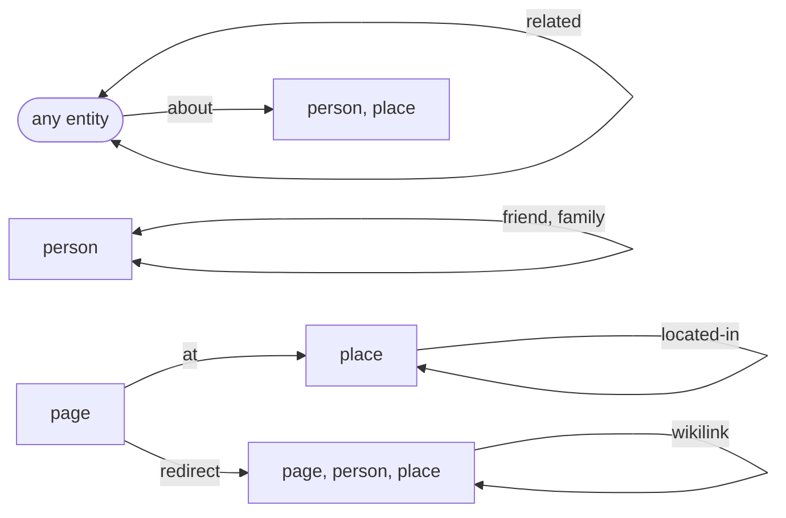
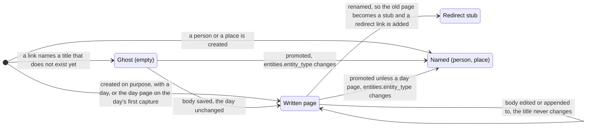
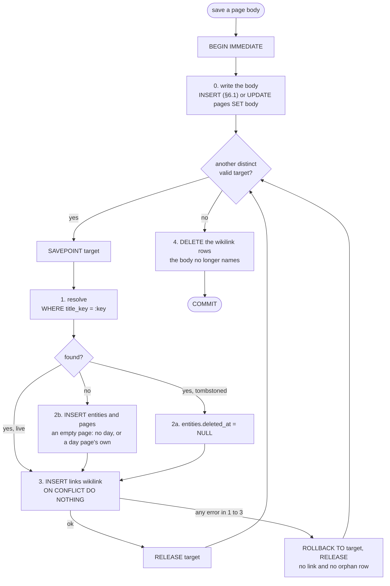

# Lifelog — Database Schema v1

**Status:** freeze candidate. No canonical database exists yet; until one does, §3 is edited in place (D13). The 2026-10 trial import (a real vault, into a copy — §2.7) has already taught D5, D22, D23 and D24; the next step is the capture path and the first import into the canonical `life.db`, not another review.
**Scope of the project:** A lifetime personal database — a life log and its backup, not a project
manager (D23): a journal of day pages, notes and wiki pages, people, places and health metrics (events,
money, location history and file attachments deferred — D22, D18, D21, D9) in a single SQLite file, plus a custom UI for data entry and daily use.
Other devices are clients of the one writing application (D3); everything else (view generators, AI
features, sync or merge between copies of the database) is explicitly out of scope.

This document is self-contained and written to be reviewed cold. Each rule has **one home**: a table's
rules are the constraints, triggers and comments of its `CREATE` statement in §3; the conventions the DDL
cannot hold (time, the wikilink grammar, connection settings, imports) are in §2; §5 says *why*, citing
constraint names instead of restating them; §6 shows the SQL in use. *Executed* means that a suite in
`tests/` runs the claim against §3 (`tests/README.md` lists the suites).

---

## Table of contents

1. [Goals and design principles](#1-goals-and-design-principles)
2. [Storage contract (what the DDL cannot hold)](#2-storage-contract-what-the-ddl-cannot-hold)
3. [The schema (canonical DDL)](#3-the-schema-canonical-ddl)
4. [Entity model overview](#4-entity-model-overview)
5. [Decision log](#5-decision-log)
6. [Query cookbook](#6-query-cookbook)
7. [Explicit non-goals and deferred work](#7-explicit-non-goals-and-deferred-work)
8. [References](#8-references)

---

## 1. Goals and design principles

**The goal:** one database that a single human writes to for ~50 years and that remains
readable and meaningful long after the current application is gone. The dominant risk is
not SQLite durability (settled — see D1); it is *meaning living only in application code*,
and *canonical data being corrupted by uncontrolled writers*.

**Principles, in priority order:**

1. **Pareto / KISS.** Choose the 20% of mechanism that delivers 80% of the value. Every
   table and column must justify itself against "what if we just didn't have it."
   Complexity that was researched and *deliberately cut* is listed in §7 so it is not
   silently re-added. The freeze makes this urgent: after it, change is additive only
   (principle 4), so whatever is in the schema then stays.
2. **The schema is the documentation.** Real tables, real column names, real types, real
   constraints. A stranger in 2075 should understand the database from `.schema` output and
   `SELECT * FROM lifelog_meta` alone — so the rules each table needs are comments *inside* its
   `CREATE` statement, the only comments the file keeps, and `lifelog_meta` holds the few rules that
   span tables. (SQLite's own "application file format" essay makes exactly this argument — see [R1].)
3. **Single writing application.** One application (later with CLI/API/agent
   front-ends) owns all writes to the database. Many
   *processes* are fine — one *writer* owning the conventions. No other app is ever
   pointed at the canonical data with write access (see D3).
4. **Additive-only evolution after freeze.** Once real data exists, schema changes are
   `ADD COLUMN` / `CREATE TABLE` / new indexes and numbered forward-only migrations.
   SQLite explicitly blesses additive change as its compatibility mechanism
   ("adding new tables or columns does not change the meaning of prior queries" [R1]).
5. **Derived data is disposable.** The FTS index and `title_key` can be dropped and rebuilt
   from canonical data at any time; nothing else is derived. `life.db` is irreplaceable.
   (Binary files are out of v1 entirely — see D9.)
6. **One home per concept, one home per rule.** A concept is stored once (D6: mood lives in
   `measurements` and nowhere else; a named entity's name is its page title, D20), and a rule is
   written once (the reading guide above). A fact that can be derived from another column is not
   stored beside it.
7. **Real use drives change.** A new constraint, trigger or convention needs a real incident behind
   it — a failed import, a bug in the writing application, a question the data could not answer —
   or it must replace something it makes redundant. Hypothetical writers are not incidents.

---

## 2. Storage contract (what the DDL cannot hold)

These conventions are part of the schema's meaning but cannot be expressed as a constraint. The
ones that span tables are also rows of `lifelog_meta` (§3), so the file carries them.

### 2.1 Time

- **Instants** (`*_at` columns): UTC, ISO-8601, millisecond precision,
  e.g. `2026-06-09T21:14:03.482Z`. Written by the app, never by SQLite defaults
  (SQLite's `CURRENT_TIMESTAMP` is second-precision and non-ISO; `strftime('%Y-%m-%dT%H:%M:%fZ','now')`
  is the in-DB form used by triggers) [R5][R6][R28]. Milliseconds because `%f` always renders
  `SS.SSS`, which gives one fixed-width string that the round-trip CHECK can compare, that sorts
  chronologically as plain text, and that keeps rows written within the same second in order (a
  reading and its correction) (executed).
- **Local days** (`*_day` columns): the *local calendar date where the thing happened or
  was captured*, TEXT `YYYY-MM-DD`, written at insert time in the zone of the device that captured
  it — a phone's, never the clock or zone of a hub on a server (D3).
  **Never derived from the UTC instant at query time.** This survives timezone changes,
  DST, and travel: "the day I graduated" is a local-date fact, not an instant [R7][R8][R9].
- **Round-trip CHECKs.** Every day column is checked with `date(x) IS x`, every instant with
  `strftime('%Y-%m-%dT%H:%M:%fZ', x) IS x`. The `IS` matters: a CHECK passes when it evaluates
  to NULL, and `date()` returns NULL for malformed input, so `date(x) = x` silently *accepts*
  `2026-9-3` (executed).
- **Written versus happened.** `created_at` — on `entities`, `links` and `measurements` alike — is
  when the row was written to `life.db`, never back-dated, so it is an audit trail. When a thing *happened* is its own `day` / `*_at`. (An entry in a day page has no time
  of its own; a time worth keeping is written in its text: a known limit, D5.)
- **Zone.** `measurements.tz` stores the IANA zone of the device that took a timed reading
  (`Europe/Berlin`; NULL = unknown), so its `taken_at` can be read as local time. Only capture time
  can supply it. Every other instant is a write time, read in UTC.

### 2.2 Identity and provenance

- **Entity rows first, ids by `RETURNING`.** A domain row's `id` equals its `entities.id`. The app
  inserts the `entities` row with `INSERT … RETURNING id`, keeps the id in a variable and binds it
  in the same transaction (§6.1). Never `last_insert_rowid()` across statements: any insert in
  between — a link, a ghost page, a measurement — moves it, and the next row silently points at the
  wrong entity (executed).
- **A person or a place is a page (D20).** A person is one id with three rows: `entities`
  (`entity_type = 'person'`), `pages` (`entity_type = 'person'`, titled — the title is the handle that
  `[[wikilinks]]` write) and `people`. Insert them in that order in one transaction (§6.14). A place is
  the first two only, with `entity_type = 'place'`: it has no columns of its own (D16). A ghost page an
  earlier `[[Name]]` created is *promoted* instead: `UPDATE entities SET entity_type = 'person'` (the
  foreign key cascades it to `pages.entity_type`), then insert the `people` row; a place needs nothing
  more. A day page is never promoted (`pages_day_page_plain`, D20). The foreign keys refuse a person without a page and a person turned back into
  a page (executed). Title uniqueness already refuses a second `Sam`, so two people called Sam are told apart
  in the handle (`Sam (barber)`); `people.name` is the editable full name.
- **Provenance.** `source` on `entities`, `links`, `measurements` and `habit_periods` names the writer
  of the row — `ui`, `cli`, `api`, `agent:<name>`, `import:<name>` (lowercase `[a-z0-9_:.-]`, 1–64
  characters). Only the moment of writing knows it, so it is required at insert and never changes;
  with agents among the writers (D3) it is how a wrong row is traced to the writer that made it. An
  importer's `import_key` — on entities and on facts — is unique per `source`, so its name is also the
  deduplication namespace.

### 2.3 Deletion and corrections

- **Life data is never deleted except `links` rows.** Entities are tombstoned
  (`entities.deleted_at`), and `BEFORE DELETE` triggers reject deleting an `entities` row or any
  domain row (measurements and habit periods included), also on a connection that forgot
  `foreign_keys` (executed). The registries — `metrics`, `link_kinds`, `lifelog_meta` — are the
  owner's administrative rows: an unreferenced one may be deleted, and each table's CREATE comment
  says so. Every read path filters `deleted_at IS NULL`. Junk captured by accident is tombstoned like
  everything else.
- **Readings are corrected by inserting, never by editing.** `measurements` rejects `UPDATE` and
  `DELETE`. A measurement is corrected by a row whose `supersedes_id` names it (at most one per row;
  correct the correction to change it again); a NULL `value` **retracts**. The view
  `measurement_values` is the read rule.
- **Imports insert with `ON CONFLICT(…) DO NOTHING`**, never `INSERT OR IGNORE` (it also skips rows
  that violate a CHECK or NOT NULL, silently) and never `OR REPLACE` (a delete, blocked only when
  `recursive_triggers=ON`, §2.6) (both executed).

**A correction never overwrites.** One reading, corrected, retracted and restored — what
`measurement_values` shows after each insert (§6.10).



### 2.4 Prose, wikilinks and titles

`pages.body` is CommonMark text. Wiki references are written inline as `[[Page Title]]`; a `#tag`
is read as `[[tag]]`, so tags are just pages (D5). The app never rewrites the body: `#health` stays
`#health` in the database.

**The save contract (D19).** Saving a page body is one `BEGIN IMMEDIATE` transaction (§6.13): the
body, then the page's `links(kind='wikilink')` rows, made **equal to the set of pages the body
names** — missing rows added, rows the body no longer supports deleted — so a re-save changes nothing
and every link can be rebuilt from the bodies alone. The `links` table is the source of truth for the
graph; the body text is the source of truth for prose. The rules, all executed against the vectors
below:

- *What is read.* The CommonMark **text** of `pages.body`, after NFC normalisation — not code
  spans, code blocks, raw HTML, link destinations or image alt text. A conformant CommonMark parser
  yields exactly this, so nothing is hand-parsed (the reference implementation in `tests/` uses
  markdown-it-py [R59], which loses a code span that follows an unclosed `[`, where the CommonMark
  reference implementation keeps it).
- *Wikilink.* `[[title]]` or `[[title|alias]]`, with no `[`, `]` or line break inside, and the
  brackets and title in **one** run of plain text (`[[Health *Diet*]]` is not a link, and
  `[[Diet]](url)` is a Markdown link). The title is the text before the first `|`, trimmed of
  spaces (U+0020 only, like the DDL's `trim`); the alias is display text the database ignores.
  There is no `#anchor` form (`#` is an ordinary title character, so `[[C#]]` works) and no
  escape (`\[[x]]` still links; write a literal `[[x]]` in a code span). Nothing else is
  normalised: `[[Health  Diet]]` with two spaces is a different page from `[[Health Diet]]`.
- *Tag.* `#` followed by words of letters, marks, digits and `_` (Unicode categories L, M, N)
  joined by single `-`, where the `#` is **not** glued to a preceding such character, `/` or `#`
  — so `C#`, `a#b`, `http://x/#frag` and `##x` are not tags — and the word is not all digits
  (`#12` and `#2024` are not tags, `#2024-review` is). Wikilinks are read first and their text
  is not re-read for tags (`[[Project #alpha]]` is one title). `# Heading` (with a space) is a
  heading; `#Heading` is not a CommonMark heading, so it is a tag. `#Health` and `#health` are
  one page.
- *Stub pages.* A body that starts with `#REDIRECT [[` (any case, leading whitespace allowed) is
  a rename stub (below): it gets no wikilinks and no tags — its one edge is the `redirect` link
  the app writes — so a stub never shows up as a backlink. Elsewhere the word `#redirect` alone
  is never a tag, so nothing can create a page called `redirect`.
- *An invalid target makes no link and never blocks a save.* A title `pages_title_safe` rejects
  (`[[Health/Diet]]`, `[[Re: plan]]`, the tag `#con`) is skipped. A writer checks the title rules
  before inserting — the reference predicate in `tests/` agrees with the DDL's CHECKs on more than
  40 000 generated strings — and creates each target inside its own `SAVEPOINT` (§6.13), so even a
  target the predicate wrongly let through is rolled back alone: the page is saved and no orphan
  `entities` row is left. The UI reports skipped targets; nothing is stored about them.
- *A page never links to itself* (`[[Diet]]` inside the page `Diet` is ignored), and *a
  tombstoned target is revived*, not duplicated: the unique index covers tombstoned pages, so the
  save un-tombstones the page it resolves — any save that names it, an old day page edited years
  later included, so the UI tells the owner.
- *Named pages.* A person's or a place's page is a page like any other, so `[[Bob
  Sample]]` is an ordinary wikilink and nothing in the save contract knows about people (D20).
- *Known limits.* A body that also defines a reference (`[Ref]: http://r`) turns `[[Ref]]` into
  a Markdown link; a `#` written as an entity (`&#35;x`) is decoded before the scan and counts as
  a tag; a typo (`[[Sm]]`) makes a ghost page like any other (§6.12).

Test vectors — every writer must reproduce them (`\n`, `́`, `̈` stand for a line
break and combining marks; a body is shown in a code span):

| body | links to (`title`s, in order) |
|---|---|
| `See [[Diet plan]].` | `Diet plan` |
| `[[Diet plan\|my diet]]` | `Diet plan` |
| `[[  Diet plan  ]]` | `Diet plan` |
| `[[C#]] and [[Page#Section]]` | `C#`, `Page#Section` |
| `[[Health/Diet]]` | — |
| `[[Re: plan]]` | — |
| `[[]] [[ ]] [[\|alias]]` | — |
| `[[Café]] [[CAFÉ]] [[Café]] [[cafe]]` | `Café`, `cafe` |
| `[[Café notes]]` | `Café notes` |
| `\[[escaped]]` | `escaped` |
| `` text `[[code]]` text `` | — |
| `a\n\n~~~\n[[fence]]\n~~~\n\nb` | — |
| `[[Diet]](http://y)` | — |
| `[[Health *Diet*]]` | — |
| `[[Ref]]\n\n[Ref]: http://r` | — |
| `[[CON]] [[nul]] [[Com1]] [[CONSOLE]] [[COM10]] [[LPT0]]` | `CONSOLE`, `COM10`, `LPT0` |
| `[[CON.backup]] [[nul.txt]] [[COM¹]] [[LPT².x]] [[a.CON]] [[CONSOLE.txt]]` | `a.CON`, `CONSOLE.txt` |
| `Feeling good #health today` | `health` |
| `#Health and #health and #HEALTH` | `Health` |
| `#tag. #tag2, (#paren) "#quoted" #end-` | `tag`, `tag2`, `paren`, `quoted`, `end` |
| `#café #zürich` | `café`, `zürich` |
| `# Heading\n\n## Sub\n\n### Sub sub` | — |
| `#Heading` | `Heading` |
| `I write C# and F# and a#b` | — |
| `[a](http://x/#frag) <http://x/#auto> http://x/#bare` | — |
| `issue #12 and #2024 but #2024-review` | `2024-review` |
| `[[Project #alpha]] #beta [[#gamma]]` | `Project #alpha`, `beta`, `#gamma` |
| `#con #nul #console` | `console` |
| `#REDIRECT [[New Title]]` | — |
| `see #REDIRECT [[New Title]]` | `New Title` |

(Also: a 240-byte title is a link, a 241-byte one is not; 80 × `日` = 240 bytes is, 81 is not.)

**Renames.** A title never changes (`pages_title_fixed`, D5). To fix one: create the new page, make
the old page a one-line stub (`#REDIRECT [[New Title]]`) and add `links(kind='redirect', from=old,
to=new)`. The stub is a plain page; the replacement may be a page, a person or a place, so a ghost
made by a misspelt `[[Name]]` can point at the person, and a replacement promoted later (§6.14) keeps
its redirect. A person's or a place's own title is its permanent handle and is not renamed (a person's
display name is `people.name`, D20). Consumers follow one hop; `redirect` links are excluded from
backlink queries (§6.5).

**Titles.** The rules are the CHECKs `pages_title_len` and `pages_title_safe` (§3): 1–240 bytes,
trimmed, and a valid file name on Linux, macOS and Windows — the strict direction on purpose (D5).
Every writer must be stricter than the DDL in one way: it also rejects code points Unicode has not
assigned yet (category `Cn`), whose case fold a later Unicode version could define — which would
silently change `title_key` (executed). Unicode promises a stable case fold only for assigned characters, and formally
only for text in NFKC form [R74]; a title with a compatibility character (full-width `Ｃａｆé`, a
ligature, `x²`) is outside that promise, a known limit (§7).

**`title_key`.** Uniqueness is on the key, not on the title. The function is fixed:
`title_key = NFC(casefold(NFC(title)))` — in Python
`unicodedata.normalize('NFC', unicodedata.normalize('NFC', t).casefold())`. A writer in another
language must reproduce these vectors exactly:

| title | `title_key` |
|---|---|
| `Café notes`, `Café notes` (NFD), `CAFÉ NOTES` | `café notes` |
| `Straße`, `STRASSE` | `strasse` |
| `ΣΑΣ`, `σας` (final sigma) | `σασ` |
| `DŽ` | `dž` |
| `file` (ligature) | `file` |
| `İstanbul` | `i̇stanbul` (`i` + U+0307) |
| `日本語 ノート`, `Diet` | `日本語 ノート`, `diet` |

The database verifies what it can (`pages_key_*`: trimmed, no ASCII capitals, `lower(title)` for a
pure-ASCII title); that a non-ASCII key is the *right* fold is the writing application's duty
(principle 3) — a writer that computes it wrongly gets uniqueness wrong and nothing else. Resolve a
`[[wikilink]]` with `WHERE title_key = :key`, a search on the unique index `pages_title` (executed).

**Day pages.** The journal is one page per local day, titled with that day: `2026-09-29`. Its `day`
is its title (`pages_day_page`), so a day page is the page whose title equals its day, and its key is
its title (a pure-ASCII title). Capture appends to today's page and creates it on the first write
(§6.1); `[[2026-09-29]]` reaches it like any other title, and a link that names a day before anything
was written that day creates that day's page, empty (§6.13). A day page is an ordinary page in every
other way: its `[[links]]` say who the day was with and where (§6.3).

### 2.5 Integrity checks

Four checks tell whether a file still obeys the schema. They read only the file, need no other
copy, and each catches what the others cannot. Run them before and after an import (§2.7) or a
migration (D13), and after any writer crashed. Every claim below was executed on the **live**
file, not on a copy.

```sql
PRAGMA integrity_check;      -- one row: ok
PRAGMA foreign_key_check;    -- no rows
SELECT id FROM entities WHERE id NOT IN (SELECT id FROM pages WHERE entity_type IN ('page','place') UNION SELECT id FROM people);   -- no rows
INSERT INTO pages_fts(pages_fts, rank) VALUES ('integrity-check', 1);   -- no error
```

- **`integrity_check` — the file's structure.** It caught a zeroed table page, a file truncated by
  three pages, and an index entry that no longer matches its row (a flipped byte in a `title_key`
  inside `pages_title`).
- **`foreign_key_check` — what the first cannot see.** A writer that forgot `PRAGMA foreign_keys=ON`
  (§2.6 — per connection; `STRICT` does not enforce foreign keys) stored a reading of a metric that
  does not exist, and `integrity_check` said `ok`.
- **The orphan query — the one check no constraint can express.** An `entities` row with no domain
  row (a writer that died between its inserts, or a person with a page but no `people` row): both
  other checks are clean on it.
- **The FTS5 integrity-check — the index against its content.** `pages_fts` is an external-content
  index over `pages`; if the two drift apart, searches return wrong rows and `integrity_check` still
  says `ok`. The FTS5 command with rank `1` compares the index with `pages` and fails. The index is
  derived: `INSERT INTO pages_fts(pages_fts) VALUES('rebuild')` repairs it. Writing it is a write, so
  it runs on a writer connection.
- **What none of them sees: a changed value.** A flipped byte inside a body passed
  `integrity_check` — SQLite keeps no page checksums. The cheap guard is below the file: keep
  `life.db` on a filesystem that checksums data (btrfs and ZFS do by default; never `chattr +C` the
  file or its folder, which turns btrfs checksums off) and scrub it now and then. SQLite's own
  `cksumvfs` [R64] does the same per page inside the file, at the cost of an extension every writer
  must load; it is not used.

### 2.6 Connection setup (every writer, mandatory)

```sql
PRAGMA journal_mode = WAL;     -- persistent; set once by the init DDL (§3)
PRAGMA synchronous  = FULL;    -- per connection. NORMAL in WAL "might roll back following a power loss" [R54]
PRAGMA foreign_keys = ON;      -- MANDATORY per connection: SQLite's default is OFF
PRAGMA recursive_triggers = ON;  -- MANDATORY per connection: with OFF, INSERT OR REPLACE / REPLACE INTO
                               -- deletes the conflicting row WITHOUT firing the append-only DELETE triggers
PRAGMA busy_timeout = 5000;    -- wait instead of failing instantly on SQLITE_BUSY
PRAGMA trusted_schema = OFF;   -- the schema may call only side-effect-free functions (all of this one's are)
```

A writer reads these back at connect time and refuses to run if `foreign_keys` or
`recursive_triggers` is 0 or `synchronous` is not 2 (FULL, which is also SQLite's default,
executed) — none of these is stored in the file, and `PRAGMA foreign_keys` is a silent no-op inside
a transaction (executed). It also refuses to run on a SQLite older than **3.51.3**: every version from
3.7.0 to 3.51.2, except the backports 3.44.6 and 3.50.7, has a WAL race in which a write that lands
while two checkpoints overlap can be lost — rare, but this design has several writer processes and
readers on one file, which is exactly the condition [R65]. Migrations need 3.53 (D13).

Two more settings cost nothing. `SQLITE_DBCONFIG_DEFENSIVE` (a C-level switch, in Python
`conn.setconfig(sqlite3.SQLITE_DBCONFIG_DEFENSIVE, True)`) makes the FTS shadow tables and
`writable_schema` untouchable from SQL; with it and `trusted_schema = OFF` the whole schema and every
§6 query still work (executed). `PRAGMA optimize` when a connection closes keeps the planner's
statistics fresh.

The driver must not open transactions of its own. Python's `sqlite3` in its default mode silently
sends a deferred `BEGIN` before the first `INSERT`/`UPDATE`/`DELETE`; open the connection with
`autocommit=True` (Python 3.12+) or `isolation_level=None` and issue `BEGIN IMMEDIATE` yourself.

**Every write transaction starts with `BEGIN IMMEDIATE`.** A deferred `BEGIN` that reads first —
resolve a wikilink, then create the page (§6.13) — fails **at once** with `database is locked`
if another writer committed in between: `busy_timeout` does not apply to that lock upgrade
(executed). `BEGIN IMMEDIATE` takes the write lock up front, so a second writer waits
(up to `busy_timeout`) and then sees the first one's rows (executed). Keep such transactions short.

Readers need no setup but must be **read-only**: open the file with `?mode=ro` (SQLite then
refuses every write — `attempt to write a readonly database`, executed) or `sqlite3 -readonly`.
Datasette does this by itself (executed by the optional Datasette suite). Under WAL a reader sees the
live file while the app writes and never blocks it (executed). sqlite-web can edit rows, which would
make it a second writer, so it is not used (D14). Three reader traps [R65][R66]:
- **Never `immutable=1`** (Datasette's `-i`): it tells SQLite the file cannot change, so a reader of
  the live file sees stale or inconsistent pages while the app writes. Use the default `mode=ro`.
- **Keep read transactions short.** A checkpoint cannot reset the WAL while any reader holds a
  snapshot; a reader that never lets go makes `life.db-wal` grow without bound.
- **One machine, a local disk.** WAL needs shared memory between the processes, so `life.db` never
  lives on a network file system (NFS, SMB) or in a folder a sync client (Dropbox, Syncthing,
  iCloud) copies while it is open.

`life.db`, `life.db-wal` and `life.db-shm` are never committed to git: binary churn, and git
history cannot be scrubbed of health data.

"Single writing application" (principle 3, D3) does not mean a single OS process: the
app, its CLI, the API service and local agents are all the same *writer* as long as
they go through the one application stack that owns the insert conventions.



### 2.7 Threat model, the 2075 test, and imports

**What is protected, and from what.** The asset is `life.db`: prose and health data in one
plaintext file (D17 — the database is deliberately not encrypted).

| Threat | Control | Residual |
|---|---|---|
| The file is damaged or lost | `synchronous=FULL` and WAL on SQLite ≥ 3.51.3, on a local disk (§2.6); the integrity checks find damage (§2.5) | nothing recovers it: no second copy of the file is kept (§7); power loss is documented, not simulated [R67] |
| A changed value inside the file (bit rot) | a data-checksumming filesystem (btrfs, ZFS), never `chattr +C`, a periodic `scrub` (§2.5) | no check *inside* SQLite sees it; on a filesystem without checksums nothing does |
| A buggy writer, importer or agent | one writing application; triggers for append-only facts, no hard deletes and fixed kinds and titles; `ON CONFLICT … DO NOTHING`; `BEGIN IMMEDIATE`; `source` on every row; the foreign-key and orphan checks (§2.3, §2.6, §2.5) | the pragmas are per connection, so the application asserts them at connect |
| Another tool editing rows | exploration tools open the file read-only (§2.6, D14) | anything with write access to the file bypasses every control |
| A stolen disk | the disk holding `life.db` is encrypted at rest (D17) | a stolen *unlocked* machine has everything |
| Health data or private notes leaking through git | `life.db` and its `-wal`/`-shm` are never committed; no credentials or account numbers, ever (§2.6) | page bodies and `note` fields are free text — the owner's discipline |
| The data exposed on a network | Datasette on localhost only and read-only; nothing that runs arbitrary SQL is reachable from outside (D17) | a wrong bind address |
| A reader in fifty years without this document | the 2075 test, below | — |

Out of scope: a hostile local user, malware running as the owner, and legal compulsion — those
need the database itself encrypted (§7).

**The 2075 test.** A stranger holds `life.db` and nothing else — no `SCHEMA.md`, no application.
Every question below must be answerable from `.schema` and `SELECT * FROM lifelog_meta`. The table is
executed: each place named in the third column — a `lifelog_meta` key, or a table, view or trigger
whose `CREATE` statement `.schema` prints — must exist in a fresh database and its text must contain
each phrase in the last column, and **every key of `lifelog_meta` must be used by some question**.

| # | Question | Where the answer is | The answer says |
|---|---|---|---|
| 1 | What is this, and where are its rules? | `schema` | `lifelog`, `CREATE statement` |
| 2 | How is an instant stored? | `instants` | `UTC`, `ISO-8601` |
| 3 | What is a `*_day` column? | `days` | `LOCAL`, `never recomputed`, `IS, not =` |
| 4 | In which time zone was a reading taken? | `measurements` | `IANA` |
| 5 | When was a row written, versus when did it happen? | `instants`, `measurements` | `never back-dated`, `created_at` |
| 6 | Can anything be deleted? | `deletes`, `entities_no_delete` | `tombstone`, `links`, `registries` |
| 7 | Are measurements kept? How is one corrected? | `measurements`, `measurement_values` | `append-only`, `RETRACTS` |
| 8 | Which link kinds exist, and who may link what? | `link_kinds` | `CLOSED registry` |
| 9 | How do `[[wikilinks]]` and `#tags` become links? | `pages` | `CommonMark`, `invalid target makes no link` |
| 10 | Why is a page never renamed? What makes a title valid? | `pages`, `pages_title_fixed` | `never renamed`, `file name`, `NFC` |
| 11 | Why do ids of different tables coincide? How are rows created? | `entities` | `SAME id`, `RETURNING` |
| 12 | How does `[[Bob Sample]]` reach a person or a place? | `entities`, `people` | `is also a page`, `handle` |
| 13 | Who may write, and with which settings? | `writers` | `BEGIN IMMEDIATE`, `read-only` |
| 14 | What is derived and can be rebuilt? | `pages_fts`, `pages` | `rebuild`, `derived` |
| 15 | How do imports avoid duplicates and bad rows? | `writers`, `measurements` | `DO NOTHING`, `OR IGNORE` |
| 16 | How does the schema change after real data exists? | `evolution` | `additive`, `user_version` |
| 17 | Where is the journal? What did I write on a given day? | `pages` | `day page`, `YYYY-MM-DD`, `title equals its day` |
| 18 | Which SQLite may write this file? | `sqlite` | `3.51.3`, `3.53` |
| 19 | Who or what wrote this row? | `source` | `written at insert`, `agent` |
| 20 | Does it keep to-dos and plans? | `schema` | `not a project manager` |
| 21 | Where was I on a given day? | `pages`, `link_kinds` | `places the owner was at`, `kind='at'` |
| 22 | Which metrics are habits, and was one meant to be done on a day? | `habit_periods` | `HABIT`, `NOT RECORDED` |

**Imports** — the path for data that already exists elsewhere (a journal archive, a health export,
lab results). Every step was executed on 1 000 synthetic rows:

1. **Trial run first.** Rows are never deleted, so a bad import can only be retracted row by row
   (a NULL-value correction for a measurement, a tombstone for an entity). Do the
   first run of any new importer on a *copy*: `sqlite3 life.db "VACUUM INTO '/tmp/trial.db'"`.
2. **Load the rows into a scratch database, never into `life.db`** (`sqlite3 scratch.db ".import
   --csv weights.csv staging"`), then insert in one `BEGIN IMMEDIATE` transaction per batch:

```sql
ATTACH 'scratch.db' AS s;
BEGIN IMMEDIATE;
INSERT INTO measurements(metric_id, day, taken_at, tz, value, created_at, source, import_key)
SELECT (SELECT id FROM metrics WHERE name = 'weight'), day, NULLIF(taken_at, ''), NULLIF(tz, ''), value,
       strftime('%Y-%m-%dT%H:%M:%fZ','now'), 'import:scale', id
  FROM s.staging WHERE true
ON CONFLICT(source, import_key, metric_id) WHERE import_key IS NOT NULL DO NOTHING;
COMMIT;
DETACH s;
```

   Three traps, each executed. **`WHERE true`** is required: in `INSERT … SELECT … FROM … ON CONFLICT`
   SQLite reads the `ON` as a join's, and answers "a JOIN clause is required before ON" (or `near "DO":
   syntax error`). **The conflict target repeats the index's `WHERE`**: the unique
   index is partial, and without it SQLite answers "ON CONFLICT clause does not match any PRIMARY
   KEY or UNIQUE constraint". **Never `CAST(value AS REAL)`**: it turns `'abc'` and `''` into `0.0`
   and `'12.5kg'` into `12.5`, silently — a plain insert into the STRICT column converts `'12.5'` and
   rejects `'abc'` and `''`. A CSV empty field is `''`, not NULL, so optional columns go through
   `NULLIF(…, '')`; a `''` in `taken_at` fails its CHECK. A fourth, for links: **never `INSERT OR
   REPLACE` into `links`** — on a symmetric kind the replace and the two mirror triggers keep firing
   each other, and SQLite stops with `too many levels of trigger recursion` (executed). Use
   `ON CONFLICT(from_id, to_id, kind) DO NOTHING`.
3. **Identity and time.** `source` names the importer (`import:<name>`), `import_key` is the source's
   own id, `day` / `taken_at` / `tz` say when it happened, `created_at` is when you imported it — on
   every table that has it, `created_at` is the write time (§2.1). An imported page, person or place
   carries its key on `entities` (§6.15). **The key must come out the same on every run**: the source's own id
   (a Health Connect record's id; a note's path in its vault). A source without ids gets a key built from
   fields it never changes (a note's file name, the day of a reading) — and a change to one of them then
   looks like a new row. The key deduplicates within one `source` only: the same reading from two
   sources is two rows, for the app to match and the owner to retract one.
4. **What a failure does.** `ON CONFLICT … DO NOTHING` skips only a duplicate key: a malformed
   day, an impossible value or a dangling foreign key still raises and the **whole batch rolls back**.
   Fix the data and run the batch again.
5. **Check afterwards:** the four checks of §2.5, per-source counts (`SELECT source, count(*),
   min(day), max(day) FROM measurements GROUP BY source`), and **run the importer a second time — it
   must insert nothing.**
6. **Before the freeze**, run steps 1–5 once with a real export into the canonical file: the
   2026-10 trial — a real vault, imported into a copy — already taught D5, D22, D23 and D24; an
   import into `life.db` itself is the one test this schema has never had.

## 3. The schema (canonical DDL)

This is the canonical init DDL. Until the freeze it is edited **in place** here — there
is no `0001_init.sql` file yet (D13); a test database is created by applying this block
to a fresh file (`tests/lib/docsql.py` extracts it).

```sql
-- ============================================================
-- Lifelog schema v1: the single init file, edited in place until the freeze;
-- numbered migrations begin only after real data exists (D13).
-- Each table's rules are comments INSIDE its CREATE statement, so .schema shows them (a comment
-- outside a statement is not stored in the file); the rules that span tables: SELECT * FROM lifelog_meta;
-- Every writer connection: SQLite >= 3.51.3; PRAGMA foreign_keys = ON;
-- PRAGMA recursive_triggers = ON; PRAGMA synchronous = FULL; PRAGMA trusted_schema = OFF;
-- and every write transaction starts with BEGIN IMMEDIATE (section 2.6).
-- ============================================================
PRAGMA application_id = 0x4C494645;   -- 'LIFE' — recognizable to file(1) and tools
PRAGMA user_version  = 1;
PRAGMA journal_mode  = WAL;           -- persistent; readers (Datasette) don't block the writer

CREATE TABLE lifelog_meta (
  -- the rules that span tables, readable with a SELECT by someone who has only this file;
  -- the rules of one table are comments inside its own CREATE statement
  -- rows are rules the owner adds or removes; deleting one removes the rule from the file itself
  key   TEXT PRIMARY KEY,
  value TEXT NOT NULL
) STRICT;
INSERT INTO lifelog_meta(key, value) VALUES
  ('schema',    'lifelog v1: the journal (one page per day), wiki, people, places and health metrics of one person: a life log, not a project manager; the rules of each table are comments inside its CREATE statement (.schema), the rules that span tables are these rows'),
  ('instants',  'every *_at column is a UTC ISO-8601 TEXT instant with milliseconds, e.g. 2026-06-09T21:14:03.482Z, written by the app; CHECK strftime(''%Y-%m-%dT%H:%M:%fZ'', x) IS x; created_at, on every table that has it, is when the row was written to life.db, never back-dated (when a thing happened is its day or its other *_at)'),
  ('days',      'every *_day column (and day) is the LOCAL calendar date YYYY-MM-DD where the thing happened, written at insert, never recomputed from an instant; CHECK date(x) IS x (IS, not =: a CHECK passes on NULL, and date(''2026-9-3'') is NULL)'),
  ('deletes',   'life data is never deleted except links rows: an entity is a tombstone (entities.deleted_at), a measurement is corrected by inserting a row; BEFORE DELETE triggers enforce it on entities and every domain row; the registries (metrics, link_kinds, lifelog_meta) are the owner''s administrative rows, deletable while nothing references them (each CREATE comment says so)'),
  ('source',    'entities, links, measurements and habit_periods: source names the writer of the row (ui, cli, api, agent:<name>, import:<name>); written at insert, never changed; import_key, on entities and on measurements, is unique per source'),
  ('writers',   'one writing application; every connection sets foreign_keys=ON, recursive_triggers=ON, synchronous=FULL, trusted_schema=OFF and starts write transactions with BEGIN IMMEDIATE; every other tool opens the file read-only; imports use INSERT ... ON CONFLICT DO NOTHING, never OR IGNORE (skips CHECK/NOT NULL violations silently) or OR REPLACE (a delete)'),
  ('sqlite',    'writers need SQLite >= 3.51.3 (fixes a WAL race between concurrent writers and checkpoints); migrations need >= 3.53 (ALTER TABLE ADD/DROP CONSTRAINT); CHECKs use only functions every such version has'),
  ('evolution', 'after the first real data: numbered forward-only SQL migrations, additive only, counted in PRAGMA user_version; every CHECK is named, so any rule can be widened or tightened with ALTER TABLE DROP/ADD CONSTRAINT');

CREATE TABLE entities (
  -- The shared spine: one row per linkable thing (page, person, place). Its domain row has the
  -- SAME id: the app inserts this row first with INSERT ... RETURNING id and binds that id in the same
  -- transaction. UNIQUE(id, entity_type) plus the composite FK (id, entity_type) of every domain table
  -- make a row's type and its table agree.
  -- A person or a place is also a page (D20): one id, with a pages row whose title is the handle
  -- [[wikilinks]] write; a person also has a people row whose FK points at that pages row, a place has no
  -- row of its own (D16). A ghost page is promoted by UPDATE entities SET entity_type = 'person' (the FK
  -- cascades it to pages.entity_type).
  -- Nothing is ever deleted: deleted_at is the tombstone (D11), enforced by BEFORE DELETE triggers.
  -- import_key: the key a writer that may send the row twice gives it (an importer, an offline phone, a
  -- retrying agent); whether the row was imported is source, not import_key. Unique per source, written at
  -- insert and never changed. Insert with ON CONFLICT(source, import_key) WHERE import_key IS NOT NULL
  -- DO NOTHING RETURNING id: no id back = imported before, so no domain row is inserted (section 6.15).
  id          INTEGER PRIMARY KEY,
  entity_type TEXT NOT NULL CONSTRAINT entities_entity_type
                  CHECK (entity_type IN ('page','person','place')),
  created_at  TEXT NOT NULL CONSTRAINT entities_created_at CHECK (strftime('%Y-%m-%dT%H:%M:%fZ', created_at) IS created_at),   -- the write time (lifelog_meta.instants)
  updated_at  TEXT NOT NULL CONSTRAINT entities_updated_at CHECK (strftime('%Y-%m-%dT%H:%M:%fZ', updated_at) IS updated_at),   -- kept by the *_touch triggers
  deleted_at  TEXT     CONSTRAINT entities_deleted_at CHECK (deleted_at IS NULL OR strftime('%Y-%m-%dT%H:%M:%fZ', deleted_at) IS deleted_at),   -- the tombstone
  source      TEXT NOT NULL CONSTRAINT entities_source CHECK (length(source) BETWEEN 1 AND 64 AND source NOT GLOB '*[^a-z0-9_:.-]*'),   -- the writer (lifelog_meta.source)
  import_key  TEXT,                        -- the sender's key, unique per source; NULL = sent once. Imported or not: source
  UNIQUE (id, entity_type)
) STRICT;
CREATE UNIQUE INDEX entities_import ON entities(source, import_key) WHERE import_key IS NOT NULL;

CREATE TABLE pages (
  -- All prose (D5): every page is titled, unique and linkable: an essay, a reference page, a tag, the page
  -- of a person or a place (its entity_type says which, D20), and the journal. The journal is one
  -- DAY PAGE per local day, titled YYYY-MM-DD ('2026-09-29'): its title equals its day (pages_day_page), so
  -- [[2026-09-29]] reaches it. Capture appends to today's page, created on the first write. A day page is
  -- never a person or a place (pages_day_page_plain): a promotion of it is refused (D20).
  -- Where was I: the places the owner was at that day are links(kind='at') from its day page (D16).
  -- A title is permanent and a valid file name on every OS: a page is never renamed (create the new page,
  -- make the old one a '#REDIRECT [[New]]' stub, add links(kind='redirect')).
  -- Uniqueness is on title_key = NFC(casefold(NFC(title))), computed by the app because SQLite cannot fold
  -- Unicode: 'Café' = 'CAFÉ' = NFD 'Café'. Look a page up with WHERE title_key = :key. The key is derived.
  -- links(kind='wikilink') from a page always equal the [[titles]] and #tags its CommonMark text names,
  -- rebuilt on every save; an invalid target makes no link and never blocks the save (D19).
  id          INTEGER PRIMARY KEY,
  entity_type TEXT NOT NULL DEFAULT 'page' CONSTRAINT pages_entity_type CHECK (entity_type IN ('page','person','place')),   -- 'page', or the named entity this page is
  title       TEXT NOT NULL,              -- filename-safe, immutable; a day page's is its day
  title_key   TEXT NOT NULL,              -- NFC(casefold(NFC(title))), app-computed, unique
  day         TEXT,                       -- local day it was written: a day page's day; a page written on purpose has one, a link target the app created has none
  body        TEXT NOT NULL DEFAULT '',   -- CommonMark; [[Wiki Links]] inline
  UNIQUE (id, entity_type),               -- the parent key of people
  FOREIGN KEY (id, entity_type) REFERENCES entities(id, entity_type) ON UPDATE CASCADE,   -- a promoted page follows its entity's type
  CONSTRAINT pages_day_page CHECK (date(title) IS NOT title OR day IS title),   -- a page titled with a day is that day's page
  CONSTRAINT pages_day_page_plain CHECK (date(title) IS NOT title OR entity_type = 'page'),   -- ...and stays a plain page
  CONSTRAINT pages_key_folded CHECK (length(title_key) >= 1 AND title_key = trim(title_key)
                               AND title_key NOT GLOB '*[A-Z]*'),      -- a folded key has no ASCII capitals
  CONSTRAINT pages_key_ascii CHECK (title GLOB '*[^ -~]*' OR title_key = lower(title)),   -- pure-ASCII titles: the DB verifies the key
  CONSTRAINT pages_title_len CHECK (title = trim(title) AND length(title) >= 1
                           AND length(CAST(title AS BLOB)) <= 240),  -- bytes: a filename limit is 255 bytes
  CONSTRAINT pages_title_safe CHECK (   -- a title must be a valid file name on Linux, macOS and Windows: keep it safe
         title NOT GLOB '*[/\:*?"<>|]*'            -- path separators and Windows-reserved characters
         AND title NOT GLOB ('*[' || char(1) || '-' || char(31) || char(127) || '-' || char(159) || char(173) || char(1564)
                             || char(8203) || char(8206) || '-' || char(8207) || char(8234) || '-' || char(8238)
                             || char(8288) || '-' || char(8292) || char(8294) || '-' || char(8297) || char(65279) || ']*')
                                                   -- control characters (C0, DEL, C1) and invisible or bidi ones: soft hyphen, Arabic
                                                   -- letter mark, zero-width space, LRM/RLM, embeddings and overrides, word joiner and
                                                   -- invisible operators, isolates, BOM. ZWNJ/ZWJ (U+200C/D) stay: scripts and emoji need them
         AND instr(title, char(0)) = 0
         AND substr(title, 1, 1) <> '.' AND substr(title, -1) <> '.'   -- no hidden files, '..', trailing dot
         AND upper(CASE WHEN instr(title, '.') > 0 THEN substr(title, 1, instr(title, '.') - 1) ELSE title END)
             NOT IN ('CON','PRN','AUX','NUL',                -- Windows device names, bare or before an extension (CON.backup)
               'COM1','COM2','COM3','COM4','COM5','COM6','COM7','COM8','COM9','COM¹','COM²','COM³',
               'LPT1','LPT2','LPT3','LPT4','LPT5','LPT6','LPT7','LPT8','LPT9','LPT¹','LPT²','LPT³')),
  CONSTRAINT pages_day CHECK (day IS NULL OR date(day) IS day)
) STRICT;
CREATE UNIQUE INDEX pages_title ON pages(title_key);
CREATE INDEX pages_day ON pages(day);
CREATE TRIGGER pages_title_fixed BEFORE UPDATE OF title ON pages
  WHEN NEW.title IS NOT OLD.title
BEGIN
  -- a rename would repoint every [[Old Title]] in decades of prose (D5); title_key is derived and may be recomputed
  SELECT RAISE(ABORT, 'titles are immutable: create the new page and make this one a #REDIRECT stub');
END;

CREATE VIRTUAL TABLE pages_fts USING fts5(
  -- derived: external-content FTS5 kept in sync by the three triggers below; rebuild with
  -- INSERT INTO pages_fts(pages_fts) VALUES('rebuild'). Tokenizer unicode61 folds accents
  -- (Zurich finds Zürich); a CJK run is ONE token (section 7).
  title, body, content='pages', content_rowid='id'
);
CREATE TRIGGER pages_fts_insert AFTER INSERT ON pages BEGIN
  INSERT INTO pages_fts(rowid, title, body) VALUES (NEW.id, NEW.title, NEW.body);
END;
CREATE TRIGGER pages_fts_delete AFTER DELETE ON pages BEGIN
  INSERT INTO pages_fts(pages_fts, rowid, title, body) VALUES ('delete', OLD.id, OLD.title, OLD.body);
END;
CREATE TRIGGER pages_fts_update AFTER UPDATE OF title, body ON pages BEGIN
  -- only the indexed columns: a promotion does not re-index the body
  INSERT INTO pages_fts(pages_fts, rowid, title, body) VALUES ('delete', OLD.id, OLD.title, OLD.body);
  INSERT INTO pages_fts(rowid, title, body) VALUES (NEW.id, NEW.title, NEW.body);
END;

CREATE TABLE people (
  -- people in the owner's life; relationships between them are links (friend, family, parent-of).
  -- A person is also a page with the same id (D20): its title is the permanent handle [[wikilinks]] write
  -- ('Sam (barber)' tells two Sams apart), its body holds the prose; name is the editable full name.
  id          INTEGER PRIMARY KEY,
  entity_type TEXT NOT NULL DEFAULT 'person' CONSTRAINT people_entity_type CHECK (entity_type = 'person'),
  name        TEXT NOT NULL,
  birth_day   TEXT CONSTRAINT people_birth_day CHECK (birth_day IS NULL OR date(birth_day) IS birth_day),
  death_day   TEXT CONSTRAINT people_death_day CHECK (death_day IS NULL OR date(death_day) IS death_day),
  FOREIGN KEY (id, entity_type) REFERENCES pages(id, entity_type),
  CONSTRAINT people_death_day_order CHECK (death_day IS NULL OR birth_day IS NULL OR death_day >= birth_day)
) STRICT;

CREATE TABLE metrics (
  -- a tiny registry that keeps time series canonical: 'weight' is one series forever, never
  -- 'Weight' or 'weight kg' (names are snake_case). Seeded with 'mood' (D6). The unit gives every
  -- stored value its meaning, so it never changes (metrics_unit_fixed).
  -- an unreferenced metric may be deleted (a mistake registered); a referenced one is refused by
  -- the foreign keys of measurements and habit_periods: a used metric stays (its series is life data).
  id    INTEGER PRIMARY KEY,
  name  TEXT NOT NULL UNIQUE,                 -- snake_case canonical: 'weight', 'mood'
  unit  TEXT NOT NULL DEFAULT '',             -- 'kg', 'bpm', 'h'; '' for 1-5 scales
  note  TEXT,
  CONSTRAINT metrics_name CHECK (length(name) >= 1 AND name NOT GLOB '*[^a-z0-9_]*')   -- lowercase snake_case, so no case variants
) STRICT;
CREATE TRIGGER metrics_unit_fixed BEFORE UPDATE OF unit ON metrics
  WHEN NEW.unit IS NOT OLD.unit
BEGIN
  -- changing the unit would silently reinterpret the whole series
  SELECT RAISE(ABORT, 'metrics.unit is fixed: it defines what every stored value means; register a new metric instead');
END;
INSERT INTO metrics(name, unit, note) VALUES
  ('mood', '', '1-5; attached to its day page via measurements.captured_with_id when posted');

CREATE TABLE measurements (
  -- one row per data point (the FxLifeSheet shape). The table is append-only, enforced by triggers: never
  -- UPDATE or DELETE. A correction is a new row whose supersedes_id names the row it corrects, at most one
  -- per row (chain: correct the correction); a correction with a NULL value RETRACTS the row it corrects.
  -- Read through the view measurement_values. day is when the value was true, created_at when it was written
  -- down, taken_at + tz when and where it was measured (tz: IANA zone; NULL = unknown).
  -- Imports: INSERT ... ON CONFLICT(source, import_key, metric_id) WHERE import_key IS NOT NULL DO NOTHING;
  -- never OR IGNORE (it silently skips CHECK / NOT NULL violations).
  id               INTEGER PRIMARY KEY,
  metric_id        INTEGER NOT NULL REFERENCES metrics(id),
  day              TEXT NOT NULL CONSTRAINT measurements_day CHECK (date(day) IS day),  -- local date the value refers to
  taken_at         TEXT CONSTRAINT measurements_taken_at CHECK (taken_at IS NULL OR strftime('%Y-%m-%dT%H:%M:%fZ', taken_at) IS taken_at),
  tz               TEXT CONSTRAINT measurements_tz CHECK (tz IS NULL OR (length(tz) BETWEEN 1 AND 64 AND tz NOT GLOB '*[^A-Za-z0-9_/+-]*')),
  value            REAL,                        -- numeric only, by design (D7); NULL only on a correction: it RETRACTS the row it supersedes
  created_at       TEXT NOT NULL CONSTRAINT measurements_created_at CHECK (strftime('%Y-%m-%dT%H:%M:%fZ', created_at) IS created_at),
  source           TEXT NOT NULL CONSTRAINT measurements_source CHECK (length(source) BETWEEN 1 AND 64 AND source NOT GLOB '*[^a-z0-9_:.-]*'),   -- the writer (lifelog_meta.source)
  import_key       TEXT,                        -- importer's dedup key, unique per (source, metric)
  captured_with_id INTEGER REFERENCES entities(id),      -- provenance: the page (a day page) this reading was captured with
  supersedes_id    INTEGER REFERENCES measurements(id),  -- optional: corrects an earlier row
  CONSTRAINT measurements_not_self CHECK (supersedes_id IS NULL OR supersedes_id <> id),
  CONSTRAINT measurements_first_has_value CHECK (value IS NOT NULL OR supersedes_id IS NOT NULL),   -- a first reading has a value; only a correction may retract
  CONSTRAINT measurements_value_finite CHECK (value IS NULL OR abs(value) <= 1.7976931348623157e308)   -- finite: rejects ±Infinity (a NaN arrives as NULL)
) STRICT;
CREATE INDEX measurements_series ON measurements(metric_id, day);
CREATE UNIQUE INDEX measurements_import
  ON measurements(source, import_key, metric_id) WHERE import_key IS NOT NULL;
CREATE UNIQUE INDEX measurements_one_correction
  ON measurements(supersedes_id) WHERE supersedes_id IS NOT NULL;  -- one correction per row; also serves measurement_values
CREATE INDEX measurements_day ON measurements(day);                -- day view
CREATE TRIGGER measurements_no_update BEFORE UPDATE ON measurements
BEGIN
  SELECT RAISE(ABORT, 'measurements are append-only: correct by inserting a row with supersedes_id');
END;
CREATE TRIGGER measurements_no_delete BEFORE DELETE ON measurements
BEGIN
  SELECT RAISE(ABORT, 'measurements are never deleted: correct by inserting a row with supersedes_id');
END;
CREATE TRIGGER measurements_supersede_metric AFTER INSERT ON measurements
  WHEN NEW.supersedes_id IS NOT NULL
BEGIN
  -- a correction must correct an EXISTING row of the SAME metric (IS NOT, not <>: a dangling
  -- supersedes_id yields NULL, and NULL <> x is NULL = pass). supersedes_id is set only at INSERT
  -- and must name an existing row, so correction chains can never form a cycle.
  SELECT RAISE(ABORT, 'supersedes_id must reference a measurement of the same metric')
   WHERE (SELECT metric_id FROM measurements WHERE id = NEW.supersedes_id) IS NOT NEW.metric_id;
END;
CREATE VIEW measurement_values AS
  -- the canonical read rule: rows nothing has corrected, minus retractions
  SELECT me.*
    FROM measurements me
   WHERE me.value IS NOT NULL
     AND NOT EXISTS (SELECT 1 FROM measurements x WHERE x.supersedes_id = me.id);

CREATE TABLE habit_periods (
  -- a metric is a HABIT while it has a period: the local days the owner meant to do it (D24). Check-ins
  -- stay in measurements (1 = done, 0 = not done that day); a day inside a period with no check-in is
  -- NOT RECORDED, never assumed done or not done. A habit is unitless (0/1). A restarted habit has several
  -- periods, which never overlap. A wrong period is corrected by UPDATE, never deleted.
  id         INTEGER PRIMARY KEY,
  metric_id  INTEGER NOT NULL REFERENCES metrics(id),
  start_day  TEXT NOT NULL CONSTRAINT habit_periods_start_day CHECK (date(start_day) IS start_day),
  end_day    TEXT CONSTRAINT habit_periods_end_day CHECK (end_day IS NULL OR date(end_day) IS end_day),   -- the last day, inclusive; NULL = still going
  source     TEXT NOT NULL CONSTRAINT habit_periods_source CHECK (length(source) BETWEEN 1 AND 64 AND source NOT GLOB '*[^a-z0-9_:.-]*'),   -- the writer (lifelog_meta.source)
  CONSTRAINT habit_periods_order CHECK (end_day IS NULL OR end_day >= start_day),
  UNIQUE (metric_id, start_day)
) STRICT;
CREATE TRIGGER habit_periods_check_insert BEFORE INSERT ON habit_periods
BEGIN
  SELECT RAISE(ABORT, 'a habit is a unitless metric (0 = not done, 1 = done): this metric has a unit')
   WHERE (SELECT unit FROM metrics WHERE id = NEW.metric_id) IS NOT '';
  -- a period with the same start is left to UNIQUE, so ON CONFLICT DO NOTHING re-runs it (this trigger fires first)
  SELECT RAISE(ABORT, 'periods of one habit never overlap: end the open one first')
   WHERE EXISTS (SELECT 1 FROM habit_periods p WHERE p.metric_id = NEW.metric_id
                    AND p.start_day IS NOT NEW.start_day
                    AND p.start_day <= coalesce(NEW.end_day, '9999-12-31')
                    AND coalesce(p.end_day, '9999-12-31') >= NEW.start_day);
END;
CREATE TRIGGER habit_periods_check_update BEFORE UPDATE OF metric_id, start_day, end_day ON habit_periods
BEGIN
  SELECT RAISE(ABORT, 'a habit is a unitless metric (0 = not done, 1 = done): this metric has a unit')
   WHERE (SELECT unit FROM metrics WHERE id = NEW.metric_id) IS NOT '';
  SELECT RAISE(ABORT, 'periods of one habit never overlap')
   WHERE EXISTS (SELECT 1 FROM habit_periods p WHERE p.metric_id = NEW.metric_id AND p.id <> NEW.id
                    AND p.start_day <= coalesce(NEW.end_day, '9999-12-31')
                    AND coalesce(p.end_day, '9999-12-31') >= NEW.start_day);
END;
CREATE TRIGGER habit_periods_no_delete BEFORE DELETE ON habit_periods
BEGIN
  SELECT RAISE(ABORT, 'habit periods are never deleted: correct a wrong one with UPDATE');
END;
CREATE TRIGGER habit_periods_source_fixed BEFORE UPDATE OF source ON habit_periods
  WHEN NEW.source IS NOT OLD.source
BEGIN
  -- provenance is written at insert and never changed, as on entities and links (lifelog_meta.source);
  -- the WHEN clause lets full-row updates through
  SELECT RAISE(ABORT, 'habit_periods.source is written at insert and never changed');
END;

CREATE TABLE link_kinds (
  -- the CLOSED registry of link kinds: a link's kind must be registered first (FK), and a kind's
  -- structure (symmetric flag, allowed endpoint entity types) is fixed at registration and enforced
  -- by a trigger on every link. Registering a kind is a deliberate INSERT, so a typo cannot create
  -- one. from_types / to_types: NULL = any entity type, else a comma list of entities.entity_type values
  -- ('person,place'); a misspelt token fails CLOSED (every link of that kind is rejected).
  -- an unreferenced kind may be deleted by the owner; a used one is refused by the links FK
  kind       TEXT PRIMARY KEY CONSTRAINT link_kinds_kind CHECK (kind = lower(kind) AND length(kind) > 0 AND kind NOT GLOB '*[^a-z0-9_-]*'),
  symmetric  INTEGER NOT NULL DEFAULT 0 CONSTRAINT link_kinds_symmetric CHECK (symmetric IN (0,1)),
  from_types TEXT CONSTRAINT link_kinds_from_types CHECK (from_types IS NULL OR (from_types NOT GLOB '*[^a-z,]*' AND from_types NOT GLOB ',*'
                         AND from_types NOT GLOB '*,' AND from_types NOT GLOB '*,,*')),
  to_types   TEXT CONSTRAINT link_kinds_to_types CHECK (to_types   IS NULL OR (to_types   NOT GLOB '*[^a-z,]*' AND to_types   NOT GLOB ',*'
                         AND to_types   NOT GLOB '*,' AND to_types   NOT GLOB '*,,*')),
  note       TEXT,
  CONSTRAINT link_kinds_mirror_valid CHECK (symmetric = 0 OR from_types IS to_types)   -- a mirrored edge must be valid in both directions
) STRICT;
INSERT INTO link_kinds(kind, symmetric, from_types, to_types, note) VALUES
  ('wikilink', 0, 'page,person,place', 'page,person,place', 'extracted from [[body]] on save; body is the truth'),
  ('redirect', 0, 'page',      'page,person,place', 'old stub page → its replacement, a page, person or place; renames, D5'),
  ('about',    0, NULL,        'person,place', 'entity → person/place it is about'),
  ('at',       0, 'page',      'place',        'day page → a place the owner was at that day; from a day page only, which the app checks (D16)'),
  ('located-in', 0, 'place',   'place',        'containment: Tokyo → Japan; transitive — walk it with a recursive CTE (section 6.11)'),
  ('parent-of', 0, 'person',   'person',       'parent → child; ''family'' stays the symmetric catch-all'),
  ('friend',   1, 'person',    'person',       NULL),
  ('family',   1, 'person',    'person',       NULL),
  ('related',  1, NULL,        NULL,           'anything ↔ anything');
CREATE TRIGGER link_kinds_structure_fixed BEFORE UPDATE OF symmetric, from_types, to_types ON link_kinds
  WHEN NEW.symmetric IS NOT OLD.symmetric OR NEW.from_types IS NOT OLD.from_types OR NEW.to_types IS NOT OLD.to_types
BEGIN
  -- changing a kind's structure would leave edges that violate it, or half-edges; register a new kind
  SELECT RAISE(ABORT, 'a link kind''s structure (symmetric, endpoint types) is fixed at registration; register a new kind instead');
END;

CREATE TABLE links (
  -- one graph for everything: wiki backlinks, relationships, where the owner was, containment,
  -- redirects. Rows are hard-deleted (the one such table, D11) and immutable otherwise (delete and
  -- re-insert). Symmetric kinds are mirrored by trigger on insert AND delete, so a half-edge cannot
  -- exist and backlinks need only to_id. Cycles (e.g. located-in) are not prevented (D8).
  -- source names the writer, as on entities; written at insert, never changed.
  id         INTEGER PRIMARY KEY,
  from_id    INTEGER NOT NULL REFERENCES entities(id),
  to_id      INTEGER NOT NULL REFERENCES entities(id),
  kind       TEXT NOT NULL REFERENCES link_kinds(kind),  -- closed registry
  note       TEXT,
  created_at TEXT NOT NULL CONSTRAINT links_created_at CHECK (strftime('%Y-%m-%dT%H:%M:%fZ', created_at) IS created_at),
  source     TEXT NOT NULL CONSTRAINT links_source CHECK (length(source) BETWEEN 1 AND 64 AND source NOT GLOB '*[^a-z0-9_:.-]*'),   -- the writer (lifelog_meta.source)
  UNIQUE (from_id, to_id, kind)
) STRICT;
CREATE INDEX links_to ON links(to_id);   -- backlinks query (from_id is served by the UNIQUE index)

CREATE TRIGGER links_fixed BEFORE UPDATE OF from_id, to_id, kind, source ON links
  WHEN NEW.from_id IS NOT OLD.from_id OR NEW.to_id IS NOT OLD.to_id OR NEW.kind IS NOT OLD.kind
    OR NEW.source IS NOT OLD.source
BEGIN
  -- only note may change; to change anything else, delete and re-insert
  SELECT RAISE(ABORT, 'links are immutable: delete and re-insert');
END;
CREATE TRIGGER links_endpoint_types BEFORE INSERT ON links
BEGIN
  -- the registry is closed even on a connection that forgot PRAGMA foreign_keys=ON; an unknown
  -- endpoint id counts as type '?' and so is rejected for typed kinds
  SELECT RAISE(ABORT, 'link kind is not registered in link_kinds')
   WHERE NOT EXISTS (SELECT 1 FROM link_kinds k WHERE k.kind = NEW.kind);
  SELECT RAISE(ABORT, 'link endpoint type not allowed for this kind (see link_kinds.from_types / to_types)')
   WHERE EXISTS (SELECT 1 FROM link_kinds k
                  WHERE k.kind = NEW.kind
                    AND ((k.from_types IS NOT NULL
                          AND instr(',' || k.from_types || ',',
                                    ',' || coalesce((SELECT entity_type FROM entities WHERE id = NEW.from_id), '?') || ',') = 0)
                      OR (k.to_types IS NOT NULL
                          AND instr(',' || k.to_types || ',',
                                    ',' || coalesce((SELECT entity_type FROM entities WHERE id = NEW.to_id), '?') || ',') = 0)));
END;
CREATE TRIGGER links_mirror_insert AFTER INSERT ON links
  WHEN NEW.from_id <> NEW.to_id
   AND (SELECT symmetric FROM link_kinds WHERE kind = NEW.kind) = 1
BEGIN
  -- mirror a symmetric edge; OR IGNORE makes the re-fire find the row present and stop
  INSERT OR IGNORE INTO links(from_id, to_id, kind, note, created_at, source)
  VALUES (NEW.to_id, NEW.from_id, NEW.kind, NEW.note, NEW.created_at, NEW.source);
END;
CREATE TRIGGER links_mirror_delete AFTER DELETE ON links
  WHEN OLD.from_id <> OLD.to_id
   AND (SELECT symmetric FROM link_kinds WHERE kind = OLD.kind) = 1
BEGIN
  DELETE FROM links WHERE from_id = OLD.to_id AND to_id = OLD.from_id AND kind = OLD.kind;
END;

CREATE VIEW ghost_pages AS
  -- empty plain pages nobody points at, 30 days old: a link target created by a capture-time typo and
  -- never written (renames never create ghosts). The page of a person or a place is never a ghost,
  -- however empty (D20). The UI lists them; tombstoning is the owner's act.
  SELECT p.id, p.title, e.created_at
    FROM pages p JOIN entities e ON e.id = p.id
   WHERE p.entity_type = 'page' AND p.body = '' AND e.deleted_at IS NULL
     AND e.created_at < strftime('%Y-%m-%dT%H:%M:%fZ','now','-30 day')
     AND NOT EXISTS (SELECT 1 FROM links l WHERE l.to_id = p.id AND l.kind <> 'redirect')
     AND NOT EXISTS (SELECT 1 FROM links l WHERE l.from_id = p.id);

CREATE TRIGGER pages_touch AFTER UPDATE ON pages BEGIN
  -- updated_at is kept in the DB, so every writer (CLI, agents, scripts) gets it right
  UPDATE entities SET updated_at = strftime('%Y-%m-%dT%H:%M:%fZ','now') WHERE id = NEW.id;
END;
CREATE TRIGGER people_touch AFTER UPDATE ON people BEGIN
  UPDATE entities SET updated_at = strftime('%Y-%m-%dT%H:%M:%fZ','now') WHERE id = NEW.id;
END;
CREATE TRIGGER entities_touch AFTER UPDATE OF deleted_at ON entities
  WHEN NEW.deleted_at IS NOT OLD.deleted_at
BEGIN
  -- tombstoning and un-tombstoning are changes too; watching deleted_at only, it cannot re-fire itself
  UPDATE entities SET updated_at = strftime('%Y-%m-%dT%H:%M:%fZ','now') WHERE id = NEW.id;
END;
CREATE TRIGGER entities_provenance_fixed BEFORE UPDATE OF source, import_key ON entities
  WHEN NEW.source IS NOT OLD.source OR NEW.import_key IS NOT OLD.import_key
BEGIN
  -- provenance is captured at insert, and a changed key would let a re-run import the row again;
  -- the WHEN clause lets full-row updates through
  SELECT RAISE(ABORT, 'entities.source and import_key are written at insert and never changed');
END;

CREATE TRIGGER entities_no_delete BEFORE DELETE ON entities
BEGIN
  -- no hard deletes (D11): an entity and its domain rows are tombstoned, never removed; under
  -- PRAGMA recursive_triggers=ON these triggers also stop REPLACE from deleting a row. Only links rows are deleted.
  SELECT RAISE(ABORT, 'entities are never deleted: set entities.deleted_at (tombstone)');
END;
CREATE TRIGGER pages_no_delete BEFORE DELETE ON pages
BEGIN SELECT RAISE(ABORT, 'pages are never deleted: tombstone the entity (entities.deleted_at)'); END;
CREATE TRIGGER people_no_delete BEFORE DELETE ON people
BEGIN SELECT RAISE(ABORT, 'people are never deleted: tombstone the entity (entities.deleted_at)'); END;
```

**9 tables + 1 FTS5 virtual table + 2 views** (`measurement_values`, `ghost_pages`)
**+ 24 triggers.** That is the entire system. Every `CHECK` is named (`CONSTRAINT <table>_<rule>`), so
any rule can be dropped or re-added by name after the freeze (D13).

---

## 4. Entity model overview

The diagrams draw tables, keys and relationships only; the other columns are in §3. They are part of
the contract: `tests/` checks every table, key column and foreign key they draw against §3, so a
diagram cannot drift from the DDL without a test failing. (`pages_fts`, the FTS5 index over `pages`,
is derived and rebuildable and is not drawn.)

### 4.1 Entities and the graph

One supertype row per linkable thing (`entities`), one domain row per entity with the *same* id — the
composite foreign key `(id, entity_type)` makes the type and the table agree — and one polymorphic graph
(`links`) over the supertype, whose `kind` is a foreign key to the closed registry `link_kinds`. A
person or a place is also a page (D20): a person's `people` row hangs off its `pages` row, which hangs
off its `entities` row — one id, three rows; a place is its `entities` and `pages` rows alone (D16).



### 4.2 Facts and registries

A reading is a fact, not an entity: `measurements` is append-only (D7). A correction is a new row, and
`measurements.supersedes_id` points back at the row it corrects; `measurements.captured_with_id` records
provenance (a mood reading points at its day page). `habit_periods` says when a metric is a habit
(D24). `lifelog_meta` stands alone: the rules that span
tables (D17).



### 4.3 Who may link what

An arrow is a `link_kinds` row; a double-headed arrow is a symmetric kind, mirrored by trigger so that one
direction suffices for backlinks. A node that names several types stands for each of them; `any entity`
is an endpoint with no restriction (`from_types` or `to_types` NULL).



### 4.4 The life of a page

A page starts as a ghost when a link names a title that does not exist yet, or as a written page when
the owner creates it on purpose — a day page when the first thing is captured that day (D5). Either can
become the page of a person or a place (D20) — except a day page (`pages_day_page_plain`).



Any row can be tombstoned (`entities.deleted_at`, D11); a save whose link resolves a tombstoned title
revives that page instead of duplicating it (§6.13). A ghost that nothing links to is listed by
`ghost_pages` after 30 days (§6.12) — the view only lists, tombstoning stays the owner's act.

### 4.5 Product concepts

| Product concept | Schema mechanism |
|---|---|
| Journaling | the day page, titled `YYYY-MM-DD`: capture appends to it (§6.1); the day view adds what else that day holds (§6.2) |
| "When did I see Ana / go to Lakeside?" | the day pages that link `[[Ana]]` or `[[Lakeside]]` (§6.3) |
| "Where was I that day?" | `links(kind='at')` from the day page to each place; the days at a place are its `at` backlinks (§6.9, D16) |
| Mood tracking | the `mood` metric in `measurements`, each row optionally pointing at its day page (§6.4) |
| Notes, wiki and tags | `pages` + `links(kind='wikilink')` kept equal to what the body names (§2.4, §6.13); `#health` is the page `health` |
| Backlinks | `links WHERE to_id = ?` (§6.5) |
| People and places in prose | `[[Bob Sample]]` links to the person itself, because the person is a page (D20, §6.14) |
| Life graph ("everything about my son") | `links` in both directions from his id (§6.6) |
| Habits | a 0/1 metric with active periods: the day's habits done, not done or not recorded, and completion over a period (§6.16, D24) |
| To-dos, reminders, projects | not here: a life log, not a project manager (D23) |
| Birthdays | a query over `people.birth_day` |
| Biomarkers / quantified self | `metrics` + `measurements` (§6.7) |
| Imported notes (a vault) | `entities.import_key`, unique per `source`: a re-run inserts nothing, a changed note updates its page (§6.15) |
| Search | `pages_fts` (§6.8) |
| "Which of my agents wrote this?" | `source` on every entity, link and measurement (§2.2) |

---

## 5. Decision log

Each decision: **context → decision → alternatives rejected → rationale → sources.** A decision cites
the constraints that carry it; the rule itself is in §3 or §2.

### D1 — Container: a single SQLite file.

- **Decision.** SQLite, one file (`life.db`). Binary files are not stored in it at all (D9).
- **Alternatives.** Postgres/server DB (rejected: operational burden for single user,
  no longevity benefit); plain files only (see D4); NoSQL embedded stores (rejected:
  weaker durability guarantees, no standard query language for future readers).
- **Rationale.** The US Library of Congress lists SQLite as a *Recommended Storage
  Format* for datasets — one of only four, alongside XML, JSON, CSV [R10][R11]. The file
  format has been backwards-compatible since 2004 and the developers commit to reading
  today's files "for decades into the future," planning through 2050 [R12][R13]. SQLite's
  application-file-format essay: "Data lives longer than code … an SQLite database remains
  readable long after all traces of the original application have been lost" [R1].
- **Consequence.** The remaining risk is meaning living in app code — which D2, D4 and D17 address.

### D2 — Typed tables with real columns, `STRICT` mode; no JSON property bags, no EAV.

- **Decision.** Per-domain typed tables; every column real, named, and typed; every table
  declared `STRICT` (SQLite ≥ 3.37): every value must be *losslessly* convertible to the
  declared column type or the statement fails — `'xyz'` into INTEGER is rejected, `12.0` into
  INTEGER is stored as `12` (executed). No JSON columns anywhere. No free-form key/value tables.
- **Alternatives.**
  - *Single `objects` table + JSON properties*: rejected. `json_extract()` re-parses text
    on every call for every row; indexed JSON requires generated-column scaffolding
    [R15][R16]; benchmarks of tagging strategies show `json_each()` scans far slower than
    plain indexed tables [R17]. Practitioner reports converge on JSON columns becoming
    "an unmapped wasteland of inconsistent keys" within months [R18].
  - *EAV (entity-attribute-value)*: rejected — the classic documented anti-pattern once
    attributes are known: no type integrity, no referential integrity, torturous queries [R19].
  - *Non-STRICT tables*: rejected — STRICT is one keyword per table and moves validation
    from app code into the durable artifact itself (principle 2).
- **Long-tail fields** ("bike serial number") are added by additive migration, *not* by a
  JSON escape hatch: the migration forces an explicit decision that a field deserves to exist.
- **Sources.** [R1][R14]–[R19].

### D3 — IDs: `INTEGER PRIMARY KEY`; UUIDs rejected.

- **Decision.** Every entity, fact and join table is keyed by `INTEGER PRIMARY KEY` (a rowid
  alias). The registries — `lifelog_meta`, `link_kinds` — keep their natural key
  (`key`, `kind`): an integer surrogate would only hide the name. No `AUTOINCREMENT`
  (extra CPU/IO/bookkeeping, "usually not needed" [R4]). No UUIDs.
- **Alternatives.** UUIDv7/v4 TEXT keys: benchmarked *slower* (random TEXT keys scatter
  inserts across the B-tree) and larger; their only real advantage — collision-free IDs for
  multi-device merge — buys nothing while sync is a non-goal (§7) [R26][R27].
- **An id is a permanent reference.** Nothing but `links` rows is deleted, so an entity id is never
  reused, and a named entity also has its permanent title (D20).
- **Trade accepted.** If merging two databases ever becomes real, integer IDs can collide.
  Mitigation then: re-key with one script, or add an `entities.uid` column — additive after the
  freeze up to unique and `NOT NULL` (`ADD COLUMN`, a backfill, a unique index, `ALTER COLUMN uid SET
  NOT NULL`; executed); a backfilled uid loses nothing, since nothing outside pointed at the old rows.
- **Multiple devices: a hub and its clients.** The hub is one live `life.db` on a machine the owner
  holds; it may move to another (a copy, then the checks of §2.5), never run in two places at once.
  Everything else is a *client* of it — the UI, the owner's own apps, AI agents, a phone — writing
  through the app's API. That is multiple processes or connections, not multiple divergent
  databases: WAL + `busy_timeout` + `BEGIN IMMEDIATE` serialize concurrent writers to one file
  safely, and the "single writer" rule (principle 3) means *single writing application*, not single
  process. A phone keeps a read-only copy (§2.6); offline it queues only *new* rows and replays them
  through the API, so nothing can conflict. A replay, like a re-run importer, must insert nothing
  twice: the client gives each new row an `import_key`, the key facts and entities have (§6.15).
- **Rejected: devices that each hold a copy and merge (CRDTs).** cr-sqlite, the SQLite extension for
  it, allows no checked foreign keys, no UNIQUE constraint but the primary key and no CHECK across
  columns in a merged table [R75] — the composite FKs, the unique `title_key` and the paired CHECKs
  this schema rests on.
- **Sources.** [R4][R26][R27][R75].

### D4 — Text ownership: the database is canonical.

- **Context.** This was the hardest decision. *Files canonical*: any app, plugin, or future tool
  pointed at the folder becomes a legitimate writer of canonical data → dialect drift and
  corruption. Evidence: the Logseq↔Obsidian ecosystem needs dedicated conversion tools (journal
  filename formats, URL-encoded filenames, block-reference syntax, property formats, task
  statuses) [R29][R30][R31][R32]. *DB canonical*: the fear of meaning trapped in the app.
- **Decision.** `pages.body` in SQLite is the single source of truth for prose. No folder of
  files holds canonical text, and nothing may write canonical data except this app. The ability to
  leave rests on the file format itself (D1) and on the schema being its own documentation.
- **Why not files-canonical with discipline (linters + git as recovery net)?** Git is a
  *recovery* net, not a *guard*. The owner's own multi-app history (Obsidian, Logseq, Trilium,
  each leaving residue) is direct evidence that the discipline requirement fails in practice.
- **Why not files-canonical with a single writer?** It inherits every engineering complaint Logseq
  documented when they *split their product in two* over this exact axis: live editing rewrites
  whole files; renaming a page must rewrite every referencing file; files lack persistent IDs and
  timestamps [R34][R35][R36].
- **Costs accepted.** Prose is edited only through this app's UI/CLI/API.
- **Sources.** [R29]–[R32], [R34]–[R36].

### D5 — One `pages` table for all prose; the journal is a page per day; titles are permanent.

- **Decision.** One text entity `pages`, every row titled, unique and linkable — an essay, a reference
  page, a tag, a person, and the journal.
  - The journal is **one day page per local day**, titled with the day (`2026-09-29`); its `day` is
    its title (`pages_day_page`), so `[[2026-09-29]]` reaches it and the day page of a day is one
    lookup by key. Capture appends to today's page and creates it on the first write (§6.1, §2.4).
  - *Dated is a property, not a type:* the app sets `day` on a page the owner creates on purpose and
    leaves it NULL on a page it creates as a link target, so the day view (§6.2) shows what was
    **written** that day, not what was **mentioned** — except a day page, whose title is its day.
  - **Tags are pages**: one graph, one syntax.
  - **Titles** are permanent (`pages_title_fixed`), unique by `title_key` (§2.4) and safe as a file
    name everywhere (`pages_title_safe`).
- **Why a page per day.** The first real import, an Obsidian vault of one note per day, met untitled
  journal entries: no day could be linked, and every `[[2026-08-20]]` the vault wrote made a second,
  empty page beside that day's entries — two homes for one day. Untitled entries also needed a second
  kind of page with its own CHECKs, and an inbox column nobody used.
- **Alternatives.**
  - *Untitled memos, the day page a query over them (a Memos-style stream, which is also the inbox)*:
    rejected — the incident above; and a page needs no second state.
  - *A `journal` table beside `pages`*: rejected — a day would not be linkable (`[[…]]` reaches only
    pages), and prose would have two homes.
  - *A day page with a free title and a unique `day`*: rejected — `[[2026-09-29]]` could not find it
    without a second lookup rule, and two pages could claim one day by title and by column.
  - *Separate `note` and `wiki` kinds*: rejected — they would differ only in the day rule and share
    one title namespace; a `[[link]]` to a title that does not exist yet creates a page, and anything
    linked before it was written would keep whatever kind the link guessed.
  - *Renames*: rejected — renaming silently repoints every `[[Old Title]]` in decades of prose, or
    leaves ghosts if it doesn't; a redirect stub keeps both working (§2.4).
  - *ASCII-only case-insensitive uniqueness (`COLLATE NOCASE`)*: rejected — `Café notes` and
    `CAFÉ NOTES` (and NFC vs NFD spellings) would be distinct rows. *ASCII-only titles*: rejected —
    a life log has `日本語` and `Zürich` in it.
  - *An ICU or app-registered collation*: rejected — a database whose index needs a collation only one
    program supplies can be read by anyone but not written or integrity-checked (`no such collation
    sequence`, executed).
  - *Id-named files, so that titles need no file-name rules*: rejected — the rules are the strict
    direction: loosening `pages_title_safe` after the freeze is one `DROP CONSTRAINT` + `ADD
    CONSTRAINT` (D13), while tightening it later would meet titles that already break the new rule.
    *Reopen only if* a title you actually want is forbidden (`Re: plan`) often enough to hurt.
- **Costs accepted.** An entry in a day page has no time of its own: a time worth keeping is written
  in the text. There is no inbox. A title cannot be corrected in place: a new page and a stub. An
  empty page created on purpose that nothing links to shows in `ghost_pages`.
- **Sources.** Kaydet [R41]; FxLifeSheet [R9][R42]; Windows reserved names [R58]; Unicode security [R63].

### D6 — Mood: the `mood` metric in `measurements`, not a column on `pages`.

- **Decision.** Mood is a time series like any other: a seeded metric `mood` whose rows are appended
  to `measurements`. When a mood is attached to a day page, the row's `captured_with_id` is the page's id. The
  1–5 range is app-level validation on one metric row, not a schema CHECK.
- **Rule.** One home per concept, forever (principle 6): a standalone mood tap needs no second
  mechanism, and mood charts uniformly with every other series.
- **Alternatives.** *`pages.mood` column*: rejected — it splits the concept across two tables the
  moment a text-less mood tap happens. *Both*: rejected — two homes for one concept drift.

### D7 — Measurements: one FxLifeSheet-shaped table + tiny metric registry; append-only.

- **Decision.** `metrics` keeps series canonical (`metrics_name`: lowercase snake_case, so 'Weight'
  cannot become a second series; `metrics_unit_fixed`). `measurements` holds one row per data point
  and is **bitemporal** [R68]: `day`/`taken_at` is *valid time*, `created_at` and the append-only
  rows are *transaction time*, so "what did I believe my weight was on 1 March, as of 1 April" stays
  answerable. The table is append-only (`measurements_no_update`, `measurements_no_delete`); a
  correction supersedes (`measurements_one_correction`, `measurements_supersede_metric` — the one
  supersede invariant that could silently corrupt a series); a NULL value retracts
  (`measurements_first_has_value`); values are finite (`measurements_value_finite`: a `REAL` column
  stores `1e999` as infinity, and one such row poisons every average). SQLite turns a bound `NaN` into
  NULL before any CHECK sees it: as a first reading that is rejected, but as a correction it is a
  retraction the database cannot tell from an intended one (executed) — so the app never binds NaN.
  `measurement_values` is the one read rule; two independent readings on one day are both returned.
  The unique index on `supersedes_id` doubles as the index the view's `NOT EXISTS` needs (executed:
  the plan uses it).
- **Habits** are 0/1 metrics with active periods (D24): their check-ins are ordinary rows here.
- **`captured_with_id`** is provenance (the day page the reading was captured with), not "about
  this person": the owner is the only subject of measurements.
- **This is the most battle-tested part of the design.** FxLifeSheet's actual schema is a single
  `raw_data` table carrying 380k data points over 6+ years with zero schema drama [R9][R42]. Open Brane
  runs one append-only table with keyed idempotent writes at 942k rows [R43]. We keep three of their
  devices: `import_key` idempotency, denormalized local `day`, `source` provenance.
- **Deliberate simplifications** (§7): `value REAL` only (no text-valued measurements — prose belongs
  in pages); no LOINC/UCUM/reference ranges [R8]; no raw/normalized two-tier wearable mirror [R8]; no
  multi-resolution rollups (~5 GB/lifetime of sensor data queries fine raw) [R45].
- **Sources.** [R8][R9][R42][R43][R45][R68].

### D8 — One `entities` supertype + one polymorphic `links` graph; a closed kind registry; symmetry in-DB.

- **Decision.** The four linkable types share one ID space through `entities`; all relationships live
  in one `links(from_id, to_id, kind)` table with real foreign keys (`UNIQUE(from_id, to_id, kind)`
  allows several kinds between one pair, never a duplicate edge). `links.kind` references the closed
  registry `link_kinds`, whose structure is fixed at registration (`link_kinds_structure_fixed`);
  `links_endpoint_types` checks the kind and both endpoint types on every insert, including mirror rows
  — also on a connection with `foreign_keys=OFF`, executed in autocommit. Symmetric kinds are mirrored
  by trigger on insert *and* delete, so a half-edge cannot exist whatever the writer, and both mirror
  triggers terminate under `recursive_triggers=ON` (executed). Links are immutable except `note`
  (`links_fixed`). Cycles (e.g. `located-in`) are not prevented; §6.11 walks it with `UNION`. Widening a
  kind's endpoint types is a deliberate migration: drop `link_kinds_structure_fixed`, update the row,
  recreate the trigger, in one transaction (executed).
- **Alternatives.**
  - *No supertype; discriminator pairs* (`from_kind TEXT, from_id INT`): rejected — no foreign keys,
    so edges can dangle silently forever.
  - *Per-relationship tables* (`friendships`, `attendance`, …): rejected — N tables and N code paths
    for one concept, and "everything about X" becomes a union over an open-ended set.
  - *A CHECK-list on `links.kind`*: rejected — relationship taxonomy is personal and grows
    ('godmother', 'college-roommate'). Structural enums (`entities.entity_type`, `pages.entity_type`) ARE
    constrained: **constrain structure, leave taxonomy open — but never implicit.**
  - *Free-text kinds auto-registered on first use*: rejected — a typo (`Friend`) would register a
    permanent kind.
  - *Symmetry as discipline or as app double-writes*: rejected — every graph query must remember the
    OR, or any future writer (API, CLI, agent) can silently create a half-edge.
  - *A `pending_links` table for unresolved wikilinks*: rejected — a second source of truth; the body
    is the record of an unresolved mention (D19).
- **Rationale.** The graph is where a life database earns its keep: ark's "killer feature" is its
  SQLite edge tables answering "everything about my son" in one query [R46].
- **Sources.** [R46][R43].

### D9 — Binary files: DEFERRED out of v1. The design is kept here for the day it returns.

- **Decision.** No `attachments` table, no `media/` directory, no binary files at all. The design
  below is **perfectly additive later** (a future `attachments` table touches nothing else). Until
  then, a page that needs a file references it in prose.
- **The deferred design.** Binary files live in `media/`, named by SHA-256; `attachments` rows carry
  `(entity_id, sha256, ext, mime, size)`; path = `media/<sha256[0:2]>/<sha256><ext>`, derived, never
  stored. Dedup is automatic. No inline BLOBs: SQLite's own benchmarks put the break-even around
  100 KB [R2][R3], and "To BLOB or Not To BLOB" agrees [R47]. ark and Open Brane converged here
  [R46][R43]. No GC: orphans accumulate, and a one-query sweep exists for the day it matters.
- **Reopen trigger.** An actual attachment need appears (photos in day pages, scanned documents).
- **Sources.** [R2][R3][R43][R46][R47].

### D10 — Time model: UTC instants + denormalized local days, both TEXT.

- **Decision.** §2.1. A timed reading's zone is a column because only capture time can supply it: a
  UTC instant alone cannot say whether `22:30Z` was 14:30, 22:30 or 07:30 the next morning. Every
  other instant is a write time, and a write time needs no zone. The DB checks the
  shape of a zone name, not that it is a real zone; readers convert with a tz database, which keeps
  renamed zones (`Europe/Kiev` → `Europe/Kyiv`) as links. The standard way to write an instant with
  its zone is RFC 9557 [R69]: `2026-06-09T21:14:03.482Z[Europe/Berlin]` — exactly `*_at` plus `tz`.
  Provenance (`source`) is a column for the same reason as the zone (§2.2).
- **Alternatives.**
  - *Instants only, local day computed at query time*: rejected — a timezone move or DST rule
    silently rewrites history. This is why FxLifeSheet needed a dedicated `tag_days` importer to
    reconstruct local dates [R7], and why health-mcp denormalizes the local date at write time [R8].
  - *Unix epoch / Julian day integers*: unreadable in the file and in ad-hoc queries (principle 2).
    SQLite's own docs list TEXT ISO-8601 as the canonical representation [R5][R6].
  - *SQLite `CURRENT_TIMESTAMP` defaults*: rejected — second precision, non-ISO (executed) [R28].
- **Sources.** [R5][R6][R7][R8][R28][R69].

### D11 — Deletion: tombstones, never hard deletes.

- **Decision.** §2.3; the `*_no_delete` triggers. Tombstoning and un-tombstoning bump
  `entities.updated_at` (`entities_touch`, watching `deleted_at` only, so it cannot re-fire itself
  under `recursive_triggers=ON`, executed).
- **Rationale.** In a biography database, *erasure is itself biographical*: in 20 years it should be
  possible to see what the 2027 version of the owner deleted, and when. Hard deletes also break the
  `links` graph. Storage cost is irrelevant at this scale.
- **Alternatives.** Hard delete + `ON DELETE CASCADE` (destroys evidence, cascades surprises);
  trash-with-expiry (a policy layer that can be added on top of tombstones later).
- **Facts.** `measurements` are not even tombstoned: they are corrected by inserting rows, as medical
  records are. The triggers guard against mistakes, not against a writer that drops
  them, so "tamper-evident" would overstate it.
- **Known asymmetry.** `links` rows are hard-deleted — no tombstone, no audit. Wikilink removal is
  *required* (the body is the truth, D19). Authored links (`friend`, `family`, …) go the same way,
  weighed against a split policy and **rejected**: the *evidence* (the day pages that name
  people together) survives, and relationship links are a summary over it. Relationship removal is therefore invisible. The split
  policy stays additive later (a `deleted_at` column + partial unique index + a flag in `link_kinds`),
  and `sqlite-history` triggers [R48] are the documented retrofit.

### D12 — Audit trail: no revision tables.

- **Decision.** No revision or history tables. The temporal metadata is row-level: `created_at`
  (on every table that has it — entities, links, measurements), `updated_at`, the tombstone, `source`,
  and the append-only facts. A commit must survive power loss, so connections use
  `synchronous = FULL` (§2.6) [R54].
- **Alternatives.** *Full revision snapshots per edit*: rejected — significant code for a history
  nobody has asked to query. *Trigger-based history tables* (`sqlite-history` [R48]): rejected **for
  now**; it retrofits onto the current schema with no redesign if a real need appears.
- **Cost accepted.** An `UPDATE` to a mutable row (a page body, a person) overwrites the old
  value, and nothing recovers it.
- **Sources.** [R48][R54].

### D13 — Migrations: numbered plain SQL + `PRAGMA user_version`; freeze-and-migrate.

- **Decision.** No ORM, no migration framework, no down-migrations. **Until the freeze there are no
  migrations:** §3 is edited in place and test databases are recreated; `user_version` stays 1. After
  real data exists: numbered plain-SQL files, `db/migrations/0002_*.sql`, … applied in order, progress
  in `PRAGMA user_version` [R20][R21][R22]; additive only (new tables, columns, indexes; a column rename
  is allowed and recorded in its migration). `PRAGMA application_id = 0x4C494645` ('LIFE') lets
  `file(1)` and future tools recognize the database [R1].
- **Every CHECK is named, so every rule can change without a rebuild.** Widening an enum (a new
  entity type, a new link endpoint), letting partial dates into `birth_day` or loosening the title rules is a
  two-statement transactional migration — `ALTER TABLE … DROP CONSTRAINT <name>; … ADD CONSTRAINT
  <name> CHECK (…)` (SQLite ≥ 3.53 [R55]) — **only because the CHECK has a name**: an unnamed CHECK
  cannot be dropped (`no such constraint`), and adding a looser second CHECK does not relax the first
  (both apply). `ADD CONSTRAINT` checks the existing rows, so tightening is as safe as loosening. All
  executed on a populated database, with integrity and foreign-key checks clean after. The alternative
  is SQLite's 12-step table rebuild, with FTS triggers, composite FKs and tombstone triggers to recreate.
- **Down-migrations** are rejected as a category. A migration runs on a *copy* first (`VACUUM INTO`,
  as for an importer, §2.7) and the four checks of §2.5 must pass on the copy before it touches
  `life.db`.
- **Sources.** [R1][R20][R21][R22][R55].

### D14 — UI: thin custom app for capture/browse; off-the-shelf tools for exploration.

- **Decision.** Build only what the product needs: a capture composer that appends to today's page
  (with mood, D6), a day view, simple metric charts, forms for people/places,
  a search box over `pages_fts`, and a backlinks panel. For ad-hoc exploration: **Datasette** pointed
  at `life.db`, read-only (§2.6) [R49]. `sqlite-web` is **not used** [R50]: it can insert, update and
  delete rows — a second writer that bypasses the insert conventions (principle 3).
- **The writing application** is one stack the owner controls — one codebase, in whatever language —
  that carries the insert conventions (§2.2, §6.1) and exposes them as a CLI, a REST API and an
  agent surface, so the owner's UIs, AI agents and importers all write through it (principle 3).
  Its own engineering decisions live outside this document: it implements the schema, it never
  defines it.
- **Rejected.** Building a generic admin UI — Datasette already is one, maintained by someone else.
- **Sources.** [R49][R50].

### D15 — Recurrence: DEFERRED out of v1. The design is kept here for the day it returns.

- **Decision.** Nothing repeats: there are no tasks or events (D23, D22). A lifelog records what
  happened; a repeating appointment is planning, which the owner's calendar already does. What the
  schema still covers: **birthdays** are a query over `people.birth_day`; **"did I do it each month"**
  is a habit — a 0/1 metric with its active periods (D24) — whose history charts for free.
- **The deferred design** — additive later, on events if they return (D22):
  structured, readable columns `repeat` (`none|daily|weekly|monthly|yearly`), `repeat_every`
  (NULL = 1), `repeat_weekdays` (`'mo,we,fr'`, weekly only) and `repeat_until` (inclusive); a repeating
  row is a *template*, and occurrences are expanded at read by one window-bounded recursive CTE, never
  materialized. Weeks count calendar weeks (Mon–Sun) from the week of the start; months and years
  clamp to the month's last day. The expander and its oracle are in the git history of `tests/`.
- **Alternatives kept rejected for that day.** *An RFC-5545 RRULE string*: meaning lives in a parser,
  unreadable cold. *Materialized occurrence rows*: the three-way edit problem (this / this and future /
  all) and a regeneration job [R51][R52].
- **Reopen trigger.** A recurring event the owner wants in this database rather than the calendar.
- **Sources.** [R51][R52].

### D16 — Places: a page of type `place`; where the owner was is an `at` link from the day page.

- **Decision.** A place is an entity and a page (D20) with `entity_type = 'place'`, and nothing else:
  its name is the page title, what the owner knows about it is the page's text, and it has no row of
  its own. Where the owner was on a day is a link `at` from that day's page to the place (several
  places a day are several links; the link's `note` may say when) — so "where was I on 7 August" and
  "when was I at Lakeside" are one link query each (§6.9). `about` links connect anything to a place;
  `located-in` nests places, so "everything in Japan" is answerable (§6.11). There is no `lives-in`
  kind: it would be undated; where the owner lived is prose until dated spans return with events (D22).
- **Why `at` and not the day page's `[[Lakeside]]`.** A wikilink says the day *names* Lakeside — "we
  talked about going to Lakeside" and "I was at Lakeside" would be the same row. The owner asked to
  register the place they were at on the day itself, so it is a link kind of its own.
- **Alternatives.**
  - *A `places` table with a point (`lat`, `lon`)*: deferred with the location history it served (D21);
    a point comes back as an additive `places(id, lat, lon)` table hanging off the page.
  - *A `visited` link (person → place)*: rejected — undated, and never used by a real import.
  - *A `place_id` column on pages*: rejected — a day has several places, and a column for day pages
    only would sit empty on every other page.
  - *A place as plain text in prose, not a page*: the place queries fail, and backfilling 10 years of
    free text is the painful path.
- **Costs accepted.** `link_kinds` can say "from a page", not "from a *day* page": the writing
  application refuses an `at` from any other page (§2.4 says how a day page is recognised).
- **Sources.** [R46].

### D17 — The contract as data: `lifelog_meta`, comments inside the statements, in-DB guards.

- **Decision.** The rules of a table are comments inside its `CREATE` statement: a comment *outside* a
  statement is not stored in the file (executed), and `.schema` prints the statements. The few rules
  that span tables are rows of `lifelog_meta(key, value)`, queryable with `SELECT *`. Alongside, the
  contract is enforced where CHECK constraints reach: date and instant round-trips (§2.1), GLOBs only
  as character-class guards, and the composite FKs that make a row's type and its table agree. A CHECK
  uses only functions every SQLite the contract allows has (`lifelog_meta.sqlite`) — a SQLite that
  lacks one cannot write the table or integrity-check it — so no `octet_length()` where
  `length(CAST(x AS BLOB))` does the same.
- **The 2075 test** (§2.7) is executed: every question must be answered from `.schema` and
  `lifelog_meta`, and every `lifelog_meta` key must answer some question. A new rule that spans tables
  therefore needs a key and a row in that table; a table's own rule needs a comment in its statement.
- **Threat model.** The database is deliberately not encrypted (§2.7): health data never enters git; the
  disk is encrypted at rest; Datasette listens on localhost only and opens the file read-only; no
  credentials or full account numbers, ever.
- **Alternatives.** Comments only in a separate document (lives outside the artifact, rots); all
  rules as `lifelog_meta` rows (a second copy of what the statements already say).

### D18 — Money: DEFERRED out of v1. The design is kept here for the day it returns.

- **Decision.** No `currencies`, `holdings` or `balances`. The first real import kept the owner's
  money notes as text, and no question has needed them as rows yet; what the schema holds at
  the freeze stays for good (D13), while these tables are additive later (they reference only
  `entities` and `pages`).
- **The deferred design.**
  - **Exact integers** in minor units of a holding's currency; a closed `currencies` registry whose
    `subunits` (immutable) gives an amount its meaning — any integer, so a 1/5 subunit like MRU works.
  - **`holdings`** — an entity and a page (D20), like a person: `side` (asset or liability) and
    `currency`, both immutable; anything with a balance or a value is a holding: a bank account, a
    pension, a house at your own estimate, a mortgage. Record your own share of joint items.
  - **`balances`** — append-only snapshots of a holding's value on a local day; the newest row per
    `(holding_id, day)` wins (recorded last, the highest `id`) and a NULL amount retracts, read through
    a `balance_values` view. Bitemporal like `measurements` [R68].
  - **Net worth is derived, never stored, and reported per currency**: amounts of different currencies
    are never added, and nothing converts one into another. The queries (net worth on a day, at every
    month-end, holdings that need updating) and their exact-integer oracle are in the git history of
    `tests/`.
- **Alternatives kept rejected for that day.** *Money as `measurements`*: `REAL` drifts (`0.1 + 0.2`),
  the unit lives on the metric and there is no per-day retraction. *Decimal as TEXT or `NUMERIC`*: TEXT
  sorts as strings, and `NUMERIC` stores a long decimal as REAL. *One signed column and no `side`*: a
  loan typed positive flips net worth silently. *Stored net-worth totals*: they lose the drivers. *A
  double-entry ledger, quantity × price, exchange rates*: each additive on top of balances (§7).
- **Reopen trigger.** The owner wants net worth over time in this database: the first statement,
  balance or snapshot to be stored as a number.
- **Sources.** [R53][R54][R55][R56][R57][R68].

### D19 — The wikilink save contract: one transaction, links follow the body, a bad target never blocks a save.

- **Decision.** §2.4 and §6.13. The DDL does not implement it: the contract lives in the writing
  application, and the DDL checks what it can — endpoint types, filename-safe unique titles.
- **Why.** Without it: the auto-created page for `[[Health/Diet]]` is rejected by the title CHECK; a
  writer that swallows the error and commits leaves an orphan `entities` row, and one that does not
  loses the page's text. An "upsert" of links leaves a link behind after the body dropped it. Read literally,
  the tag rule turns a stub's `#REDIRECT` into a page called `REDIRECT`.
- **Alternatives.**
  - *Make the database skip a bad target* (a trigger that swallows the page insert, or a title CHECK
    loose enough for any `[[text]]`): a CHECK cannot skip a row, and a title the filesystem cannot hold
    is what the CHECK exists to stop (D5).
  - *A regular expression over the raw body*: rejected — it cannot tell code, URLs and raw HTML from
    prose without re-implementing a CommonMark parser.
  - *Expand `#health` into `[[health]]` in the body*: rejected — it rewrites the owner's text.
  - *Obsidian-style `[[Page#Heading]]` / `^block` targets*: rejected — `#` is legal in a title
    (`[[C#]]`); `|alias` is kept because `|` can never be in a title.
  - *Keep a stub's wikilink and exempt only its tag*: rejected — the stub would show up as a backlink
    of its own replacement, duplicating the `redirect` edge.
- **Costs accepted.** The database does not check that `links` matches the bodies. That drift is
  detectable and repairable: a rebuild from the bodies gives the same links as 400 incremental random
  edits (executed). A skipped target is remembered only in the body's own text.
- **Sources.** [R58][R59].

### D20 — A person or a place is a page: one id, and `[[Name]]` reaches it directly.

- **Decision.** A named entity is one id: `entities` (its type) and a titled `pages` row whose
  `entity_type` is that type; a person also has a `people` row, whose composite FK references the
  `pages` row (`people` → `pages` → `entities`), and a place has nothing more (D16). The page title is
  the entity's handle, and the unique `title_key` forces two people called Sam apart (`Sam (barber)`).
  A place has no name column (the title is the name); `people.name` is the editable full name. The save contract is
  untouched: `[[Bob Sample]]` is an ordinary wikilink, and it lands on the person's own id, so
  "everything about Bob" is one pair of link queries (§6.6).
- **Promotion.** A ghost page made by an earlier `[[Bob Sample]]` becomes the person by
  `UPDATE entities SET entity_type = 'person'` — the `ON UPDATE CASCADE` foreign key carries the new type to
  `pages.entity_type` — and one `people` insert (a place needs none). The foreign keys refuse a person
  without a page, and undoing a promotion (the `people` row's FK) (executed). A day page is never
  promoted: it is the journal of its day (D5), and its `at` links need it to stay a page (D16).
  `pages_day_page_plain` checks the cascaded type, so the `UPDATE` on `entities` is refused (executed).
- **Why.** The owner writes `Today I met [[Bob Sample]]` and wants that day's page attached to the
  person.
  A wikilink can only land on a page, so the person must be one. Giving the person and the page the
  same id means the backlinks of the person *are* the backlinks of the page: no second id to resolve,
  no `page_id` pointer and its rules, one row fewer per named thing.
- **Alternatives.**
  - *A separate page entity pointed at by `entities.page_id`*: rejected — two ids for one person (the
    page `[[…]]` reaches and the person `about` points at), a pointer column with a CHECK, a
    UNIQUE and two triggers, a third leg in every "everything about X" query, and a place name that
    had to be unique twice (its own `name` and its title).
  - *A `mention` link kind, page → person, resolved by matching names on save*: rejected — a page and
    a person with one name need a precedence rule, and a link would depend on the `people` table at
    save time, so a rename or a new person changes what a re-save produces.
  - *A `[[@Name]]` prefix for people*: rejected — the same resolution problem with a namespace in front.
- **Costs accepted.** Every person and place needs a unique handle, even one never mentioned;
  an importer makes one (§6.14). A handle is permanent like any title: a changed name is `people.name`,
  and `[[Old name]]` keeps working. A typo in a name makes a ghost page like any wikilink typo. A page
  names a person by wikilink *or* by `about`; the two are separate rows, and §6.6 reads both.

### D21 — Location history: DEFERRED out of v1. The design is kept here for the day it returns.

- **Decision.** No GPS track. The owner does not want minute-by-minute tracking: where they were is
  the `at` links of the day pages (D16). A place has no point, since nothing would be matched to it.
- **The deferred design** — additive later (two new tables, nothing else changes): `positions`, one
  GPS fix per row — `taken_at`, the local `day` and `tz`, WGS84 `lat`/`lon` [R71], an optional
  `accuracy_m`, `source` and `import_key` — append-only with no correction row (a fix is raw sensor
  output; a doubtful one is left out when read, by `accuracy_m`), refusing a fix at exactly 0°, 0° (how
  photo metadata says "no location"); and `places(id, lat, lon)`, a point per place, hanging off its
  page. A fix is matched to the nearest place at query time, never stored, with `+ - *` only (`sin` and
  `cos` exist only in builds with `SQLITE_ENABLE_MATH_FUNCTIONS` [R72]): the app binds the metres per
  degree of longitude at the fix's latitude and the query ranks places by the squared equirectangular
  distance. The query and its haversine oracle are in the git history of `tests/`.
- **Alternatives kept rejected for that day.** *Latitude and longitude as two metrics*: nothing pairs
  the two rows of one fix. *Each fix an entity*: hundreds a day, and nothing links to a fix.
- **Reopen trigger.** A location export the owner wants kept (Google Timeline, a phone's track, photo
  locations), or a question the day pages cannot answer: "where was I at 15:00 on that day?".
- **Sources.** [R71][R72].

### D22 — Events: DEFERRED out of v1. The design is kept here for the day it returns.

- **Decision.** No `events` table. What happened on a day is that day's page (D5): its text says
  what, and its `[[links]]` say who and where — the days with `[[Ana]]` or at `[[Lakeside]]` are the
  day pages that link them (§6.3); a reading is still a measurement.
- **Why.** The first real import, an Obsidian vault of daily notes, had a model write an event for
  every outing a note told ("we went to Lakeside", a haircut, a visit): each one a second copy of a
  sentence of that day's page, an event and a place of the same name, and nothing a question needed
  that the day page and its links did not already answer. Nothing else needed events yet: no source
  that delivers dated spans or timed sessions has been imported.
- **The deferred design** — additive later (a new table, two link kinds): `events(id, entity_type,
  name, start_day, end_day, start_at, end_at, place_id, note)` hanging off `entities` like `people` off `pages`,
  with the round-trip CHECKs of §2.1 and `end ≥ start`; day-precise events first-class, instants
  optional; one place per event (`place_id`); `attended` (person → event); and an event's **kind** as
  an `is-a` link to the page naming it — [[Workout]], [[Sleep]] — never a column (free text splits a
  kind by spelling, a CHECK list closes a personal taxonomy, and a registry is a second namespace
  beside page titles). An importer would key its events like any entity (§6.15), and a moved event
  would update its row.
- **Alternatives.** *Keep the table and tell importers to write fewer events*: rejected — whatever
  is in the schema at the freeze stays for good (D13), and the table had no real row a day page could
  not hold. *An event as a page*: rejected — an event's name is a label, not a unique handle, and
  would collide (`Dentist`).
- **Reopen trigger.** A source that delivers dated spans or timed sessions — a phone's sleep and
  exercise sessions, a calendar, a location export's visits — or a question the day pages cannot
  answer: "how many workouts this year?", "where did I live in 2015?".

### D23 — A life log, not a project manager: no tasks.

- **Decision.** No `tasks` table and no task links (`spawned`, `subtask`). `life.db` keeps what
  happened and what was measured — the day pages, notes, people, places and readings — and is the
  backup of that record. What is still to be done belongs to the tools made for it (a to-do app, a
  calendar); a plan the owner wrote stays the text of its page, where it is found by search (§6.8).
- **Why** (the first real import, 2026-10). The vault's plans and goals became 53 open tasks with no
  due day and no completion, the import asked question after question about which checkbox was a
  task, a habit or a rule, and the owner's verdict was that this database is a journal and a backup,
  not a project-management tool. A task is also the one entity whose rows go stale by design: open
  until closed somewhere else.
- **Alternatives.** *Keep tasks for reminders*: rejected — the owner's calendar and to-do app already
  remind, and a second list drifts from them. *Tasks as pages*: rejected — a task's name is a label,
  not a unique handle (`Dentist`), and it would collide.
- **Costs accepted.** A habit is still a 0/1 metric (D15); a done thing worth remembering is written in
  the day page. Tasks are additive later — a table hanging off `entities` and two link kinds — if the
  owner ever wants to-dos here.
- **Reopen trigger.** The owner wants to-dos, reminders or projects kept in this database.

### D24 — Habits: a metric with active periods.

- **Decision.** A habit is a unitless metric (D7) that has periods in `habit_periods`: the local days
  the owner meant to do it, from `start_day` to `end_day` (inclusive; NULL = still going). Its
  check-ins stay in `measurements`, one home for a day's value: 1 = done, 0 = not done. On a day inside
  a period, no check-in is **not recorded** — never assumed either way. A restarted habit has several
  periods, which never overlap (`habit_periods_check_insert`, `_check_update`); a period on a metric
  with a unit is refused; a wrong period is corrected by `UPDATE`, never deleted
  (`habit_periods_no_delete`). The day's habits and their completion are §6.16; the day view lists
  them (§6.2).
- **Why** (the first real import, 2026-10). The vault's habits and supplements became 0/1 metrics,
  and two questions had no answer: which metrics are habits (only a note's wording set them apart
  from mood or a 0/1 lab marker), and whether a habit was meant to be done on a given day — so a day
  with no check-in could not be told from a day outside the habit, and no streak or completion rate
  could be honest.
- **Alternatives.**
  - *A separate check-in table*: rejected — a second home for "how was that day", with its own
    corrections, imports and charts, and no join with mood or weight.
  - *A `kind` column on `metrics`*: rejected — it says which metrics are habits, not when.
  - *Start and stop columns on `metrics`*: rejected — a habit restarted (vitamin D each winter) needs
    several periods.
  - *A missing day counts as not done*: rejected — imported notes rarely say which days a habit was
    done, so every unwritten day would count against the owner. An explicit 0 says "not done".
- **Costs accepted.** A completion rate is over recorded days; the not-recorded days are counted, not
  hidden. A habit's target ("three times a week") has no column yet (§7). The 0/1 range of a check-in
  is checked by the app, like mood's 1–5 (D6).

---

## 6. Query cookbook

Proof that the schema serves the product with plain SQL. `:named` are bind parameters.
All examples filter tombstones (`e.deleted_at IS NULL`). Every write transaction starts with
`BEGIN IMMEDIATE` (§2.6), and every block runs in `tests/`.

### 6.1 Capture: append to the day page (the universal insert convention)

Every entity insert is two statements in one transaction: `entities` first, `RETURNING id`, then the
domain row with that id, which the app keeps in a variable (below `:page_id`) and binds wherever the
page is meant (§2.2). Capture appends to today's page; the first capture of a day creates it.

```sql
BEGIN IMMEDIATE;
-- today's page, if the day has one (a day page's key is its title, §2.4): found, the app keeps its id
-- as :page_id and skips the two INSERTs; found tombstoned, it revives it as §6.13 step 2a does
SELECT p.id, e.deleted_at FROM pages p JOIN entities e ON e.id = p.id WHERE p.title_key = '2026-09-29';
INSERT INTO entities(entity_type, created_at, updated_at, source)
VALUES ('page', strftime('%Y-%m-%dT%H:%M:%fZ','now'), strftime('%Y-%m-%dT%H:%M:%fZ','now'), 'ui')
RETURNING id;   -- the app keeps it as :page_id
INSERT INTO pages(id, title, title_key, day)
VALUES (:page_id, '2026-09-29', '2026-09-29', '2026-09-29');
-- the entry, after a blank line when the page already has text
UPDATE pages SET body = body || CASE WHEN body = '' THEN '' ELSE char(10, 10) END
                        || 'Shipped the schema doc. Review pending. [[Lifelog]]'
 WHERE id = :page_id;
-- the body names [[Lifelog]]: the link sync of §6.13 runs here, inside this same transaction
-- optional mood, attached to the page it belongs to (D6):
INSERT INTO measurements(metric_id, day, value, source, captured_with_id, created_at)
SELECT id, '2026-09-29', 4, 'ui', :page_id, strftime('%Y-%m-%dT%H:%M:%fZ','now')
  FROM metrics WHERE name = 'mood';      -- (a timed reading also sets taken_at and tz)
COMMIT;
```

### 6.2 The day view

The day's page, other pages written that day, the places the owner was at, the habits active that
day with their state (§6.16), and the other measurements (through `measurement_values`, so corrected readings never show).
`ORDER BY (at IS NOT NULL), at` puts undated items — the day page first — before the rest on purpose;
a bare `ORDER BY at` does it by accident.

```sql
SELECT what, at, detail FROM (
  SELECT 'day page' AS what, NULL AS at, p.body AS detail
    FROM pages p JOIN entities e ON e.id = p.id
   WHERE p.title_key = :day AND e.deleted_at IS NULL
  UNION ALL
  SELECT 'page' || CASE WHEN e.updated_at > e.created_at THEN ' (edited)' ELSE '' END,
         e.updated_at, p.title
    FROM pages p JOIN entities e ON e.id = p.id
   WHERE p.day = :day AND p.title <> :day AND e.deleted_at IS NULL
  UNION ALL
  SELECT 'at', NULL, pl.title
    FROM pages d
    JOIN entities de ON de.id = d.id AND de.deleted_at IS NULL
    JOIN links l    ON l.from_id = d.id AND l.kind = 'at'
    JOIN pages pl   ON pl.id = l.to_id
    JOIN entities e ON e.id = pl.id AND e.deleted_at IS NULL
   WHERE d.title_key = :day
  UNION ALL
  SELECT 'habit', NULL, m.name || ': ' ||
         CASE (SELECT max(v.value) FROM measurement_values v WHERE v.metric_id = m.id AND v.day = :day)
           WHEN 1 THEN 'done' WHEN 0 THEN 'not done' ELSE 'not recorded' END
    FROM habit_periods h JOIN metrics m ON m.id = h.metric_id
   WHERE h.start_day <= :day AND coalesce(h.end_day, '9999-12-31') >= :day
  UNION ALL
  SELECT m.name, me.taken_at, CAST(me.value AS TEXT) || ' ' || m.unit
    FROM measurement_values me JOIN metrics m ON m.id = me.metric_id
   WHERE me.day = :day
     AND NOT EXISTS (SELECT 1 FROM habit_periods h WHERE h.metric_id = me.metric_id
                        AND h.start_day <= :day AND coalesce(h.end_day, '9999-12-31') >= :day)
)
ORDER BY (at IS NOT NULL), at;
```

A page shows on the day it was *written* (a link target the app created has no day, D5), flagged if
edited since.

### 6.3 The days that name someone or somewhere

"When did I see Ana?", "when was I at Lakeside?": the day pages that name the person, place or page,
newest first — by a `[[wikilink]]` in their text, or by an `about` link a writer added where the text
names them without brackets (an imported note). A day page is the page whose title is its day (§2.4).
The days the owner was *at* a place are its `at` links (§6.9); for the days anywhere inside a place
(Tokyo in Japan), walk `located-in` first (§6.11).

```sql
SELECT DISTINCT d.day, substr(d.body, 1, 60) AS start
  FROM links l
  JOIN pages d    ON d.id = l.from_id AND d.title = d.day
  JOIN entities e ON e.id = d.id AND e.deleted_at IS NULL
 WHERE l.to_id = :entity_id AND l.kind IN ('wikilink', 'about')
 ORDER BY d.day DESC;
```

### 6.4 Mood over time

```sql
SELECT me.day, me.value
  FROM measurement_values me
  JOIN metrics m ON m.id = me.metric_id AND m.name = 'mood'
 ORDER BY me.day;
```

### 6.5 Backlinks to a page (or to anything)

```sql
SELECT l.kind, e.entity_type, l.from_id, pg.title AS label
  FROM links l
  JOIN entities e  ON e.id = l.from_id AND e.deleted_at IS NULL
  JOIN pages    pg ON pg.id = l.from_id
 WHERE l.to_id = :page_id
   AND l.kind <> 'redirect';   -- a rename stub is not a mention of its replacement (§2.4)
```

A person or a place is a page, so its title labels it. Symmetric kinds are mirrored (D8), so
this one direction suffices for them.

### 6.6 Everything about a person or a place (the ark query)

Asymmetric kinds put the entity on either end (`parent-of` is person → person, `about` is entity →
person), so query both directions. The pages that write `[[Bob Sample]]`, day pages included, link
to the person's own id (D20), so they are in the first leg; what the person's page body links to is in the
second.

```sql
SELECT l.kind, e.entity_type, l.from_id AS other_id, 'in' AS direction
  FROM links l JOIN entities e ON e.id = l.from_id
 WHERE l.to_id = :entity_id AND e.deleted_at IS NULL
UNION ALL
SELECT l.kind, e.entity_type, l.to_id, 'out'
  FROM links l JOIN entities e ON e.id = l.to_id
 WHERE l.from_id = :entity_id AND e.deleted_at IS NULL;
```

The legs are index-served by `links_to` and by the `UNIQUE(from_id, to_id, kind)` index.

### 6.7 Metric series, corrections applied (weight, last 90 days)

```sql
SELECT me.day, me.value
  FROM measurement_values me
  JOIN metrics m ON m.id = me.metric_id AND m.name = 'weight'
 WHERE me.day >= date(:day, '-90 day')
 ORDER BY me.day;
```

Two legitimate readings on one day are both returned; aggregate in the query if a daily value is wanted.

### 6.8 Full-text search

```sql
SELECT p.id, p.title,
       snippet(pages_fts, 1, '<b>', '</b>', '…', 24) AS ctx
  FROM pages_fts
  JOIN pages p    ON p.id = pages_fts.rowid
  JOIN entities e ON e.id = p.id AND e.deleted_at IS NULL
 WHERE pages_fts MATCH :query
 ORDER BY rank;
```

### 6.9 Where was I: the places of a day, the days at a place (D16)

`:day_page_id` is the day's page (§6.1 finds or creates it), `:place_id` the place's page. The app
refuses an `at` link from a page that is not a day page.

```sql
-- I was at Lakeside on 2026-07-31, in the evening
INSERT INTO links(from_id, to_id, kind, note, created_at, source)
VALUES (:day_page_id, :place_id, 'at', 'evening', strftime('%Y-%m-%dT%H:%M:%fZ','now'), 'ui')
ON CONFLICT(from_id, to_id, kind) DO NOTHING;

-- where was I on :day?
SELECT pl.title, l.note
  FROM pages d
  JOIN entities de ON de.id = d.id AND de.deleted_at IS NULL
  JOIN links l    ON l.from_id = d.id AND l.kind = 'at'
  JOIN pages pl   ON pl.id = l.to_id
  JOIN entities e ON e.id = pl.id AND e.deleted_at IS NULL
 WHERE d.title_key = :day
 ORDER BY pl.title;

-- the days I was at a place, newest first (links_to serves the place)
SELECT d.day, l.note
  FROM links l
  JOIN pages d    ON d.id = l.from_id AND d.title = d.day
  JOIN entities e ON e.id = d.id AND e.deleted_at IS NULL
 WHERE l.to_id = :place_id AND l.kind = 'at'
 ORDER BY d.day DESC;
```

### 6.10 Correct a wrong measurement (append-only)

```sql
-- never UPDATE the value; supersede it:
INSERT INTO measurements(metric_id, day, taken_at, value, source, supersedes_id, created_at)
VALUES (:metric_id, :day, NULL, 71.4, 'ui', :wrong_row_id, strftime('%Y-%m-%dT%H:%M:%fZ','now'));
-- rejected if :wrong_row_id belongs to a different metric, does not exist, or
-- was already corrected once (correct the correction instead)

-- a row that should never have existed (a mis-tap): RETRACT it — a correction with a NULL value.
-- measurement_values then hides both rows; to bring a value back, correct the retraction.
INSERT INTO measurements(metric_id, day, value, source, supersedes_id, created_at)
VALUES (:metric_id, :day, NULL, 'ui', :mistaken_row_id, strftime('%Y-%m-%dT%H:%M:%fZ','now'));
```

### 6.11 Everything inside a place (containment)

`located-in` (place → place: Tokyo → Kanto → Japan) is one-way and transitive. Walk it down with a
recursive CTE — `UNION`, not `UNION ALL`, so a mistaken cycle ends instead of looping (executed) —
then join what hangs off those places. "My days in Japan in 2019": the day pages with an `at` link to
a place inside it (§6.9):

```sql
WITH RECURSIVE inside(id) AS (
  SELECT :place_id
  UNION
  SELECT l.from_id FROM links l JOIN inside ON l.to_id = inside.id
    JOIN entities ep ON ep.id = l.from_id AND ep.deleted_at IS NULL
   WHERE l.kind = 'located-in'
)
SELECT d.day, pl.title AS place
  FROM inside
  JOIN links l    ON l.to_id = inside.id AND l.kind = 'at'
  JOIN pages d    ON d.id = l.from_id AND d.title = d.day
  JOIN entities e ON e.id = d.id AND e.deleted_at IS NULL
  JOIN pages pl   ON pl.id = inside.id
  JOIN entities epl ON epl.id = pl.id AND epl.deleted_at IS NULL
 WHERE d.day BETWEEN :from_day AND :to_day
 ORDER BY d.day, pl.title;
```

A day that names two places inside Japan is listed once per place.

### 6.12 Ghost pages (the wikilink sweep, D5)

```sql
SELECT id, title, created_at FROM ghost_pages ORDER BY created_at;
```

The view (§3) lists empty plain pages nothing points at, 30 days old; the UI surfaces it as a cleanup
list. The sources are capture-time typos and a mention later edited out of a body (step 4 of §6.13
drops its link, the empty page stays).

### 6.13 Save a body with wikilinks (resolve or create each target, sync the links)

The app reads the body (§2.4) and gets a list of distinct valid targets, each with `:title` (first
spelling, NFC) and `:key` (`title_key(:title)`). Everything below is **one `BEGIN IMMEDIATE`
transaction**: two writers that save the same new link cannot both see "none found" — the second
waits, then finds the first one's page. Each target is its own `SAVEPOINT`, so a target that fails for
any reason is rolled back alone (no link, no orphan `entities` row) and the save carries on (D19).



```sql
BEGIN IMMEDIATE;
-- 0) the body itself: the INSERT of §6.1, or  UPDATE pages SET body = :body WHERE id = :page_id;

-- for each target (skip a target whose :key is the page's own title_key):
SAVEPOINT target;
-- 1) resolve (a search on the unique index pages_title)
SELECT p.id, p.title, e.deleted_at
  FROM pages p JOIN entities e ON e.id = p.id
 WHERE p.title_key = :key;

-- 2a) found, but tombstoned: revive it (the UI tells the owner the save revives a deleted page)
UPDATE entities SET deleted_at = NULL WHERE id = :found_id;
-- 2b) none found: create the empty page; no day (a link target is not something written today),
--     except a day page, whose day is its title (pages_day_page)
INSERT INTO entities(entity_type, created_at, updated_at, source)
VALUES ('page', strftime('%Y-%m-%dT%H:%M:%fZ','now'), strftime('%Y-%m-%dT%H:%M:%fZ','now'), :source)
RETURNING id;   -- the app keeps it as :target_id
INSERT INTO pages(id, title, title_key, day)
VALUES (:target_id, :title, :key, CASE WHEN date(:title) IS :title THEN :title END);

-- 3) link it (:target_id is :found_id, or the id 2b returned)
INSERT INTO links(from_id, to_id, kind, created_at, source)
VALUES (:page_id, :target_id, 'wikilink', strftime('%Y-%m-%dT%H:%M:%fZ','now'), :source)
ON CONFLICT(from_id, to_id, kind) DO NOTHING;
RELEASE target;   -- on any error in 1-3:  ROLLBACK TO target;  RELEASE target;  and go on

-- 4) once, after the last target: drop the links the body no longer names
--    (:target_ids is a JSON array of the ids linked in step 3, '[]' when there are none)
DELETE FROM links
 WHERE from_id = :page_id AND kind = 'wikilink'
   AND to_id NOT IN (SELECT value FROM json_each(:target_ids));
COMMIT;
```

`[[café NOTES]]` and `[[Café notes]]` produce the same `:key`, so both resolve to the one page;
`title` keeps the spelling of whoever created it. A target may be a person or a place: it is a
page (D20). `:source` is the saving writer (§2.2).

### 6.14 A person or a place: create one, promote a ghost page (D20)

Step 0 is the resolve of §6.13. No row: create it (steps 1–3). A plain page (`entity_type = 'page'`,
e.g. a ghost an earlier `[[Bob Sample]]` made) that is not a day page: promote it instead. Any other
row: the handle is taken; choose another (`Bob Sample (colleague)`). A place is the same with its own
type and no domain row: `entities` and `pages` only, and its promotion is the `UPDATE` alone (D16).

```sql
-- 0. does the handle exist already?  :handle_key = title_key(:handle_title), §2.4
SELECT p.id, p.entity_type FROM pages p WHERE p.title_key = :handle_key;

-- create: entity, page, people row — one id
BEGIN IMMEDIATE;
INSERT INTO entities(entity_type, created_at, updated_at, source)
VALUES ('person', strftime('%Y-%m-%dT%H:%M:%fZ','now'), strftime('%Y-%m-%dT%H:%M:%fZ','now'), 'ui')
RETURNING id;   -- the app keeps it as :person_id
INSERT INTO pages(id, entity_type, title, title_key) VALUES (:person_id, 'person', :handle_title, :handle_key);
INSERT INTO people(id, name) VALUES (:person_id, 'Bob Sample');
COMMIT;

-- promote: the plain page :ghost_id becomes a person; its links stay (the id does not change)
BEGIN IMMEDIATE;
UPDATE entities SET entity_type = 'person' WHERE id = :ghost_id AND entity_type = 'page';   -- cascades to pages.entity_type
INSERT INTO people(id, name) VALUES (:ghost_id, 'Ana Example');
COMMIT;
```

The day pages that already name the person (§6.3) keep their links: the id did not change. A promotion
cannot go wrong quietly: a page that is already named, or none at all, makes the `UPDATE` change no
row, so the `people` insert fails on its key; a day page makes the `UPDATE` itself fail
(`pages_day_page_plain`). Both executed; roll the transaction back. A place's promotion has no second
statement, so its writer checks that the `UPDATE` changed one row.

### 6.15 Import a row once: insert it, re-run it, update a changed one

**Who sets `import_key`:** every writer that may send the same row twice — an importer (re-run, or a
fresh export years later), a phone replaying its offline queue, an agent retrying after a timeout whose
first attempt did commit. It is the key the *sender* gives the row: the source's own id when there is
one (§2.7 step 3), else a UUID the client makes once and resends unchanged. A row typed on the hub itself
cannot arrive twice and has none. The same holds for measurements.

```sql
BEGIN IMMEDIATE;
INSERT INTO entities(entity_type, created_at, updated_at, source, import_key)
VALUES ('page', strftime('%Y-%m-%dT%H:%M:%fZ','now'), strftime('%Y-%m-%dT%H:%M:%fZ','now'), 'import:vault', :import_key)
ON CONFLICT(source, import_key) WHERE import_key IS NOT NULL DO NOTHING
RETURNING id;   -- the app keeps it as :page_id; no row back = imported before: skip the next INSERT
INSERT INTO pages(id, title, title_key, body)
VALUES (:page_id, 'Sourdough', 'sourdough', 'Feed the starter the night before.');
COMMIT;

-- a later run finds the note changed: update the live page that has the key; a tombstoned one stays gone
UPDATE pages
   SET body = 'Feed the starter the night before; 75% water.'
 WHERE id = (SELECT id FROM entities
              WHERE source = 'import:vault' AND import_key = :import_key AND deleted_at IS NULL);
```

A run that inserts nothing the second time is the check of §2.7 step 5. `import_key` never changes
(`entities_provenance_fixed`), so the key found on the next run is the key written on the first.
A body an import writes or changes is a save like any other (D19): run the link sync of §6.13 in
the same transaction — create or resolve each target the body names, drop the links it no longer
names — so `links(kind='wikilink')` stays equal to the body.

### 6.16 Habits: start and stop one, the habits of a day, completion over a period (D24)

`:metric` is a unitless metric; a check-in is a measurement of it, 1 or 0 (§6.10 corrects one).

```sql
-- start the habit on :day; no end yet
INSERT INTO habit_periods(metric_id, start_day, source)
SELECT id, :day, 'ui' FROM metrics WHERE name = :metric;

-- stop it: the open period ends on :day
UPDATE habit_periods SET end_day = :day
 WHERE metric_id = (SELECT id FROM metrics WHERE name = :metric) AND end_day IS NULL;

-- the habits of :day: done, not done, or not recorded
SELECT m.name,
       CASE (SELECT max(v.value) FROM measurement_values v WHERE v.metric_id = m.id AND v.day = :day)
         WHEN 1 THEN 'done' WHEN 0 THEN 'not done' ELSE 'not recorded' END AS state
  FROM habit_periods h JOIN metrics m ON m.id = h.metric_id
 WHERE h.start_day <= :day AND coalesce(h.end_day, '9999-12-31') >= :day
 ORDER BY m.name;

-- completion between :from_day and :to_day, per habit: the days it was active, and of those the
-- days done, not done and not recorded (a rate is done / (done + not done))
WITH RECURSIVE days(day) AS (
  SELECT :from_day
  UNION ALL
  SELECT date(day, '+1 day') FROM days WHERE day < :to_day
),
active AS (
  SELECT h.metric_id, d.day
    FROM days d JOIN habit_periods h ON h.start_day <= d.day AND coalesce(h.end_day, '9999-12-31') >= d.day
)
SELECT m.name, count(*) AS active_days,
       sum(s.value IS 1) AS done, sum(s.value IS 0) AS not_done, sum(s.value IS NULL) AS not_recorded
  FROM active a
  JOIN metrics m ON m.id = a.metric_id
  LEFT JOIN (SELECT metric_id, day, max(value) AS value FROM measurement_values GROUP BY metric_id, day) s
         ON s.metric_id = a.metric_id AND s.day = a.day
 GROUP BY m.id
 ORDER BY m.name;
```

A day outside every period is not a habit day at all: it is in no count. Two check-ins on one day
count once (the higher wins). A re-sent period is idempotent: insert it with
`ON CONFLICT(metric_id, start_day) DO NOTHING`, carrying the `end_day` it was sent with — the
insert trigger fires first, so a genuine overlap still raises, and a closed period re-sent without
its `end_day` is an open one that overlaps any later period of the habit (executed) — then apply a
changed `end_day` with an UPDATE of the row at that metric and start day; periods are keyed by the
owner's data, not by a sender's `import_key` (D24).

---

## 7. Explicit non-goals and deferred work

Researched, considered, and **deliberately cut** — recorded so they are not silently
re-added, each with the trigger that should reopen the question.

| Cut item | Why cut | Reopen when |
|---|---|---|
| Copies of the database that merge (sync, CRDTs) | Other devices are clients of the one writer (D3); a merge would force UUID keys and drop the checked FKs and the unique `title_key` [R75] | Never while the schema rests on those constraints |
| An entity `uid` (UUIDv7) | An integer id is never reused and a title is permanent, so references are already stable; `entities.import_key` covers an offline replay; the column is additive (D3, executed) | A reference that must survive a re-key or a merge |
| Agent CLI/API | Planned as a later layer over the same DB; single-writer rule (principle 3) extends to it naturally; `source` already tells its rows apart (§2.2) | After v1 UI exists |
| Binary files / `attachments` | Cut from v1 (D9): all-text DB stays megabyte-scale; design kept in D9 | The first real photo/PDF attachment need |
| Recurring events | A lifelog records what happened; the calendar does planning; birthdays and habits are covered without it; design kept in D15 | A recurring event wanted in this database, or a task to tick off per occurrence that a habit metric cannot hold |
| Database encryption | Deliberate plaintext (D17); protect the disk instead (full-disk encryption) | A legal/privacy requirement for at-rest encryption |
| Revision/history tables | Tombstones and append-only facts cover the need (D12); `sqlite-history` triggers are the documented fallback [R48] | Demonstrated need for intra-day history of structured rows |
| Raw wearable-import tier | health-mcp's two-tier mirror exists for provider quirks [R8]; premature with zero importers | A second data source appears, or re-import fidelity bites |
| LOINC / UCUM / reference ranges | Interop vocabulary, not storage need (D7) [R8] | FHIR export or clinical data exchange wanted |
| Multi-resolution rollups | ~5 GB/lifetime of sensor data queries fine raw (D7) [R45] | Query latency is ever noticeable |
| Text-valued measurements | `value REAL` keeps charting trivial (D7) | A real series needs non-numeric values (then: probably a note + link instead) |
| JSON columns / property bags | The core anti-decision (D2) | Never |
| Generic view system, AI generation | Cut from product scope by the owner | Product decision, not schema |
| Markdown export of the prose; nightly snapshots, restore and an off-box copy; a CSV dump; continuous replication | Out of scope while the schema is being made reliable; nothing in the schema depends on any of them (D4, D12). Until one exists there is **no second copy** of `life.db`, and the file itself is the only thing to leave with | Before the first real data enters a canonical `life.db` (the freeze, D13) at the latest |
| Trash UI with restore/expiry | Tombstones (D11) are already the data layer | UI work; zero schema change |
| `.sqlar` single-artifact packaging | `tar` covers "one file to email" | Frequent whole-archive portability need |
| An NFKC `title_key` (`NFKC(casefold(NFKC(title)))`) | Unicode's formal case-fold promise covers NFKC text [R74]; the NFC key is outside it only for titles with compatibility characters, rare in this life log. The key is derived, so switching is a recompute; two titles it merges (`Ｃａｆé`, `Café`) become a redirect | A rebuilt `title_key` differs from the stored one after a Unicode upgrade, or a look-alike duplicate page appears |
| Unicode collation for titles (ICU / app-registered) | A collation only one program registers makes the DB unwritable and un-integrity-checkable for everyone else; the app-computed `title_key` gives the same uniqueness (D5) | Never, unless SQLite ships Unicode folding in the core |
| Hard deletes / GDPR-style erasure | Tombstones keep everything (D11) | A legal/privacy need to truly destroy specific rows |
| Storing account numbers, IBANs, credentials | A plaintext DB makes them a liability (D17) | Never in `life.db`; use a password manager |
| Partial dates (`1870`, `1870-05`) for people | Nothing asked for one yet. The standard for them is EDTF, now ISO 8601-2 [R70]. The path is one migration: `DROP CONSTRAINT people_birth_day` and `ADD CONSTRAINT people_birth_day` with a CHECK that also accepts the EDTF forms wanted — executed for `YYYY` and `YYYY-MM` on a populated table; junk and month 13 stay rejected. Queries that do date arithmetic on `birth_day` must then skip partial values | The first ancestor or approximate date you want to record |
| Searching *inside* a CJK run | `unicode61`, kept, folds `é ü ș ț` but a CJK run is one token (`本語` does not find `日本語のノート`). The index is derived, so switching is one transaction — drop `pages_fts`, create it with `tokenize='trigram remove_diacritics 1'`, `rebuild` — and the sync triggers keep working (executed). Trigram finds 3+-character parts and still not two-character words (`京都`) | The first real CJK page you cannot find |
| Money: holdings, balances, net worth over time; then a transaction ledger, quantity × price, exchange rates, joint holdings | The first real import kept money notes as text; nothing has needed them as rows (D18); design kept in D18, each later step additive on top of balances | The first balance or statement the owner wants stored as a number |
| Location history: a GPS track, a point per place, matching a fix to a place | The owner does not want minute-by-minute tracking; a day page's `at` links say where the day was (D16, D21); design kept in D21 | A location export the owner wants kept, or "where was I at 15:00?" |
| The zone of the device that wrote each row; a nickname | Only a timed reading needs a zone (`measurements.tz`); a nickname is the person's page text (D10). Each is one `ADD COLUMN` | A question that needs one |
| A habit's target ("three times a week") | A period says when a habit applies; completion is counted per day (D24). Additive: a nullable column on `habit_periods` | A habit whose goal is not "every day" and a question about meeting it |
| Re-checking links when an entity changes type | `links_endpoint_types` checks a link at insert; a promotion (D20) can leave one its kind now refuses — a day page `at` the place [[Lakeside]], then Lakeside becomes a person (executed). Additive: a trigger on `UPDATE OF type ON entities` | The first such link found in real data |
| Events: appointments, trips, sessions, where you lived (a table of dated happenings) | A day page and its `[[links]]` record what happened, with whom and where (D22, §6.3); design kept in D22 | A source of dated spans or timed sessions (phone sleep and exercise, a calendar, a location export's visits), or a question the day pages cannot answer |

---

## 8. References

What each source contributed to the decisions above. Reference numbers are identifiers, not a count:
the gaps are intentional.

### SQLite durability, format, and features

- **[R1]** SQLite: *The SQLite Application File Format* (essay) —
  <https://www.sqlite.org/appfileformat.html>
  "Data lives longer than code"; the SQL schema as human-readable documentation of the
  format; additive schema change as the compatibility mechanism; Application ID. → D1,
  D2, D13.
- **[R2]** SQLite: *35% Faster Than the Filesystem* — internal-vs-external BLOB
  benchmarks — <https://www.sqlite.org/intern-v-extern-blob.html>
  Blobs < ~100 KB faster in-DB; larger blobs faster as files; page-size guidance. → D9.
- **[R3]** SQLite: *Faster Than The Filesystem* — <https://www.sqlite.org/fasterthanfs.html>
  Companion benchmark (10 KB blobs ~35% faster in DB, 20% less space). → D9.
- **[R4]** SQLite: *AUTOINCREMENT* — <https://www.sqlite.org/autoinc.html>
  `INTEGER PRIMARY KEY` = rowid alias; AUTOINCREMENT overhead, "usually not needed". → D3.
- **[R5]** SQLite: *Date And Time Functions* — <https://www.sqlite.org/lang_datefunc.html>
  `strftime('%Y-%m-%dT%H:%M:%fZ','now')`; 'now' is UTC. → §2.1, D10.
- **[R6]** SQLite: *Datatypes* — <https://www.sqlite.org/datatype3.html>
  Dates as TEXT ISO-8601 is the canonical representation. → D10.
- **[R10]** SQLite: *SQLite as a Library of Congress Recommended Storage Format* —
  <https://www.sqlite.org/locrsf.html> → D1.
- **[R11]** US Library of Congress: *Recommended Formats Statement — Data* —
  <https://www.loc.gov/preservation/resources/rfs/data.html>
  SQLite listed as a recommended storage format for datasets. → D1.
- **[R12]** SQLite: *SQLite Database File Format* (compatibility history) —
  <https://www.sqlite.org/formatchng.html>
  Backwards-compatible since 2004. → D1.
- **[R13]** SQLite: *Long Term Support* — <https://www.sqlite.org/lts.html>
  Commitment to support existing files through 2050. → D1.
- **[R14]** SQLite: *STRICT Tables* — <https://www.sqlite.org/stricttables.html>
  Per-table static typing since 3.37.0 (2021). → D2.
- **[R28]** allenap: *ISO-8601 and DATETIME in SQLite* —
  <https://allenap.me/posts/iso-8601-and-datetime-in-sqlite>
  DATETIME comparisons degrade to text; format discipline matters. → D10. (See also Igor
  Bubelov, *Don't Trust SQLite Timestamps*, <https://bubelov.com/blog/2020/sqlite-timestamps/>.)

### Prior art: real long-lived personal databases

- **[R9]** KrauseFx/FxLifeSheet — repository, `db/create_tables.sql` —
  <https://github.com/KrauseFx/FxLifeSheet>
  Verified actual schema: single `raw_data` table (unix `timestamp`, denormalized
  `yearmonth/yearweek/year/quarter/month/day/hour/minute`, `key`, `question`, `type`,
  `value` TEXT, timezone-corrected `matcheddate`, `source`, `importedat`, `importid`).
  380k data points, 6+ years. → D5, D7, D10.
- **[R42]** Felix Krause: *How I put my whole life into a single database* —
  <https://krausefx.com/blog/how-i-put-my-whole-life-into-a-single-database>
  Single self-owned DB; questions added/removed freely via config registry. → D5, D7.
- **[R7]** FxLifeSheet `tag_days` importer —
  <https://github.com/KrauseFx/FxLifeSheet/tree/master/ruby_importers/importers/tag_days>
  Local-date tagging with the timezone actually occupied — evidence that reconstructing
  local days after the fact is painful enough to need dedicated tooling. → D10.
- **[R43]** Connor Gallic: *Open Brane — annotated, 8 columns, 80-line write path, one
  SQLite file* — <https://dev.to/connor_gallic/open-brane-annotated-8-columns-80-line-write-path-one-sqlite-file-43n3>
  Append-only single table (ts, source, type, actor, payload_json, attachment_uri,
  ingested_at); idempotent writes via `INSERT OR IGNORE`; 942k rows / 3 GB; blobs
  outside the DB. → D7, D8, D9.
- **[R46]** Jamie Rubin: *ark, part 3* — <https://jamierubin.net/2026/06/09/ark-part-3/>
  Content-addressed flat store (sha256-named files, dedup for free) with SQLite as the
  index; typed edge tables doc↔doc, doc↔person, person↔person; the person-graph as the
  killer feature. → D8, D9.
- **[R8]** health-mcp: *DATA_MODEL.md* —
  <https://github.com/lukaisailovic/health-mcp/blob/main/docs/DATA_MODEL.md>
  Biomarkers with LOINC/UCUM/reference ranges (studied, then simplified away — D7);
  two-tier wearables (raw mirror + normalized — deferred); UTC ISO timestamps **plus
  denormalized local `YYYY-MM-DD`**; numbered forward-only migrations. → D7, D10, D13.
- **[R45]** Myome design paper — <https://scanlin.io/myome/paper.html>
  ~50 MB/year sensor data, ~5 GB/lifetime: scale is a non-issue; multi-resolution
  aggregation deferred. → D7, §7.
- **[R41]** mirat.dev: *Nine Years of Kaydet* —
  <https://mirat.dev/articles/nine-years-of-kaydet/>
  Plain-text entries + SQLite index; "plain text + SQLite beat every cloud note app"
  — 9 years of daily use. → D4, D5.

### The files-vs-database debate (D4 evidence)

- **[R34]** Logseq forum: *Why the database version and how it's going?* —
  <https://discuss.logseq.com/t/why-the-database-version-and-how-its-going/26744>
  Stated limits of markdown-canonical: block creation rewrites whole files; page rename
  updates all referencing files; files lack persistent IDs and timestamps. SQLite (via
  sqlite-wasm) chosen for the DB version.
- **[R35]** Logseq: *Big update — Logseq is splitting into two versions* —
  <https://logseq.io/page/b2ad9ce1-9cb7-4436-8083-54cb4516d324/df4dc09d-0a12-4c87-904e-22a9bf4c350a>
  Logseq OG (markdown files canonical) vs Logseq DB (SQLite canonical): the industry
  literally forked over this decision.
- **[R36]** *Logseq DB Unofficial FAQ* —
  <https://logseq.io/page/e87c7359-51f7-44fe-87b3-4a0cd9f2dee3/695feeec-88be-4c5b-8bf2-572513c2f730>
  In the DB version the database is canonical.
- **[R29]** morganholland/logseq-to-obsidian-migration —
  <https://github.com/morganholland/logseq-to-obsidian-migration>
  Dedicated tooling required between two "plain markdown" apps: journal filename
  conversion (`YYYY_MM_DD` → `YYYY-MM-DD`), frontmatter rewriting, property stripping,
  block-reference conversion, URL-decoded filenames.
- **[R30]** laughedelic/outbreak (Obsidian↔Logseq converter) —
  <https://github.com/laughedelic/outbreak>
  Syntax translation of tasks, highlights, wiki-links, embeds, callouts, frontmatter.
- **[R31]** msfjarvis: *The Obsidian Migration — One Week Later* —
  <https://msfjarvis.dev/posts/the-obsidian-migration--one-week-later/>
  First-person account of wikilink/tag/journal-date incompatibilities.
- **[R32]** laughedelic/obsidian-importer: Logseq assessment —
  <https://github.com/laughedelic/obsidian-importer/blob/feat/logseq-importer/docs/logseq-importer-assessment.md>
  Catalogue of Logseq-specific constructs an importer must translate.
### Schema-design evidence (D2, D3)

- **[R15]** Anton Zhiyanov: *JSON and virtual columns in SQLite* —
  <https://antonz.org/json-virtual-columns/>
  `json_extract()` parses text on every call; generated columns needed to make it fast.
- **[R16]** DelphiTools: *SQLite as a no-SQL database* —
  <https://www.delphitools.info/2021/06/17/sqlite-as-a-no-sql-database/>
  Measured: 169 ms unindexed scan vs 0.15 ms indexed column lookup; JSON paths worse.
- **[R17]** Simon Willison: *sqlite-tags-benchmark* —
  <https://github.com/simonw/research/tree/main/sqlite-tags-benchmark>
  Five strategies benchmarked on 100k rows: indexed relational fastest; `json_each()`
  scans much slower; FTS5 a close second (supports D14's search choice).
- **[R18]** Jason Graczyk (NWOS): *Postgres JSON Columns vs Proper Schemas* —
  <https://nwos.com/daily/postgres-json-columns-when-theyre-a-lifesaver-and-when-theyre-a-trap>
  Practitioner pattern: the "flexible" JSON column becomes "an unmapped wasteland of
  inconsistent keys" within ~6 months.
- **[R19]** Cybertec: *entity-attribute-value design — don't do it!* —
  <https://www.cybertec-postgresql.com/en/entity-attribute-value-eav-design-in-postgresql-dont-do-it/>
  EAV as documented anti-pattern once the attribute set is fixed. (See also: SQLBlog
  *What is so bad about EAV, anyway?*; cedanet.com.au EAV anti-pattern page; Red Gate
  *Avoiding the EAV of Destruction*.)
- **[R26]** lik.ai: *SQLite Primary Key Benchmarks (UUIDv7, UUIDv4, Snowflake, Integer)* —
  <https://lik.ai/blog/sqlite-primary-key-benchmarks/>
  Integer fastest overall; UUID variants close for query, worse for insert; UUIDv4 vs v7
  difference minimal. (Same benchmark: <https://engineered.at/articles/sqlite-primary-key-benchmarks-uuidv7-uuidv4-snowflake-integer>.)
- **[R27]** Production Hardening: *Integer Primary Keys for Embedded Writes* —
  <https://www.productionhardening.org/sqlite-architecture-production-hardening/schema-design-for-edge-devices/integer-primary-keys-for-embedded-writes/>
  Random TEXT UUID keys scatter inserts across the B-tree (page splits, dirty-block
  churn). → D3.
- **[R75]** vlcn.io: *cr-sqlite — Constraints* — <https://vlcn.io/docs/cr-sqlite/constraints> (code:
  <https://github.com/vlcn-io/cr-sqlite>, last release v0.16.3, January 2024) A merged ("CRR") table
  may not have checked foreign keys, unique constraints other than the primary key, or CHECKs that
  depend on other columns. → D3, §7.
- **[R47]** Microsoft Research TR-2006-45: *To BLOB or Not To BLOB* —
  <https://www.microsoft.com/en-us/research/wp-content/uploads/2006/04/tr-2006-45.pdf>
  Classic study; break-even a few hundred KB — small in DB, large on filesystem. → D9.

### Operations: migrations, audit (D12, D13)

- **[R20]** Ash: *Simple Migration System in SQLite* —
  <https://www.ash.dev/blog/simple-migration-system-in-sqlite/>
  `PRAGMA user_version` as the migration counter; no framework.
- **[R21]** Nhân: *Working with SQLite in Python without an ORM or migration framework* —
  <https://hi.imnhan.com/sqlite-python/>
  `mXXXX.sql` + user_version in < 100 lines.
- **[R22]** David Röthlisberger: *Simple declarative schema migration for SQLite* —
  <https://david.rothlis.net/declarative-schema-migration-for-sqlite/>
  Schema-in-one-file, auto-applied additions; the declarative extreme of the same idea.
- **[R48]** Simon Willison: *sqlite-history — tracking changes to SQLite tables using
  triggers* — <https://simonwillison.net/2023/Apr/15/sqlite-history/> (code:
  <https://github.com/simonw/sqlite-history>)
  The documented fallback audit mechanism if D12 ever proves insufficient.

### UI tooling (D14)

- **[R49]** Datasette — <https://datasette.io/> (code:
  <https://github.com/simonw/datasette>)
  Instant browsing/SQL/faceting/JSON-CSV export over any SQLite file; Datasette Lite runs
  in-browser.
- **[R50]** sqlite-web — <https://github.com/coleifer/sqlite-web> (**not used** — it edits rows, i.e. is a second writer; it does have `-r/--read-only`. D14)
  Web-based table browser with row insert/update/delete, CSV/JSON import-export.

### SQLite behaviour and money (D18)

- **[R53]** SQLite: *ON CONFLICT clause* — <https://www.sqlite.org/lang_conflict.html>
  "When the REPLACE conflict resolution strategy deletes rows in order to satisfy a
  constraint, delete triggers fire if and only if recursive triggers are enabled." The reason
  `PRAGMA recursive_triggers = ON` is mandatory (§2.6). (The page's wording on which
  constraints `IGNORE` skips is loose; what it does was executed.) → D18, §2.3, §2.6.
- **[R54]** SQLite: *PRAGMA statements* — <https://www.sqlite.org/pragma.html>
  `synchronous=NORMAL` in WAL mode: "A transaction committed in WAL mode with
  synchronous=NORMAL might roll back following a power loss or system crash";
  `recursive_triggers` is a per-connection setting, off by default. → §2.6, D12.
- **[R55]** SQLite: *ALTER TABLE* — <https://www.sqlite.org/lang_altertable.html>
  With the release notes, <https://www.sqlite.org/changes.html>: since 3.53.0 (2026-04-09)
  `ALTER TABLE` can add and remove NOT NULL and CHECK constraints. Its restriction to *named* constraints,
  and that `ADD CONSTRAINT` checks existing rows, were found by executing it on 3.53.4. → D13, D18.
- **[R56]** Beancount `balance` directive (via the `beancount_ex` library docs — the official
  syntax page URL tried returned 404): asserts an account's balance at the *beginning* of a
  date — the reason `balances.day` states "end of day" explicitly.
  <https://beancount-ex.hexdocs.pm/0.6.0/Beancount.Directives.Balance.html>. → D18.
- **[R57]** ISO 4217 (as tabulated at <https://en.wikipedia.org/wiki/ISO_4217>): the minor-unit
  exponent is a per-currency fact (JPY 0, KWD 3), and a few currencies (MRU, MGA) subdivide
  by 5 — why `currencies.subunits` is a per-row integer and not a global "cents" assumption. → D18.

### The wikilink save contract (D19)

- **[R58]** Microsoft Learn: *Naming Files, Paths, and Namespaces* —
  <https://learn.microsoft.com/en-us/windows/win32/fileio/naming-a-file>
  Reserved names (`CON`, `PRN`, `AUX`, `NUL`, `COM1`–`COM9`, `LPT1`–`LPT9`, and the superscript
  digits `COM¹ COM² COM³ LPT¹ LPT² LPT³`): "avoid these names followed immediately by an extension; for
  example, NUL.txt and NUL.tar.gz are both equivalent to NUL"; no trailing space or period. The
  DDL rejects the bare names, the names before an extension and the superscript names. → §2.4, D5.
- **[R59]** markdown-it-py 4.2.0, the Python port of markdown-it, a CommonMark-compliant parser —
  <https://github.com/executablebooks/markdown-it-py>; the specification it implements is
  <https://spec.commonmark.org/>. Used as the reference reader in `tests/wikilinks`: which text it hands
  back (code spans, fences, indented code, raw HTML and image alt text are not text; escapes and
  entities are decoded; `#Heading` without a space is not a heading) was executed, not read from
  the spec. → §2.4, D19.
- **[R63]** Unicode Technical Standard #39, *Unicode Security Mechanisms* —
  <https://www.unicode.org/reports/tr39/> (with UAX #31, *Identifiers*): default-ignorable and bidi
  characters are dropped or rejected before identifiers are compared, because they are invisible.
  → D5, §2.4 (the invisible-character rule).
- **[R74]** Unicode: *Character Encoding Stability Policies* —
  <https://www.unicode.org/policies/stability_policy.html> Case folding stability (Unicode 5.2+): for a
  string of assigned characters, `toCasefold(toNFKC(S))` is the same under every later version — the
  formal promise covers NFKC text only. Normalization stability covers assigned characters. → §2.4 (`Cn`), §7.

### Reliability of the file (§2.5, §2.6, §2.7)

- **[R64]** SQLite: *The Checksum VFS Shim* — <https://www.sqlite.org/cksumvfs.html>
  An 8-byte checksum per page (reserve bytes = 8), `SQLITE_IOERR_DATA` on a mismatch; SQLite ≥ 3.32.
  Considered for in-value damage and not used (an extension in every writer); a checksumming
  filesystem does the same job below the file. → §2.5.
- **[R65]** SQLite: *Write-Ahead Logging* — <https://www.sqlite.org/wal.html>
  The WAL-reset bug (3.7.0 – 3.51.2, fixed in 3.51.3 and 3.53.0; backports 3.44.6 and 3.50.7): two or more
  connections, a write racing a checkpoint, a lost transaction. Also: checkpoint starvation by
  readers that never let go, "WAL does not work over a network filesystem", the conditions for
  read-only access. → §2.6, `lifelog_meta.sqlite`.
- **[R66]** SQLite: *How To Corrupt An SQLite Database File* —
  <https://www.sqlite.org/howtocorrupt.html> Network filesystems, files copied while open, broken
  POSIX locks, `immutable` on a changing file. → §2.6.
- **[R67]** T. S. Pillai et al., *All File Systems Are Not Created Equal: On the Complexity of
  Crafting Crash-Consistent Applications*, OSDI 2014 —
  <https://www.usenix.org/conference/osdi14/technical-sessions/presentation/pillai>
  SQLite among the studied applications: crash consistency depends on the filesystem's persistence
  properties, which is why power loss is listed as documented, not simulated. → §2.7.

### Time and dates (D7, D10, D18, §7)

- **[R68]** R. T. Snodgrass, *Developing Time-Oriented Database Applications in SQL*, Morgan
  Kaufmann 2000; SQL:2011's application-time and system-time periods are the same two clocks. Valid
  time vs transaction time — the two clocks of `measurements` and `balances`. → D7, D18.
- **[R69]** RFC 9557, *Date and Time on the Internet: Timestamps with Additional Information*
  (2024) — <https://datatracker.ietf.org/doc/html/rfc9557> An IANA zone in brackets after an RFC 3339
  instant. → D10.
- **[R70]** Library of Congress, *Extended Date/Time Format (EDTF)*, incorporated in ISO 8601-2:2019 —
  <https://www.loc.gov/standards/datetime/> Year and month precision, approximate (`~`) and uncertain
  (`?`) dates. → §7 (partial dates).

### Recurrence (D15)

- **[R51]** Stack Overflow: *Should I store dates or recurrence rules in my database when
  building a calendar app?* —
  <https://stackoverflow.com/questions/4239871/should-i-store-dates-or-recurrence-rules-in-my-database-when-building-a-calendar>
  The canonical store-the-rule-vs-materialize-the-instances discussion; the accepted
  answer separates "canonical" (the rule) from "serving" (generated dates) — exactly
  the template/expand-at-read split of D15's deferred design.
- **[R52]** Microsoft Learn: *dbo.sysschedules (Transact-SQL)* —
  <https://learn.microsoft.com/en-us/sql/relational-databases/system-tables/dbo-sysschedules-transact-sql>
  The structured-interval family in production since SQL Server 7: `freq_type` /
  `freq_interval` / `freq_recurrence_factor` / `freq_relative_interval` — the shape
  `repeat` / `repeat_weekdays` / `repeat_every` of D15's deferred design follows.

### Location (D21)

- **[R71]** RFC 7946, *The GeoJSON Format* (2016) — <https://datatracker.ietf.org/doc/html/rfc7946>
  Positions are WGS84 longitude and latitude in decimal degrees; geometry that crosses the
  antimeridian is cut in two (RFC 7946 §3.1.9). → D21.
- **[R72]** SQLite: *Built-in Mathematical SQL Functions* — <https://sqlite.org/lang_mathfunc.html>
  `sin`, `cos`, `acos`, `radians` are active only in builds compiled with
  `-DSQLITE_ENABLE_MATH_FUNCTIONS`. → D21.

---

## Appendix A — Prior-art survey summary

The seven real systems surveyed during research, and exactly what was taken from each:

| System | Scale / longevity | Shape | Taken into this design | Rejected from this design |
|---|---|---|---|---|
| FxLifeSheet [R9][R42] | 380k points, 6+ yrs | One `raw_data` table; metric registry in config | measurements shape, `import_key` idempotency, denormalized time buckets (`day`), capture-friction philosophy | value-as-TEXT (we use REAL), Postgres, 8 separate time-bucket columns (one `day` suffices) |
| ark [R46] | 700k items, 125 GB store + 9 GB SQLite | Content-addressed files; SQLite index; typed edges | `media/` sha256 store, `links` as the one graph, "everything about a person" query | annotations layer, classification/quality subsystems |
| Open Brane [R43] | 942k rows, 3 GB | One append-only 8-column table; no FKs | append-only spirit for measurements, keyed idempotent writes (as `ON CONFLICT … DO NOTHING`), blobs-outside-DB | payload_json column (violates D2), no-FK design (violates D8), `INSERT OR IGNORE` (it also swallows CHECK and NOT NULL violations, §2.3) |
| health-mcp [R8] | Years of use | Typed biomarker tables; two-tier wearables; forward-only migrations | UTC+local-day convention, forward-only numbered migrations, metric registry concept | LOINC/UCUM/ref-ranges, raw mirror tier (both deferred, §7) |
| Myome [R45] | Design paper | TSDB + SQLite + object store | Scale calibration (~5 GB/lifetime → no rollups needed) | TSDB, FHIR machinery, multi-resolution storage |
| Kaydet [R41] | 9 yrs daily entries | Plain text + SQLite index | Evidence that boring survives; hybrid text+DB instinct (resolved as D4: the database is canonical) | Files-as-canonical (owner's writer-drift objection) |
| Logseq OG vs DB [R34]–[R36] | Product-scale split | Files-canonical vs SQLite-canonical | The decisive precedent for D4: a team that hit live-editing limits chose DB-canonical | Block-level datom model, collaboration machinery |
