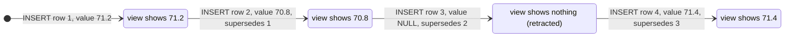
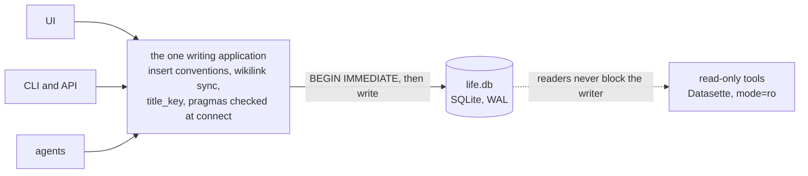
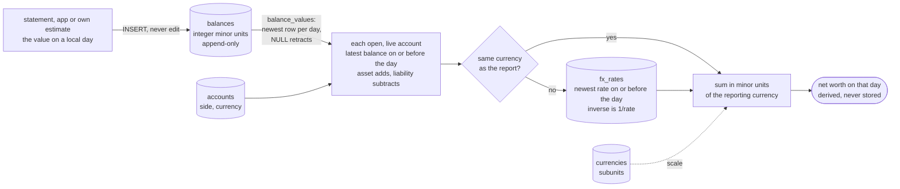
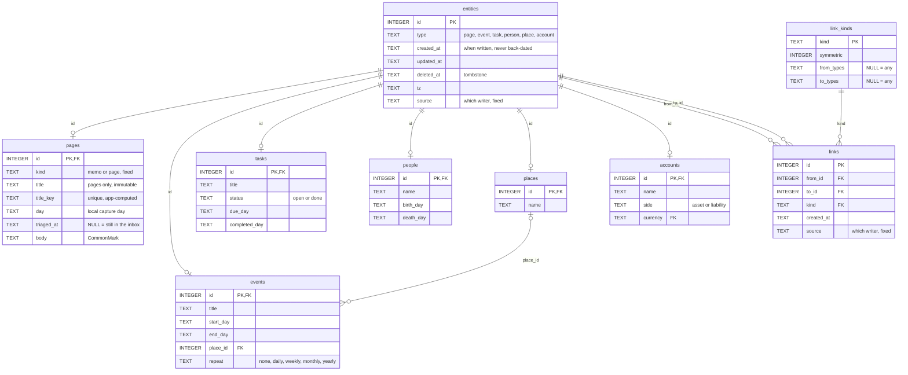
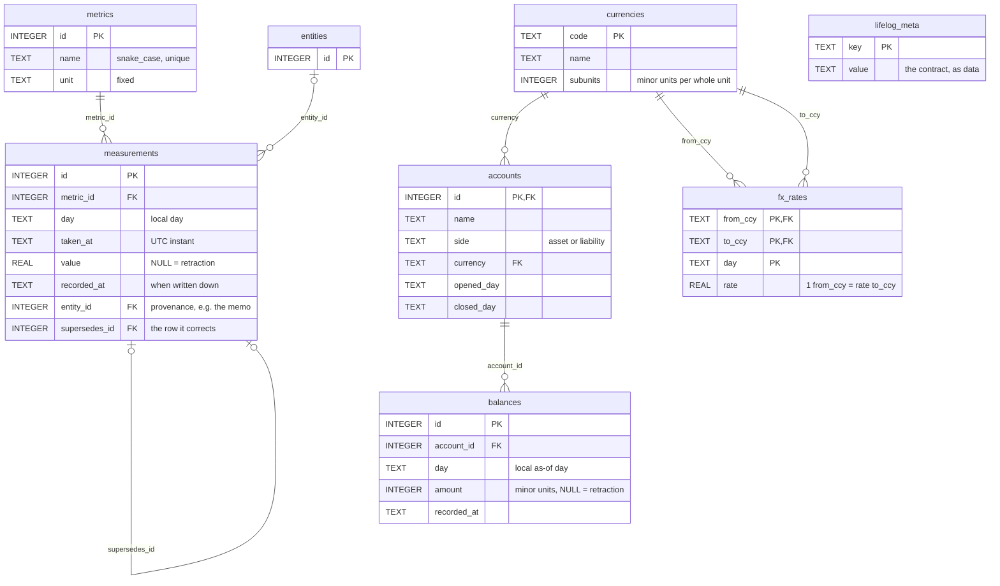
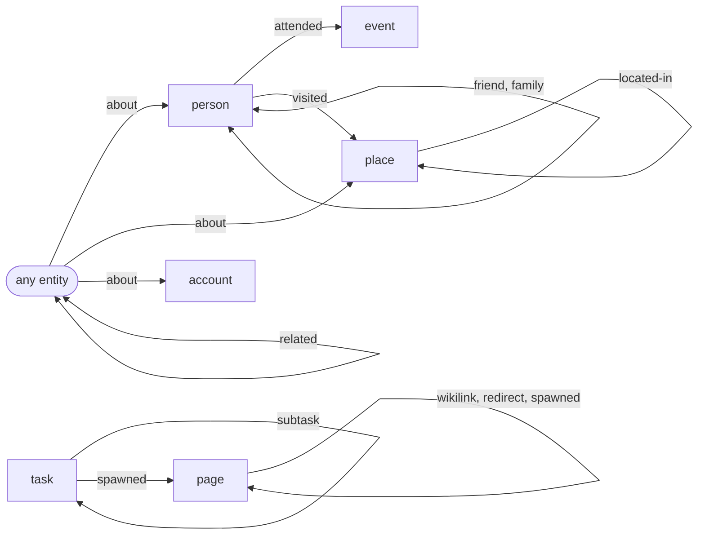
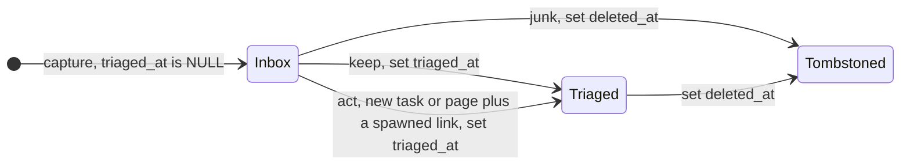
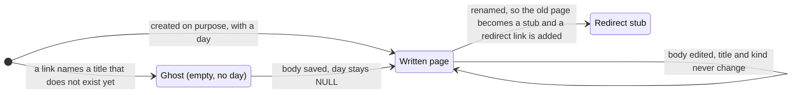
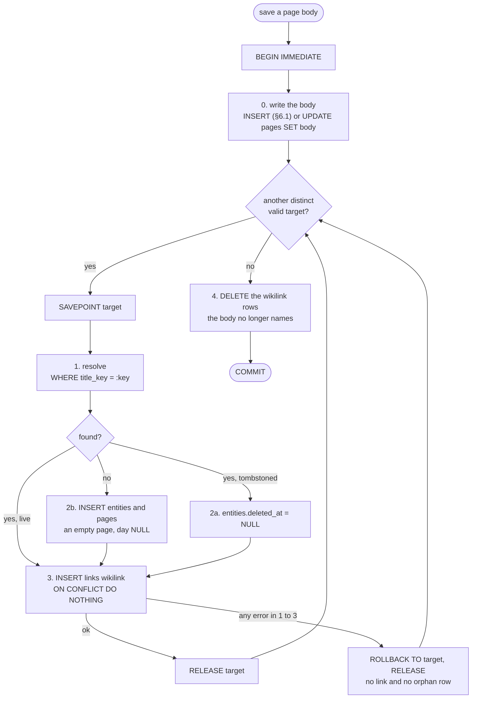

# Lifelog — Database Schema v1

**Status:** frozen pending external review. No canonical database exists yet; until one does, §3 is edited in place (D13).
**Scope of the project:** A lifetime personal database (journal/memos, pages (notes, wiki), events,
tasks, people, health metrics, personal finance — accounts, balances, net worth; file
attachments deferred — D9) in a single SQLite file,
plus a custom UI for data entry and daily use. Everything else (view generators, AI
features, sync, multi-device) is explicitly out of scope.

This document is self-contained: it records the full schema (DDL), every design decision
with its rationale, the alternatives that were considered and rejected, the conventions
that writers of the schema must follow, a query cookbook proving the schema serves its
use cases, and the sources the decisions are based on. It is written to be reviewed cold,
without access to the conversation that produced it.

---

## Table of contents

1. [Goals and design principles](#1-goals-and-design-principles)
2. [Storage contract (conventions)](#2-storage-contract-conventions)
3. [The schema (canonical DDL)](#3-the-schema-canonical-ddl)
4. [Entity model overview](#4-entity-model-overview)
5. [Decision log](#5-decision-log)
6. [Query cookbook](#6-query-cookbook)
7. [Explicit non-goals and deferred work](#7-explicit-non-goals-and-deferred-work)
8. [References](#8-references)

---

## 1. Goals and design principles

**The goal:** one database that a single human writes to for ~50 years and that remains
readable and meaningful long after the current application is gone. The dominant risk is
not SQLite durability (settled — see D1); it is *meaning living only in application code*,
and *canonical data being corrupted by uncontrolled writers*.

**Principles, in priority order:**

1. **Pareto / KISS.** Choose the 20% of mechanism that delivers 80% of the value. Every
   table and column must justify itself against "what if we just didn't have it."
   Complexity that was researched and *deliberately cut* is listed in §7 so it is not
   silently re-added.
2. **The schema is the documentation.** Real tables, real column names, real types, real
   constraints. A stranger in 2075 should understand the database from
   `.schema` output alone — so the rules each table needs are comments *inside* its `CREATE`
   statement, the only comments the file keeps. (SQLite's own "application file format" essay
   makes exactly this argument — see [R1].)
3. **Single writing application.** One application (later with CLI/API/agent
   front-ends) owns all writes to the database. Many
   *processes* are fine — one *writer* owning the conventions. No other app is ever
   pointed at the canonical data with write access (see D3).
4. **Additive-only evolution after freeze.** Once real data exists, schema changes are
   `ADD COLUMN` / `CREATE TABLE` / new indexes and numbered forward-only migrations.
   SQLite explicitly blesses additive change as its compatibility mechanism
   ("adding new tables or columns does not change the meaning of prior queries" [R1]).
5. **Derived data is disposable.** The FTS index and `title_key` can be dropped and rebuilt
   from canonical data at any time; nothing else is derived. `life.db` is irreplaceable.
   (Binary files are out of v1 entirely — see D9.)

---

## 2. Storage contract (conventions)

These conventions are part of the schema's meaning. They are also embedded as comments in
the init DDL (§3; after the freeze, `0001_init.sql`). *Executed* in this document means that a suite in
`tests/` runs the claim against §3 (`tests/README.md` lists the suites).

### 2.1 Directory layout

```
life/
└── life.db                  # canonical: all structured data + all prose
```

`life.db`, `life.db-wal` and `life.db-shm` are never committed to git: binary churn, and git
history cannot be scrubbed of finance data (§2.10). Binary files (`media/`) are deliberately
deferred out of v1 (D9) — the layout grows a `media/` sibling when they return.

### 2.2 Time

- **Instants** (`*_at` columns): UTC, ISO-8601, millisecond precision,
  e.g. `2026-06-09T21:14:03.482Z`. Written by the app, never by SQLite defaults
  (SQLite's `CURRENT_TIMESTAMP` is second-precision and non-ISO; `strftime('%Y-%m-%dT%H:%M:%fZ','now')`
  is the in-DB form used by triggers) [R5][R6][R28].
- **Local days** (`*_day` columns): the *local calendar date where the thing happened or
  was captured*, TEXT `YYYY-MM-DD`, written at insert time from the writer's timezone.
  **Never derived from the UTC instant at query time.** This survives timezone changes,
  DST, and travel: "the day I graduated" is a local-date fact, not an instant [R7][R8].
  The pattern (UTC instant + denormalized local day) is taken from health-mcp [R8] and
  FxLifeSheet's `matcheddate` column [R9].
- Format and calendar validity are enforced in-DB with round-trip CHECKs:
  `date(x) IS x` for days, `strftime('%Y-%m-%dT%H:%M:%fZ', x) IS x` for instants.
  The `IS` operator, not `=`, matters: a CHECK passes when it evaluates to NULL, and
  `date()` returns NULL for malformed input, so `date(x) = x` silently *accepts*
  garbage like `2026-9-3` — empirically confirmed.
- **`entities.created_at` is when the row was written to `life.db`** — never back-dated, so it
  can serve as an audit trail (as `recorded_at` does on `measurements` and `balances`). When a
  thing *happened* is its own `day` / `*_at`. (An imported memo's original time of day has no
  column: a known limit.)
- **Time zone.** `entities.tz` and `measurements.tz` store the writer's IANA zone at capture
  (`Europe/Berlin`; NULL = unknown), so a UTC instant can be read as local time. Only capture time
  can supply it — it cannot be reconstructed later. Events have no `tz` of their own (D10).
- An event may be day-precise only (`start_day`, `end_day`, no `*_at`). Date-level facts
  are first-class in a biography database.

### 2.3 Identity

- Every entity, fact and join table uses `INTEGER PRIMARY KEY` (rowid alias; no
  `AUTOINCREMENT` — the keyword adds overhead and is "usually not needed" [R4]). The four
  registries and reference tables keep their natural key instead: `lifelog_meta(key)`,
  `link_kinds(kind)`, `currencies(code)`, `fx_rates(from_ccy, to_ccy, day)`.
- The six *entity* types (`page`, `event`, `task`, `person`, `place`, `account`) share one ID
  space via the `entities` supertype table (D8, D16, D18). A domain row's `id` **equals** its
  `entities.id`; the app inserts the `entities` row first with `INSERT … RETURNING id` and binds
  that id in the same transaction (see §6.1). Never `last_insert_rowid()` across statements: any
  insert in between — a link, a ghost page, a measurement — moves it, and the next row silently
  points at the wrong entity (executed). `UNIQUE(id, type)` on
  `entities` plus a composite FK in every domain table make the type↔table pairing
  structural, not conventional (verified).
- **Provenance.** `entities.source` and `links.source` name the writer that made the row — `ui`,
  `cli`, `api`, `agent:<name>`, `import:<name>` (lowercase `[a-z0-9_:.-]`, 1–64 characters; NULL =
  unknown). Like `tz`, only the moment of writing knows it, so it is written at insert and a trigger
  keeps it from changing. With agents among the writers (D3), it is how a wrong row is traced to the
  writer that made it. `measurements.source` and `balances.source` name the *data* source instead
  (`manual`, `statement`, an importer).
- `measurements`, `balances`, `metrics`, `currencies`, `fx_rates`, `links`, `link_kinds`,
  `lifelog_meta` are *not* entities (they are facts, joins, and registries). An `account` is an
  entity; its balances are facts.

### 2.4 Deletion

- **No hard deletes of entities.** Deletion sets `entities.deleted_at` (tombstone) — and that is *enforced*: `BEFORE DELETE` triggers reject deleting an `entities` row or any
  domain row (`links` are the one hard-deleted table, D11). Every read path filters
  `deleted_at IS NULL`. In 20 years it should be possible to know what was erased and when (D11).
- Junk captured by accident (duplicate import, mis-tap) is tombstoned like everything
  else; the storage cost is irrelevant at this scale.
- `measurements` are **append-only and never deleted — enforced by triggers**, not
  convention: `UPDATE` and `DELETE` are rejected. Corrections insert a new row with
  `supersedes_id` pointing at the corrected row, at most one correction per row (D7). A
  correction whose `value` is NULL **retracts** the row it corrects (a mis-tap, a wrong metric).
  Importers use `INSERT … ON CONFLICT(source, import_id, metric_id) WHERE import_id IS NOT NULL
  DO NOTHING` — never `INSERT OR IGNORE` (it silently skips rows that violate a CHECK or NOT
  NULL) and never `OR REPLACE` (a delete, blocked only when `recursive_triggers=ON`, §2.9).
- `balances` are append-only in the same way: `UPDATE` and `DELETE` are rejected; a wrong
  value is corrected by inserting a newer row for the same `(account_id, day)`, and an entry
  that should never have existed is retracted with a NULL `amount` (D18).

**A correction never overwrites.** One reading, corrected, retracted and restored — what
`measurement_values` shows after each insert (§6.10). `balance_values` works the same way, with the
newest row per `(account_id, day)` in place of `supersedes_id`.



### 2.5 Prose, wikilinks, and renames

- `pages.body` is CommonMark text. Wiki references are written inline as `[[Page Title]]`.
  A `#tag` is read as `[[tag]]`, so tags are just pages (D5). The app never rewrites
  the body: `#health` stays `#health` in the database.
- **The save contract (D19).** Saving a page body is one `BEGIN IMMEDIATE` transaction
  (§6.14): the body, then the page's `links(kind='wikilink')` rows, made **equal to the set of
  pages the body names** — missing rows added, rows the body no longer supports deleted — so a
  re-save changes nothing and every link can be rebuilt from the bodies alone. The `links`
  table is the source of truth for the graph; the body text is the source of truth for prose.
  Backlinks = `links WHERE to_id = ?`. The rules, all executed against the vectors
  below:
  - *What is read.* The CommonMark **text** of `pages.body`, after NFC normalisation — not code
    spans, code blocks, raw HTML, link destinations or image alt text. Any CommonMark parser
    yields exactly this (tested with markdown-it-py [R59]), so nothing is hand-parsed. Only
    `pages.body` is read: tasks, events and people carry no wikilinks.
  - *Wikilink.* `[[title]]` or `[[title|alias]]`, with no `[`, `]` or line break inside, and the
    brackets and title in **one** run of plain text (`[[Health *Diet*]]` is not a link, and
    `[[Diet]](url)` is a Markdown link). The title is the text before the first `|`, trimmed of
    spaces (U+0020 only, like the DDL's `trim`); the alias is display text the database ignores.
    There is no `#anchor` form (`#` is an ordinary title character, so `[[C#]]` works) and no
    escape (`\[[x]]` still links; write a literal `[[x]]` in a code span). Nothing else is
    normalised: `[[Health  Diet]]` with two spaces is a different page from `[[Health Diet]]`.
  - *Tag.* `#` followed by words of letters, marks, digits and `_` (Unicode categories L, M, N)
    joined by single `-`, where the `#` is **not** glued to a preceding such character, `/` or `#`
    — so `C#`, `a#b`, `http://x/#frag` and `##x` are not tags — and the word is not all digits
    (`#12` and `#2024` are not tags, `#2024-review` is). Wikilinks are read first and their text
    is not re-read for tags (`[[Project #alpha]]` is one title). `# Heading` (with a space) is a
    heading; `#Heading` is not a CommonMark heading, so it is a tag. `#Health` and `#health` are
    one page.
  - *Stub pages.* A body that starts with `#REDIRECT [[` (any case, leading whitespace allowed) is
    a rename stub (below): it gets no wikilinks and no tags — its one edge is the `redirect` link
    the app writes — so a stub never shows up as a backlink. Elsewhere the word `#redirect` alone
    is never a tag, so nothing can create a page called `redirect`.
  - *An invalid target makes no link and never blocks a save.* A title the filename rules below
    reject (`[[Health/Diet]]`, `[[Re: plan]]`, the tag `#con`) is skipped. The app checks those
    rules before inserting — its predicate agreed with the DDL's own CHECKs on 44 025 strings —
    and creates each target inside its own `SAVEPOINT` (§6.14), so even a target the predicate
    wrongly let through is rolled back alone: the memo is saved and no orphan `entities` row is
    left. The UI reports skipped targets; nothing is stored about them — the text stays in the
    body, and the next save links it once it is valid.
  - *A page never links to itself* (`[[Diet]]` inside the page `Diet` is ignored), and *a
    tombstoned target is revived*, not duplicated (Lookups, below).
  - *Known limits.* A body that also defines a reference (`[Ref]: http://r`) turns `[[Ref]]` into
    a Markdown link, so it is not a wikilink; a `#` written as an entity (`&#35;x`) is decoded
    before the scan and counts as a tag; a wikilink resolves to a **page** only, so `[[Sam]]`
    never reaches the `people` row (§7).

  Test vectors — every writer must reproduce them (`\n`, `́`, `̈` stand for a line
  break and combining marks; a body is shown in a code span):

  | body | links to (`title`s, in order) |
  |---|---|
  | `See [[Diet plan]].` | `Diet plan` |
  | `[[Diet plan\|my diet]]` | `Diet plan` |
  | `[[  Diet plan  ]]` | `Diet plan` |
  | `[[C#]] and [[Page#Section]]` | `C#`, `Page#Section` |
  | `[[Health/Diet]]` | — |
  | `[[Re: plan]]` | — |
  | `[[]] [[ ]] [[\|alias]]` | — |
  | `[[Café]] [[CAFÉ]] [[Café]] [[cafe]]` | `Café`, `cafe` |
  | `[[Café notes]]` | `Café notes` |
  | `\[[escaped]]` | `escaped` |
  | `` text `[[code]]` text `` | — |
  | `a\n\n~~~\n[[fence]]\n~~~\n\nb` | — |
  | `[[Diet]](http://y)` | — |
  | `[[Health *Diet*]]` | — |
  | `[[Ref]]\n\n[Ref]: http://r` | — |
  | `[[CON]] [[nul]] [[Com1]] [[CONSOLE]] [[COM10]] [[LPT0]]` | `CONSOLE`, `COM10`, `LPT0` |
  | `[[CON.backup]] [[nul.txt]] [[COM\u00b9]] [[LPT\u00b2.x]] [[a.CON]] [[CONSOLE.txt]]` | `a.CON`, `CONSOLE.txt` |
  | `Feeling good #health today` | `health` |
  | `#Health and #health and #HEALTH` | `Health` |
  | `#tag. #tag2, (#paren) "#quoted" #end-` | `tag`, `tag2`, `paren`, `quoted`, `end` |
  | `#café #zürich` | `café`, `zürich` |
  | `# Heading\n\n## Sub\n\n### Sub sub` | — |
  | `#Heading` | `Heading` |
  | `I write C# and F# and a#b` | — |
  | `[a](http://x/#frag) <http://x/#auto> http://x/#bare` | — |
  | `issue #12 and #2024 but #2024-review` | `2024-review` |
  | `[[Project #alpha]] #beta [[#gamma]]` | `Project #alpha`, `beta`, `#gamma` |
  | `#con #nul #console` | `console` |
  | `#REDIRECT [[New Title]]` | — |
  | `see #REDIRECT [[New Title]]` | `New Title` |

  (Also: a 240-byte title is a link, a 241-byte one is not; 80 × `日` = 240 bytes is, 81 is not.)
- **Renames are forbidden** (D5): renaming would silently repoint every `[[Old Title]]`
  in decades of prose, or leave ghosts if it didn't. Instead: create the new page, make
  the old page a one-line stub (`#REDIRECT [[New Title]]`), and add
  `links(kind='redirect', from=old, to=new)`. Consumers follow one hop; `redirect` links
  are excluded from backlink queries (§6.5), and the stub's own body is not read for
  wikilinks (contract above). Orphaned empty stubs are surfaced by the
  `ghost_pages` view for occasional sweeps (§6.13).
- **Titles are file-name-safe names — the schema keeps them safe, unique and permanent.**
  - *Safe.* A page title must be usable as a file name anywhere, so the DDL
    rejects titles that are unsafe as a filename on Linux, macOS and Windows: path
    separators and Windows-reserved characters (`/ \ : * ? " < > |`), control
    characters (incl. NUL, DEL and the C1 range U+0080–U+009F), invisible and bidi characters (soft
    hyphen U+00AD, U+061C, zero-width space U+200B, LRM/RLM U+200E–F, embeddings and overrides
    U+202A–E, U+2060–4, isolates U+2066–9, BOM U+FEFF — each would make `Diet` and a look-alike
    `Diet` two pages [R63]; ZWNJ/ZWJ U+200C/D stay, Persian words and emoji need them), a leading or trailing `.` (hidden files, `..`, Windows), a
    Windows device name (`CON`, `NUL`, `COM1`…, and the superscript `COM¹ COM² COM³ LPT¹ LPT² LPT³`)
    **bare or before an extension** — `CON.backup` and `NUL.txt` are the device too [R58] — and
    leading/trailing spaces. Titles are 1–240 **bytes** (a filename limit is 255
    bytes, with headroom for an extension). `[[Health/Diet]]` and `[[Re: plan]]` are therefore not valid
    page names — use `[[Health - Diet]]` — and a wikilink to one makes no link (contract
    above). Memos have no title. Checked against the Windows documentation only (Windows itself
    is not executable here); a name with a space before its dot (`CON .txt`) is not covered
    because the documentation does not say it is reserved. The rule is the strict one on
    purpose, and it is named (`pages_title_safe`): loosening it after the freeze is one
    `DROP CONSTRAINT` + `ADD CONSTRAINT`, while a title that is valid everywhere never has to change
    (D5). The app is stricter than the DDL in one way: it also rejects code points Unicode has not
    assigned yet (category `Cn`), whose case fold a later Unicode version could define — which would
    silently change `title_key`. Unicode keeps case folding stable only for assigned characters.
  - *Permanent.* A title never changes (`pages_title_fixed`): a rename would silently
    repoint every `[[Old Title]]` in decades of prose (D5). To fix a title, create the
    new page and turn the old one into a `#REDIRECT` stub with `links(kind='redirect')`.
  - *Unique — on `title_key`, not on the title.* `title_key` is the title in normalised,
    case-folded form, **computed by the app** and stored beside it; `pages_title` is a
    `UNIQUE` index on it (every titled page, tombstoned rows included). So `Café`, `CAFÉ`, the
    decomposed `Cafe\u0301` and `Straße`/`STRASSE` are one page, on every filesystem.
    The function is fixed: `title_key = NFC(casefold(NFC(title)))` — in Python
    `unicodedata.normalize('NFC', unicodedata.normalize('NFC', t).casefold())`. A writer
    in another language must reproduce these vectors exactly:

    | title | `title_key` |
    |---|---|
    | `Café notes`, `Cafe\u0301 notes` (NFD), `CAFÉ NOTES` | `café notes` |
    | `Straße`, `STRASSE` | `strasse` |
    | `ΣΑΣ`, `σας` (final sigma) | `σασ` |
    | `DŽ` | `dž` |
    | `file` (ligature) | `file` |
    | `İstanbul` | `i̇stanbul` (`i` + U+0307) |
    | `日本語 ノート`, `Diet` | `日本語 ノート`, `diet` |

    *Why a column and not a collation:* SQLite folds ASCII only (`NOCASE`), and a
    Unicode collation (ICU, or one the app registers) is rejected — a database whose
    index needs a collation only one program supplies can be read by anyone but **not
    written or integrity-checked** (`no such collation sequence`, verified with the
    `sqlite3` CLI) — see §7. *What the DB verifies:* a key exists iff there is a title;
    it is trimmed, non-empty and has no ASCII capitals; for a pure-ASCII title it must
    equal `lower(title)`. *What it cannot:* for a non-ASCII title, that the key is the
    *right* fold — a writer that computes it wrongly gets uniqueness wrong (and nothing
    else), so the key function lives in the one writing application (principle 3). The
    key is derived data: recompute it after changing the function; the unique index
    then reports any genuine collision at that moment.
  - *Lookups.* Resolve a `[[wikilink]]` with `WHERE title_key = :key`. The unique index is
    partial (`WHERE title_key IS NOT NULL`: memos have no key) and an equality on the key implies
    that predicate, so SQLite uses it (§6.14). The unique index covers tombstoned pages, so when a save resolves a title
    that belongs to a tombstoned page the app un-tombstones it rather than inserting a
    duplicate. Saving *any* body that names it does this — an old memo edited years later
    included — so the UI tells the owner that the save revives a deleted page.

### 2.6 Files (deferred — see D9)

Binary files are cut from v1 (decision D9: `attachments` and `media/` deferred until the
first real photo/PDF need). The design — SHA-256 content-addressed `media/`, hash +
extension + mime + size in an `attachments` table, path derived never stored, dedup by
hash — is recorded in D9 so it is not reinvented. Reopen trigger: the first genuine
attachment need. Until then the database is all text and `life.db` stays megabyte-scale.

### 2.7 Migrations

- **Until the schema freeze there are no migrations.** §3 of this document is the single
  canonical init DDL, edited in place; test databases are created by applying §3 to a
  fresh file and thrown away (D13).
- After real data exists: numbered plain-SQL files, `db/migrations/0002_*.sql`, … applied
  in order; progress tracked with `PRAGMA user_version` (a 32-bit integer in the DB
  header — no bookkeeping table needed) [R20][R21][R22].
- No ORM, no migration framework. At single-user scale the runner is ~20 lines or, in the
  limit, `sqlite3 life.db < 000N_*.sql` by hand.
- The init DDL sets `PRAGMA application_id = 0x4C494645` (`'LIFE'`) so `file(1)` and
  future tools can recognize the database [R1].

### 2.8 Integrity checks

Four checks tell whether a file still obeys the schema. They read only the file, need no other
copy, and each catches what the others cannot. Run them before and after an import (§2.11) or a
migration (§2.7), and after any writer crashed. Every claim below was executed on the **live**
file, not on a copy.

```sql
PRAGMA integrity_check;      -- one row: ok
PRAGMA foreign_key_check;    -- no rows
SELECT id FROM entities WHERE id NOT IN (SELECT id FROM pages UNION SELECT id FROM events UNION SELECT id FROM tasks UNION SELECT id FROM people UNION SELECT id FROM places UNION SELECT id FROM accounts);   -- no rows
INSERT INTO pages_fts(pages_fts, rank) VALUES ('integrity-check', 1);   -- no error
```

- **`integrity_check` — the file's structure.** It caught a zeroed table page, a file truncated by
  three pages, and an index entry that no longer matches its row (a flipped byte in a `title_key`
  inside `pages_title`: `row … missing from index pages_title`).
- **`foreign_key_check` — what the first cannot see.** A writer that forgot `PRAGMA foreign_keys=ON`
  (§2.9 — per connection) stored a balance for an account that does not exist, and
  `integrity_check` said `ok`.
- **The orphan query — the one check no constraint can express.** An `entities` row with no domain
  row (a writer that died between its two inserts): both other checks are clean on it.
- **The FTS5 integrity-check — the index against its content.** `pages_fts` is an external-content
  index over `pages`; if the two drift apart (a row indexed that `pages` does not hold), searches
  return wrong rows and `PRAGMA integrity_check` still says `ok`. The FTS5 command with rank `1`
  compares the index with `pages` and fails (`database disk image is malformed`). The index is
  derived: `INSERT INTO pages_fts(pages_fts) VALUES('rebuild')` repairs it (all executed). Writing
  it is a write, so it runs on a writer connection.
- **What none of them sees: a changed value.** A flipped byte inside a body passed
  `integrity_check` — SQLite keeps no page checksums — so damage inside a cell cannot be found from
  the file alone. The cheap guard is below the file: keep `life.db` on a filesystem that checksums
  data (btrfs and ZFS do by default; never `chattr +C` the file or its folder, which turns btrfs
  checksums off) and scrub it now and then (`btrfs scrub`) — a flipped byte then becomes a read
  error instead of a silently wrong value. SQLite's own `cksumvfs` [R64] does the same per page
  inside the file, at the cost of an extension every writer must load; it is not used.

### 2.9 Connection setup (every writer, mandatory)

```sql
PRAGMA journal_mode = WAL;     -- persistent; set once by the init DDL (§3)
PRAGMA synchronous  = FULL;    -- per connection. NORMAL in WAL "might roll back following a power loss" [R54];
                               -- FULL costs about 1 ms per commit here (btrfs) — free for a journal
PRAGMA foreign_keys = ON;      -- MANDATORY per connection: SQLite's default is OFF and
                               -- STRICT does not enforce FKs (verified)
PRAGMA recursive_triggers = ON;  -- MANDATORY per connection: with OFF, INSERT OR REPLACE / REPLACE INTO
                               -- deletes the conflicting row WITHOUT firing the append-only DELETE
                               -- triggers (measurements, balances) — verified; ON blocks it
PRAGMA busy_timeout = 5000;    -- wait instead of failing instantly on SQLITE_BUSY
PRAGMA trusted_schema = OFF;   -- the schema may call only side-effect-free functions (all of this one's are)
```

A writer should read these back at connect time and refuse to run if `foreign_keys` or
`recursive_triggers` is 0 or `synchronous` is not 2 (FULL, which is also SQLite's default) —
none of these is stored in the file, so the file alone cannot enforce them (and `PRAGMA
foreign_keys` is a silent no-op inside a transaction). It also refuses to run on a SQLite older
than **3.51.3**: every version from 3.7.0 to 3.51.2 has a WAL race in which a write that lands
while two checkpoints overlap can be lost from the file — rare, but this design has several writer
processes and readers on one file, which is exactly the condition [R65]. Migrations need 3.53
(D13). The versions are data (`lifelog_meta.sqlite`), and every CHECK uses only functions those
versions have.

Two more settings cost nothing. `SQLITE_DBCONFIG_DEFENSIVE` (a C-level switch, in Python
`conn.setconfig(sqlite3.SQLITE_DBCONFIG_DEFENSIVE, True)`) makes the FTS shadow tables and
`writable_schema` untouchable from SQL, so no statement can corrupt the index or the schema by
hand; with it and `trusted_schema = OFF` the whole schema and every §6 query still work (executed).
`PRAGMA optimize` when a connection closes keeps the planner's statistics fresh (the `CROSS JOIN`s
of §6.16 pin their order regardless).

The driver must not open transactions of its own. Python's `sqlite3` in its default mode silently
sends a deferred `BEGIN` before the first `INSERT`/`UPDATE`/`DELETE`, which defeats the
`BEGIN IMMEDIATE` rule below; open the connection with `autocommit=True` (Python 3.12+) or
`isolation_level=None` and issue `BEGIN IMMEDIATE` yourself. Other drivers have the same switch
under other names.

**Every write transaction starts with `BEGIN IMMEDIATE`.** A deferred `BEGIN` that reads first —
resolve a wikilink, then create the page (§6.14) — fails **at once** with `database is locked`
if another writer committed in between: `busy_timeout` does not apply to that lock upgrade
(executed). `BEGIN IMMEDIATE` takes the write lock up front, so a second writer waits
(up to `busy_timeout`) and then sees the first one's rows. Every write example in §6 does this;
keep such transactions short.

Readers need no setup but must be **read-only**: open the file with `?mode=ro` (SQLite then
refuses every write — `attempt to write a readonly database`, executed) or `sqlite3 -readonly`.
Datasette does this by itself — its connection is `mode=ro` and its SQL console accepts only
`SELECT` (executed on 0.65.5). Under WAL a reader sees the live file while the app writes
and never blocks it (executed). sqlite-web can insert, update and delete rows, which would make
it a second writer, so it is not used (D14). Three reader traps [R65][R66]:
- **Never `immutable=1`** (Datasette's `-i`): it tells SQLite the file cannot change, so a reader of
  the live file sees stale or inconsistent pages while the app writes. Use the default `mode=ro`.
- **Keep read transactions short.** A checkpoint cannot reset the WAL while any reader holds a
  snapshot; a reader that never lets go makes `life.db-wal` grow without bound.
- **One machine, a local disk.** WAL needs shared memory between the processes, so `life.db` never
  lives on a network file system (NFS, SMB) or in a folder a sync client (Dropbox, Syncthing,
  iCloud) copies while it is open.

"Single writing application" (principle 3, D3) does not mean a single OS process: the
app, its CLI, the API service, and local agents are all the same *writer* as long as
they go through the one application stack that owns the insert conventions (entity row
first, day written at insert, wikilinks re-extracted on save, measurements appended).

**Who writes, who reads** (principle 3, D3):



### 2.10 Money (D18)

- **Exact, integer, per-account currency.** An amount is an `INTEGER` count of *minor units*
  of the owning account's currency; `currencies.subunits` (100 for EUR, 1 for JPY) turns it
  into a number. Never `REAL`, never a `measurements` row: `0.1 + 0.2` in `REAL` is
  `0.30000000000000004` (executed), and a sum of balances must be exact.
- **A balance is a fact about a local day.** `balances.day` is the *local* date the figure
  describes (end of day) — the same rule as every `*_day` (§2.2). `recorded_at` is the UTC
  instant it was written down; the two differ whenever history is backfilled.
- **What an account is.** Anything with a balance or a value. Record **your own share** of
  joint items. `side` (`asset` | `liability`) and `currency` never change (a trigger);
  `category` is free taxonomy. One rule covers everything: *the balance is the value in the
  account's currency on that day, as the statement, the app or your own estimate says*.

  | You own | Make an account | Balance is |
  |---|---|---|
  | deposit, savings, cash | `category 'deposit'` / `'cash'`, its own currency | the statement balance |
  | stocks, funds, pension | one per broker or wrapper (`'brokerage'`, `'pension'`); one per currency if you hold several | the portfolio's market value |
  | crypto | one per exchange or wallet (`'crypto'`), valued in the fiat you track it in | its market value that day |
  | house, car, watch, art | `'property'`, `'vehicle'`, `'valuables'` | your estimate (`source = 'estimate'`) |
  | mortgage, loan, card | `side = 'liability'` | the amount owed, positive |

  Sell everything or dispose of it: record a final balance and set `closed_day`.
- **Net worth is derived.** It is computed on read from the latest balance of each open account
  as of a day, converted with `fx_rates` as of that day (§6.16–6.17); it is never written to a
  table, so it can be re-derived in any currency for any date.
- **Secrets.** Never store credentials, PINs or full account/card numbers in `life.db` or in a
  memo: the file is plaintext (D17). An account's `notes` may hold the last four digits. Finance
  data never goes into git — its history cannot be scrubbed (§2.1).

**From a statement to net worth** (§6.15–§6.17):



---


### 2.11 Threat model, the 2075 test, and imports

**What is protected, and from what.** The asset is `life.db`: prose, health and finance in one
plaintext file (D17 — the database is deliberately not encrypted). The threats worth a control,
the control, and what is left:

| Threat | Control | Residual |
|---|---|---|
| The file is damaged or lost | `synchronous=FULL` and WAL on SQLite ≥ 3.51.3, on a local disk (§2.9); the integrity checks find damage (§2.8) | nothing recovers it: no second copy of the file is kept (§7); power loss is documented, not simulated [R67] |
| A changed value inside the file (bit rot) | a data-checksumming filesystem (btrfs, ZFS), never `chattr +C`, a periodic `scrub` (§2.8) | no check *inside* SQLite sees it; on a filesystem without checksums nothing does |
| A buggy writer, importer or agent | one writing application; triggers for append-only facts, no hard deletes and fixed kinds and titles; `ON CONFLICT … DO NOTHING`; `BEGIN IMMEDIATE`; the foreign-key and orphan checks (§2.4, §2.9, §2.8) | the pragmas are per connection, so the application asserts them at connect |
| Another tool editing rows | exploration tools open the file read-only; Datasette was executed read-only (§2.9, D14) | anything with write access to the file bypasses every control |
| A stolen disk | the disk holding `life.db` is encrypted at rest (D17) | a stolen *unlocked* machine has everything |
| Finance or health data leaking through git | `life.db` and its `-wal`/`-shm` are never committed; no credentials or full account numbers, ever (§2.1, §2.10) | `notes` fields are free text — the owner's discipline |
| The data exposed on a network | Datasette on localhost only and read-only; nothing that runs arbitrary SQL is reachable from outside (D17) | a wrong bind address |
| A reader in fifty years without this document | the 2075 test, below | — |

Out of scope: a hostile local user, malware running as the owner, and legal compulsion — those
need the database itself encrypted (§7).

**The 2075 test.** A stranger holds `life.db` and nothing else — no `SCHEMA.md`, no application.
Every question below must be answerable from `.schema` and `SELECT * FROM lifelog_meta` (the
contract as data, D17). The table is executed (`tests/schema/r10probes.py`): each listed key must
exist in a fresh database and its text must contain each phrase in the last column, and **every key
of `lifelog_meta` must be used by some question** — so a contract rule cannot be added without a row
here, and a row cannot be dropped without the test noticing.

| # | Question | `lifelog_meta` key(s) | The answer says |
|---|---|---|---|
| 1 | What is this, and which design? | `schema` | `lifelog` |
| 2 | How is an instant stored? | `instants` | `UTC`, `ISO-8601` |
| 3 | What is a `*_day` column? | `days` | `LOCAL`, `never recomputed` |
| 4 | In which time zone was a row written? | `tz` | `IANA` |
| 5 | When was a row written, versus when did it happen? | `created_at` | `never back-dated` |
| 6 | Can anything be deleted? | `deletes` | `tombstone` |
| 7 | Are measurements kept? How is one corrected? | `measurements` | `append-only`, `retracts` |
| 8 | In what unit are amounts? How do I get net worth? | `money`, `net_worth` | `minor units`, `never stored` |
| 9 | Which balance row wins for a day? | `balances` | `newest row` |
| 10 | How are currencies converted? | `fx_rates` | `from_ccy < to_ccy` |
| 11 | Which link kinds exist, and who may link what? | `link_kinds` | `closed registry` |
| 12 | How do `[[wikilinks]]` and `#tags` become links? | `wikilinks` | `CommonMark`, `invalid target makes no link` |
| 13 | Why is a page never renamed? What makes a title valid? | `renames`, `titles`, `title_key` | `never`, `240`, `NFC` |
| 14 | Why do ids of different tables coincide? How are rows created? | `entities` | `supertype`, `one transaction` |
| 15 | Who may write, and with which settings? | `writers` | `BEGIN IMMEDIATE`, `read-only` |
| 16 | What is derived and can be rebuilt? | `pages_fts`, `title_key` | `rebuildable`, `derived` |
| 17 | How do imports avoid duplicates and bad rows? | `imports` | `DO NOTHING`, `OR IGNORE` |
| 18 | What does a repeating event mean? | `recurrence` | `templates` |
| 19 | How does the schema change after real data exists? | `evolution` | `additive`, `user_version` |
| 20 | What is a memo, what is a page, and can one become the other? | `pages_kind` | `untitled`, `never changes` |
| 21 | Which SQLite may write this file? | `sqlite` | `3.51.3`, `3.53` |
| 22 | Who or what wrote this row? | `provenance` | `written at insert`, `agent` |

**Imports** — the path for data that already exists elsewhere (a journal archive, a health export,
statements). Every step was executed on 1 000 synthetic rows:

1. **Trial run first.** Rows are never deleted, so a bad import can only be retracted row by row
   (a NULL-value correction for a measurement or a balance, a tombstone for an entity). Do the
   first run of any new importer on a *copy*: `sqlite3 life.db "VACUUM INTO '/tmp/trial.db'"`.
2. **Load the rows into a scratch database, never into `life.db`** (`sqlite3 scratch.db ".import
   --csv weights.csv staging"`), then insert in one `BEGIN IMMEDIATE` transaction per batch:

```sql
ATTACH 'scratch.db' AS s;
BEGIN IMMEDIATE;
INSERT INTO measurements(metric_id, day, taken_at, tz, value, recorded_at, source, import_id)
SELECT (SELECT id FROM metrics WHERE name = 'weight'), day, NULLIF(taken_at, ''), NULLIF(tz, ''), value,
       strftime('%Y-%m-%dT%H:%M:%fZ','now'), 'scale-export', id
  FROM s.staging WHERE true
ON CONFLICT(source, import_id, metric_id) WHERE import_id IS NOT NULL DO NOTHING;
COMMIT;
DETACH s;
```

   Three traps, each executed. **`WHERE true`** is required: in `INSERT … SELECT … FROM … ON CONFLICT`
   SQLite reads the `ON` as a join's, and answers "a JOIN clause is required before ON" (or `near "DO":
   syntax error`). **The conflict target repeats the index's `WHERE`**: the unique
   index is partial, and without it SQLite answers "ON CONFLICT clause does not match any PRIMARY
   KEY or UNIQUE constraint". **Never `CAST(value AS REAL)`**: it turns `'abc'` and `''` into `0.0`
   and `'12.5kg'` into `12.5`, silently — a plain insert into the STRICT column converts `'12.5'` and
   rejects `'abc'` and `''`. A CSV empty field is `''`, not NULL, so optional columns go through
   `NULLIF(…, '')`; a `''` in `taken_at` fails its CHECK. A fourth, for links: **never `INSERT OR
   REPLACE` into `links`** — on a symmetric kind the replace and the two mirror triggers keep firing
   each other (an outer `OR REPLACE` also overrides the mirror's own `OR IGNORE`), and SQLite stops
   with `too many levels of trigger recursion` (executed; nothing is changed, but the batch fails). Use `ON CONFLICT(from_id, to_id, kind) DO NOTHING`.
3. **Identity and time.** `source` names the importer, `import_id` is the source's own id, `day` /
   `taken_at` / `tz` say when it happened, `recorded_at` is when you imported it. `created_at` of an
   entity row is always the write time (§2.2) — never the date of the thing imported.
4. **What a failure does.** `ON CONFLICT … DO NOTHING` skips only a duplicate key: a malformed
   day, an impossible value or a dangling foreign key still raises and the **whole batch rolls back**
   (`OR IGNORE` would swallow them). Fix the data and run the batch again.
5. **Check afterwards:** the four checks of §2.8 (`integrity_check`, `foreign_key_check`, the orphan
   query, the FTS5 integrity-check), per-source counts (`SELECT source, count(*), min(day), max(day) FROM measurements
   GROUP BY source`), and **run the importer a second time — it must insert nothing.**
6. **Before the freeze**, run steps 1–5 once with a real export on a copy: a real import is the one
   test this schema has never had.

## 3. The schema (canonical DDL)

This is the canonical init DDL. Until the freeze it is edited **in place** here — there
is no `0001_init.sql` file yet (D13); a test database is created by applying this block
to a fresh file (`tests/lib/docsql.py` extracts it).

```sql
-- ============================================================
-- Lifelog schema v1: the single init file, edited in place until the freeze;
-- numbered migrations begin only after real data exists (D13).
-- The contract is data:  SELECT * FROM lifelog_meta;  and the rules of each table are
-- comments INSIDE its CREATE statement, so .schema shows them (a comment outside a
-- statement is not stored in the file).
-- Every writer connection: SQLite >= 3.51.3; PRAGMA foreign_keys = ON;
-- PRAGMA recursive_triggers = ON; PRAGMA synchronous = FULL; PRAGMA trusted_schema = OFF;
-- and every write transaction starts with BEGIN IMMEDIATE (section 2.9).
-- ============================================================
PRAGMA application_id = 0x4C494645;   -- 'LIFE' — recognizable to file(1) and tools
PRAGMA user_version  = 1;
PRAGMA journal_mode  = WAL;           -- persistent; readers (Datasette) don't block the writer

CREATE TABLE lifelog_meta (
  -- the contract as data: time formats, derived indexes, rename, recurrence, money and
  -- writer rules, readable with a SELECT by someone who has only this file
  key   TEXT PRIMARY KEY,
  value TEXT NOT NULL
) STRICT;
INSERT INTO lifelog_meta(key, value) VALUES
  ('schema',     'lifelog v1'),
  ('instants',   'UTC ISO-8601 TEXT, ms precision, e.g. 2026-06-09T21:14:03.482Z'),
  ('days',       'LOCAL calendar date TEXT YYYY-MM-DD, written at insert, never recomputed'),
  ('renames',    'pages are never renamed; new page + links(kind=''redirect'')'),
  ('recurrence', 'events with repeat <> ''none'' are templates; occurrences expand at read; nothing else repeats'),
  ('pages_fts',  'derived FTS5 index (unicode61: a CJK run is one token); pages_fts_* shadow tables are rebuildable, not data'),
  ('measurements','append-only (triggers reject UPDATE/DELETE); read through view measurement_values; one correction per row; a correction with NULL value retracts its row'),
  ('deletes',     'entities and their domain rows are never deleted (tombstone via entities.deleted_at, enforced by triggers); measurements and balances are never deleted; only links rows are hard-deleted (D11)'),
  ('created_at',  'entities.created_at = when the row was written to life.db, never back-dated; when a thing happened is its day / *_at fields'),
  ('tz',          'entities.tz and measurements.tz = IANA zone name of the writer when the row (measurements: taken_at) was captured, e.g. Europe/Berlin; NULL = unknown; with the UTC instant it gives the local time of day'),
  ('imports',     'INSERT ... ON CONFLICT(source, import_id ...) DO NOTHING; never OR IGNORE (skips CHECK/NOT NULL violations silently) or OR REPLACE (a delete)'),
  ('link_kinds',  'closed registry: links.kind references link_kinds; symmetric flag and endpoint types immutable and enforced; links rows are hard-deleted (D11)'),
  ('titles',      'page titles never change and are valid file names everywhere: <=240 bytes, no path/reserved characters or names (a device name like CON is reserved even before an extension), no control, invisible or bidi characters; memos are untitled'),
  ('title_key',   'pages.title_key = NFC(casefold(NFC(title))), computed by the app; UNIQUE across pages (a memo has none); ASCII titles must equal lower(title); rebuildable'),
  ('pages_kind',  'pages.kind is memo (untitled: the capture stream and the inbox; always has a day) or page (titled, unique, linkable; its day is NULL when the app created it as a link target); it never changes after insert'),
  ('money',       'amounts are INTEGER minor units of accounts.currency; whole units = amount / currencies.subunits; never REAL, never in measurements'),
  ('balances',    'append-only snapshots of an account''s value on a local day (account, day, amount); the newest row per (account_id, day) wins, newest = recorded last = highest id; NULL amount retracts; read through balance_values'),
  ('net_worth',   'derived, never stored: per open account, latest balance on or before the day, converted with fx_rates, assets minus liabilities (section 6.16)'),
  ('fx_rates',    'reference data (mutable): 1 from_ccy = rate to_ccy in WHOLE units; one row per pair, stored with from_ccy < to_ccy; as-of lookup = newest day <= target'),
  ('entities',    'every page/event/task/person/place/account row has an entities row with the same id (supertype; composite FK (id, entity_type)); both are inserted in one transaction'),
  ('wikilinks',   'links(kind=wikilink) from a page always equal what its body names: [[Title]], [[Title|alias]] and #tag, read from the CommonMark text, never rewritten; rebuilt on every save; an invalid target makes no link'),
  ('writers',     'one writing application; every connection sets foreign_keys=ON, recursive_triggers=ON, synchronous=FULL, trusted_schema=OFF, journal_mode=WAL and starts write transactions with BEGIN IMMEDIATE; every other tool opens the file read-only'),
  ('sqlite',      'writers need SQLite >= 3.51.3 (fixes a WAL corruption race between concurrent writers and checkpoints); migrations need >= 3.53 (ALTER TABLE ADD/DROP CONSTRAINT); CHECKs use only functions every such version has'),
  ('provenance',  'entities.source and links.source name the writer (ui, cli, api, agent:<name>, import:<name>); written at insert, never changed; NULL = unknown'),
  ('evolution',   'after the first real data: numbered forward-only SQL migrations, additive only, PRAGMA user_version; every CHECK is named, so any rule can be widened or tightened with ALTER TABLE DROP/ADD CONSTRAINT');

CREATE TABLE entities (
  -- The shared spine: one row per linkable thing (page, event, task, person, place, account).
  -- UNIQUE(id, type) plus the composite FK (id, entity_type) in every domain table make a row's
  -- type and its domain table agree; the app inserts this row first, in the same transaction.
  -- Nothing is ever deleted: deleted_at is the tombstone (D11), enforced by BEFORE DELETE triggers.
  -- Every *_at column in this file is a UTC ISO-8601 instant with milliseconds, every *_day a LOCAL
  -- date 'YYYY-MM-DD' written at insert and never recomputed; both are checked by a round-trip
  -- that uses IS, not =: a CHECK passes on NULL, and date('2026-9-3') is NULL.
  id         INTEGER PRIMARY KEY,
  type       TEXT NOT NULL CONSTRAINT entities_type
                  CHECK (type IN ('page','event','task','person','place','account')),
  created_at TEXT NOT NULL CONSTRAINT entities_created_at CHECK (strftime('%Y-%m-%dT%H:%M:%fZ', created_at) IS created_at),   -- when written to life.db, never back-dated
  updated_at TEXT NOT NULL CONSTRAINT entities_updated_at CHECK (strftime('%Y-%m-%dT%H:%M:%fZ', updated_at) IS updated_at),   -- kept by the *_touch triggers
  deleted_at TEXT     CONSTRAINT entities_deleted_at CHECK (deleted_at IS NULL OR strftime('%Y-%m-%dT%H:%M:%fZ', deleted_at) IS deleted_at),
  tz         TEXT     CONSTRAINT entities_tz CHECK (tz IS NULL OR (length(tz) BETWEEN 1 AND 64 AND tz NOT GLOB '*[^A-Za-z0-9_/+-]*')),   -- IANA zone of the writer when the row was created ('Europe/Berlin'); NULL = unknown
  source     TEXT     CONSTRAINT entities_source CHECK (source IS NULL OR (length(source) BETWEEN 1 AND 64 AND source NOT GLOB '*[^a-z0-9_:.-]*')),   -- which writer made the row: 'ui', 'cli', 'api', 'agent:<name>', 'import:<name>'; written at insert, never changed; NULL = unknown
  UNIQUE (id, type)
) STRICT;

CREATE TABLE pages (
  -- All prose: memos (untitled; the journal stream and the inbox, triaged_at NULL = still in the
  -- inbox) and pages (titled, unique, linkable: an essay, a reference page, a tag; D5). The day page
  -- is a query over the memo stream, not a row. Mood is the 'mood' metric in measurements (D6).
  -- A title is permanent: pages are never renamed (new page + a #REDIRECT stub + links(kind='redirect')).
  -- Uniqueness is on title_key = NFC(casefold(NFC(title))), computed by the app because SQLite cannot
  -- fold Unicode: 'Café' = 'CAFÉ' = NFD 'Café'. Look a page up with WHERE title_key = :key.
  -- links(kind='wikilink') from a page always equal the [[titles]] and #tags its body names (D19).
  id          INTEGER PRIMARY KEY,
  entity_type TEXT NOT NULL DEFAULT 'page' CONSTRAINT pages_entity_type CHECK (entity_type = 'page'),
  kind        TEXT NOT NULL CONSTRAINT pages_kind CHECK (kind IN ('memo','page')),
  title       TEXT,                       -- page: required, filename-safe, immutable; memo: NULL
  title_key   TEXT,                       -- page: NFC(casefold(NFC(title))), app-computed, unique; memo: NULL
  day         TEXT,                       -- local capture day; required for a memo; a page has one if written on purpose, NULL for a link target the app created
  triaged_at  TEXT CONSTRAINT pages_triaged_at CHECK (triaged_at IS NULL OR strftime('%Y-%m-%dT%H:%M:%fZ', triaged_at) IS triaged_at),
  body        TEXT NOT NULL DEFAULT '',   -- CommonMark; [[Wiki Links]] inline
  FOREIGN KEY (id, entity_type) REFERENCES entities(id, type),
  CONSTRAINT pages_memo_day CHECK (kind = 'page' OR day IS NOT NULL),   -- a memo always has a day; a page may have none
  CONSTRAINT pages_page_titled CHECK (kind = 'memo' OR title IS NOT NULL),
  CONSTRAINT pages_memo_untitled CHECK (kind <> 'memo' OR title IS NULL),   -- memos are untitled: a titled memo would be unfindable
  CONSTRAINT pages_key_iff_title CHECK ((title IS NULL) = (title_key IS NULL)),
  CONSTRAINT pages_key_folded CHECK (title_key IS NULL OR (length(title_key) >= 1 AND title_key = trim(title_key)
                               AND title_key NOT GLOB '*[A-Z]*')),      -- a folded key has no ASCII capitals
  CONSTRAINT pages_key_ascii CHECK (title_key IS NULL OR title GLOB '*[^ -~]*' OR title_key = lower(title)),   -- pure-ASCII titles: the DB verifies the key
  CONSTRAINT pages_title_len CHECK (title IS NULL OR (title = trim(title) AND length(title) >= 1
                           AND length(CAST(title AS BLOB)) <= 240)),  -- bytes: a filename limit is 255 bytes
  CONSTRAINT pages_title_safe CHECK (title IS NULL OR (   -- a title must be a valid file name on Linux, macOS and Windows: keep it safe
         title NOT GLOB '*[/\:*?"<>|]*'            -- path separators and Windows-reserved characters
         AND title NOT GLOB ('*[' || char(1) || '-' || char(31) || char(127) || '-' || char(159) || char(173) || char(1564)
                             || char(8203) || char(8206) || '-' || char(8207) || char(8234) || '-' || char(8238)
                             || char(8288) || '-' || char(8292) || char(8294) || '-' || char(8297) || char(65279) || ']*')
                                                   -- control characters (C0, DEL, C1) and invisible or bidi ones: soft hyphen, Arabic
                                                   -- letter mark, zero-width space, LRM/RLM, embeddings and overrides, word joiner and
                                                   -- invisible operators, isolates, BOM. ZWNJ/ZWJ (U+200C/D) stay: scripts and emoji need them
         AND instr(title, char(0)) = 0
         AND substr(title, 1, 1) <> '.' AND substr(title, -1) <> '.'   -- no hidden files, '..', trailing dot
         AND upper(CASE WHEN instr(title, '.') > 0 THEN substr(title, 1, instr(title, '.') - 1) ELSE title END)
             NOT IN ('CON','PRN','AUX','NUL',                -- Windows device names, bare or before an extension (CON.backup)
               'COM1','COM2','COM3','COM4','COM5','COM6','COM7','COM8','COM9','COM¹','COM²','COM³',
               'LPT1','LPT2','LPT3','LPT4','LPT5','LPT6','LPT7','LPT8','LPT9','LPT¹','LPT²','LPT³'))),
  CONSTRAINT pages_triage_memo CHECK (triaged_at IS NULL OR kind = 'memo'),
  CONSTRAINT pages_day_valid CHECK (day IS NULL OR date(day) IS day)
) STRICT;
CREATE UNIQUE INDEX pages_title ON pages(title_key) WHERE title_key IS NOT NULL;   -- memos have no key and stay out of it
CREATE INDEX pages_day ON pages(day);
CREATE INDEX pages_inbox ON pages(day) WHERE kind = 'memo' AND triaged_at IS NULL;
CREATE TRIGGER pages_title_fixed BEFORE UPDATE OF title ON pages
  WHEN NEW.title IS NOT OLD.title
BEGIN
  -- a rename would repoint every [[Old Title]] in decades of prose (D5); title_key is derived and may be recomputed
  SELECT RAISE(ABORT, 'titles are immutable: create the new page and make this one a #REDIRECT stub');
END;
CREATE TRIGGER pages_kind_fixed BEFORE UPDATE OF kind ON pages
  WHEN NEW.kind IS NOT OLD.kind
BEGIN
  -- flipping kind in place would silently change which CHECKs and indexes govern the row (D5)
  SELECT RAISE(ABORT, 'pages.kind is fixed: create a new page and link it (kind=spawned) instead');
END;

CREATE VIRTUAL TABLE pages_fts USING fts5(
  -- derived: external-content FTS5 kept in sync by the three triggers below; rebuild with
  -- INSERT INTO pages_fts(pages_fts) VALUES('rebuild'). Tokenizer unicode61 folds accents
  -- (Zurich finds Zürich); a CJK run is ONE token (section 7).
  title, body, content='pages', content_rowid='id'
);
CREATE TRIGGER pages_fts_ai AFTER INSERT ON pages BEGIN
  INSERT INTO pages_fts(rowid, title, body) VALUES (NEW.id, NEW.title, NEW.body);
END;
CREATE TRIGGER pages_fts_ad AFTER DELETE ON pages BEGIN
  INSERT INTO pages_fts(pages_fts, rowid, title, body) VALUES ('delete', OLD.id, OLD.title, OLD.body);
END;
CREATE TRIGGER pages_fts_au AFTER UPDATE OF title, body ON pages BEGIN
  -- only the indexed columns: triage or a no-op update does not re-index the body
  INSERT INTO pages_fts(pages_fts, rowid, title, body) VALUES ('delete', OLD.id, OLD.title, OLD.body);
  INSERT INTO pages_fts(rowid, title, body) VALUES (NEW.id, NEW.title, NEW.body);
END;

CREATE TABLE places (
  -- named locations, an entity type linkable like everything else (D16); events.place_id points here.
  -- name is unique case-insensitively for ASCII only ('Berlin' = 'berlin'); disambiguate homonyms
  -- in the name itself ('Springfield (IL)').
  id          INTEGER PRIMARY KEY,
  entity_type TEXT NOT NULL DEFAULT 'place' CONSTRAINT places_entity_type CHECK (entity_type = 'place'),
  name        TEXT NOT NULL UNIQUE COLLATE NOCASE,
  notes       TEXT,
  FOREIGN KEY (id, entity_type) REFERENCES entities(id, type)
) STRICT;

CREATE TABLE events (
  -- happenings: appointments, trips, milestones. Date-level facts are first-class; instants are
  -- optional extra precision. A repeating event is a template (D15): occurrences expand at read
  -- (section 6.12), never stored. Events are the only thing that repeats.
  id          INTEGER PRIMARY KEY,
  entity_type TEXT NOT NULL DEFAULT 'event' CONSTRAINT events_entity_type CHECK (entity_type = 'event'),
  title       TEXT NOT NULL,
  start_day   TEXT NOT NULL CONSTRAINT events_start_day CHECK (date(start_day) IS start_day),
  end_day     TEXT CONSTRAINT events_end_day CHECK (end_day IS NULL OR date(end_day) IS end_day),
  start_at    TEXT CONSTRAINT events_start_at CHECK (start_at IS NULL OR strftime('%Y-%m-%dT%H:%M:%fZ', start_at) IS start_at),
  end_at      TEXT CONSTRAINT events_end_at CHECK (end_at IS NULL OR strftime('%Y-%m-%dT%H:%M:%fZ', end_at) IS end_at),
  place_id    INTEGER REFERENCES places(id),
  notes       TEXT,
  repeat        TEXT NOT NULL DEFAULT 'none'
                 CONSTRAINT events_repeat CHECK (repeat IN ('none','daily','weekly','monthly','yearly')),
  repeat_every  INTEGER,               -- NULL = 1; 13 w/ daily = every 13 days;
                                        -- 3 w/ monthly = quarterly
  repeat_weekdays TEXT,                -- weekly only: 'mo,we,fr'
  repeat_position TEXT,                -- monthly only, w/ repeat_weekday:
                                        -- 'first'..'last' → "last Friday"
  repeat_weekday  TEXT,                -- monthly only, w/ repeat_position: 'mo'..'su'
  repeat_until   TEXT CONSTRAINT events_repeat_until CHECK (repeat_until IS NULL OR date(repeat_until) IS repeat_until),
  FOREIGN KEY (id, entity_type) REFERENCES entities(id, type),
  CONSTRAINT events_end_day_order CHECK (end_day IS NULL OR end_day >= start_day),
  CONSTRAINT events_end_at_order CHECK (end_at IS NULL OR start_at IS NULL OR end_at >= start_at),
  CONSTRAINT events_until_order CHECK (repeat_until IS NULL OR repeat_until >= start_day),
  CONSTRAINT events_repeat_every CHECK (repeat_every IS NULL OR (repeat <> 'none' AND repeat_every >= 1)),
  CONSTRAINT events_until_repeats CHECK (repeat_until IS NULL OR repeat <> 'none'),
  CONSTRAINT events_weekly_weekdays CHECK ((repeat = 'weekly') = (repeat_weekdays IS NOT NULL)),
  CONSTRAINT events_repeat_weekdays CHECK (repeat_weekdays IS NULL OR (   -- 'mo,we,fr': lowercase 2-letter tokens, comma-separated
         repeat_weekdays NOT GLOB '*[^a-z,]*'
         AND repeat_weekdays NOT GLOB ',*' AND repeat_weekdays NOT GLOB '*,'
         AND repeat_weekdays NOT GLOB '*,,*'
         AND length(repeat_weekdays) =
             3 * (length(repeat_weekdays) - length(replace(repeat_weekdays, ',', '')) + 1) - 1
         AND length(replace(replace(replace(replace(replace(replace(replace(replace(
               repeat_weekdays,'su',''),'mo',''),'tu',''),'we',''),'th',''),'fr',''),'sa',''),',','')) = 0)),
  CONSTRAINT events_position_pair CHECK ((repeat_position IS NULL) = (repeat_weekday IS NULL)),
  CONSTRAINT events_repeat_position CHECK (repeat_position IS NULL OR
         (repeat = 'monthly' AND repeat_position IN ('first','second','third','fourth','last')
          AND repeat_weekday IN ('mo','tu','we','th','fr','sa','su')))
) STRICT;
CREATE INDEX events_start ON events(start_day);

CREATE TABLE tasks (
  -- fleeting: open | done. Abandoning a task is erasure (a tombstone), not a recorded decision.
  -- Tasks do not repeat: a reminder is a repeating event, "did I do it each month" is a 0/1 habit
  -- metric in measurements (D15).
  id           INTEGER PRIMARY KEY,
  entity_type  TEXT NOT NULL DEFAULT 'task' CONSTRAINT tasks_entity_type CHECK (entity_type = 'task'),
  title        TEXT NOT NULL,
  status       TEXT NOT NULL DEFAULT 'open' CONSTRAINT tasks_status CHECK (status IN ('open','done')),
  due_day      TEXT CONSTRAINT tasks_due_day CHECK (due_day IS NULL OR date(due_day) IS due_day),
  completed_at TEXT CONSTRAINT tasks_completed_at CHECK (completed_at IS NULL OR strftime('%Y-%m-%dT%H:%M:%fZ', completed_at) IS completed_at),
  completed_day TEXT CONSTRAINT tasks_completed_day CHECK (completed_day IS NULL OR date(completed_day) IS completed_day),   -- LOCAL day it was done (D10)
  FOREIGN KEY (id, entity_type) REFERENCES entities(id, type),
  CONSTRAINT tasks_done_at CHECK ((status = 'done') = (completed_at IS NOT NULL)),
  CONSTRAINT tasks_done_day CHECK ((status = 'done') = (completed_day IS NOT NULL))
) STRICT;
CREATE INDEX tasks_open ON tasks(status, due_day);

CREATE TABLE people (
  -- people in the owner's life; relationships between them are links (friend, family, parent-of)
  id          INTEGER PRIMARY KEY,
  entity_type TEXT NOT NULL DEFAULT 'person' CONSTRAINT people_entity_type CHECK (entity_type = 'person'),
  name        TEXT NOT NULL,
  nickname    TEXT,
  birth_day   TEXT CONSTRAINT people_birth_day CHECK (birth_day IS NULL OR date(birth_day) IS birth_day),
  death_day   TEXT CONSTRAINT people_death_day CHECK (death_day IS NULL OR date(death_day) IS death_day),
  notes       TEXT,
  FOREIGN KEY (id, entity_type) REFERENCES entities(id, type),
  CONSTRAINT people_death_order CHECK (death_day IS NULL OR birth_day IS NULL OR death_day >= birth_day)
) STRICT;

CREATE TABLE metrics (
  -- a tiny registry that keeps time series canonical: 'weight' is one series forever, never
  -- 'Weight' or 'weight kg' (names are snake_case). Seeded with 'mood' (D6). The unit gives every
  -- stored value its meaning, so it never changes (metrics_unit_fixed).
  id    INTEGER PRIMARY KEY,
  name  TEXT NOT NULL UNIQUE,                 -- snake_case canonical: 'weight', 'mood'
  unit  TEXT NOT NULL DEFAULT '',             -- 'kg', 'bpm', 'h'; '' for 1-5 scales
  notes TEXT,
  CONSTRAINT metrics_name CHECK (length(name) >= 1 AND name NOT GLOB '*[^a-z0-9_]*')   -- lowercase snake_case, so no case variants
) STRICT;
CREATE TRIGGER metrics_unit_fixed BEFORE UPDATE OF unit ON metrics
  WHEN NEW.unit IS NOT OLD.unit
BEGIN
  -- changing the unit would silently reinterpret the whole series
  SELECT RAISE(ABORT, 'metrics.unit is fixed: it defines what every stored value means; register a new metric instead');
END;
INSERT INTO metrics(name, unit, notes) VALUES
  ('mood', '', '1-5; attached to its memo via measurements.entity_id when posted');

CREATE TABLE measurements (
  -- one row per data point (the FxLifeSheet shape, 380k rows over 6+ years). The table is
  -- append-only, enforced by triggers: never UPDATE or DELETE. A correction is a new row whose supersedes_id names the row
  -- it corrects, at most one per row (chain: correct the correction); a correction with a NULL value
  -- RETRACTS the row it corrects. Read through the view measurement_values.
  -- Imports: INSERT ... ON CONFLICT(source, import_id, metric_id) WHERE import_id IS NOT NULL
  -- DO NOTHING; never OR IGNORE (it silently skips CHECK / NOT NULL violations).
  id            INTEGER PRIMARY KEY,
  metric_id     INTEGER NOT NULL REFERENCES metrics(id),
  day           TEXT NOT NULL CONSTRAINT measurements_day CHECK (date(day) IS day),  -- local date the value refers to
  taken_at      TEXT CONSTRAINT measurements_taken_at CHECK (taken_at IS NULL OR strftime('%Y-%m-%dT%H:%M:%fZ', taken_at) IS taken_at),
  tz            TEXT CONSTRAINT measurements_tz CHECK (tz IS NULL OR (length(tz) BETWEEN 1 AND 64 AND tz NOT GLOB '*[^A-Za-z0-9_/+-]*')),   -- IANA zone where taken_at was captured; NULL = unknown
  value         REAL,                        -- numeric only, by design (D7); NULL only on a correction: it RETRACTS the row it supersedes
  recorded_at   TEXT NOT NULL CONSTRAINT measurements_recorded_at CHECK (strftime('%Y-%m-%dT%H:%M:%fZ', recorded_at) IS recorded_at),  -- when it was written down (audit; taken_at is when it was measured)
  source        TEXT NOT NULL DEFAULT 'manual',
  import_id     TEXT,                        -- importer's dedup key, unique per (source, metric)
  entity_id     INTEGER REFERENCES entities(id),      -- provenance: captured with this memo/event
  supersedes_id INTEGER REFERENCES measurements(id),  -- optional: corrects an earlier row
  CONSTRAINT measurements_not_self CHECK (supersedes_id IS NULL OR supersedes_id <> id),
  CONSTRAINT measurements_first_has_value CHECK (value IS NOT NULL OR supersedes_id IS NOT NULL),   -- a first reading has a value; only a correction may retract
  CONSTRAINT measurements_value_finite CHECK (value IS NULL OR abs(value) <= 1.7976931348623157e308)   -- finite: rejects ±Infinity (a NaN arrives as NULL)
) STRICT;
CREATE INDEX measurements_series ON measurements(metric_id, day);
CREATE UNIQUE INDEX measurements_import
  ON measurements(source, import_id, metric_id) WHERE import_id IS NOT NULL;
CREATE UNIQUE INDEX measurements_one_correction
  ON measurements(supersedes_id) WHERE supersedes_id IS NOT NULL;  -- one correction per row; also serves measurement_values
CREATE INDEX measurements_day ON measurements(day);                -- day view
CREATE TRIGGER measurements_no_update BEFORE UPDATE ON measurements
BEGIN
  SELECT RAISE(ABORT, 'measurements are append-only: correct by inserting a row with supersedes_id');
END;
CREATE TRIGGER measurements_no_delete BEFORE DELETE ON measurements
BEGIN
  SELECT RAISE(ABORT, 'measurements are never deleted: correct by inserting a row with supersedes_id');
END;
CREATE TRIGGER measurements_supersede_metric AFTER INSERT ON measurements
  WHEN NEW.supersedes_id IS NOT NULL
BEGIN
  -- a correction must correct an EXISTING row of the SAME metric (IS NOT, not <>: a dangling
  -- supersedes_id yields NULL, and NULL <> x is NULL = pass). supersedes_id is set only at INSERT
  -- and must name an existing row, so correction chains can never form a cycle.
  SELECT RAISE(ABORT, 'supersedes_id must reference a measurement of the same metric')
   WHERE (SELECT metric_id FROM measurements WHERE id = NEW.supersedes_id) IS NOT NEW.metric_id;
END;
CREATE VIEW measurement_values AS
  -- the canonical read rule: rows nothing has corrected, minus retractions
  SELECT me.*
    FROM measurements me
   WHERE me.value IS NOT NULL
     AND NOT EXISTS (SELECT 1 FROM measurements x WHERE x.supersedes_id = me.id);

CREATE TABLE currencies (
  -- money (D18) is an exact tier of its own, never rows in measurements. This is the closed registry
  -- of currencies you hold or value things in; subunits = minor units per whole unit (EUR 100, JPY 1),
  -- so a stranger can turn an INTEGER amount into a number without the app. subunits never changes.
  -- Never store credentials or full account/card numbers anywhere in life.db.
  code     TEXT PRIMARY KEY CONSTRAINT currencies_code CHECK (length(code) BETWEEN 3 AND 10 AND code NOT GLOB '*[^A-Z0-9]*'),  -- ISO 4217 code: 'EUR', 'JPY' (a coin you hold by quantity may be registered too)
  name     TEXT NOT NULL,
  subunits INTEGER NOT NULL CONSTRAINT currencies_subunits CHECK (subunits BETWEEN 1 AND 1000000000),  -- minor units per 1 whole unit
  notes    TEXT
) STRICT;
INSERT INTO currencies(code, name, subunits) VALUES
  ('USD', 'US dollar',      100),
  ('EUR', 'Euro',           100),
  ('GBP', 'Pound sterling', 100),
  ('CHF', 'Swiss franc',    100),
  ('CAD', 'Canadian dollar',100),
  ('AUD', 'Australian dollar', 100),
  ('JPY', 'Japanese yen',   1);
CREATE TRIGGER currencies_subunits_fixed BEFORE UPDATE OF subunits ON currencies
  WHEN NEW.subunits IS NOT OLD.subunits
BEGIN
  -- changing subunits would silently rescale every balance ever recorded in that currency
  SELECT RAISE(ABORT, 'currencies.subunits is fixed: it defines what every stored amount means; register a new currency code instead');
END;

CREATE TABLE accounts (
  -- anything with a balance or a value: bank, deposit, brokerage, crypto wallet, pension, cash,
  -- property, vehicle, valuables, loan, mortgage, card. Stocks and crypto are valued like everything
  -- else: the market value in the account's currency on that day. An entity, so memos and events can
  -- link to it and it can be tombstoned. side and currency define what every balance means and never
  -- change (accounts_meaning_fixed). Record your OWN share of joint items.
  id          INTEGER PRIMARY KEY,
  entity_type TEXT NOT NULL DEFAULT 'account' CONSTRAINT accounts_entity_type CHECK (entity_type = 'account'),
  name        TEXT NOT NULL UNIQUE COLLATE NOCASE,   -- 'Main checking', 'Flat (Berlin)'; unique like places.name
  side        TEXT NOT NULL CONSTRAINT accounts_side CHECK (side IN ('asset','liability')),
  currency    TEXT NOT NULL REFERENCES currencies(code),
  category    TEXT COLLATE NOCASE,                   -- free taxonomy: 'cash','deposit','brokerage','crypto','pension','property','valuables','loan'
  institution TEXT,
  opened_day  TEXT CONSTRAINT accounts_opened_day CHECK (opened_day IS NULL OR date(opened_day) IS opened_day),
  closed_day  TEXT CONSTRAINT accounts_closed_day CHECK (closed_day IS NULL OR date(closed_day) IS closed_day),   -- last day the account counts (inclusive)
  notes       TEXT,
  FOREIGN KEY (id, entity_type) REFERENCES entities(id, type),
  CONSTRAINT accounts_closed_order CHECK (closed_day IS NULL OR opened_day IS NULL OR closed_day >= opened_day)
) STRICT;
CREATE TRIGGER accounts_meaning_fixed BEFORE UPDATE OF side, currency ON accounts
  WHEN NEW.side IS NOT OLD.side OR NEW.currency IS NOT OLD.currency
BEGIN
  -- changing either would rewrite history; the WHEN clause keeps full-row ORM updates working
  SELECT RAISE(ABORT, 'an account''s side and currency are fixed: close it and open a new account instead');
END;

CREATE TABLE balances (
  -- append-only snapshots of an account's VALUE on a local day, in INTEGER minor units of the account's
  -- currency (never REAL; whole units = amount / currencies.subunits). The newest row per
  -- (account_id, day) wins, newest = recorded last = highest id; a row with a NULL amount RETRACTS
  -- that day. A wrong entry is corrected by another row, never UPDATE/DELETE (triggers; they need
  -- PRAGMA recursive_triggers=ON to stop a REPLACE). Read through balance_values. Net worth is
  -- derived, never stored (section 6.16).
  id          INTEGER PRIMARY KEY,
  account_id  INTEGER NOT NULL REFERENCES accounts(id),
  day         TEXT NOT NULL CONSTRAINT balances_day CHECK (date(day) IS day),   -- LOCAL as-of date: the end-of-day balance / valuation
  amount      INTEGER,                                  -- minor units of accounts.currency, as the institution states it
                                                        -- (a mortgage of 200 000 is +20000000: side says it is owed);
                                                        -- NULL = retraction of this (account, day)
  recorded_at TEXT NOT NULL CONSTRAINT balances_recorded_at CHECK (strftime('%Y-%m-%dT%H:%M:%fZ', recorded_at) IS recorded_at),  -- when it was written down
  source      TEXT NOT NULL DEFAULT 'manual',           -- 'manual','statement','estimate','import:<name>'
  import_id   TEXT,                                     -- importer's dedup key, unique per source
  note        TEXT                                      -- 'after selling the ETF', 'agent estimate'
) STRICT;
CREATE INDEX balances_series ON balances(account_id, day);   -- newest-per-day and as-of lookups (rowid is the last key part)
CREATE UNIQUE INDEX balances_import ON balances(source, import_id) WHERE import_id IS NOT NULL;
CREATE TRIGGER balances_no_update BEFORE UPDATE ON balances
BEGIN
  SELECT RAISE(ABORT, 'balances are append-only: correct by inserting a newer row for the same (account, day)');
END;
CREATE TRIGGER balances_no_delete BEFORE DELETE ON balances
BEGIN
  SELECT RAISE(ABORT, 'balances are never deleted: retract by inserting a row with NULL amount');
END;
CREATE VIEW balance_values AS
  -- the canonical read rule: the newest row (highest id) per (account, day), unless it is a retraction
  SELECT b.*
    FROM balances b
   WHERE b.amount IS NOT NULL
     AND NOT EXISTS (SELECT 1 FROM balances x
                      WHERE x.account_id = b.account_id AND x.day = b.day AND x.id > b.id);

CREATE TABLE fx_rates (
  -- reference data (mutable, re-importable): 1 from_ccy = rate to_ccy in WHOLE units. One canonical
  -- direction per pair (from_ccy < to_ccy), so a pair can never hold two rates; the inverse is 1/rate.
  -- Re-importing a rate re-states every past net-worth figure that used it.
  from_ccy TEXT NOT NULL REFERENCES currencies(code),
  to_ccy   TEXT NOT NULL REFERENCES currencies(code),
  day      TEXT NOT NULL CONSTRAINT fx_rates_day CHECK (date(day) IS day),
  rate     REAL NOT NULL CONSTRAINT fx_rates_rate CHECK (rate > 0 AND rate < 1e18),   -- 1 from_ccy = rate to_ccy, in WHOLE units (not minor units)
  source   TEXT NOT NULL DEFAULT 'manual',
  PRIMARY KEY (from_ccy, to_ccy, day),
  CONSTRAINT fx_rates_direction CHECK (from_ccy < to_ccy)          -- one canonical direction per pair; the inverse is 1/rate
) STRICT;

CREATE TABLE link_kinds (
  -- the CLOSED registry of link kinds: a link's kind must be registered first (FK), and a kind's
  -- structure (symmetric flag, allowed endpoint entity types) is fixed at registration and enforced
  -- by a trigger on every link. Registering a kind is a deliberate INSERT, so a typo cannot create
  -- one. from_types / to_types: NULL = any entity type, else a comma list of entities.type values
  -- ('task,page'); a misspelt token fails CLOSED (every link of that kind is rejected).
  kind       TEXT PRIMARY KEY CONSTRAINT link_kinds_kind CHECK (kind = lower(kind) AND length(kind) > 0 AND kind NOT GLOB '*[^a-z0-9_-]*'),
  symmetric  INTEGER NOT NULL DEFAULT 0 CONSTRAINT link_kinds_symmetric CHECK (symmetric IN (0,1)),
  from_types TEXT CONSTRAINT link_kinds_from_types CHECK (from_types IS NULL OR (from_types NOT GLOB '*[^a-z,]*' AND from_types NOT GLOB ',*'
                         AND from_types NOT GLOB '*,' AND from_types NOT GLOB '*,,*')),
  to_types   TEXT CONSTRAINT link_kinds_to_types CHECK (to_types   IS NULL OR (to_types   NOT GLOB '*[^a-z,]*' AND to_types   NOT GLOB ',*'
                         AND to_types   NOT GLOB '*,' AND to_types   NOT GLOB '*,,*')),
  note       TEXT,
  CONSTRAINT link_kinds_mirror_valid CHECK (symmetric = 0 OR from_types IS to_types)   -- a mirrored edge must be valid in both directions
) STRICT;
INSERT INTO link_kinds(kind, symmetric, from_types, to_types, note) VALUES
  ('wikilink', 0, 'page',      'page',         'extracted from [[body]] on save; body is the truth'),
  ('redirect', 0, 'page',      'page',         'old stub page → its replacement; renames, D5'),
  ('spawned',  0, 'task,page', 'page',         'task/page created from a memo during triage'),
  ('subtask',  0, 'task',      'task',         'child task → parent task'),
  ('attended', 0, 'person',    'event',        'person → event'),
  ('about',    0, NULL,        'person,place,account', 'entity → person/place/account it is about'),
  ('visited',  0, 'person',    'place',        'person → place; the place of an EVENT is events.place_id, never a link (D16)'),
  ('located-in', 0, 'place',   'place',        'containment: Tokyo → Japan; transitive — walk it with a recursive CTE (section 6.19)'),
  ('parent-of', 0, 'person',   'person',       'parent → child; ''family'' stays the symmetric catch-all'),
  ('friend',   1, 'person',    'person',       NULL),
  ('family',   1, 'person',    'person',       NULL),
  ('related',  1, NULL,        NULL,           'anything ↔ anything');
CREATE TRIGGER link_kinds_structure_fixed BEFORE UPDATE OF symmetric, from_types, to_types ON link_kinds
  WHEN NEW.symmetric IS NOT OLD.symmetric OR NEW.from_types IS NOT OLD.from_types OR NEW.to_types IS NOT OLD.to_types
BEGIN
  -- changing a kind's structure would leave edges that violate it, or half-edges; register a new kind
  SELECT RAISE(ABORT, 'a link kind''s structure (symmetric, endpoint types) is fixed at registration; register a new kind instead');
END;

CREATE TABLE links (
  -- one graph for everything: wiki backlinks, relationships, triage provenance, subtasks, attendance,
  -- redirects. Rows are hard-deleted (the one such table, D11) and immutable otherwise (delete and
  -- re-insert). Symmetric kinds are mirrored by trigger on insert AND delete, so a half-edge cannot
  -- exist and backlinks need only to_id. Cycles (e.g. subtask) are not prevented (D8).
  -- source names the writer, like entities.source; written at insert, never changed.
  id         INTEGER PRIMARY KEY,
  from_id    INTEGER NOT NULL REFERENCES entities(id),
  to_id      INTEGER NOT NULL REFERENCES entities(id),
  kind       TEXT NOT NULL REFERENCES link_kinds(kind),  -- closed registry
  note       TEXT,
  created_at TEXT NOT NULL CONSTRAINT links_created_at CHECK (strftime('%Y-%m-%dT%H:%M:%fZ', created_at) IS created_at),
  source     TEXT CONSTRAINT links_source CHECK (source IS NULL OR (length(source) BETWEEN 1 AND 64 AND source NOT GLOB '*[^a-z0-9_:.-]*')),
  UNIQUE (from_id, to_id, kind)
) STRICT;
CREATE INDEX links_to ON links(to_id);   -- backlinks query (from_id is served by the UNIQUE index)

CREATE TRIGGER links_immutable BEFORE UPDATE OF from_id, to_id, kind, source ON links
  WHEN NEW.from_id IS NOT OLD.from_id OR NEW.to_id IS NOT OLD.to_id OR NEW.kind IS NOT OLD.kind
    OR NEW.source IS NOT OLD.source
BEGIN
  -- only note may change; to change anything else, delete and re-insert
  SELECT RAISE(ABORT, 'links are immutable: delete and re-insert');
END;
CREATE TRIGGER links_endpoint_types BEFORE INSERT ON links
BEGIN
  -- the registry is closed even on a connection that forgot PRAGMA foreign_keys=ON; an unknown
  -- endpoint id counts as type '?' and so is rejected for typed kinds
  SELECT RAISE(ABORT, 'link kind is not registered in link_kinds')
   WHERE NOT EXISTS (SELECT 1 FROM link_kinds k WHERE k.kind = NEW.kind);
  SELECT RAISE(ABORT, 'link endpoint type not allowed for this kind (see link_kinds.from_types / to_types)')
   WHERE EXISTS (SELECT 1 FROM link_kinds k
                  WHERE k.kind = NEW.kind
                    AND ((k.from_types IS NOT NULL
                          AND instr(',' || k.from_types || ',',
                                    ',' || coalesce((SELECT type FROM entities WHERE id = NEW.from_id), '?') || ',') = 0)
                      OR (k.to_types IS NOT NULL
                          AND instr(',' || k.to_types || ',',
                                    ',' || coalesce((SELECT type FROM entities WHERE id = NEW.to_id), '?') || ',') = 0)));
END;
CREATE TRIGGER links_mirror_insert AFTER INSERT ON links
  WHEN NEW.from_id <> NEW.to_id
   AND (SELECT symmetric FROM link_kinds WHERE kind = NEW.kind) = 1
BEGIN
  -- mirror a symmetric edge; OR IGNORE makes the re-fire find the row present and stop
  INSERT OR IGNORE INTO links(from_id, to_id, kind, note, created_at, source)
  VALUES (NEW.to_id, NEW.from_id, NEW.kind, NEW.note, NEW.created_at, NEW.source);
END;
CREATE TRIGGER links_mirror_delete AFTER DELETE ON links
  WHEN OLD.from_id <> OLD.to_id
   AND (SELECT symmetric FROM link_kinds WHERE kind = OLD.kind) = 1
BEGIN
  DELETE FROM links WHERE from_id = OLD.to_id AND to_id = OLD.from_id AND kind = OLD.kind;
END;

CREATE VIEW ghost_pages AS
  -- empty pages nobody points at, 30 days old: a link target created by a capture-time typo and
  -- never written (renames never create ghosts). The UI lists them; tombstoning is the owner's act.
  SELECT p.id, p.title, e.created_at
    FROM pages p JOIN entities e ON e.id = p.id
   WHERE p.kind = 'page' AND p.body = '' AND e.deleted_at IS NULL
     AND e.created_at < strftime('%Y-%m-%dT%H:%M:%fZ','now','-30 day')
     AND NOT EXISTS (SELECT 1 FROM links l WHERE l.to_id = p.id AND l.kind <> 'redirect')
     AND NOT EXISTS (SELECT 1 FROM links l WHERE l.from_id = p.id);

CREATE TRIGGER pages_touch AFTER UPDATE ON pages BEGIN
  -- updated_at is kept in the DB, so every writer (CLI, agents, scripts) gets it right
  UPDATE entities SET updated_at = strftime('%Y-%m-%dT%H:%M:%fZ','now') WHERE id = NEW.id;
END;
CREATE TRIGGER events_touch AFTER UPDATE ON events BEGIN
  UPDATE entities SET updated_at = strftime('%Y-%m-%dT%H:%M:%fZ','now') WHERE id = NEW.id;
END;
CREATE TRIGGER tasks_touch AFTER UPDATE ON tasks BEGIN
  UPDATE entities SET updated_at = strftime('%Y-%m-%dT%H:%M:%fZ','now') WHERE id = NEW.id;
END;
CREATE TRIGGER people_touch AFTER UPDATE ON people BEGIN
  UPDATE entities SET updated_at = strftime('%Y-%m-%dT%H:%M:%fZ','now') WHERE id = NEW.id;
END;
CREATE TRIGGER places_touch AFTER UPDATE ON places BEGIN
  UPDATE entities SET updated_at = strftime('%Y-%m-%dT%H:%M:%fZ','now') WHERE id = NEW.id;
END;
CREATE TRIGGER accounts_touch AFTER UPDATE ON accounts BEGIN
  UPDATE entities SET updated_at = strftime('%Y-%m-%dT%H:%M:%fZ','now') WHERE id = NEW.id;
END;
CREATE TRIGGER entities_touch AFTER UPDATE OF deleted_at ON entities
  WHEN NEW.deleted_at IS NOT OLD.deleted_at
BEGIN
  -- tombstoning and un-tombstoning are changes too; watching deleted_at only, it cannot re-fire itself
  UPDATE entities SET updated_at = strftime('%Y-%m-%dT%H:%M:%fZ','now') WHERE id = NEW.id;
END;
CREATE TRIGGER entities_source_fixed BEFORE UPDATE OF source ON entities
  WHEN NEW.source IS NOT OLD.source
BEGIN
  -- provenance is captured at insert or not at all; the WHEN clause lets full-row updates through
  SELECT RAISE(ABORT, 'entities.source is written at insert and never changed');
END;

CREATE TRIGGER entities_no_delete BEFORE DELETE ON entities
BEGIN
  -- no hard deletes (D11): an entity and its domain row are tombstoned, never removed; under
  -- PRAGMA recursive_triggers=ON these triggers also stop REPLACE from deleting a row
  SELECT RAISE(ABORT, 'entities are never deleted: set entities.deleted_at (tombstone)');
END;
CREATE TRIGGER pages_no_delete BEFORE DELETE ON pages
BEGIN SELECT RAISE(ABORT, 'pages are never deleted: tombstone the entity (entities.deleted_at)'); END;
CREATE TRIGGER events_no_delete BEFORE DELETE ON events
BEGIN SELECT RAISE(ABORT, 'events are never deleted: tombstone the entity (entities.deleted_at)'); END;
CREATE TRIGGER tasks_no_delete BEFORE DELETE ON tasks
BEGIN SELECT RAISE(ABORT, 'tasks are never deleted: tombstone the entity (entities.deleted_at)'); END;
CREATE TRIGGER people_no_delete BEFORE DELETE ON people
BEGIN SELECT RAISE(ABORT, 'people are never deleted: tombstone the entity (entities.deleted_at)'); END;
CREATE TRIGGER places_no_delete BEFORE DELETE ON places
BEGIN SELECT RAISE(ABORT, 'places are never deleted: tombstone the entity (entities.deleted_at)'); END;
CREATE TRIGGER accounts_no_delete BEFORE DELETE ON accounts
BEGIN SELECT RAISE(ABORT, 'accounts are never deleted: tombstone the entity (entities.deleted_at)'); END;
```

**Table count: 15 real tables (11 + `currencies`, `accounts`, `balances`, `fx_rates` — D18) + 1 FTS5
virtual table + 3 views** (`measurement_values`, `balance_values`, `ghost_pages`) **+ 33 triggers**. That
is the entire system. Every `CHECK` is named (`CONSTRAINT <table>_<rule>`), so any rule can be dropped or
re-added by name after the freeze (D13).

---

## 4. Entity model overview

The diagrams are part of the contract: `tests/schema/diagrams.py` checks every table, column, key and
foreign key they draw against §3, so a diagram cannot drift from the DDL without a test failing.
(`pages_fts`, the FTS5 index over `pages`, is derived and rebuildable and is not drawn.)

### 4.1 Entities and the graph

One supertype row per linkable thing (`entities`), one domain row per entity with the *same* id — the
composite foreign key `(id, entity_type) → entities(id, type)` makes the type and the table agree — and
one polymorphic graph (`links`) over the supertype. `links.kind` is a foreign key to the closed
registry `link_kinds`.



### 4.2 Facts, money and registries

Facts are not entities. `measurements` and `balances` are append-only (D7, D18): a correction is a new
row, and `measurements.supersedes_id` points back at the row it corrects; `measurements.entity_id`
records provenance (a mood reading points at its memo). An amount is an integer in minor units of the
account's currency, and `fx_rates` is reference data with one canonical direction per pair.
`lifelog_meta` stands alone: it is the contract as data (D17).



### 4.3 Who may link what

An arrow is a `link_kinds` row; a double-headed arrow is a symmetric kind, mirrored by trigger so that one
direction suffices for backlinks. `any entity` is an endpoint with no restriction (`from_types` or
`to_types` NULL). A trigger rejects every link whose endpoint types do not fit its kind.



### 4.4 The life of a memo and of a page

A memo is captured into the inbox and leaves it once; a page starts as a ghost when a link names a title
that does not exist yet, or as a written page when the owner creates it on purpose (D5).





Any row can be tombstoned (`entities.deleted_at`, D11); a save whose link resolves a tombstoned title
revives that page instead of duplicating it (§6.14). A ghost that nothing links to is listed by
`ghost_pages` after 30 days (§6.13) — the view only lists, tombstoning stays the owner's act.

### 4.5 Product concepts

How the pieces serve the product concepts:

| Product concept | Schema mechanism |
|---|---|
| Journaling | Posting `memo` pages during the day; the "day page" is a query (§6.2), not an entity |
| Inbox | `memo` rows with `triaged_at IS NULL` (§6.3) |
| Triage | Keep → set `triaged_at`; act → create task + `links(kind='spawned')`; junk → tombstone |
| Mood tracking | the `mood` metric in `measurements`, each row optionally pointing at its memo (§6.4) |
| Notes and wiki | `pages(kind='page')` — one kind: titled, unique, dated only if written on purpose — + `links(kind='wikilink')` kept equal to what the `[[body]]` text names (save contract, §2.5, D19) |
| Tags | same mechanism: `#health` is read as `[[health]]`, a page; the body is never rewritten (D5, D19) |
| Backlinks | `links WHERE to_id = ?` (§6.5); symmetric kinds are mirrored on insert and delete, so one direction suffices. Asymmetric kinds (`attended`, `subtask`, …) need both directions for "everything about X" (§6.6) |
| Life graph ("everything about my son") | `links` over `people`/`events`/`pages`/`places` (§6.6) |
| Subtasks | `links(kind='subtask', child → parent)`; recursive CTE for nesting (§6.11) |
| Recurring events | `repeat_*` columns on `events`; occurrences expanded at read with a recursive CTE (§6.12). Tasks do not repeat: a reminder is a repeating event, a per-occurrence checklist is a 0/1 habit metric (D15) |
| Birthdays | query over `people.birth_day` — deliberately not events |
| Biomarkers / quantified self / habits | `metrics` + `measurements` (§6.7) |
| Stocks, crypto, deposits, valuables, property, loans | one `account` each (§2.10 table): a balance is its value on a day |
| Net worth over time | derived: latest `balance_values` per open `account`, converted with `fx_rates` (§6.16–6.17) |
| "What was my flat / mortgage / pension worth in 2019?" | `balances` of that account, as of a day (§6.15–6.16) |
| Notes about an account or a money decision | `links(kind='about', memo/event → account)` |
| Which accounts are stale | §6.18 |
| Search | `pages_fts` (§6.8) |
| History of a row | none beyond `created_at` / `updated_at` / `deleted_at` and the append-only facts (D12) |
| "Which of my agents wrote this?" | `entities.source`, `links.source`, written at insert (§2.3) |

---

## 5. Decision log

Each decision: **context → decision → alternatives rejected → rationale → sources.**

### D1 — Container: a single SQLite file.

- **Decision.** SQLite, one file (`life.db`). Binary files are not stored in it at all (D9); when
  they return they live outside it in `media/`.
- **Alternatives.** Postgres/server DB (rejected: operational burden for single user,
  no longevity benefit); plain files only (see D4); NoSQL embedded stores (rejected:
  weaker durability guarantees, no standard query language for future readers).
- **Rationale.** The US Library of Congress lists SQLite as a *Recommended Storage
  Format* for datasets — one of only four, alongside XML, JSON, CSV [R10][R11]. The file
  format has been backwards-compatible since 2004 and the developers commit to reading
  today's files "for decades into the future," planning through 2050 [R12][R13]. SQLite's
  application-file-format essay: "Data lives longer than code … an SQLite database remains
  readable long after all traces of the original application have been lost" [R1].
- **Consequence.** Portability story is strong; the remaining risk is meaning living in
  app code — which D2, D4 and the conventions in §2 address.

### D2 — Typed tables with real columns, `STRICT` mode; no JSON property bags, no EAV.

- **Decision.** Per-domain typed tables; every column real, named, and typed; every table
  declared `STRICT` (SQLite ≥ 3.37): every value must be *losslessly* convertible to the
  declared column type or the statement fails — `'xyz'` into INTEGER is rejected
  (`datatype mismatch`), `123` into TEXT is accepted and stored as `'123'`. No
  lossy-conversion surprises [R14]. No JSON columns anywhere. No free-form key/value
  property tables.
- **Alternatives.**
  - *Single `objects` table + JSON properties*: rejected. `json_extract()` re-parses text
    on every call for every row; indexed JSON requires generated-column scaffolding
    [R15][R16]; benchmarks of tagging strategies show `json_each()` scans far slower than
    plain indexed tables [R17]. Practitioner reports converge on JSON columns becoming
    "an unmapped wasteland of inconsistent keys" within months [R18]. And with the field
    set fixed, the flexibility buys nothing.
  - *EAV (entity-attribute-value)*: rejected — the classic documented anti-pattern once
    attributes are known: no type integrity, no referential integrity, torturous queries
    [R19].
  - *Non-STRICT tables*: rejected — STRICT is one keyword per table and moves validation
    from app code into the durable artifact itself, which is exactly principle #2.
- **Long-tail fields** ("bike serial number") are added by additive migration, *not* by a
  JSON escape hatch. The migration ceremony is the feature: it forces an explicit
  decision that a field deserves to exist permanently.
- **Sources.** [R1][R14]–[R19].

### D3 — IDs: `INTEGER PRIMARY KEY`; UUIDs rejected.

- **Decision.** Every entity, fact and join table is keyed by `INTEGER PRIMARY KEY` (a rowid
  alias). The registries and reference tables — `lifelog_meta`, `link_kinds`, `currencies`,
  `fx_rates` — keep their natural key (`key`, `kind`, `code`, `(from_ccy, to_ccy, day)`): an
  integer surrogate would only hide the name (§2.3). No `AUTOINCREMENT` (extra CPU/IO/bookkeeping,
  "usually not needed" [R4]). No UUIDs.
- **Alternatives.** UUIDv7/v4 TEXT keys: benchmarked *slower* (random TEXT keys scatter
  inserts across the B-tree, causing page splits) and larger; their only real advantage —
  collision-free IDs for multi-device merge — buys nothing while sync is a non-goal
  (§7) [R26][R27].
- **Trade accepted.** If merging two databases or multi-device sync ever become
  real, integer IDs from two databases can collide. Mitigation if that day comes: SQLite
  makes re-keying a one-script job (`UPDATE … SET id = id + offset` in FK-off
  transaction), or add a nullable `uuid` column then. We do not pay for it now.
- **Multiple writers.** The plan is multiple *clients* through one controlled service — a React
  app, an MCP layer for AI agents, a mobile client — all writing via the app's API. That is
  multiple processes or connections, not multiple divergent databases: WAL + `busy_timeout`
  serializes concurrent writers to one file safely, integer IDs stay correct, and the "single
  writer" rule (principle #3) means *single writing application*, not single process.
  What remains out of scope: devices holding divergent local copies that merge
  (CRDT territory — cr-sqlite/vlcn-style tooling is currently beta-grade and its
  column-level machinery would violate "schema is the documentation"). If that day
  comes, nullable `uuid` + origin-device columns are the additive escape hatch; capture
  identity at write time is the only part that cannot be reconstructed later.
- **Sources.** [R4][R26][R27].

### D4 — Text ownership: the database is canonical.

- **Context.** This was the hardest decision. *Files canonical*: any app, plugin, or future tool
  pointed at the folder becomes a legitimate writer of canonical data → dialect drift and
  corruption. Evidence: the Logseq↔Obsidian ecosystem needs dedicated conversion tools (journal
  filename formats `YYYY_MM_DD` vs `YYYY-MM-DD`, URL-encoded filenames, block-reference syntax,
  property formats, task statuses) [R29][R30][R31][R32]. *DB canonical*: the fear of meaning
  trapped in the app.
- **Decision.** `pages.body` in SQLite is the single source of truth for prose. No folder of
  files holds canonical text, and nothing may write canonical data except this app (and later
  its CLI/API). The ability to leave rests on the file format itself (D1) and on the schema being
  its own documentation (principle 2).
- **Why not files-canonical with discipline (linters + git as recovery net)?** Git is a
  *recovery* net, not a *guard* — it requires noticing damage after the fact. The
  owner's own multi-app history (Obsidian, Logseq, Trilium, each leaving residue) is
  direct evidence that the discipline requirement fails in practice. Keeping the database
  canonical removes the trust requirement structurally.
- **Why not files-canonical with a single writer (only our app writes files)?** It keeps
  the open-format benefit, but inherits every engineering complaint Logseq documented
  when they *split their product in two* over this exact axis: live editing rewrites
  whole files per keystroke-batch; renaming a page must rewrite every referencing file;
  files lack persistent IDs and timestamps [R34][R35][R36]. Logseq DB (SQLite canonical)
  is the side chosen by a team that hit the live-editing requirement head-on [R34][R36].
- **Costs accepted.** Prose is edited only through this app's UI/CLI/API.
- **Sources.** [R29]–[R32], [R34]–[R36].

### D5 — One `pages` table for all prose; journal dropped; memos = journal + inbox.

- **Decision.** A single text entity `pages` with `kind IN ('memo','page')`.
  - A **memo** is the Twitter/Memos-style capture stream: it serves *both* as the journal (the
    day's record) *and* as an inbox (capture now, triage later). It is untitled (capture without
    friction), always has a `day`, and is never the target of a `[[link]]`.
  - A **page** is titled, unique and linkable — an essay, a reference page, a tag. *Dated is a
    property, not a type:* the app sets `day` on a page the owner creates on purpose and leaves it
    NULL on a page it creates as a link target, so the day view (§6.2) shows what was **written**
    that day, not what was **mentioned**. A ghost that is written later keeps `day = NULL`
    (`*_day` is written at insert, never recomputed, §2.2). A category of pages (essay,
    reference) is a tag, and a tag is a page.
  - There is **no journal entity and no daily-page row**: the day page is a query over
    `pages.day` (+ events/tasks/measurements for that day, §6.2) — the "journal emerges from the
    stream" model.
  - **Tags are the same mechanism**: `#health` is simply the page `health`, referenced as
    `[[health]]` — one graph, one syntax, no separate tag system. How a tag is recognised, and
    that the body is never rewritten to `[[health]]`: D19.
- **Inbox mechanism = one column.** `triaged_at TEXT NULL` on memos:
  - keep-as-memory → set `triaged_at`;
  - needs action → create a task or page + `links(kind='spawned', from=task, to=memo)` + set
    `triaged_at` (provenance preserved);
  - junk → tombstone.
  Inbox view = `kind='memo' AND triaged_at IS NULL AND deleted_at IS NULL`.
- **Titles and kinds are fixed.**
  - A title is **1–240 bytes**, trimmed, and safe as a file name on Linux, macOS and Windows
    (§2.5 lists the rules: path separators and Windows-reserved characters, control characters,
    invisible and bidi characters, a leading or trailing `.`, a device name such as `CON` **bare or before the first `.`**, and
    the six superscript names `COM¹ … LPT³` [R58]). The DDL rejects the rest; a memo must not have a
    title (a titled memo would be invisible to the title index and to §6.3).
  - Uniqueness is on **`title_key`** = `NFC(casefold(NFC(title)))`, computed by the app (function
    and test vectors in §2.5); `pages_title` is `UNIQUE … WHERE title_key IS NOT NULL`
    (memos have no key) and no lookup carries a `kind` predicate — an equality on the key
    implies the index's predicate (executed). The DB verifies the parts it can (key present iff
    titled, trimmed, no ASCII capitals, `= lower(title)` for ASCII titles); that a non-ASCII fold
    is the *right* fold is the writing application's duty.
  - A title **never changes** (`pages_title_fixed`): renames are forbidden, because they would
    silently repoint every `[[Old Title]]` in decades of prose. The sanctioned path is a new page
    plus a `#REDIRECT` stub. `title_key` is derived and may be recomputed.
  - `pages.kind` **never changes** after insert (`pages_kind_fixed`; a no-op `SET kind = kind` is
    allowed): a memo that deserves to be a page becomes a *new* page linked `kind='spawned'`,
    exactly as triage works. Without the trigger the CHECKs alone would let a kind flip silently
    drop the day requirement or leave an orphan title.
  - `places.name` stays ASCII-`NOCASE` (and `metrics.name` is lowercase ASCII by its CHECK): they
    are never file names, and `Zürich`/`ZÜRICH` as two places is a data-quality issue, not a
    collision. A place name is unique, so two places called Springfield are told apart in the name
    itself (`Springfield (IL)`).
- **Alternatives.**
  - *Separate `journal` kind / one daily page row*: rejected — a page you must not forget
    to create, and two capture paths. The day view (§6.2) reconstructs
    the classic journal page from the stream anyway.
  - *Separate `inbox` table or status workflow column*: rejected — a status machine is
    the 80% solution to a 20% problem; one nullable timestamp distinguishes
    untriaged/triaged and nothing else is needed until proven otherwise.
  - *Zero-column inbox ("recent memos are the inbox")*: rejected — it makes the inbox
    view either unbounded history or an arbitrary time window.
  - *Separate `note` and `wiki` kinds*: rejected. They would differ in three things only — the
    `day` rule, whether the page shows in the day view, and whether the ghost sweep counts it —
    while sharing one title index, one set of title rules and one `[[link]]` namespace. The split
    also leaks: a `[[link]]` to a title that does not exist yet creates a page, and `kind` and
    `title` are immutable, so anything linked before it was written would stay whatever kind the
    link guessed, undoable only by a new page and a redirect stub.
  - *ASCII-only case-insensitive uniqueness (`COLLATE NOCASE`)*: rejected — it folds only ASCII,
    so `Café notes` and `CAFÉ NOTES` (and NFC vs NFD spellings of one name) would be distinct rows
    that collide as files on macOS and Windows.
  - *An ICU or app-registered collation*: rejected — it breaks writes and `integrity_check` for
    every reader lacking it (§7).
  - *ASCII-only titles*: rejected — a life log has `日本語` and `Zürich` in it.
  - *Id-named files, so that titles need no file-name rules*: rejected — the rules are tested (D19),
    and they are the strict direction: loosening `pages_title_safe` after the freeze is one
    `DROP CONSTRAINT` + `ADD CONSTRAINT` (every CHECK is named, D13), while tightening it later would
    meet titles that already break the new rule, and a title that is valid everywhere never has to
    be renamed. *Reopen only if* a title you actually want is forbidden (`Re: plan`) often enough to
    hurt.
- **Costs accepted.** Merging or splitting kinds after real data exists would mean rewriting
  `kind` on every row against `pages_kind_fixed`. An empty page created on purpose, with a day,
  that nothing links to is listed by `ghost_pages` after 30 days, as a link target always was;
  the view only lists, tombstoning stays the owner's act. *Reopen only if* a need appears that a
  tag or `day IS NOT NULL` cannot serve.
- **Sources.** Kaydet (9 years of daily entries as plain text + SQLite index) [R41];
  FxLifeSheet (capture-friction minimization) [R9][R42]; Memos-style capture is the
  owner's stated interface preference; Windows reserved names [R58].

### D6 — Mood: the `mood` metric in `measurements`, not a column on `pages`.

- **Decision.** Mood is a time series like any other: a seeded metric
  `('mood', '', '1-5')` whose rows are appended to `measurements`. When a mood is
  attached to a memo, the measurement row carries `entity_id` = the memo's id, so
  the provenance link costs nothing (the column already exists). "Mood over time"
  is one query over one table (§6.4). The 1–5 range is app-level validation on one
  metric row, not a schema CHECK.
- **Rule.** One home per concept, forever: mood lives in `measurements` and nowhere else. A
  standalone mood tap (no memo text) needs no second mechanism, and mood charts uniformly with
  every other series.
- **Alternatives.**
  - *`pages.mood` column*: rejected — splits the concept across two tables the
    moment a text-less mood tap happens, and forces a join for series queries.
  - *Both (column + metric)*: rejected — two homes for one concept is the classic
    drift failure; pick one.

### D7 — Measurements: one FxLifeSheet-shaped table + tiny metric registry; append-only.

- **Decision.**
  - `metrics(id, name UNIQUE, unit, notes)` — a registry whose only job is keeping series canonical
    ('weight' is one series forever; the name is lowercase snake_case by CHECK, so 'Weight' cannot
    become a second one).
    Seeded rows, extensible; UI should make create-on-the-fly painless (suggest + confirm).
    `unit` is immutable (`metrics_unit_fixed`): it gives every stored value its meaning.
  - `measurements(metric_id, day, taken_at?, tz?, value REAL, recorded_at, source, import_id?,
    entity_id?, supersedes_id?)` — one row per data point. `day` is the local date the value
    refers to; `taken_at` (UTC) and `tz` say when and where it was measured; `recorded_at`
    (NOT NULL) says when it was written down. In the literature's terms the table is
    **bitemporal** [R68]: `day`/`taken_at` is *valid time* (when it was true), `recorded_at` and the
    append-only rows are *transaction time* (when the database learned it), so "what did I believe
    my weight was on 1 March, as of 1 April" stays answerable.
  - **Append-only, enforced.** Triggers reject every `UPDATE` and `DELETE`. A correction is a new
    row with `supersedes_id` → the row it corrects. A partial `UNIQUE` index on `supersedes_id`
    allows at most one correction per row (chain corrections by correcting the correction), and
    because `supersedes_id` can only be set at insert and must name an existing row, chains cannot
    form cycles. A trigger rejects a correction whose `supersedes_id` points at a row of a
    *different* metric — the one supersede invariant that could silently corrupt a series; it uses
    `IS NOT`, so a dangling `supersedes_id` is rejected even with `foreign_keys=OFF`.
  - **Retraction.** A correction whose `value` is NULL **retracts** the row it corrects (a mis-tap,
    a wrong metric): `value` is nullable, and `CHECK (value IS NOT NULL OR supersedes_id IS NOT
    NULL)` keeps a first reading honest. Re-entry = correct the retraction.
  - **Values are finite.** `measurements_value_finite` rejects `±Infinity` (a `REAL` column stores
    `1e999` as infinity otherwise, and one such row poisons every average). SQLite turns a bound
    `NaN` into NULL before any CHECK sees it: as a first reading that is rejected, but as a
    *correction* it is a retraction the database cannot tell from an intended one (both executed).
    So the app never binds NaN — an importer that meets one skips the row and reports it.
  - **`measurement_values`** is the one read rule, as a view: exactly "rows nothing has corrected,
    minus retractions". Two independent readings on one day are both legitimate and both returned
    (average or pick in the query, not the view). The unique index on `supersedes_id` doubles as
    the index the view's `NOT EXISTS` needs — without it the view is quadratic (measured: 14 s at
    20 000 rows; 0.004 s with the index). `measurements(day)` serves the day view.
  - **Imports** are idempotent: the key is `(source, import_id, metric_id)` under a partial unique
    index, and importers use `INSERT … ON CONFLICT … DO NOTHING`, never `OR IGNORE` (§2.4).
  - `entity_id` is documented as provenance ("captured with this memo/event"), not "about this
    person": the owner is the only subject of measurements. A wrong `source` or `entity_id` cannot
    be edited in place either — correct by superseding.
- **This is the most battle-tested part of the design.** FxLifeSheet's actual schema
  (verified from `db/create_tables.sql` in the repo) is a single `raw_data` table —
  `timestamp, yearmonth/yearweek/year/quarter/month/day/hour/minute, key, question,
  type, value TEXT, matcheddate, source, importedat, importid` — carrying 380k data
  points over 6+ years with zero schema drama [R9][R42]. Open Brane independently runs
  one append-only table with `(source, actor)`-keyed idempotent writes at 942k rows [R43].
  We keep three of their devices: `import_id` idempotency, denormalized local `day`,
  `source` provenance.
- **Deliberate simplifications vs. prior art** (all listed in §7 as deferred):
  - `value REAL` only — no text-valued measurements. Charting stays trivial; prose
    observations belong in memos/pages with a link.
  - No LOINC/UCUM/reference-range columns (health-mcp has them [R8]) — a personal
    registry with free-text `unit` is the 20%; standards matter for export/interop, not
    local storage.
  - No raw/normalized two-tier wearable mirror (health-mcp [R8]) — build the raw tier
    only when a second data source actually exists.
  - No multi-resolution rollups (Myome's minute/hour/day aggregates [R45]) — at ~50 MB/yr
    of sensor data and ~5 GB/lifetime, raw queries are fine for decades; SQLite computes monthly
    aggregates in milliseconds at this volume.
- **Sources.** [R8][R9][R42][R43][R45].

### D8 — One `entities` supertype + one polymorphic `links` graph; a closed kind registry; symmetry in-DB.

- **Decision.** The six linkable types (D18 adds accounts) share one ID space through `entities`;
  all relationships of every kind live in a single `links(from_id, to_id, kind)` table with real
  foreign keys. `UNIQUE(from_id, to_id, kind)` allows several kinds between the same pair but
  forbids duplicate edges.
  - **The kind registry is closed.** `links.kind` is a foreign key to `link_kinds`, so an
    unregistered kind is rejected; registering a kind is a deliberate `INSERT INTO link_kinds` (a
    data row, not a schema change — the taxonomy stays open-ended, just never implicit). Kind
    names are lowercase `[a-z0-9_-]`.
  - **A kind's structure is fixed at registration** (`link_kinds_structure_fixed`): the
    `symmetric` flag and the allowed endpoint types `from_types` / `to_types` (NULL = any entity
    type, otherwise a comma list from `entities.type`). To change one, register a new kind.
  - **Endpoint types are enforced.** A `BEFORE INSERT` trigger on `links` checks the kind and
    both endpoints — including the mirror rows of symmetric kinds, which must therefore be valid
    in both directions (`CHECK (symmetric = 0 OR from_types IS to_types)`). A misspelt type token
    fails **closed** (every link of that kind is rejected) and an unknown endpoint id counts as
    type `'?'`. The trigger also rejects an unregistered kind itself — the FK alone would let one
    through on a connection with `foreign_keys=OFF` (executed in autocommit; `PRAGMA
    foreign_keys` is a no-op inside a transaction). What still depends on `foreign_keys=ON`
    (mandatory, §2.9): dangling endpoint ids of *untyped* kinds (`related`, `about`'s source) and
    every other FK.
  - **Symmetry is structural.** Trigger-maintained mirrors keep symmetric kinds two-sided on
    insert *and* delete (`A→B` also stores `B→A`), so a half-edge can never exist — whatever the
    writer (app, CLI, API, agent) — and backlink queries stay trivial (`WHERE to_id = ?`). Both
    mirror triggers terminate under `PRAGMA recursive_triggers=ON` (executed): the insert mirror
    uses `INSERT OR IGNORE`, so its re-fire finds the row present and stops; the delete mirror
    finds nothing left to delete. Deleting one side of a symmetric edge deletes its mirror.
  - **Links are immutable** in `from_id`, `to_id`, `kind` and `source` (delete and re-insert); the
    immutability trigger carries a `WHEN` guard, so a full-row `UPDATE` that changes only `note`
    passes. A mirror row copies its original's `note`, `created_at` and `source`.
  - **Seeded kinds** (§4.3): `wikilink` and `redirect` page→page; `spawned` task|page→page;
    `subtask` task→task; `attended` person→event; `about` any→person|place|account; `visited`
    person→place (an event's place is `events.place_id`, never a link — D16); `located-in`
    place→place (so "everything in Japan" is answerable, §6.19); `parent-of` person→person
    (direction kept; `family` stays the symmetric catch-all); `friend` and `family` person↔person;
    `related` any↔any.
  - Cycles (e.g. `subtask`) are not prevented by the schema; §6.11 caps its walk.
- **Alternatives.**
  - *No supertype; discriminator pairs* (`from_kind TEXT, from_id INT`): rejected — no
    foreign keys, so edges can dangle silently forever. The whole point of putting the
    graph in the DB is integrity.
  - *Per-relationship tables* (`friendships`, `attendance`, `page_links`, …): rejected —
    N tables and N code paths for one concept ("these two things are related"), and
    "everything about X" becomes a union over an open-ended set.
  - *A CHECK-list on `links.kind`*: rejected — relationship taxonomy is personal and grows
    unpredictably ('godmother', 'college-roommate'); each addition would need a migration.
    Structural enums (`entities.type`, `pages.kind`, `tasks.status`) ARE constrained, because
    those are architecture, not taxonomy. The line: **constrain structure, leave taxonomy
    open — but never implicit.**
  - *Free-text kinds auto-registered on first use*: rejected — a typo (`Friend`) would register a
    permanent kind, and a kind later flagged symmetric would never get its missing mirror rows.
  - *Symmetry as discipline (store one edge, query with `from_id = ? OR to_id = ?`)*:
    rejected — every graph query must remember the OR (miss once, lose half the
    graph), and nothing stops two writers storing the same pair in both directions.
  - *Symmetry as double-write in the app (mirror rows, no trigger)*: rejected — with
    multiple writers planned (API, CLI, agents), any future writer can silently
    create a half-edge. The trigger makes the invariant structural, exactly like the
    `updated_at` triggers.
  - *Separate `pending_links` table for unresolved wikilinks (no auto-create)*:
    rejected — splits the graph across two tables and creates a second source of
    truth for one concept; see D5's ghost-page policy instead.
- **Rationale.** The graph is where a life database earns its keep: ark's entire "killer
  feature" is its SQLite edge tables (doc↔doc, doc↔person, person↔person) answering
  "everything about my son" in one query [R46]. One `links` table serves all product
  needs with one index: wiki backlinks (`kind='wikilink'`, asymmetric), life
  relationships (`kind='family'/'friend'/…`, symmetric), provenance (`kind='spawned'`
  from memo triage, `kind='attended'` for events, `kind='subtask'`, `kind='redirect'`
  for renames).
- **Sources.** [R46][R43].

### D9 — Binary files: DEFERRED out of v1. The design is kept here for the day it returns.

- **Decision.** No `attachments` table, no `media/` directory, no binary files in the system at
  all. The "if it needs to be outside, it's not part of this system" framing makes the cut the
  honest one: the entire design below is **perfectly additive later** (a future `attachments`
  migration touches nothing else, needs no backfill, and nothing in v1 references it). Until then,
  a memo that needs a file references it in prose.
- **The deferred design.** Binary files live in `media/`,
  named by SHA-256; `attachments` rows carry `(entity_id, sha256, ext, mime, size)`;
  path = `media/<sha256[0:2]>/<sha256><ext>`, derived, never stored. Dedup is
  automatic (same bytes → same file). No inline BLOBs: SQLite's own benchmarks put
  the break-even around 100 KB [R2][R3]; Microsoft Research's "To BLOB or Not To
  BLOB" agrees [R47]. Keeping bytes out keeps `life.db` megabyte-scale for decades.
  ark (700k items: files out, sha256-named, metadata in) and Open Brane both
  converged here [R46][R43].
- **The cut we are explicitly NOT making elsewhere.** No GC ever: orphans accumulate,
  tombstoned entities keep their files, and a documented one-query sweep
  (hashes in DB vs directory listing) exists for the day it matters.
- **Reopen trigger.** An actual attachment need appears (photos in journal entries,
  scanned documents, PDFs on events). Then: additive migration, the design above
  verbatim, plus `CHECK (length(sha256)=64)` and a fixed `ext` convention.
- **Sources.** [R2][R3][R43][R46][R47].

### D10 — Time model: UTC instants + denormalized local days, both TEXT.

- **Decision.** See §2.2. ISO-8601 UTC TEXT for instants; local `YYYY-MM-DD` TEXT for
  days, written at insert, never recomputed.
  - **Zone.** `entities.tz` and `measurements.tz` hold the IANA zone name of the writer when the row
    — for measurements, `taken_at` — was captured (`NULL` = unknown). A UTC instant alone cannot say
    whether `22:30Z` was 14:30, 22:30 or 07:30 the next morning, and only capture time can supply the
    zone, which is why it cannot wait for a migration. The DB checks the shape (1–64 characters of
    `A-Za-z0-9_/+-`), not that the name is a real zone; readers convert with a tz database. `events`
    deliberately have no `tz` (KISS): an event's `start_at` is read in the creating writer's
    `entities.tz`, a guess for a trip planned from elsewhere, and a *recurring timed* event has no
    defined local time across DST — a known limit (§7). Zone names are renamed now and then
    (`Europe/Kiev` became `Europe/Kyiv` in 2022); the tz database keeps the old name as a link in its
    `backward` file, so a reader resolves a stored name with a tz database that includes it. The
    standard way to write an instant with its zone is RFC 9557 [R69]:
    `2026-06-09T21:14:03.482Z[Europe/Berlin]` — exactly `*_at` plus `tz`, so writing it needs no
    new data.
  - **Provenance, for the same reason.** Which writer made a row (`entities.source`,
    `links.source`, §2.3) is also known only at the moment of writing, so it is a column now, not a
    migration later.
  - **Completion day.** `tasks.completed_day` (local; paired with `status = 'done'` and
    `completed_at`) makes "what I finished on day X" a plain lookup instead of the query-time
    UTC-to-local derivation this decision forbids; §6.2 has a `'done'` row.
- **Alternatives.**
  - *Instants only, local day computed at query time*: rejected — a timezone move or DST
    rule silently rewrites history ("June 3" becomes "June 2" for anything stored near
    midnight). This is exactly why FxLifeSheet needed a dedicated `tag_days` importer to
    reconstruct local dates after the fact [R7], and why health-mcp denormalizes the
    local date at write time [R8].
  - *Unix epoch / Julian day integers*: faster and smaller, but unreadable in the file
    and in ad-hoc queries — violates principle #2. SQLite's own docs list TEXT ISO-8601
    as the canonical date representation [R5][R6].
  - *SQLite `CURRENT_TIMESTAMP` defaults*: rejected — second precision, non-ISO format
    (space separator, no Z); a documented footgun [R28].
- **Sources.** [R5][R6][R7][R8][R28].

### D11 — Deletion: tombstones, never hard deletes.

- **Decision.** Deleting an entity sets `entities.deleted_at`. Reads filter
  `deleted_at IS NULL`. No entity row and no domain row is ever physically removed: `BEFORE DELETE`
  triggers on `entities` and the six domain tables reject it (the `entities` trigger also holds on a
  connection with `foreign_keys=OFF` and for orphan entity rows). Tombstoning and un-tombstoning bump
  `entities.updated_at` (`entities_touch`, watching `deleted_at` only, so it cannot re-fire itself —
  executed with `recursive_triggers=ON`): "what changed most recently" is one column, and
  `updated_at` equals `deleted_at` for a fresh tombstone.
- **Rationale.** In a biography database, *erasure is itself biographical*: in 20 years
  it should be possible to see what the 2027 version of the owner deleted, and when.
  Hard deletes also break the `links` graph (FK violations or silently dangling
  relationships). Storage cost of keeping everything is irrelevant at this scale.
- **Alternatives.** Hard delete + `ON DELETE CASCADE` (destroys evidence, cascades
  surprises); trash-with-expiry (a policy layer — can be added later *on top of*
  tombstones without schema change; the data layer is already there).
- **Exception.** `measurements` and `balances` are never deleted at all — not even tombstoned. They
  are corrected by inserting rows (D7, D18), and triggers enforce it. This is how medical records
  think. The triggers guard against mistakes, not against a writer that drops them, so "tamper-evident"
  would overstate it. An `entities` row with no domain row (a writer that died between its two
  inserts) is still insertable; the orphan query of §2.8 finds it.
- **Task semantics.** Tasks are *fleeting* entities: `status` is `open | done` — there is no
  `dropped` status. Abandoning a task is erasure (a tombstone), not a recorded decision, and a
  completed task stays completed forever. `CHECK ((status = 'done') = (completed_at IS NOT NULL))`
  keeps the two columns honest.
- **Known asymmetry.** `links` rows are hard-deleted — no tombstone, no audit. Wikilink removal is
  even *required* (the body is the truth, §2.5: re-extraction on save must delete dangling rows or
  the table fights its own source of truth). Authored links (`friend`, `family`, …) are deleted with
  them, which was weighed explicitly against a split policy (derived rows hard-deleted, authored
  rows tombstoned, policy encoded in `link_kinds`) and **rejected**: "who was in my life when" is
  not needed as a structured query — the *evidence* (memos, `attended` events) survives anyway, and
  relationship links are a summary over that evidence. Consequence, accepted knowingly: relationship
  removal is invisible — the row is gone and nothing records that it existed. The split policy
  remains additive-later (a `deleted_at` column + partial unique index + one `derived` flag in
  `link_kinds`), and `sqlite-history` triggers [R48] are the documented retrofit if relationship
  erasure ever needs to be auditable. `attachments`, if D9 ever returns, inherits this same rule.

### D12 — Audit trail: no revision tables.

- **Decision.** The schema contains **no revision or history tables**. The only in-DB temporal
  metadata is row-level: `entities.created_at` (written by the app, never back-dated, §2.2) and
  `updated_at` (trigger-maintained); the `deleted_at` tombstone (D11); `source` on `entities` and
  `links`, which says who wrote the row, not what it said before (§2.3); and `recorded_at` on the
  append-only `measurements` and `balances` (measurements also `taken_at` and `tz`), whose
  corrections are new rows, not overwrites (D7, D18).
- **Durability.** A commit must survive power loss, so connections use `synchronous = FULL`
  (§2.9). SQLite documents that with `NORMAL` in WAL "a transaction committed … might roll back
  following a power loss" [R54]; measured here, `FULL` is ~1 ms per commit against ~0.1 ms (btrfs,
  500 memo commits) — invisible for a journal. Every write transaction starts with `BEGIN IMMEDIATE`
  (§2.9).
- **Alternatives.**
  - *Full revision snapshots per edit*: rejected — an app-level
    versioning system is significant code to build and maintain, for a history nobody has asked to
    query.
  - *Trigger-based history tables* (e.g., Simon Willison's `sqlite-history` pattern —
    triggers log every INSERT/UPDATE/DELETE with JSON diffs into a companion table):
    rejected **for now**, but this is the documented fallback: it retrofits onto the
    current schema with no redesign if a real need appears (e.g., wanting intra-day
    history of structured rows) [R48].
- **Cost accepted.** An `UPDATE` to a mutable row (a page body, a task, a person) overwrites the
  old value, and nothing recovers it.
- **Sources.** [R48][R54].

### D13 — Migrations: numbered plain SQL + `PRAGMA user_version`; freeze-and-migrate.

- **Decision.** See §2.7. No ORM, no migration framework, no down-migrations. Forward
  only. **Until the freeze, there are no migrations at all:** the v1 schema is edited in
  place (§3 is the canonical DDL; at freeze it becomes `db/migrations/0001_init.sql`)
  and any test database is recreated from scratch; `user_version` stays 1. Numbered files and the
  additive-only policy begin **after** the first real data is imported. **After the freeze, all
  changes are additive** (new tables, new columns, new indexes); column renames via `ALTER TABLE …
  RENAME COLUMN` are allowed and must be recorded in the migration file with a comment explaining the
  rename (the migration history is the dictionary of meaning changes).
- **Every CHECK is named, so every rule can change without a rebuild.** Widening an enum after the
  freeze (a new `pages.kind`, entity type, `repeat` value), letting partial dates into `birth_day`
  or loosening the title rules is a two-statement transactional migration — `ALTER TABLE … DROP
  CONSTRAINT <name>; … ADD CONSTRAINT <name> CHECK (…)` (SQLite ≥ 3.53 [R55]) — **only because the
  CHECK has a name**: an unnamed CHECK can never be dropped (`no such constraint`), and adding a
  looser second CHECK does not relax the first (both apply). The alternative is SQLite's 12-step
  table rebuild, here with FTS triggers, a composite FK and tombstone triggers to recreate. `ADD
  CONSTRAINT` checks the existing rows (it fails on one that breaks the new rule), so tightening is
  as safe as loosening. Names are `<table>_<column>` or `<table>_<rule>` (`people_birth_day`,
  `pages_title_safe`). Executed: every name drops on a populated database, and a widened rule takes
  effect with integrity and foreign-key checks clean; the migration runner must use such a SQLite.
- **Rationale.** This is the convergent simplest practice for SQLite projects: a
  `user_version` pragma in the file header, an array of `.sql` files applied in order —
  multiple independent write-ups implement it in under 100 lines and report no need for
  more [R20][R21][R22]. SQLite's compatibility essay explicitly blesses additive change
  as the mechanism by which schemas evolve without breaking old meaning [R1].
- **Down-migrations** are rejected as a category. A migration is applied to a *copy* of the file
  first (`VACUUM INTO`, as for an importer, §2.11) and the four checks of §2.8 must pass on the
  copy before it touches `life.db`; a migration that fails on the copy is fixed, never reversed.

### D14 — UI: thin custom app for capture/browse; off-the-shelf tools for exploration.

- **Decision.** Build only what the product needs: a Memos/Twitter-style capture
  composer (with mood — a `mood` measurement in the same transaction, D6), a day view,
  an inbox triage view, simple metric charts
  (sparklines/line charts from `measurements`), forms for events/tasks/people/places, a
  search box over `pages_fts`, and a backlinks panel. For ad-hoc exploration, browsing raw
  tables, and running SQL: **Datasette** pointed at `life.db` (instant table browsing,
  faceting, SQL console, JSON/CSV export, zero code) [R49]. It opens the file read-only (§2.9)
  and its SQL console accepts only `SELECT` (executed on 0.65.5). `sqlite-web` is **not used**
  [R50]: it can insert, update and delete rows — a second writer that bypasses the
  entity-row-first and `title_key` conventions, against principle 3 and D3. Editing goes through the
  app, whose forms already cover row editing.
- **Rejected.** Building a generic object-browser/admin UI — Datasette already is one,
  is maintained by someone else, and reads any SQLite file this schema produces. This is
  the single biggest UI-side Pareto cut: the custom surface shrinks to data entry and
  the day view.
- **Corollary (schema consequence):** because a third-party tool will read the file, the
  schema must stay readable without the app — reinforcing D2 (real column names) and the
  conventions header embedded in §3's init DDL.
- **Sources.** [R49][R50].

### D15 — Recurrence: structured `repeat_*` columns, occurrences expanded at read.

- **Decision.** `events` carry six readable recurrence columns (tasks do not repeat, below):
  `repeat` (`none|daily|weekly|monthly|yearly`), `repeat_every` (NULL = 1; 13 with
  `daily` = every 13 days, 3 with `monthly` = quarterly), `repeat_weekdays` (weekly
  only, e.g. `'mo,we,fr'`), `repeat_position` + `repeat_weekday` (monthly only:
  `'last'` + `'fr'` = last Friday of the month), `repeat_until` (inclusive local day,
  NULL = open-ended). A repeating row is a *template*; occurrences are computed at
  read time with a recursive CTE (§6.12) — never materialized. Birthdays are *not*
  recurrence: they are a one-line query over `people.birth_day`. Recurring *habits*
  (daily meditation) are *not* events: they are 0/1 `measurements` on a habit metric —
  the FxLifeSheet pattern, charts for free.
- **Payload CHECKs.** `repeat_every` only with a repeating kind and ≥ 1; `repeat_until` only on a
  repeating row (and ≥ `start_day` for events); `repeat = 'weekly'` **iff** `repeat_weekdays` is
  present, and the value must be a strictly formatted list of lowercase two-letter tokens
  (`'mo,we,fr'` — anything else would insert silently and then never recur).
- **Expansion semantics.**
  - *Week.* "Every Nth week" counts **calendar weeks (Mon–Sun)** from the week containing
    `start_day`, not 7-day blocks from `start_day` (which would put a Wednesday-start series'
    following Monday in week 0).
  - *Month.* SQLite's `'+N month'`/`'+N year'` **normalise** rather than clamp
    (`date('2026-01-31','+1 month')` = `2026-03-03`; `date('2024-02-29','+1 year')` = `2025-03-01`),
    so "the 31st" and Feb-29 series are computed by matching `min(start day-of-month, last day of that
    month)` (clamping: Jan 31, Feb 28, Mar 31).
  - *Duration.* A recurring event with `end_day` keeps its duration per occurrence (§6.12 returns
    `occ_start` and `occ_end`).
  - *One expander.* A single window-bounded query (§6.12) serves every kind, checked against an
    independent oracle.
- **Tasks do not repeat.** A task has one `status`, so a repeating task could only ever be done
  once: completing it would end the series, which makes it a reminder, not a checklist — it could
  never record "done this month, not that month". Both needs have a better home: a **reminder** is a
  repeating event ("pay rent", monthly), and **"did I do it each month"** is a 0/1 habit measurement,
  whose history charts for free. A one-off follow-up is a normal task; if two tasks belong together,
  link them with the symmetric `related` (a `spawned` link from task to task is rejected — D8
  allows `spawned` task|page → page only). Recurrence on tasks is additive later (§7): the same six
  columns and CHECKs as `events`, with `due_day` as the anchor. "Edit only this occurrence" of an
  event is deliberately unsupported — split the series instead (end the first with
  `repeat_until`, create a second).
- **Alternatives.**
  - *RFC-5545 RRULE text column*: rejected — a cryptic string in a column is exactly
    the "meaning lives in app code" failure this schema exists to prevent; unreadable
    cold in 2075, needs a parser to answer "does this occur on June 3?".
  - *Materialized occurrence rows* (Google Calendar's shape): rejected at this scale —
    drags in the three-way edit problem (this instance / this and future / all) and a
    regeneration job, for a calendar that is mostly non-recurring.
  - *A separate `recurrences` table*: rejected — six columns used by one table don't justify a
    join and a second ID space.
- **Research basis.** The calendar literature is unanimous on the fork (store the rule
  and expand on read vs materialize instances) [R51][R52]; the structured-interval
  shape follows the classic practitioner designs (e.g. SQL Server Agent's
  `freq_type/freq_interval` family) [R52].
- **Sources.** [R51][R52].

### D16 — Places: a fifth entity type.

- **Decision.** `places(id, name UNIQUE, notes)` joins `entities` as a linkable type. An event has
  exactly one place, `events.place_id`; links can connect anything to a place (`about`), and a person
  to a place they visited (`visited`, person → place only). There is no `lives-in` kind: it would be
  undated, so "where did I live in 2015" would be unanswerable, while a dated event (start and end
  day, `place_id`) answers it, and §6.19 rolls cities up into countries.
  Place-centric queries ("everything in Japan 2019", "days spent in Berlin") are expected, and
  free-text `place` would make those impossible — backfilling 10 years of free text is the painful
  path.
- **Alternatives.** Free-text `events.place` (rejected — the queries above fail); a
  `places` table *outside* the entity supertype (rejected — places deserve graph
  links and tombstones like everything else; that is what the supertype is for).
- **Sources.** [R46] (ark's place nodes).

### D17 — The contract as data: `lifelog_meta`, date round-trips, and in-DB semantic guards.

- **Decision.** A tiny `lifelog_meta(key, value)` table, seeded at init, carries the
  storage contract (time formats, rebuildability of FTS, rename convention, recurrence
  semantics, the measurement, link-kind and title rules) as *queryable data* rather than comments —
  comments are invisible to `SELECT *` and stripped by some tooling, and a comment *outside* a
  `CREATE` statement is not stored in the file at all (executed), which is why §3 puts each table's
  rules inside its own statement and keeps the file header to a pointer. Alongside it, the contract is
  enforced where CHECK constraints can reach: every `*_day` column must pass `date(col) IS col`
  (format *and* calendar validity — '2026-13-45' and '2026-9-3' are rejected; `=` would silently
  accept malformed dates, because a CHECK passes on NULL), and every `*_at` column the
  `strftime(...) IS col` round-trip — not a GLOB on the ISO shape. GLOBs appear only as
  character-class guards (`tz`, titles and `title_key`, `metrics.name`, `currencies.code`, `repeat_weekdays`, and the
  kind and type lists of `link_kinds`, `source`). The supertype has `UNIQUE(id, type)` and every domain
  table a constant `entity_type` column + composite FK, so a row's type and its domain table can never
  disagree and one id can never live in two domain tables. A CHECK uses only functions that every
  SQLite the contract allows has (`lifelog_meta.sqlite`): a SQLite that lacks one cannot write the
  table or integrity-check it — so no `octet_length()` where `length(CAST(x AS BLOB))` does the same.
- **The 2075 test.** A stranger holding only `life.db` must be able to answer the questions of §2.11
  from `.schema` and `SELECT * FROM lifelog_meta`. The table lists 22 questions and the `lifelog_meta`
  keys that answer them (25 rows); `tests/schema/r10probes.py` runs it, and fails if a key answers no
  question or a question loses its answer. A new contract rule therefore needs a row in the table and
  a key in the DDL.
- **Threat model.** The database is deliberately not encrypted, and with finance in the file the
  assumptions behind that are explicit: (1) the finance tables never enter git, whose history cannot
  be scrubbed (§2.1, §2.10); (2) the disk holding `life.db` must be encrypted at rest (full-disk
  encryption), because the file itself will not be; (3) Datasette listens on localhost only and opens
  the file read-only (`?mode=ro`, its default for a mutable database — verified); nothing that can run
  arbitrary SQL from a browser is exposed to a network; (4) no credentials or full account numbers,
  ever (§2.10).
- **Rationale.** Principle #2 ("the schema is the documentation") deserves mechanism,
  not prose. These are one-time costs, zero per-write cost, and they make the 2075 test
  (`.schema` + the data itself, cold) actually pass.
- **Alternatives.** Comments only (invisible to queries); a documentation wiki (lives outside the
  artifact, rots).

### D18 — Money: accounts, balances, currencies, FX. Net worth is derived.

- **Context.** The lifelong database also holds financial data — first of all *net worth over time*
  and entries like it (what an account, a house, a loan was worth on a day). Money has three
  properties the rest of the schema does not: it must be **exact**, it has a **currency** (several,
  over 50 years — and currencies are redenominated: the DEM became the EUR at a fixed rate), and its
  history is **audited** — a wrong balance must be corrected visibly, not overwritten.
- **Decision.**
  - **Exact integers.** An amount is an `INTEGER` count of minor units of the owning account's
    currency. `currencies(code, name, subunits)` is a closed registry (`subunits` = minor units
    per whole unit: EUR 100, JPY 1, BTC 10⁸; any integer, so a 1/5 subunit like MRU works) and
    `subunits` is immutable (`currencies_subunits_fixed`) — changing it would silently rescale
    every stored amount. The seed holds seven common codes; adding one is a deliberate `INSERT`.
  - **`accounts` — a sixth entity type.** Anything with a balance or value: bank account,
    brokerage, crypto wallet, pension, cash, property, vehicle, valuables, loan, mortgage, card.
    Columns: `name` (unique, NOCASE, like `places`), `side` (`asset|liability`), `currency`, free
    `category`, `institution`, `opened_day`, `closed_day` (inclusive), `notes`. `side` and
    `currency` are immutable (`accounts_meaning_fixed`, with a `WHEN` clause so ORMs' full-row
    updates work). Being an entity gives accounts the graph (`about` links from memos and events),
    the tombstone and `updated_at` for free. Record your **own share** of joint holdings.
  - **One rule covers every holding: an account's balance is its value in its own currency on a
    day** — a deposit's statement balance, a portfolio's or a crypto wallet's market value, an
    estimate for a house or a watch (table in §2.10). Nothing more is modelled: only the `category`
    vocabulary and guidance, and crypto is valued in fiat like everything else (no BTC seed row).
  - **`balances` — append-only snapshots.** `(account_id, day, amount, recorded_at, source,
    import_id, note)`. `day` is the local as-of date (end of day; note Beancount asserts at the
    *start* of a date [R56]); `recorded_at` is when it was written. `UPDATE`/`DELETE` are
    rejected. **The newest row per `(account_id, day)` wins**, and a row with a NULL `amount`
    **retracts** that day — the two operations that `measurements` cannot do. Read through
    `balance_values`. Import idempotency is `UNIQUE(source, import_id)` used with
    `ON CONFLICT … DO NOTHING`. *Newest* means **recorded last — the highest `id`**, not the most
    trustworthy source: the first import of old statements, run after a manual correction of the
    same days, wins over that correction. Re-running the import changes nothing (its rows are
    duplicates); to keep the manual value, enter it again after the import. Like `measurements`, the
    table is **bitemporal** [R68]: `day` is valid time, `recorded_at` and the row order are
    transaction time.
  - **`fx_rates` — reference data.** `(from_ccy, to_ccy, day, rate)` with `from_ccy < to_ccy`
    enforced, so one pair can never carry two contradictory rates; `rate` is `REAL` because a
    rate is a ratio, not money (canonical amounts stay integers; converted figures are derived).
    Mutable and re-importable — it is public reference data, not a personal fact. The price of
    that: a corrected rate re-states every past net-worth figure that used it, and nothing records
    the old one.
  - **Net worth is derived, never stored** (§6.16–6.17): per live, open account the latest
    balance on or before the day, × the rate *as of the reporting day*, assets minus
    liabilities. The reporting currency is a query parameter, so the history can be re-stated
    in any currency; a missing rate yields an explicit NULL/`unconverted` count instead of a
    silent gap.
- **Why the CHECKs are named.** Adding a type like `'account'` to `entities.type` after the freeze
  is a table rebuild unless the CHECK is *named*: SQLite ≥ 3.53 supports `ALTER TABLE … DROP
  CONSTRAINT` / `ADD CONSTRAINT`, but only for a constraint that has a name — an unnamed inline
  `CHECK` reports `no such constraint`, and adding a looser second CHECK does not relax the first
  (both apply). Verified, including that a named constraint can be dropped and re-added on a
  populated database with the foreign keys and `integrity_check` intact. So `entities_type`,
  `accounts_side` and `currencies_subunits` are named, like every other CHECK (D13).
- **Alternatives rejected.**
  - *Money as `measurements`* (one metric per account, `value REAL`): rejected. `REAL` drifts
    (`0.1 + 0.2` executed: `0.30000000000000004`); the unit lives on the metric, not the row, so a
    currency cannot vary or be looked up per account; there is no retraction; an account is
    not linkable; and `INSERT OR REPLACE` can rewrite it. Storing integer-valued floats
    would be exact up to 2⁵³, but nothing in the file says so — principle 2 fails.
  - *Decimal as TEXT / `NUMERIC`*: rejected — SQLite has no decimal type. Executed: TEXT
    decimals sort as strings (`'10.25'` before `'9.5'`) and their `SUM` is a float
    (`0.30000000000000004`); a `NUMERIC` column stores every decimal as REAL
    (`'1234567890123456.78'` came back as `1234567890123456.8`).
  - *One signed column and no `side`*: rejected — a loan typed positive by mistake flips the
    sign of net worth silently; `side` makes the meaning explicit and immutable, amounts stay as
    statements print them.
  - *Store net-worth totals directly*: rejected — loses the drivers and cannot be re-stated in
    another currency. The one legitimate use, importing a spreadsheet of totals, is a
    pseudo-account closed when detailed accounts begin (§6.17).
  - *`supersedes_id` chains for balances*: rejected — `balances` has a natural key
    `(account, day)` (measurements do not: several readings a day are valid), so "newest row
    wins" is simpler and cannot be ambiguous. Two correction shapes exist for two shapes of data.
  - *Full double-entry ledger* (`transactions` + `postings`, hledger/GnuCash shape):
    deferred, §7 — it is a second product (categories, transfers, splits, importers) and it is
    additive later: a `transactions` table would reference `accounts`, and `balances` would become
    its reconciliation points.
  - *Quantity × price per holding*: deferred, §7. It does not fit `currencies`/`fx_rates` as they
    are: the code CHECK rejects `V`, `ZM`, `BRK.B`, `VWCE.DE`; a price must be stored as its
    reciprocal whenever the ticker sorts after the reporting currency (`from_ccy < to_ccy`); a
    ticker-to-ticker "rate" is accepted; and a US-listed stock priced in USD cannot be valued in EUR
    without a second hop. Doing it properly means a units registry, a `prices` table and longer
    queries — real weight for a number the statement already prints. Reopen when automatic repricing
    or allocation by security is wanted; the additive path is a `securities` + `prices` pair and a
    nullable `accounts.security_id`, and nothing in the schema blocks it.
  - *Accounts outside the entity supertype*: rejected — no links, no tombstone, and no cheap way to
    change that after the freeze (moving rows into the supertype is a data migration, not a CHECK).
- **Costs accepted.** A balance carries forward until replaced, so a stale account keeps
  counting (`stale_days`, §6.18, exist to expose that); FX rates must be maintained by hand or
  by an importer, per pair, for the reporting currency you use (no triangulation through a pivot);
  there is no return/attribution analysis (needs flows — §7); joint holdings are
  recorded as your share, not modelled as co-ownership.
- **Sources.** [R53][R54][R55][R56][R57].

### D19 — The wikilink save contract: one transaction, links follow the body, a bad target never blocks a save.

- **Decision.** Saving a page body is one `BEGIN IMMEDIATE` transaction that writes the body and
  makes the page's `links(kind='wikilink')` rows equal to the pages the body names — adding,
  and deleting, rows — with each target resolved or created inside its own `SAVEPOINT` (§6.14).
  What is read (CommonMark text only), what a wikilink and a tag are, stubs, self-links,
  tombstones and the known limits are in §2.5, with test vectors. **An invalid target makes no link
  and never blocks a save.** The DDL does not implement it: the contract lives in the writing application.
- **Why.** Without it: the auto-created page for `[[Health/Diet]]`, `[[Re: plan]]` and
  `[[Target|alias]]` is rejected by the filename CHECK; a writer that swallows the error and commits
  leaves an orphan `entities` row, and one that does not loses the memo. An "upsert" of links leaves
  a link behind after the body dropped it. Read literally, the tag rule turns a stub's `#REDIRECT`
  into a page called `REDIRECT`. And `redirect` rows would be listed as backlinks although backlink
  queries exclude them.
- **Alternatives.**
  - *A `pending_links` table for targets that do not resolve*: rejected in D8's alternatives, and
    not needed — the body is the record of an unresolved mention.
  - *Make the database skip a bad target* (a trigger that swallows the page insert, or a title
    CHECK loose enough for any `[[text]]`): a CHECK cannot skip a row, and a title the filesystem
    cannot hold is exactly what the CHECK exists to stop (D5).
  - *A regular expression over the raw body*: rejected — it cannot tell code, URLs and raw HTML
    from prose without re-implementing a CommonMark parser. Reading the parser's text nodes gives
    all the exclusions with no grammar to maintain.
  - *Expand `#health` into `[[health]]` in the body*: rejected — it rewrites
    the owner's text, cannot be told from a hand-written `[[health]]`, and adds nothing the
    extraction does not already do.
  - *Obsidian-style `[[Page#Heading]]` / `^block` targets*: rejected — `#` is legal in a title
    (`[[C#]]`); `|alias` is kept because `|` can never be in a
    title, so it is unambiguous.
  - *Keep a stub's wikilink and exempt only its tag*: rejected — the stub would show up as a
    backlink of its own replacement, duplicating the `redirect` edge.
- **Costs accepted.** The contract lives in the one writing application (principle 3). The database
  checks what it can — endpoints are pages (`links_endpoint_types`), titles are filename-safe and
  unique by key — but not that `links` matches the bodies. That drift is detectable and repairable:
  a rebuild from the bodies gives the same links as 400 incremental random edits (executed). A skipped
  target is not remembered anywhere except in the body's own text.
- **Sources.** [R58] [R59].

---

## 6. Query cookbook

Proof that the schema serves the product with plain SQL. `:named` are bind parameters.
All examples assume the reader filters tombstones (`e.deleted_at IS NULL`). Every write
example starts its transaction with `BEGIN IMMEDIATE` (§2.9).

### 6.1 Capture a memo (the universal insert convention)

Every entity insert is two statements in one transaction: `entities` first, `RETURNING id`, then
the domain row with that id. The app keeps the id in a variable (below `:memo_id`) and binds it
wherever the memo is meant. Never `last_insert_rowid()` for this: the link sync inserts rows in
between, and the mood reading would then point at a random entity with no error (executed, §2.3).
The domain row's `entity_type` is constant per table (the composite FK relies on it).

```sql
BEGIN IMMEDIATE;
INSERT INTO entities(type, created_at, updated_at, tz, source)   -- tz: the writer's IANA zone right now
VALUES ('page', strftime('%Y-%m-%dT%H:%M:%fZ','now'), strftime('%Y-%m-%dT%H:%M:%fZ','now'), 'Europe/Berlin', 'ui')
RETURNING id;   -- the app keeps it as :memo_id
INSERT INTO pages(id, kind, day, body)
VALUES (:memo_id, 'memo', '2026-09-29',
        'Shipped the schema doc. Review pending. [[Lifelog]]');
-- the body names [[Lifelog]]: the link sync of §6.14 runs here, inside this same transaction
-- optional mood, attached to the memo it belongs to (D6):
INSERT INTO measurements(metric_id, day, value, source, entity_id, recorded_at)
SELECT id, '2026-09-29', 4, 'manual', :memo_id, strftime('%Y-%m-%dT%H:%M:%fZ','now')
  FROM metrics WHERE name = 'mood';      -- (a timed reading also sets taken_at and tz)
COMMIT;
```

### 6.2 The day view ("journal page" — it's a query, not a table)

Memos for the day, pages written that day, events occurring that day, open due tasks,
and measurements (read through `measurement_values`, so corrected readings never show).
Undated items (all-day events, tasks, untimed readings) sort first, then everything
chronologically — an explicit `ORDER BY (at IS NOT NULL), at`, because a bare
`ORDER BY at` sorts NULLs first *by accident* in SQLite.

```sql
SELECT what, at, detail FROM (
  SELECT 'memo' AS what, e.created_at AS at, p.body AS detail
    FROM pages p JOIN entities e ON e.id = p.id
   WHERE p.day = :day AND p.kind = 'memo' AND e.deleted_at IS NULL
  UNION ALL
  SELECT 'page' || CASE WHEN e.updated_at > e.created_at THEN ' (edited)' ELSE '' END,
         e.updated_at, p.title
    FROM pages p JOIN entities e ON e.id = p.id
   WHERE p.day = :day AND p.kind = 'page' AND e.deleted_at IS NULL
  UNION ALL
  SELECT 'event', ev.start_at, ev.title
    FROM events ev JOIN entities e ON e.id = ev.id
   WHERE e.deleted_at IS NULL AND ev.repeat = 'none'
     AND ev.start_day <= :day AND coalesce(ev.end_day, ev.start_day) >= :day
  UNION ALL
  SELECT 'task', NULL, t.title
    FROM tasks t JOIN entities e ON e.id = t.id
   WHERE e.deleted_at IS NULL AND t.status = 'open'
     AND t.due_day <= :day
  UNION ALL
  SELECT 'done', t.completed_at, t.title                     -- what was finished that LOCAL day
    FROM tasks t JOIN entities e ON e.id = t.id
   WHERE e.deleted_at IS NULL AND t.completed_day = :day
  UNION ALL
  SELECT m.name, me.taken_at, CAST(me.value AS TEXT) || ' ' || m.unit
    FROM measurement_values me JOIN metrics m ON m.id = me.metric_id
   WHERE me.day = :day
)
ORDER BY (at IS NOT NULL), at;   -- undated items (all-day events, tasks, untimed readings) first, then chronological
```

**Recurring events** join through the §6.12 expander. A recurring multi-day event that
began before `:day` must still show, so expand a window that starts early enough and
keep occurrences still running on `:day`:

```sql
-- :start_day = :day minus the longest recurring-event duration; :end_day = :day
--   SELECT date(:day, '-' || coalesce((SELECT max(julianday(end_day) - julianday(start_day))
--                                        FROM events WHERE repeat <> 'none' AND end_day IS NOT NULL), 0) || ' days')
-- run §6.12 with those two bounds, then keep rows WHERE occ_end >= :day
```

"Pages touched that day" = pages *written* that day (a page has a `day`; a link target the app created has none, D5), flagged if edited since;
deriving an *updated*-day from the UTC instant at query time is deliberately not done
— D10. Undated open tasks deliberately do NOT appear in every day view — they live in
the task list, not the journal. Tasks do not repeat (D15). Completing a task sets `status`, `completed_at` and the
**local** `completed_day` together (`UPDATE tasks SET status = 'done', completed_at = …,
completed_day = :day WHERE id = :task_id`); the `'done'` row above is "what I finished today"
without any UTC-to-local conversion at read time (D10).

### 6.3 The inbox

```sql
SELECT p.id, e.created_at, p.body
  FROM pages p JOIN entities e ON e.id = p.id
 WHERE p.kind = 'memo' AND p.triaged_at IS NULL AND e.deleted_at IS NULL
 ORDER BY e.created_at DESC;
```

### 6.4 Mood over time

```sql
SELECT me.day, me.value
  FROM measurement_values me
  JOIN metrics m ON m.id = me.metric_id AND m.name = 'mood'
 ORDER BY me.day;
```

(`measurement_values` returns every row nothing has corrected; with no corrections on
mood rows it is simply the series. Several mood taps on one day are all returned.)

### 6.5 Backlinks to a page

```sql
SELECT l.kind, e.type, l.from_id,
       COALESCE(pg.title, ev.title, t.title, pe.name, pl.name,
                substr(pg.body, 1, 40)) AS label   -- memos: first line of body
  FROM links l
  JOIN entities e ON e.id = l.from_id AND e.deleted_at IS NULL
  LEFT JOIN pages   pg ON pg.id = l.from_id
  LEFT JOIN events  ev ON ev.id = l.from_id
  LEFT JOIN tasks   t  ON t.id  = l.from_id
  LEFT JOIN people  pe ON pe.id = l.from_id
  LEFT JOIN places  pl ON pl.id = l.from_id
 WHERE l.to_id = :page_id
   AND l.kind <> 'redirect';   -- a rename stub is not a mention of its replacement (§2.5)
```

For symmetric kinds the mirror row (D8) makes this one direction sufficient.

### 6.6 Everything about a person (the ark query)

Symmetric kinds are mirrored, so `to_id` finds them; asymmetric kinds put the person
on either end (`attended` is person → event, `about` is entity → person), so query
both directions:

```sql
SELECT l.kind, e.type, l.from_id AS other_id, 'in' AS direction
  FROM links l JOIN entities e ON e.id = l.from_id
 WHERE l.to_id = :person_id AND e.deleted_at IS NULL
UNION ALL
SELECT l.kind, e.type, l.to_id, 'out'
  FROM links l JOIN entities e ON e.id = l.to_id
 WHERE l.from_id = :person_id AND e.deleted_at IS NULL;
```

Both directions are index-served: `links_to` for `to_id`, the `UNIQUE(from_id,to_id,kind)`
index for `from_id`.

### 6.7 Metric series, corrections applied (weight, last 90 days)

```sql
SELECT me.day, me.value
  FROM measurement_values me
  JOIN metrics m ON m.id = me.metric_id AND m.name = 'weight'
 WHERE me.day >= date(:day, '-90 day')
 ORDER BY me.day;
```

(`measurement_values` is the in-schema view: every row that no later row corrects —
every reader gets the same rule, §5 D7. Two legitimate readings on one day are both
returned; aggregate in the query if a daily value is wanted.)

### 6.8 Full-text search

```sql
SELECT p.id, p.kind, p.title,
       snippet(pages_fts, 1, '<b>', '</b>', '…', 24) AS ctx
  FROM pages_fts
  JOIN pages p    ON p.id = pages_fts.rowid
  JOIN entities e ON e.id = p.id AND e.deleted_at IS NULL
 WHERE pages_fts MATCH :query
 ORDER BY rank;
```

### 6.9 Triage: memo → task (provenance preserved)

```sql
BEGIN IMMEDIATE;
INSERT INTO entities(type, created_at, updated_at, source)
VALUES ('task', strftime('%Y-%m-%dT%H:%M:%fZ','now'), strftime('%Y-%m-%dT%H:%M:%fZ','now'), 'ui')
RETURNING id;   -- the app keeps it as :task_id
INSERT INTO tasks(id, title, due_day)
VALUES (:task_id, 'Book dentist appointment', :due_day);
INSERT INTO links(from_id, to_id, kind, created_at, source)
VALUES (:task_id, :memo_id, 'spawned', strftime('%Y-%m-%dT%H:%M:%fZ','now'), 'ui');
UPDATE pages SET triaged_at = strftime('%Y-%m-%dT%H:%M:%fZ','now') WHERE id = :memo_id;
COMMIT;
```

### 6.10 Correct a wrong measurement (append-only)

```sql
-- never UPDATE the value; supersede it:
INSERT INTO measurements(metric_id, day, taken_at, value, source, supersedes_id, recorded_at)
VALUES (:metric_id, :day, NULL, 71.4, 'manual', :wrong_row_id, strftime('%Y-%m-%dT%H:%M:%fZ','now'));
-- rejected if :wrong_row_id belongs to a different metric, does not exist, or
-- was already corrected once (correct the correction instead) — D7

-- a row that should never have existed (a mis-tap): RETRACT it — a correction with a NULL value.
-- measurement_values then hides both rows; to bring a value back, correct the retraction.
INSERT INTO measurements(metric_id, day, value, source, supersedes_id, recorded_at)
VALUES (:metric_id, :day, NULL, 'manual', :mistaken_row_id, strftime('%Y-%m-%dT%H:%M:%fZ','now'));
```

### 6.11 Subtasks (recursive CTE over `links`)

```sql
WITH RECURSIVE subtree(root, id, depth) AS (
  SELECT :task_id, :task_id, 0
  UNION ALL
  SELECT subtree.root, l.from_id, subtree.depth + 1
    FROM links l JOIN subtree ON l.to_id = subtree.id
   WHERE l.kind = 'subtask' AND subtree.depth < 32     -- cycle guard: the walk always terminates
)
SELECT t.title, subtree.depth
  FROM subtree JOIN tasks t ON t.id = subtree.id
  JOIN entities e ON e.id = t.id AND e.deleted_at IS NULL
 WHERE subtree.id <> subtree.root OR subtree.depth = 0
 ORDER BY subtree.depth;
```

Endpoint types are enforced (`subtask` is task→task only — D8), but cycle
*prevention* is app-level: never link a task to its own ancestor. Without the depth cap, a two-task
cycle below the root never terminated (verified); with it, a cycle repeats at most 32
levels and the query still returns.

### 6.12 Occurrences of recurring events (one expander, D15)

The `repeat_*` columns carry enough *readable* information to answer "what occurs in
this window?" with date arithmetic — no RRULE parser, no materialized rows. One
window-bounded query covers every repeat kind: it walks the days of
`[:start_day, :end_day]` (never further) and joins each day to the recurring events
whose rule matches it. Each occurrence returns `occ_start` and `occ_end` (a multi-day
event keeps its duration). Only events repeat (D15).

```sql
WITH RECURSIVE days(day) AS (
  SELECT :start_day
  UNION ALL
  SELECT date(day, '+1 day') FROM days WHERE day < :end_day
)
SELECT e.id, e.title, d.day AS occ_start,
       date(d.day, '+' || CAST(julianday(coalesce(e.end_day, e.start_day)) - julianday(e.start_day) AS INTEGER) || ' days') AS occ_end
  FROM days d JOIN events e
    ON e.repeat <> 'none'
   AND d.day >= e.start_day
   AND d.day <= coalesce(e.repeat_until, :end_day)
   AND (
        -- daily: every N days from start_day
        (e.repeat = 'daily'
         AND CAST(julianday(d.day) - julianday(e.start_day) AS INTEGER) % coalesce(e.repeat_every, 1) = 0)
        -- weekly: chosen weekdays, every Nth CALENDAR week (Mon-Sun) counted from start_day's week
     OR (e.repeat = 'weekly'
         AND (',' || e.repeat_weekdays || ',') LIKE
             '%,' || substr('su,mo,tu,we,th,fr,sa', CAST(strftime('%w', d.day) AS INTEGER) * 3 + 1, 2) || ',%'
         AND CAST((julianday(d.day) - julianday(date(e.start_day, '-' || ((CAST(strftime('%w', e.start_day) AS INTEGER) + 6) % 7) || ' days'))) / 7 AS INTEGER)
             % coalesce(e.repeat_every, 1) = 0)
        -- monthly, same day of month (clamped to the month's last day)
     OR (e.repeat = 'monthly' AND e.repeat_position IS NULL
         AND ((CAST(strftime('%Y', d.day) AS INTEGER) * 12 + CAST(strftime('%m', d.day) AS INTEGER))
            - (CAST(strftime('%Y', e.start_day) AS INTEGER) * 12 + CAST(strftime('%m', e.start_day) AS INTEGER)))
             % coalesce(e.repeat_every, 1) = 0
         AND CAST(strftime('%d', d.day) AS INTEGER) =
             min(CAST(strftime('%d', e.start_day) AS INTEGER),
                 CAST(strftime('%d', date(d.day, 'start of month', '+1 month', '-1 day')) AS INTEGER)))
        -- monthly, Nth weekday ('first'..'fourth', 'last')
     OR (e.repeat = 'monthly' AND e.repeat_position IS NOT NULL
         AND ((CAST(strftime('%Y', d.day) AS INTEGER) * 12 + CAST(strftime('%m', d.day) AS INTEGER))
            - (CAST(strftime('%Y', e.start_day) AS INTEGER) * 12 + CAST(strftime('%m', e.start_day) AS INTEGER)))
             % coalesce(e.repeat_every, 1) = 0
         AND d.day = CASE e.repeat_position
             WHEN 'last' THEN date(d.day, 'start of month', '+1 month', '-1 day',
                  '-' || ((CAST(strftime('%w', date(d.day, 'start of month', '+1 month', '-1 day')) AS INTEGER)
                           - (instr('su,mo,tu,we,th,fr,sa', e.repeat_weekday) / 3) + 7) % 7) || ' days')
             ELSE date(date(d.day, 'start of month', 'weekday ' || (instr('su,mo,tu,we,th,fr,sa', e.repeat_weekday) / 3)),
                  '+' || (7 * (CASE e.repeat_position WHEN 'first' THEN 0 WHEN 'second' THEN 1
                                                      WHEN 'third' THEN 2 ELSE 3 END)) || ' days')
             END)
        -- yearly (Feb 29 clamps to Feb 28 in non-leap years)
     OR (e.repeat = 'yearly'
         AND (CAST(strftime('%Y', d.day) AS INTEGER) - CAST(strftime('%Y', e.start_day) AS INTEGER))
             % coalesce(e.repeat_every, 1) = 0
         AND strftime('%m', d.day) = strftime('%m', e.start_day)
         AND CAST(strftime('%d', d.day) AS INTEGER) =
             min(CAST(strftime('%d', e.start_day) AS INTEGER),
                 CAST(strftime('%d', date(d.day, 'start of month', '+1 month', '-1 day')) AS INTEGER)))
   )
 ORDER BY d.day, e.id
```

Semantics, all executed and cross-checked:

- `daily` / `repeat_every`: every N days from `start_day`.
- `weekly`: the listed weekdays, every Nth **calendar week (Mon–Sun)** counted from the
  week containing `start_day`; the first occurrence is never before `start_day`.
- `monthly` without a position: the same day of the month, **clamped** to the month's
  last day (the 31st → Jan 31, Feb 28, Mar 31, Apr 30); `repeat_every=3` = quarterly.
- `monthly` with `repeat_position` + `repeat_weekday`: `first`…`fourth` or `last`
  weekday. "Last" steps *backward* from the month's last day by
  `(last_day_w − target_w + 7) % 7` — SQLite's `'weekday N'` only steps forward. Months
  are also filtered by `repeat_every`.
- `yearly`: same month and day, clamped (a Feb 29 start returns Feb 28 in common years).
- `repeat_until` is inclusive and applied to the *occurrence*, not the month.
- SQLite traps this query is written around: `strftime` has **no `%a`** (weekday names come
  from a lookup string indexed by `%w`); `'+N month'`/`'+N year'` normalise instead of
  clamping; `||` binds **tighter** than `*`, `/` and `+`, so every arithmetic
  sub-expression next to a `||` is fully parenthesised — dropping a paren fails
  silently (`'a' || 7/3` is `0`), not loudly.
- A window costs O(days in window × recurring events): a one-month window over 16
  recurring events ran in 0.0005 s.

### 6.13 Ghost pages (the wikilink sweep, D5)

```sql
SELECT p.id, p.title, e.created_at
  FROM pages p JOIN entities e ON e.id = p.id
 WHERE p.kind = 'page' AND p.body = '' AND e.deleted_at IS NULL
   AND e.created_at < strftime('%Y-%m-%dT%H:%M:%fZ','now','-30 day')
   AND NOT EXISTS (SELECT 1 FROM links l WHERE l.to_id = p.id AND l.kind <> 'redirect')
   AND NOT EXISTS (SELECT 1 FROM links l WHERE l.from_id = p.id);
```

Live in the schema as the `ghost_pages` view; the UI surfaces it as a cleanup list.
Renaming never creates ghosts (D5: redirects), so the sources are capture-time typos and a
mention later edited out of a body (step 4 of §6.14 drops its link, the empty page stays).

### 6.14 Save a body with wikilinks (resolve or create each target, sync the links)

The app reads the body (§2.5) and gets a list of distinct valid targets, each with `:title` (first
spelling, NFC) and `:key` (`title_key(:title)`). Everything below — the body write and the link
sync — is **one `BEGIN IMMEDIATE` transaction** (§2.9): two writers that save the same new link
cannot both see "none found" — the second waits, then finds the first one's page. Each target is
its own `SAVEPOINT`, so a target that fails for any reason is rolled back alone (no link, no orphan
`entities` row) and the save carries on (D19). The procedure at a glance; the SQL follows:



```sql
BEGIN IMMEDIATE;
-- 0) the body itself: the INSERT of §6.1, or  UPDATE pages SET body = :body WHERE id = :page_id;

-- for each target (skip a target whose :key is the page's own title_key):
SAVEPOINT target;
-- 1) resolve (an equality on title_key implies the partial unique index's predicate, so it is used)
SELECT p.id, p.title, e.deleted_at
  FROM pages p JOIN entities e ON e.id = p.id
 WHERE p.title_key = :key;

-- 2a) found, but tombstoned: revive it (the UI tells the owner the save revives a deleted page)
UPDATE entities SET deleted_at = NULL WHERE id = :found_id;
-- 2b) none found: create the empty page (no day: a link target is not something written today)
INSERT INTO entities(type, created_at, updated_at, source)
VALUES ('page', strftime('%Y-%m-%dT%H:%M:%fZ','now'), strftime('%Y-%m-%dT%H:%M:%fZ','now'), :source)
RETURNING id;   -- the app keeps it as :target_id
INSERT INTO pages(id, kind, title, title_key) VALUES (:target_id, 'page', :title, :key);

-- 3) link it (:target_id is :found_id, or the id 2b returned)
INSERT INTO links(from_id, to_id, kind, created_at, source)
VALUES (:page_id, :target_id, 'wikilink', strftime('%Y-%m-%dT%H:%M:%fZ','now'), :source)
ON CONFLICT(from_id, to_id, kind) DO NOTHING;
RELEASE target;   -- on any error in 1-3:  ROLLBACK TO target;  RELEASE target;  and go on

-- 4) once, after the last target: drop the links the body no longer names
--    (:target_ids is a JSON array of the ids linked in step 3, '[]' when there are none)
DELETE FROM links
 WHERE from_id = :page_id AND kind = 'wikilink'
   AND to_id NOT IN (SELECT value FROM json_each(:target_ids));
COMMIT;
```

`[[cafe\u0301 NOTES]]` and `[[Café notes]]` produce the same `:key`, so both resolve to the one page;
`title` keeps the spelling of whoever created it (in NFC). Without step 4 a link outlives the text
that made it, and without the `SAVEPOINT` a rejected target leaves its `entities` row behind.
`:source` is the saving writer (`ui`, `agent:<name>`, §2.3). Step 2a runs for *any* save that names
a tombstoned page, an old memo edited years later included, so the UI tells the owner that the save
revives a deleted page before it commits.

### 6.15 Open an account; record, correct and retract a balance (D18)

Amounts are **integer minor units** of the account's currency (`currencies.subunits` per
whole unit): €12,345.67 is `1234567`. Opening an account is the universal two-statement
entity insert (§6.1); recording a balance is one row. Nothing is ever edited or deleted.

```sql
BEGIN IMMEDIATE;
INSERT INTO entities(type, created_at, updated_at, source)
VALUES ('account', strftime('%Y-%m-%dT%H:%M:%fZ','now'), strftime('%Y-%m-%dT%H:%M:%fZ','now'), 'ui')
RETURNING id;   -- the app keeps it as :account_id
INSERT INTO accounts(id, name, side, currency, category, institution, opened_day)
VALUES (:account_id, 'Main checking', 'asset', 'EUR', 'cash', 'Bank A', '2019-03-01');
COMMIT;

-- what the statement says at the end of a LOCAL day
INSERT INTO balances(account_id, day, amount, recorded_at, source)
VALUES (:account_id, '2026-09-30', 1234567, strftime('%Y-%m-%dT%H:%M:%fZ','now'), 'statement');

-- a wrong entry is never edited: write the right one for the same (account, day) — the newest row wins
INSERT INTO balances(account_id, day, amount, recorded_at, note)
VALUES (:account_id, '2026-09-30', 1234576, strftime('%Y-%m-%dT%H:%M:%fZ','now'), 'digits transposed');

-- an entry that should never have existed (wrong account, wrong day): retract it with NULL
INSERT INTO balances(account_id, day, amount, recorded_at, note)
VALUES (:account_id, '2026-09-30', NULL, strftime('%Y-%m-%dT%H:%M:%fZ','now'), 'belongs to the savings account');

-- idempotent bulk import: ON CONFLICT ... DO NOTHING skips only the duplicate. Not INSERT OR IGNORE,
-- which would also skip a row with a malformed day or a NULL where one is required — silently.
INSERT INTO balances(account_id, day, amount, recorded_at, source, import_id)
VALUES (:account_id, :day, :amount, strftime('%Y-%m-%dT%H:%M:%fZ','now'), 'bank_csv', :row_key)
ON CONFLICT(source, import_id) WHERE import_id IS NOT NULL DO NOTHING;

-- reading one back as a number
SELECT b.day, b.amount * 1.0 / c.subunits AS whole_units, a.currency
  FROM balance_values b JOIN accounts a ON a.id = b.account_id JOIN currencies c ON c.code = a.currency
 WHERE b.account_id = :account_id ORDER BY b.day;
```

A retraction only hides the day: the earlier days remain, so the as-of rule of §6.16 falls
back to the previous balance. Writing a correct value after a retraction simply becomes the
newest row again.

### 6.16 Net worth on a day, per account and in a reporting currency

`:day` is the local day to value, `:base` the reporting currency code (`'EUR'`). Net worth is
derived — never stored — so it can be re-computed in any currency, on any day.

```sql
WITH held AS (                                   -- open, live accounts on :day, and the day of the balance that counts
  SELECT a.id, a.name, a.side, a.currency,
         (SELECT b.day FROM balance_values b
           WHERE b.account_id = a.id AND b.day <= :day ORDER BY b.day DESC LIMIT 1) AS as_of
    FROM accounts a
    JOIN entities e ON e.id = a.id AND e.deleted_at IS NULL
   WHERE coalesce(a.opened_day, '0000-01-01') <= :day
     AND coalesce(a.closed_day, '9999-12-31') >= :day
)
SELECT h.name, h.side, h.currency, b.amount, h.as_of,
       CAST(julianday(:day) - julianday(h.as_of) AS INTEGER) AS stale_days,        -- how old the number is
       CAST(round((CASE h.side WHEN 'asset' THEN 1 ELSE -1 END) * b.amount
            * CASE WHEN h.currency = :base THEN 1.0
                   WHEN h.currency < :base THEN (SELECT r.rate FROM fx_rates r
                        WHERE r.from_ccy = h.currency AND r.to_ccy = :base AND r.day <= :day ORDER BY r.day DESC LIMIT 1)
                   ELSE 1.0 / (SELECT r.rate FROM fx_rates r
                        WHERE r.from_ccy = :base AND r.to_ccy = h.currency AND r.day <= :day ORDER BY r.day DESC LIMIT 1)
              END
            * (SELECT subunits FROM currencies WHERE code = :base) * 1.0
            / (SELECT subunits FROM currencies WHERE code = h.currency)) AS INTEGER) AS net_base_minor  -- NULL = no FX rate
  FROM held h
  CROSS JOIN balance_values b ON b.account_id = h.id AND b.day = h.as_of   -- CROSS JOIN pins the order: accounts first, then seek
 ORDER BY h.side, h.name;
```

The rules, all executed against an exact-arithmetic oracle:

- An account **counts** on `:day` if it is live (not tombstoned), open (`opened_day <= :day <=
  closed_day`, both inclusive; NULL = unbounded) and has at least one balance on or before
  `:day`. Its value is the **latest effective balance on or before `:day`** (carried forward);
  `stale_days` says how old that number is — a balance from 2019 silently counts in 2026 unless
  someone looks (§6.18 lists the accounts that need updating).
- `side` decides the sign: assets add, liabilities subtract. Balances are stored as the
  institution states them (a mortgage is a positive amount owed).
- Conversion uses the `fx_rates` row **as of `:day`**, not as of the balance's own day, so a
  2019 balance is worth what it would fetch on the reporting day. A pair is stored in one
  direction (`from_ccy < to_ccy`): the inverse is `1/rate`. `net_base_minor` is in **minor units of
  `:base`**. If no rate exists it is NULL, and a `SUM` would silently skip the row — so always
  check for NULLs (the series query counts them).
- Each row is rounded to a whole minor unit, so the sum of the rows can differ by a minor
  unit or so from the series total in §6.17, which rounds the sum.
- `CROSS JOIN` pins the join order (accounts first, then an index seek per account). Without
  it SQLite scans every balance row (measured at 36 500 rows: 0.043 s without the `CROSS
  JOIN`, 0.000 s with it).

### 6.17 Net worth over time (month-ends)

```sql
WITH RECURSIVE month_ends(day) AS (
  SELECT date(:from_day, 'start of month', '+1 month', '-1 day')
  UNION ALL
  SELECT date(day, 'start of month', '+2 month', '-1 day') FROM month_ends
   WHERE day < date(:to_day, 'start of month', '+1 month', '-1 day')
),
held AS (                                        -- every open, live account on every month-end, with its latest balance
  SELECT m.day, a.side, a.currency,
         (SELECT b.amount FROM balance_values b
           WHERE b.account_id = a.id AND b.day <= m.day ORDER BY b.day DESC LIMIT 1) AS amount
    FROM month_ends m
    JOIN accounts a ON coalesce(a.opened_day, '0000-01-01') <= m.day
                   AND coalesce(a.closed_day, '9999-12-31') >= m.day
    JOIN entities e ON e.id = a.id AND e.deleted_at IS NULL
)
SELECT day,
       CAST(round(sum(net)) AS INTEGER) AS net_worth_minor,   -- reporting currency, minor units
       count(*)                          AS accounts,          -- accounts that have a balance by then
       sum(net IS NULL)                  AS unconverted        -- > 0: an FX rate is missing and the total understates
  FROM (
    SELECT h.day,
           (CASE h.side WHEN 'asset' THEN 1 ELSE -1 END) * h.amount
           * CASE WHEN h.currency = :base THEN 1.0
                  WHEN h.currency < :base THEN (SELECT r.rate FROM fx_rates r
                       WHERE r.from_ccy = h.currency AND r.to_ccy = :base AND r.day <= h.day ORDER BY r.day DESC LIMIT 1)
                  ELSE 1.0 / (SELECT r.rate FROM fx_rates r
                       WHERE r.from_ccy = :base AND r.to_ccy = h.currency AND r.day <= h.day ORDER BY r.day DESC LIMIT 1)
             END
           * (SELECT subunits FROM currencies WHERE code = :base) * 1.0
           / (SELECT subunits FROM currencies WHERE code = h.currency) AS net
      FROM held h
     WHERE h.amount IS NOT NULL
  )
 GROUP BY day
 ORDER BY day;
```

`accounts` is how many accounts had a balance by that month-end; `unconverted > 0` means an FX
rate was missing for at least one of them, so that month understates (never a silent
zero). Measured over 31 years of month-ends with 40 accounts and 438 000 balance rows: 0.085 s.
Joining `balance_values` directly makes SQLite scan all balances once per month — 17.3 s at
36 500 rows; the correlated scalar subquery in `held` turns that into an index seek per
(month, account).

Net worth for one day is §6.16 with a final `SELECT sum(net_base_minor), count(*) …`;
"net worth by category" is the same query grouped on `a.category`.

**Backfilling history from a spreadsheet of monthly totals** (no per-account detail): make one
account, `'Legacy net worth'` (`side = 'asset'`, `category = 'aggregate'`), record the totals as
its balances (liabilities already netted, so amounts may be negative), and set its
`closed_day` to the day the detailed accounts begin. Nothing is double-counted and the series is
continuous.

### 6.18 Accounts that need updating

```sql
SELECT a.name, max(b.day) AS last_balance,
       CAST(julianday(:day) - julianday(max(b.day)) AS INTEGER) AS stale_days
  FROM accounts a
  JOIN entities e ON e.id = a.id AND e.deleted_at IS NULL
  LEFT JOIN balance_values b ON b.account_id = a.id AND b.day <= :day
 WHERE a.closed_day IS NULL OR a.closed_day >= :day
 GROUP BY a.id
HAVING max(b.day) IS NULL OR max(b.day) < date(:day, '-35 day')
 ORDER BY stale_days DESC;
```

### 6.19 Everything inside a place (containment)

`located-in` (place → place: Tokyo → Kanto → Japan) is one-way and transitive. Walk it down
with a recursive CTE — `UNION`, not `UNION ALL`, so a mistaken cycle ends instead of looping —
then join whatever hangs off any of those places. This is D16's motivating query, "everything
in Japan 2019", for events (via `events.place_id`):

```sql
WITH RECURSIVE inside(id) AS (
  SELECT :place_id
  UNION
  SELECT l.from_id FROM links l JOIN inside ON l.to_id = inside.id WHERE l.kind = 'located-in'
)
SELECT ev.title, ev.start_day, pl.name AS place
  FROM events ev
  JOIN entities e ON e.id = ev.id AND e.deleted_at IS NULL
  JOIN inside ON inside.id = ev.place_id
  JOIN places pl ON pl.id = ev.place_id
 WHERE ev.start_day BETWEEN :from_day AND :to_day
 ORDER BY ev.start_day;
```

An event has exactly one place, `events.place_id` — there is no second, link-based home
(D16). A trip through several cities is one event per leg, or a country-level event
plus city-level ones: this query finds all of them because containment rolls the cities up
into the country. Where someone *lived* is a dated event (start and end day, `place_id`), not an
undated link.

---

## 7. Explicit non-goals and deferred work

Researched, considered, and **deliberately cut** — recorded so they are not silently
re-added, each with the trigger that should reopen the question.

| Cut item | Why cut | Reopen when |
|---|---|---|
| Multi-device sync / CRDTs | Not a goal; would force UUIDs (D3), change-tracking columns, conflict resolution | A second device must write canonical data |
| Agent CLI/API | Planned as a later layer over the same DB; single-writer rule (principle 3) extends to it naturally; `source` already tells its rows apart (§2.3) | After v1 UI exists |
| Binary files / `attachments` | Cut from v1 (D9): all-text DB stays megabyte-scale; design kept in D9 | The first real photo/PDF attachment need |
| Database encryption | Deliberate plaintext (D17); protect the disk instead (full-disk encryption) | A legal/privacy requirement for at-rest encryption |
| Revision/history tables | Tombstones and append-only facts cover the need (D12); `sqlite-history` triggers are the documented fallback [R48] | Demonstrated need for intra-day history of structured rows |
| Raw wearable-import tier | health-mcp's two-tier mirror exists for provider quirks [R8]; premature with zero importers | A second data source appears, or re-import fidelity bites |
| LOINC / UCUM / reference ranges | Interop vocabulary, not storage need (D7) [R8] | FHIR export or clinical data exchange wanted |
| Multi-resolution rollups | ~5 GB/lifetime of sensor data queries fine raw (D7) [R45] | Query latency is ever noticeable |
| Text-valued measurements | `value REAL` keeps charting trivial (D7) | A real series needs non-numeric values (then: probably a note + link instead) |
| JSON columns / property bags | The core anti-decision (D2) | Never |
| Generic view system, AI generation | Cut from product scope by the owner | Product decision, not schema |
| Markdown export of the prose; nightly snapshots, restore and an off-box copy; a CSV dump; continuous replication | Out of scope while the schema is being made reliable; nothing in the schema depends on any of them (D4, D12). Until one exists there is **no second copy** of `life.db`, and the file itself is the only thing to leave with | Before the first real data enters a canonical `life.db` (the freeze, D13) at the latest |
| Trash UI with restore/expiry | Tombstones (D11) are already the data layer | UI work; zero schema change |
| `.sqlar` single-artifact packaging | `tar` covers "one file to email" | Frequent whole-archive portability need |
| Unicode collation for titles (ICU / app-registered) | A collation only one program registers makes the DB unwritable and un-integrity-checkable for everyone else (`no such collation sequence`); the app-computed `title_key` gives the same uniqueness (D5) | Never, unless SQLite ships Unicode folding in the core |
| Unicode-aware uniqueness for `places.name` | Not a filename; ASCII-`NOCASE` is enough for a personal registry today (`metrics.name` is lowercase ASCII by its CHECK) | A real duplicate like `Zürich`/`ZÜRICH` appears (then: a `name_key`, same pattern) |
| Hard deletes / GDPR-style erasure | Tombstones keep everything (D11) | A legal/privacy need to truly destroy specific rows |
| Transaction ledger (income, spending, transfers), budgets, categories | A second product (splits, transfers, importers, categorisation); net worth needs only balances (D18). Additive later: `transactions` referencing `accounts`, `balances` as reconciliation points | The owner wants spending/savings-rate analysis, or a bank-feed importer exists |
| Per-holding quantity × price, cost basis / lots, dividends, returns (TWR/IRR) | Net worth needs the market *value* on a day, which the statement or app gives; quantity × price needs a `prices` table and non-currency units — the schema cannot hold a ticker (executed: `V`, `ZM`, `BRK.B` fail the code CHECK; a price must be entered as a reciprocal when the ticker sorts after the reporting currency). Additive later: a `securities` + `prices` pair and a nullable `accounts.security_id` (D18) | The owner wants automatic repricing, allocation by security or realised/unrealised gain |
| Cross rates through a pivot currency; automatic FX import | Store the pairs you report in (D18); an importer can fill `fx_rates` | A second reporting currency, or backfilling decades of rates by hand hurts |
| Co-ownership / shares of joint accounts, multiple owners | Single-user database; record your own share (D18) | A second person needs their own view |
| Storing account numbers, IBANs, credentials | A plaintext DB makes them a liability (§2.10, D17) | Never in `life.db`; use a password manager |
| Partial dates (`1870`, `1870-05`) for people and events | Nothing asked for one yet. The standard for them is EDTF, now ISO 8601-2 [R70] (`1870`, `1870-05`, `1870~` for "about 1870"). The path is one migration: `DROP CONSTRAINT people_birth_day` and `ADD CONSTRAINT people_birth_day` with a CHECK that also accepts the EDTF forms wanted — executed for `YYYY` and `YYYY-MM` on a populated table; junk and month 13 stay rejected. Queries that do date arithmetic on `birth_day` (birthdays) must then skip partial values | The first ancestor or approximate date you want to record |
| Repeating tasks | A task has one status, so a repeating one could only be a reminder that ends when done; a repeating event is the reminder and a 0/1 habit metric the checklist (D15) | A task you must tick off per occurrence, with its own history, that a habit metric cannot hold (then: the six `repeat_*` columns and CHECKs of `events` on `tasks`, `due_day` as the anchor — additive) |
| Searching *inside* a CJK run | `unicode61`, kept, folds `é ü ș ț` but a CJK run is one token (`本語` does not find `日本語のノート`). The index is derived, so switching is one transaction — drop `pages_fts`, create it with `tokenize='trigram remove_diacritics 1'`, `rebuild` — and the sync triggers keep working (executed). Trigram finds 3+-character parts and still not two-character words (`京都`) | The first real CJK memo you cannot find |
| Typing a person's name instead of picking them (`[[Sam]]`, `@Sam`) | A wikilink resolves to a page; people are linked with `about` from a picker (§6.6). A text mention needs a rule for two people called Sam. The additive path is one `link_kinds` row (`mention`, page→person) and a line in D19 — executed: accepted for a person, rejected for a place | Picking a person becomes the slow part of capture |
| The local wall-clock time of a recurring *timed* event across DST (D10) | Occurrences expand by local day; a timed recurrence is a UTC instant, so its local hour shifts across a DST change; `entities.tz` records where it was set but the expander does not use it | A recurring timed event where the hour matters |

---

## 8. References

What each source contributed to the decisions above. Reference numbers are identifiers, not a count:
the gaps are intentional.

### SQLite durability, format, and features

- **[R1]** SQLite: *The SQLite Application File Format* (essay) —
  <https://www.sqlite.org/appfileformat.html>
  "Data lives longer than code"; the SQL schema as human-readable documentation of the
  format; additive schema change as the compatibility mechanism; Application ID. → D1,
  D2, D13, §2.7.
- **[R2]** SQLite: *35% Faster Than the Filesystem* — internal-vs-external BLOB
  benchmarks — <https://www.sqlite.org/intern-v-extern-blob.html>
  Blobs < ~100 KB faster in-DB; larger blobs faster as files; page-size guidance. → D9.
- **[R3]** SQLite: *Faster Than The Filesystem* — <https://www.sqlite.org/fasterthanfs.html>
  Companion benchmark (10 KB blobs ~35% faster in DB, 20% less space). → D9.
- **[R4]** SQLite: *AUTOINCREMENT* — <https://www.sqlite.org/autoinc.html>
  `INTEGER PRIMARY KEY` = rowid alias; AUTOINCREMENT overhead, "usually not needed". → D3.
- **[R5]** SQLite: *Date And Time Functions* — <https://www.sqlite.org/lang_datefunc.html>
  `strftime('%Y-%m-%dT%H:%M:%fZ','now')`; 'now' is UTC. → §2.2, D10.
- **[R6]** SQLite: *Datatypes* — <https://www.sqlite.org/datatype3.html>
  Dates as TEXT ISO-8601 is the canonical representation. → D10.
- **[R10]** SQLite: *SQLite as a Library of Congress Recommended Storage Format* —
  <https://www.sqlite.org/locrsf.html> → D1.
- **[R11]** US Library of Congress: *Recommended Formats Statement — Data* —
  <https://www.loc.gov/preservation/resources/rfs/data.html>
  SQLite listed as a recommended storage format for datasets. → D1.
- **[R12]** SQLite: *SQLite Database File Format* (compatibility history) —
  <https://www.sqlite.org/formatchng.html>
  Backwards-compatible since 2004. → D1.
- **[R13]** SQLite: *Long Term Support* — <https://www.sqlite.org/lts.html>
  Commitment to support existing files through 2050. → D1.
- **[R14]** SQLite: *STRICT Tables* — <https://www.sqlite.org/stricttables.html>
  Per-table static typing since 3.37.0 (2021). → D2.
- **[R28]** allenap: *ISO-8601 and DATETIME in SQLite* —
  <https://allenap.me/posts/iso-8601-and-datetime-in-sqlite>
  DATETIME comparisons degrade to text; format discipline matters. → D10. (See also Igor
  Bubelov, *Don't Trust SQLite Timestamps*, <https://bubelov.com/blog/2020/sqlite-timestamps/>.)

### Prior art: real long-lived personal databases

- **[R9]** KrauseFx/FxLifeSheet — repository, `db/create_tables.sql` —
  <https://github.com/KrauseFx/FxLifeSheet>
  Verified actual schema: single `raw_data` table (unix `timestamp`, denormalized
  `yearmonth/yearweek/year/quarter/month/day/hour/minute`, `key`, `question`, `type`,
  `value` TEXT, timezone-corrected `matcheddate`, `source`, `importedat`, `importid`).
  380k data points, 6+ years. → D5, D7, D10.
- **[R42]** Felix Krause: *How I put my whole life into a single database* —
  <https://krausefx.com/blog/how-i-put-my-whole-life-into-a-single-database>
  Single self-owned DB; questions added/removed freely via config registry. → D5, D7.
- **[R7]** FxLifeSheet `tag_days` importer —
  <https://github.com/KrauseFx/FxLifeSheet/tree/master/ruby_importers/importers/tag_days>
  Local-date tagging with the timezone actually occupied — evidence that reconstructing
  local days after the fact is painful enough to need dedicated tooling. → D10.
- **[R43]** Connor Gallic: *Open Brane — annotated, 8 columns, 80-line write path, one
  SQLite file* — <https://dev.to/connor_gallic/open-brane-annotated-8-columns-80-line-write-path-one-sqlite-file-43n3>
  Append-only single table (ts, source, type, actor, payload_json, attachment_uri,
  ingested_at); idempotent writes via `INSERT OR IGNORE`; 942k rows / 3 GB; blobs
  outside the DB. → D7, D8, D9.
- **[R46]** Jamie Rubin: *ark, part 3* — <https://jamierubin.net/2026/06/09/ark-part-3/>
  Content-addressed flat store (sha256-named files, dedup for free) with SQLite as the
  index; typed edge tables doc↔doc, doc↔person, person↔person; the person-graph as the
  killer feature. → D8, D9.
- **[R8]** health-mcp: *DATA_MODEL.md* —
  <https://github.com/lukaisailovic/health-mcp/blob/main/docs/DATA_MODEL.md>
  Biomarkers with LOINC/UCUM/reference ranges (studied, then simplified away — D7);
  two-tier wearables (raw mirror + normalized — deferred); UTC ISO timestamps **plus
  denormalized local `YYYY-MM-DD`**; numbered forward-only migrations. → D7, D10, D13.
- **[R45]** Myome design paper — <https://scanlin.io/myome/paper.html>
  ~50 MB/year sensor data, ~5 GB/lifetime: scale is a non-issue; multi-resolution
  aggregation deferred. → D7, §7.
- **[R41]** mirat.dev: *Nine Years of Kaydet* —
  <https://mirat.dev/articles/nine-years-of-kaydet/>
  Plain-text entries + SQLite index; "plain text + SQLite beat every cloud note app"
  — 9 years of daily use. → D4, D5.

### The files-vs-database debate (D4 evidence)

- **[R34]** Logseq forum: *Why the database version and how it's going?* —
  <https://discuss.logseq.com/t/why-the-database-version-and-how-its-going/26744>
  Stated limits of markdown-canonical: block creation rewrites whole files; page rename
  updates all referencing files; files lack persistent IDs and timestamps. SQLite (via
  sqlite-wasm) chosen for the DB version.
- **[R35]** Logseq: *Big update — Logseq is splitting into two versions* —
  <https://logseq.io/page/b2ad9ce1-9cb7-4436-8083-54cb4516d324/df4dc09d-0a12-4c87-904e-22a9bf4c350a>
  Logseq OG (markdown files canonical) vs Logseq DB (SQLite canonical): the industry
  literally forked over this decision.
- **[R36]** *Logseq DB Unofficial FAQ* —
  <https://logseq.io/page/e87c7359-51f7-44fe-87b3-4a0cd9f2dee3/695feeec-88be-4c5b-8bf2-572513c2f730>
  In the DB version the database is canonical.
- **[R29]** morganholland/logseq-to-obsidian-migration —
  <https://github.com/morganholland/logseq-to-obsidian-migration>
  Dedicated tooling required between two "plain markdown" apps: journal filename
  conversion (`YYYY_MM_DD` → `YYYY-MM-DD`), frontmatter rewriting, property stripping,
  block-reference conversion, URL-decoded filenames.
- **[R30]** laughedelic/outbreak (Obsidian↔Logseq converter) —
  <https://github.com/laughedelic/outbreak>
  Syntax translation of tasks, highlights, wiki-links, embeds, callouts, frontmatter.
- **[R31]** msfjarvis: *The Obsidian Migration — One Week Later* —
  <https://msfjarvis.dev/posts/the-obsidian-migration--one-week-later/>
  First-person account of wikilink/tag/journal-date incompatibilities.
- **[R32]** laughedelic/obsidian-importer: Logseq assessment —
  <https://github.com/laughedelic/obsidian-importer/blob/feat/logseq-importer/docs/logseq-importer-assessment.md>
  Catalogue of Logseq-specific constructs an importer must translate.
### Schema-design evidence (D2, D3)

- **[R15]** Anton Zhiyanov: *JSON and virtual columns in SQLite* —
  <https://antonz.org/json-virtual-columns/>
  `json_extract()` parses text on every call; generated columns needed to make it fast.
- **[R16]** DelphiTools: *SQLite as a no-SQL database* —
  <https://www.delphitools.info/2021/06/17/sqlite-as-a-no-sql-database/>
  Measured: 169 ms unindexed scan vs 0.15 ms indexed column lookup; JSON paths worse.
- **[R17]** Simon Willison: *sqlite-tags-benchmark* —
  <https://github.com/simonw/research/tree/main/sqlite-tags-benchmark>
  Five strategies benchmarked on 100k rows: indexed relational fastest; `json_each()`
  scans much slower; FTS5 a close second (supports D14's search choice).
- **[R18]** Jason Graczyk (NWOS): *Postgres JSON Columns vs Proper Schemas* —
  <https://nwos.com/daily/postgres-json-columns-when-theyre-a-lifesaver-and-when-theyre-a-trap>
  Practitioner pattern: the "flexible" JSON column becomes "an unmapped wasteland of
  inconsistent keys" within ~6 months.
- **[R19]** Cybertec: *entity-attribute-value design — don't do it!* —
  <https://www.cybertec-postgresql.com/en/entity-attribute-value-eav-design-in-postgresql-dont-do-it/>
  EAV as documented anti-pattern once the attribute set is fixed. (See also: SQLBlog
  *What is so bad about EAV, anyway?*; cedanet.com.au EAV anti-pattern page; Red Gate
  *Avoiding the EAV of Destruction*.)
- **[R26]** lik.ai: *SQLite Primary Key Benchmarks (UUIDv7, UUIDv4, Snowflake, Integer)* —
  <https://lik.ai/blog/sqlite-primary-key-benchmarks/>
  Integer fastest overall; UUID variants close for query, worse for insert; UUIDv4 vs v7
  difference minimal. (Same benchmark: <https://engineered.at/articles/sqlite-primary-key-benchmarks-uuidv7-uuidv4-snowflake-integer>.)
- **[R27]** Production Hardening: *Integer Primary Keys for Embedded Writes* —
  <https://www.productionhardening.org/sqlite-architecture-production-hardening/schema-design-for-edge-devices/integer-primary-keys-for-embedded-writes/>
  Random TEXT UUID keys scatter inserts across the B-tree (page splits, dirty-block
  churn). → D3.
- **[R47]** Microsoft Research TR-2006-45: *To BLOB or Not To BLOB* —
  <https://www.microsoft.com/en-us/research/wp-content/uploads/2006/04/tr-2006-45.pdf>
  Classic study; break-even a few hundred KB — small in DB, large on filesystem. → D9.

### Operations: migrations, audit (D12, D13)

- **[R20]** Ash: *Simple Migration System in SQLite* —
  <https://www.ash.dev/blog/simple-migration-system-in-sqlite/>
  `PRAGMA user_version` as the migration counter; no framework.
- **[R21]** Nhân: *Working with SQLite in Python without an ORM or migration framework* —
  <https://hi.imnhan.com/sqlite-python/>
  `mXXXX.sql` + user_version in < 100 lines.
- **[R22]** David Röthlisberger: *Simple declarative schema migration for SQLite* —
  <https://david.rothlis.net/declarative-schema-migration-for-sqlite/>
  Schema-in-one-file, auto-applied additions; the declarative extreme of the same idea.
- **[R48]** Simon Willison: *sqlite-history — tracking changes to SQLite tables using
  triggers* — <https://simonwillison.net/2023/Apr/15/sqlite-history/> (code:
  <https://github.com/simonw/sqlite-history>)
  The documented fallback audit mechanism if D12 ever proves insufficient.

### UI tooling (D14)

- **[R49]** Datasette — <https://datasette.io/> (code:
  <https://github.com/simonw/datasette>)
  Instant browsing/SQL/faceting/JSON-CSV export over any SQLite file; Datasette Lite runs
  in-browser.
- **[R50]** sqlite-web — <https://github.com/coleifer/sqlite-web> (**not used** — it edits rows, i.e. is a second writer; it does have `-r/--read-only`. D14)
  Web-based table browser with row insert/update/delete, CSV/JSON import-export.

### SQLite behaviour and money (D18)

- **[R53]** SQLite: *ON CONFLICT clause* — <https://www.sqlite.org/lang_conflict.html>
  "When the REPLACE conflict resolution strategy deletes rows in order to satisfy a
  constraint, delete triggers fire if and only if recursive triggers are enabled." The reason
  `PRAGMA recursive_triggers = ON` is mandatory (§2.9). (The page's wording on which
  constraints `IGNORE` skips is loose; what it does was executed.) → D18, §2.4, §2.9.
- **[R54]** SQLite: *PRAGMA statements* — <https://www.sqlite.org/pragma.html>
  `synchronous=NORMAL` in WAL mode: "A transaction committed in WAL mode with
  synchronous=NORMAL might roll back following a power loss or system crash";
  `recursive_triggers` is a per-connection setting, off by default. → §2.9.
- **[R55]** SQLite: *ALTER TABLE* — <https://www.sqlite.org/lang_altertable.html>
  With the release notes, <https://www.sqlite.org/changes.html>: since 3.53.0 (2026-04-09)
  `ALTER TABLE` can add and remove NOT NULL and CHECK constraints. Its restriction to *named* constraints,
  and that `ADD CONSTRAINT` checks existing rows, were found by executing it on 3.53.4. → D13, D18.
- **[R56]** Beancount `balance` directive (via the `beancount_ex` library docs — the official
  syntax page URL tried returned 404): asserts an account's balance at the *beginning* of a
  date — the reason `balances.day` states "end of day" explicitly.
  <https://beancount-ex.hexdocs.pm/0.6.0/Beancount.Directives.Balance.html>. → D18.
- **[R57]** ISO 4217 (as tabulated at <https://en.wikipedia.org/wiki/ISO_4217>): the minor-unit
  exponent is a per-currency fact (JPY 0, KWD 3), and a few currencies (MRU, MGA) subdivide
  by 5 — why `currencies.subunits` is a per-row integer and not a global "cents" assumption. → D18.

### The wikilink save contract (D19)

- **[R58]** Microsoft Learn: *Naming Files, Paths, and Namespaces* —
  <https://learn.microsoft.com/en-us/windows/win32/fileio/naming-a-file>
  Reserved names (`CON`, `PRN`, `AUX`, `NUL`, `COM1`–`COM9`, `LPT1`–`LPT9`, and the superscript
  digits `COM¹ COM² COM³ LPT¹ LPT² LPT³`): "avoid these names followed immediately by an extension; for
  example, NUL.txt and NUL.tar.gz are both equivalent to NUL"; no trailing space or period. The
  DDL rejects the bare names, the names before an extension and the superscript names. → §2.5.
- **[R59]** markdown-it-py 4.2.0, the Python port of markdown-it, a CommonMark-compliant parser —
  <https://github.com/executablebooks/markdown-it-py>; the specification it implements is
  <https://spec.commonmark.org/>. Used as the reference reader in `tests/wikilinks`: which text it hands
  back (code spans, fences, indented code, raw HTML and image alt text are not text; escapes and
  entities are decoded; `#Heading` without a space is not a heading) was executed, not read from
  the spec. → §2.5, D19.
- **[R63]** Unicode Technical Standard #39, *Unicode Security Mechanisms* —
  <https://www.unicode.org/reports/tr39/> (with UAX #31, *Identifiers*): default-ignorable and bidi
  characters are dropped or rejected before identifiers are compared, because they are invisible;
  case-folding stability covers assigned characters only. → §2.5 (the invisible-character rule, `Cn`).

### Reliability of the file (§2.8, §2.9, §2.11)

- **[R64]** SQLite: *The Checksum VFS Shim* — <https://www.sqlite.org/cksumvfs.html>
  An 8-byte checksum per page (reserve bytes = 8), `SQLITE_IOERR_DATA` on a mismatch; SQLite ≥ 3.32.
  Considered for in-value damage and not used (an extension in every writer); a checksumming
  filesystem does the same job below the file. → §2.8.
- **[R65]** SQLite: *Write-Ahead Logging* — <https://www.sqlite.org/wal.html>
  The WAL-reset bug (3.7.0 – 3.51.2, fixed in 3.51.3; backports 3.44.6 and 3.50.7): two or more
  connections, a write racing a checkpoint, a lost transaction. Also: checkpoint starvation by
  readers that never let go, "WAL does not work over a network filesystem", the conditions for
  read-only access. → §2.9, `lifelog_meta.sqlite`.
- **[R66]** SQLite: *How To Corrupt An SQLite Database File* —
  <https://www.sqlite.org/howtocorrupt.html> Network filesystems, files copied while open, broken
  POSIX locks, `immutable` on a changing file. → §2.9.
- **[R67]** T. S. Pillai et al., *All File Systems Are Not Created Equal: On the Complexity of
  Crafting Crash-Consistent Applications*, OSDI 2014 —
  <https://www.usenix.org/conference/osdi14/technical-sessions/presentation/pillai>
  SQLite among the studied applications: crash consistency depends on the filesystem's persistence
  properties, which is why power loss is listed as documented, not simulated. → §2.11.

### Time and dates (D7, D10, D18, §7)

- **[R68]** R. T. Snodgrass, *Developing Time-Oriented Database Applications in SQL*, Morgan
  Kaufmann 2000; SQL:2011's application-time and system-time periods are the same two clocks. Valid
  time vs transaction time — the two clocks of `measurements` and `balances`. → D7, D18.
- **[R69]** RFC 9557, *Date and Time on the Internet: Timestamps with Additional Information*
  (2024) — <https://datatracker.ietf.org/doc/html/rfc9557> An IANA zone in brackets after an RFC 3339
  instant. → D10.
- **[R70]** Library of Congress, *Extended Date/Time Format (EDTF)*, incorporated in ISO 8601-2:2019 —
  <https://www.loc.gov/standards/datetime/> Year and month precision, approximate (`~`) and uncertain
  (`?`) dates. → §7 (partial dates).

### Recurrence (D15)

- **[R51]** Stack Overflow: *Should I store dates or recurrence rules in my database when
  building a calendar app?* —
  <https://stackoverflow.com/questions/4239871/should-i-store-dates-or-recurrence-rules-in-my-database-when-building-a-calendar>
  The canonical store-the-rule-vs-materialize-the-instances discussion; the accepted
  answer separates "canonical" (the rule) from "serving" (generated dates) — exactly
  D15's template/expand-at-read split.
- **[R52]** Microsoft Learn: *dbo.sysschedules (Transact-SQL)* —
  <https://learn.microsoft.com/en-us/sql/relational-databases/system-tables/dbo-sysschedules-transact-sql>
  The structured-interval family in production since SQL Server 7: `freq_type` /
  `freq_interval` / `freq_recurrence_factor` / `freq_relative_interval` — the shape
  `repeat` / `repeat_weekdays` / `repeat_every` / `repeat_position` follows.

---

## Appendix A — Prior-art survey summary

The seven real systems surveyed during research, and exactly what was taken from each:

| System | Scale / longevity | Shape | Taken into this design | Rejected from this design |
|---|---|---|---|---|
| FxLifeSheet [R9][R42] | 380k points, 6+ yrs | One `raw_data` table; metric registry in config | measurements shape, `import_id` idempotency, denormalized time buckets (`day`), capture-friction philosophy | value-as-TEXT (we use REAL), Postgres, 8 separate time-bucket columns (one `day` suffices) |
| ark [R46] | 700k items, 125 GB store + 9 GB SQLite | Content-addressed files; SQLite index; typed edges | `media/` sha256 store, `links` as the one graph, "everything about a person" query | annotations layer, classification/quality subsystems |
| Open Brane [R43] | 942k rows, 3 GB | One append-only 8-column table; no FKs | append-only spirit for measurements, keyed idempotent writes (as `ON CONFLICT … DO NOTHING`), blobs-outside-DB | payload_json column (violates D2), no-FK design (violates D8), `INSERT OR IGNORE` (it also swallows CHECK and NOT NULL violations, §2.4) |
| health-mcp [R8] | Years of use | Typed biomarker tables; two-tier wearables; forward-only migrations | UTC+local-day convention, forward-only numbered migrations, metric registry concept | LOINC/UCUM/ref-ranges, raw mirror tier (both deferred, §7) |
| Myome [R45] | Design paper | TSDB + SQLite + object store | Scale calibration (~5 GB/lifetime → no rollups needed) | TSDB, FHIR machinery, multi-resolution storage |
| Kaydet [R41] | 9 yrs daily entries | Plain text + SQLite index | Evidence that boring survives; hybrid text+DB instinct (resolved as D4: the database is canonical) | Files-as-canonical (owner's writer-drift objection) |
| Logseq OG vs DB [R34]–[R36] | Product-scale split | Files-canonical vs SQLite-canonical | The decisive precedent for D4: a team that hit live-editing limits chose DB-canonical | Block-level datom model, collaboration machinery |
