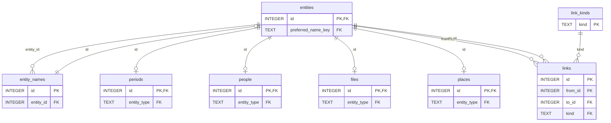
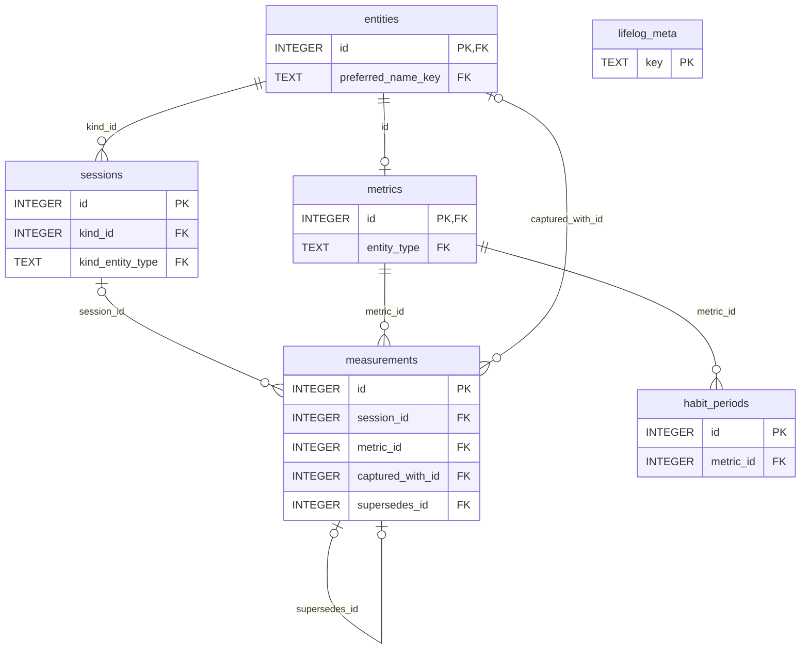

# Entity model

The diagrams draw tables, keys and relationships only; the other columns are in [schema](../schema/README.md). They are part of
the contract: `tests/` checks every table, key column and foreign key they draw against [schema](../schema/README.md), so a
diagram cannot drift from the DDL without a test failing. (`entities_fts`, the FTS5 index over `entity_search_content`,
is derived and rebuildable and is not drawn.)

## Entities and the graph

One named identity and prose body per linkable thing (`entities`), with authoritative spellings in
`entity_names` and a preferred selection checked by a deferred owner FK. A person, place, metric, file or
period is a page concept, not a separate prose row. Typed extensions reference `(id, entity_type)`
directly on `entities`; a place's point remains optional. The polymorphic `links` graph references
the same stable id and the closed `link_kinds` registry.

## Facts and registries

A reading is a fact, not an entity: `measurements` is append-only ([D7](../decisions/D07-measurements.md)). A correction is a new row, and
`measurements.supersedes_id` points back at the row it corrects; `measurements.captured_with_id` records
provenance (a mood reading points at its day page). `habit_periods` says when a metric is a habit
([D24](../decisions/D24-habits.md)). A metric is a page with a `metrics` row, as a person is a page with a `people` row ([D27](../decisions/D27-a-metric-is-a-page.md));
it is filed in a category, which is a page, by a `part-of` link ([D26](../decisions/D26-metric-categories.md)). `lifelog_meta` stands alone: the rules that span
tables ([D17](../decisions/D17-contract-as-data.md)).

