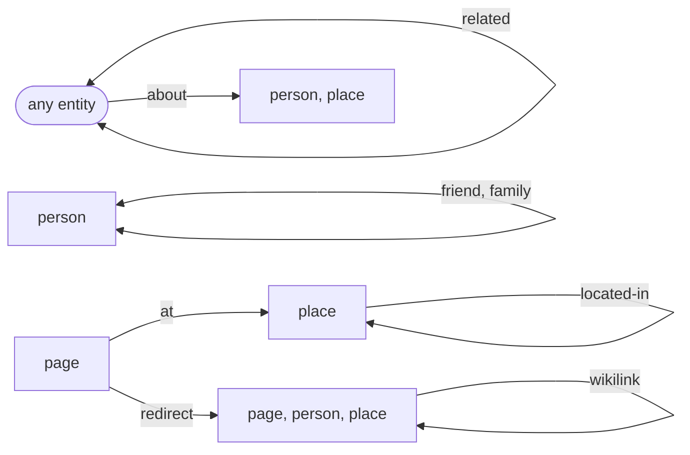

# Who may link what

An arrow is a `link_kinds` row; a double-headed arrow is a symmetric kind, mirrored by trigger so that one
direction suffices for backlinks. A node that names several types stands for each of them; `any entity`
is an endpoint with no restriction (`from_types` or `to_types` NULL).

