# The life of a page

A page starts as a ghost when a link names a title that does not exist yet, or as a written page when
the owner creates it on purpose — a day page when the first thing is captured that day ([D5](../decisions/D05-pages-and-day-pages.md)). Either can
become the page of a person, a place, a metric, a file or a period ([D20](../decisions/D20-named-pages.md), [D27](../decisions/D27-a-metric-is-a-page.md), [D9](../decisions/D09-binary-files.md)) — except a day page (`entities_day_page_plain`).

```mermaid
%% diagram: page-life
stateDiagram-v2
    direction LR
    state "Ghost (empty)" as Ghost
    state "Written page" as Written
    state "Named (person, place, metric, file, period)" as Named
    [*] --> Ghost: a link names a title that does not exist yet
    [*] --> Written: created on purpose, with a day, or the day page on the day's first capture
    [*] --> Named: a person, a place, a metric, a file or a period is created
    Ghost --> Written: body saved, the day unchanged
    Ghost --> Named: promoted, entities.entity_type changes
    Written --> Named: promoted unless a day page, entities.entity_type changes
    Written --> Written: body edited or appended to; owned preferred name selected
    Ghost --> Ghost: renamed, same id and body; old owned name retained
    Named --> Named: renamed, same id, details and links; old owned name retained
```

Rename never moves prose or incident links and never adopts another owner’s name; `#REDIRECT` is ordinary text ([rename a page](../cookbook/rename-a-page.md)).

Any row can be tombstoned (`entities.deleted_at`, [D11](../decisions/D11-tombstones.md)); a save whose link resolves a tombstoned title
revives that page instead of duplicating it ([save a body](../cookbook/save-a-body.md)). A ghost that nothing links to is listed by
`ghost_pages` after 30 days ([ghost pages](../cookbook/ghost-pages.md)) — the view only lists, tombstoning stays the owner's act.
