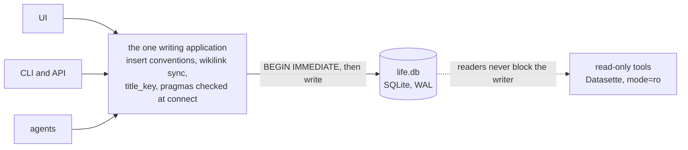

# Connection setup (every writer, mandatory)

```sql
PRAGMA journal_mode = WAL;     -- persistent; set once by the init DDL (schema/README.md)
PRAGMA synchronous  = FULL;    -- per connection. NORMAL in WAL "might roll back following a power loss" [R54]
PRAGMA foreign_keys = ON;      -- MANDATORY per connection: SQLite's default is OFF
PRAGMA recursive_triggers = ON;  -- MANDATORY per connection: with OFF, INSERT OR REPLACE / REPLACE INTO
                               -- deletes the conflicting row WITHOUT firing the append-only DELETE triggers
PRAGMA busy_timeout = 5000;    -- wait instead of failing instantly on SQLITE_BUSY
PRAGMA trusted_schema = OFF;   -- the schema may call only side-effect-free functions (all of this one's are)
```

A writer reads these back at connect time and refuses to run if `foreign_keys` or
`recursive_triggers` is 0 or `synchronous` is not 2 (FULL, executed; the default
of most builds, but set it anyway) — none of these is stored in the file, and `PRAGMA foreign_keys` is a silent no-op inside
a transaction (executed). It also refuses to run on a SQLite older than **3.51.3**: every version from
3.7.0 to 3.51.2, except the backports 3.44.6 and 3.50.7, has a WAL race in which a write that lands
while two checkpoints overlap can be lost — rare, but this design has several writer processes and
readers on one file, which is exactly the condition [R65](../research/references.md#r65). Migrations need 3.53 ([D13](../decisions/D13-migrations-and-freeze.md)).

Two more settings cost nothing. `SQLITE_DBCONFIG_DEFENSIVE` (a C-level switch, in Python
`conn.setconfig(sqlite3.SQLITE_DBCONFIG_DEFENSIVE, True)`) makes the FTS shadow tables and
`writable_schema` untouchable from SQL; with it and `trusted_schema = OFF` the whole schema and every
[cookbook](../cookbook/README.md) query still work (executed). `PRAGMA optimize` when a connection closes keeps the planner's
statistics fresh.

The driver must not open transactions of its own. Python's `sqlite3` in its default mode silently
sends a deferred `BEGIN` before the first `INSERT`/`UPDATE`/`DELETE`; open the connection with
`autocommit=True` (Python 3.12+) or `isolation_level=None` and issue `BEGIN IMMEDIATE` yourself.

**Every write transaction starts with `BEGIN IMMEDIATE`.** A deferred `BEGIN` that reads first —
resolve a wikilink, then create the page ([save a body](../cookbook/save-a-body.md)) — fails **at once** with `database is locked`
if another writer committed in between: `busy_timeout` does not apply to that lock upgrade
(executed). `BEGIN IMMEDIATE` takes the write lock up front, so a second writer waits
(up to `busy_timeout`) and then sees the first one's rows (executed). Keep such transactions short.

Readers must be **read-only** and set **`PRAGMA trusted_schema = OFF`** per connection, as writers do. Open the
file with `?mode=ro` (SQLite then refuses every write — `attempt to write a readonly database`, executed) or
`sqlite3 -readonly`; Datasette opens it read-only by itself. The pragma matters because a reader runs whatever schema
the file holds: with it OFF, a view that calls a function not marked side-effect-free fails (`unsafe use of …`)
instead of running it, and every [cookbook](../cookbook/README.md) query still runs on such a reader (both executed).
Under WAL a reader sees the live file while the app writes and never blocks it (executed). sqlite-web can edit rows, which would
make it a second writer, so it is not used ([D14](../decisions/D14-ui-and-tools.md)). Three reader traps [R65](../research/references.md#r65)[R66](../research/references.md#r66):
- **Never `immutable=1`** (Datasette's `-i`): it tells SQLite the file cannot change, so a reader of
  the live file sees stale or inconsistent pages while the app writes. Use the default `mode=ro`.
- **Keep read transactions short.** A checkpoint cannot reset the WAL while any reader holds a
  snapshot; a reader that never lets go makes `life.db-wal` grow without bound.
- **One machine, a local disk.** WAL needs shared memory between the processes, so `life.db` never
  lives on a network file system (NFS, SMB) or in a folder a sync client (Dropbox, Syncthing,
  iCloud) copies while it is open.

`life.db`, `life.db-wal` and `life.db-shm` are never committed to git: binary churn, and git
history cannot be scrubbed of health data.

"Single writing application" (principle 3, [D3](../decisions/D03-integer-ids.md)) does not mean a single OS process: the
app, its CLI, the API service and local agents are all the same *writer* as long as
they go through the one application stack that owns the insert conventions.


