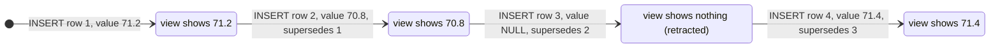

# Deletion and corrections

- **Life data is never deleted except `links` rows.** Entities are tombstoned
  (`entities.deleted_at`), and `BEFORE DELETE` triggers reject deleting an `entities` row or any
  domain row (measurements and habit periods included), also on a connection that forgot
  `foreign_keys` (executed). The registries — `metrics`, `link_kinds`, `lifelog_meta` — are the
  owner's administrative rows: an unreferenced one may be deleted, and each table's CREATE comment
  says so. Every read path filters `deleted_at IS NULL`. Junk captured by accident is tombstoned like
  everything else.
- **Readings are corrected by inserting, never by editing.** `measurements` rejects `UPDATE` and
  `DELETE`. A measurement is corrected by a row whose `supersedes_id` names it (at most one per row;
  correct the correction to change it again); a NULL `value` **retracts**. The view
  `measurement_values` is the read rule.
- **Imports insert with `ON CONFLICT(…) DO NOTHING`**, never `INSERT OR IGNORE` (it also skips rows
  that violate a CHECK or NOT NULL, silently) and never `OR REPLACE` (a delete, blocked only when
  `recursive_triggers=ON`, [connection setup](connections.md)) (both executed).

**A correction never overwrites.** One reading, corrected, retracted and restored — what
`measurement_values` shows after each insert ([correct a measurement](../cookbook/correct-a-measurement.md)).

