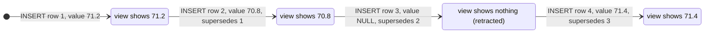

# Correct a wrong measurement (append-only)

```sql
-- Ordinary value correction copies scope and attribution from the prior row.
INSERT INTO measurements(metric_id,session_id,day,taken_at,tz,value,source,captured_with_id,supersedes_id,created_at)
SELECT metric_id,session_id,day,taken_at,tz,71.4,'ui',captured_with_id,id,strftime('%Y-%m-%dT%H:%M:%fZ','now')
FROM measurements WHERE id=:wrong_row_id;
-- Refuses a repeated correction; correct the leaf instead.

-- NULL retracts, retaining the same metric/session chain and attribution.
INSERT INTO measurements(metric_id,session_id,day,taken_at,tz,value,source,captured_with_id,supersedes_id,created_at)
SELECT metric_id,session_id,day,taken_at,tz,NULL,'ui',captured_with_id,id,strftime('%Y-%m-%dT%H:%M:%fZ','now')
FROM measurements WHERE id=:mistaken_row_id;
```

A correction never overwrites. [Scope relocation](../contract/measurement-scope.md) instead retracts the old
leaf and writes a new independent root atomically; it is not this value-correction operation.


