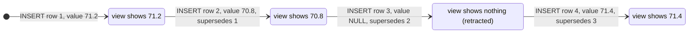

# Correct a wrong measurement (append-only)

```sql
-- never UPDATE the value; supersede it:
INSERT INTO measurements(metric_id, day, taken_at, value, source, supersedes_id, created_at)
VALUES (:metric_id, :day, NULL, 71.4, 'ui', :wrong_row_id, strftime('%Y-%m-%dT%H:%M:%fZ','now'));
-- rejected if :wrong_row_id belongs to a different metric, does not exist, or
-- was already corrected once (correct the correction instead)

-- a row that should never have existed (a mis-tap): RETRACT it — a correction with a NULL value.
-- measurement_values then hides both rows; to bring a value back, correct the retraction.
INSERT INTO measurements(metric_id, day, value, source, supersedes_id, created_at)
VALUES (:metric_id, :day, NULL, 'ui', :mistaken_row_id, strftime('%Y-%m-%dT%H:%M:%fZ','now'));
```

**A correction never overwrites.** One reading, corrected, retracted and restored — what
`measurement_values` shows after each insert.


