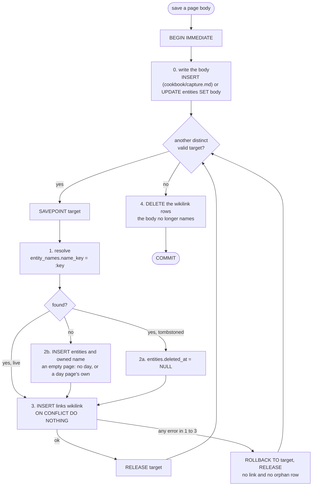

# Save a body with wikilinks (resolve or create each target, sync the links)

The app reads the body ([titles and wikilinks](../contract/titles-and-wikilinks.md)) and gets a list of distinct valid targets, each with `:title` (first
spelling, NFC) and `:key` (`title_key(:title)`). Everything below is **one `BEGIN IMMEDIATE`
transaction**: two writers that save the same new link cannot both see "none found" — the second
waits, then finds the first one's page. Each target is its own `SAVEPOINT`, so a target that fails for
any reason is rolled back alone (no link, no orphan `entities` row) and the save carries on ([D19](../decisions/D19-wikilink-save-contract.md)).



```sql
BEGIN IMMEDIATE;
-- 0) the body itself: the INSERT of cookbook/capture.md, or UPDATE entities SET body = :body WHERE id = :page_id;

-- for each target; after resolving, skip self and deduplicate by entity id, including aliases:
SAVEPOINT target;
-- 1) resolve an exact registry key; spelling is not identity
SELECT e.id, n.title, e.deleted_at
  FROM entity_names n JOIN entities e ON e.id = n.entity_id
 WHERE n.name_key = :key;

-- 2a) found, but tombstoned: revive it (the UI tells the owner the save revives a deleted page)
UPDATE entities SET deleted_at = NULL WHERE id = :found_id;
-- 2b) none found: create the empty page; no day (a link target is not something written today),
--     except a day page, whose day is its title (entities_day_page)
INSERT INTO entities(entity_type, preferred_name_key, day, created_at, updated_at, source)
VALUES ('page', :key, CASE WHEN date(:title) IS :title THEN :title END,
        strftime('%Y-%m-%dT%H:%M:%fZ','now'), strftime('%Y-%m-%dT%H:%M:%fZ','now'), :source)
RETURNING id;   -- the app keeps it as :target_id
INSERT INTO entity_names(entity_id, title, name_key)
VALUES (:target_id, :title, :key);

-- 3) link it (:target_id is :found_id, or the id 2b returned)
INSERT INTO links(from_id, to_id, kind, created_at, source)
VALUES (:page_id, :target_id, 'wikilink', strftime('%Y-%m-%dT%H:%M:%fZ','now'), :source)
ON CONFLICT(from_id, to_id, kind) DO NOTHING;
RELEASE target;   -- on any error in 1-3:  ROLLBACK TO target;  RELEASE target;  and go on

-- 4) once, after the last target: drop the links the body no longer names
--    (:target_ids is a JSON array of the ids linked in step 3, '[]' when there are none)
DELETE FROM links
 WHERE from_id = :page_id AND kind = 'wikilink'
   AND to_id NOT IN (SELECT value FROM json_each(:target_ids));
COMMIT;
```

`[[café NOTES]]` and `[[Café notes]]` produce the same `:key`, so both resolve to the one page;
`title` keeps the spelling of whoever created it. A target may be a person or a place: it is a
page ([D20](../decisions/D20-named-pages.md)). `:source` is the saving writer (`lifelog_meta.source`).
