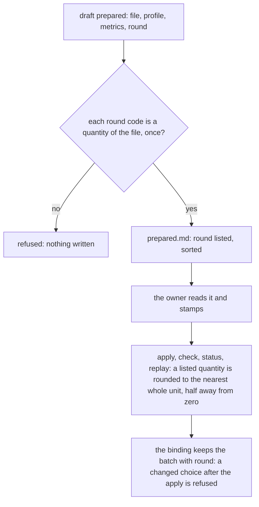

# 087 — The owner rounds chosen prepared quantities to whole units

> Dated implementation record, not permission to operate on real data. The owner runs every approval and replay.

## Status

- **Date / baseline:** 2026-10-09, `9fe97e5` (master).
- **Priority:** P2. **Effort:** S. **Risk:** LOW: an optional field that is empty by default; none for the schema
  (untouched).
- **Status:** DONE.
- **Resolves:** issue [0055](../issues/0055-prepared-values-keep-every-decimal.md). No RFC: no decision changes. The
  owner chose rounding at import, not at display, on 2026-10-09: calories, distance and mean heart rate.

## The change

| what | where |
|---|---|
| **`round` in the batch.** `PreparedBatch` gets an optional `round`: the quantity codes whose values are written as the nearest whole unit (half away from zero; `-0` is written as `0`). Each code is a quantity of the file, once; the draft sorts the list. An empty list rounds nothing, so a batch without the field reads as before. | `internal/importer/prepared_batch.go`, `prepared_selections.go` |
| **One place rounds.** `writePreparedAfter` rounds after it parses the source value, so apply, check, the dry-run verification of *status* and *replay* see the same value. The binding stores the batch with `round`, so a different choice after the apply is refused as a changed interpretation. | `internal/importer/prepared_batch.go` |
| **Every surface.** The `draft-prepared` action takes an optional `round` field (a JSON list of quantity codes); the CLI, MCP and browser get it from the catalog. | `internal/api/import.go` |
| **Docs.** The README section "Bounded source preparations" states the field; the guide says that the owner review binds any rounding the owner chose. | `README.md`, `docs/guides/importing.md` |

## Done criteria

1. Tests on a synthetic Fit daily CSV: with `round` of calories, distance and mean heart rate, the stored readings are
   the hand-checked whole values (`1789.3456789012` → 1789, `5432.5` → 5433, `72.5` → 73), steps unchanged; a second
   apply writes nothing; `status` shows no mismatch; a code that is not a quantity of the file, or a code twice, is
   refused; a changed `round` after the apply is refused and writes nothing; the action takes the field.
2. Baseline green on Windows: `go generate ./... && go vet ./... && go test ./...`.
3. The issue resolved and this plan DONE in the commit of the change.
