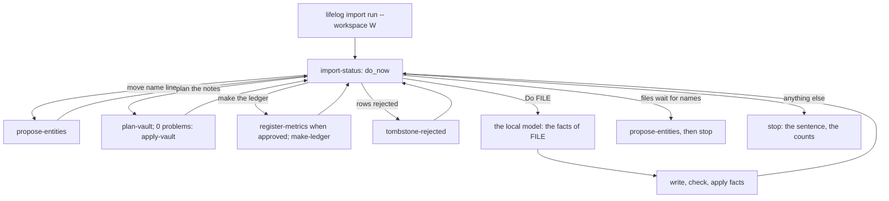

# 088 — The writer runs the facts pass with a local model: `lifelog import run`

> Dated implementation record, not permission to operate on real data. The owner runs every approval and replay,
> and runs the command on real sources; tests use synthetic data only.

## Status

- **Date / baseline:** 2026-10-09, `91f540f` (master).
- **Priority:** P1. **Effort:** L. **Risk:** MEDIUM for the import process (a new driver of existing operations),
  none for the schema (untouched).
- **Status:** PROPOSED.
- **Resolves:** issue [0057](../issues/0057-the-import-loop-lives-outside-the-writer.md); RFC
  [0010](../rfcs/0010-the-writer-drives-a-local-model.md), option A. The owner decided on 2026-10-09: a driver in
  the writer; the model on this machine only, with no override.

## The change

| what | where |
|---|---|
| **The model.** A small interface at the consumer; one implementation calls an OpenAI-compatible `POST /chat/completions` with `net/http` only: temperature 0, thinking off, a `max_tokens`, a bounded answer. The host must be loopback after resolution; no proxy, no redirect, no override. The model name is `--model`, or the one model the server lists. | `internal/importrun/model.go` |
| **The driver.** It follows *status* and runs each step of the table above through the catalog actions, in-process. The facts of a file: only `.md`, `.txt` and `.vcf` up to 60 000 characters go to the model (a `.vcf` in batches of cards); any other file stops the run. A refused write is kept as text with its class; a held write stays, and a write that waits for a held name; a `kept_as_text` entry whose quote is not in the file is dropped; at most 10 checks, then apply. No JSON: one retry with three times `max_tokens`, then the file stays to do. Held files whose names the owner decided apply without the model. stdout: counts and file paths; the refused details go to `run-refused.md` in the workspace. | `internal/importrun/run.go`, `facts-system.md` |
| **The command.** `lifelog import run --workspace W [--model-url URL] [--model NAME] [--max N] [--files a,b] [--max-tokens N]`; an interrupt rolls back the file in progress and stops. Not a catalog action, not an MCP tool. | `cmd/lifelog/main.go` |
| **Docs.** README (the command; a decision: the run loop, its guard, why it is terminal-only); the non-goals row; one sentence of the guide's "Three parties". | `README.md`, `docs/architecture/non-goals.md`, `docs/guides/importing.md` |

## Done criteria

1. Tests with a fake model on a synthetic notes folder through the production writer: a file applied; a refused
   write kept as text; a held name held, proposed, and the run stopped; after the stamp the held file applied with no
   model call; a bad `kept_as_text` quote dropped; no JSON retried once, then the file left to do; a fresh workspace
   planned, applied, registered and ledgered in one run; a plan with a problem stops before *apply vault*; a `.csv`,
   a `.pdf` or a long note stops the run with no model call; a rejected row tombstoned when status asks; a `.vcf` in
   batches.
2. The guard: a private address, a public name and a name that resolves to a non-loopback address are refused
   before any request.
3. A process test of the command against a loopback model: its exit code, counts on stdout with no synthetic name,
   and the rows written. The command is in neither the catalog nor the MCP tools.
4. Baseline green on Windows; `-shuffle=on` once.
5. The issue resolved, the RFC accepted and this plan DONE in the commit of the change.
