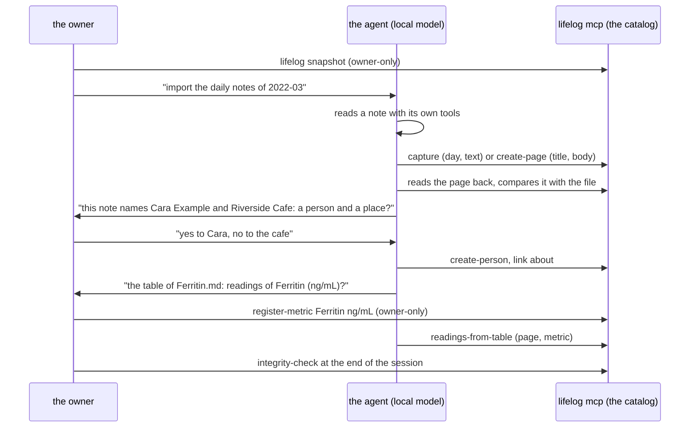

# 089 — No import process: the owner imports with an agent, through the catalog

> Dated implementation record, not permission to operate on real data. The owner and the owner's local agent do the
> import into the real database; tests use synthetic data only.

## Status

- **Date / baseline:** 2026-10-09, `2a5fcc0` (master).
- **Priority:** P1. **Effort:** L. **Risk:** MEDIUM: a large removal of working, tested code; LOW for the schema
  (one `lifelog_meta` text; no table or column).
- **Status:** DONE.
- **Resolves:** issue [0058](../issues/0058-the-import-machine-outweighs-the-backfill.md); RFC
  [0011](../rfcs/0011-no-import-process.md), option C. It replaces the commands of plans 083–088.

## The owner's decisions (2026-10-09)

| question | decision |
|---|---|
| what the life log is for, first | the notes and the journal; then people and places |
| imports | one backfill, done with a local agent (Pi) connected through **MCP**, in a conversation, with the owner approving as it goes |
| the notes | the agent reads each note and writes its page itself (`capture` for a daily note, `create-page` for a topic note); daily notes first |
| people and places | the agent suggests them during the import; the owner says yes or no; the agent writes them. No suggestions feature in the application |
| bloodwork | readings, by a fixed action that reads the page's table (no model types a number) |
| photos | a chosen photo per day with its place, with `lifelog file`, which exists |
| not imported | contacts, Keep, Fit |
| safety | a snapshot before a session; the integrity check after it; a restore undoes it |
| the old process | removed; git keeps it |
| `life.db` | deleted and rebuilt with the agent |
| the docs | mostly for the owner: the schema contract stays, the long import guide goes |

## How an import works after the change

The agent's brief (owner-local, `D:\LifeLog\AGENTS.md`) says how. The rules:
- one note at a time;
- copy the text exactly and check it by reading it back;
- never write a person, a place or a link without the owner's yes;
- never translate or "fix" the text;
- counts in its summaries, names only in the conversation with the owner;
- the model stays local.

## The one new action

**`readings-from-table`** (catalog action, on every surface; `lifelog readings PAGE METRIC [--column NAME]` is its
shortcut).

- **What it reads.** It reads a page already in the database, so it needs no file. It finds the page's first
  Markdown table with a column of days (`YYYY-MM-DD`) and the column of values: the only other column, or the one
  that `column` names.
- **Each row** with a day and a plain number becomes a reading of the registered metric. The unit is checked, never
  converted: it comes from the cell or from the column header, and it must be the metric's unit. A value of `<5`,
  a word, a comma decimal or a second row of the same day is reported, not written.
- **The key** is the page, the metric and the day, under a fixed source `import:table`, so a run from any surface
  finds what an earlier one wrote. A re-run writes nothing, and a later correction uses `correct`.
- **The answer** counts the readings written, those that existed already, and the rows reported, each with its
  reason.

## What goes

- **Code:**
  - `internal/importer`, `internal/importrun`, `internal/takeout` and `internal/inventory`;
  - `internal/api/import.go` and the workspace of the handler (`api.New(store, ws, …)` becomes `api.New(store, …)`);
  - the import tools of `internal/mcp`;
  - in `cmd/lifelog`: `import setup|approve|status|check|apply|replay|run|inventory|takeout`, the `--workspace`
    flag and `mcp --workspace`;
  - every test of these.

  `readings-from-table` keeps a small table parser of its own, taken from `source_evidence.go`: the cells, the day
  column, the number and the unit.
- **Docs:**
  - **The guide:** delete `docs/guides/importing.md`, with its links (`docs/README.md`, `building-a-writer.md`,
    `AGENTS.md`).
  - **The contract:** `contract/imports.md` says "an importer, a program or an agent, writes through the writer's
    operations; a snapshot first; a key for a row that may be sent twice". Its trial and workspace steps go, and
    the `imports` suite changes in the same commit.
  - **The freeze:** in D13 and in the `lifelog_meta.evolution` row of `schema.sql`, the freeze becomes "the first
    write to `life.db` that the owner keeps, which a schema rebuild would lose". `process.md`, "Before the freeze",
    item 6 changes the same way.
  - **Smaller mentions** of replay or workspaces: D3, D11, D25, the threat model, planning, and the non-goals row
    (back to "Cut from product scope by the owner").
  - **README:** the import commands and decisions are rewritten (one paragraph: an agent imports through the
    catalog; `readings-from-table`), and the sections "Bounded source preparations" and "Reviewed selected photo
    pairs" are removed.
  - **AGENTS.md:** the benchmark example (`internal/importer`) becomes one that still exists, and the `*.lifelog/`
    workspace leaves the privacy line.

## Schema candidates (the owner decides each before any cut)

| part | used by | proposal |
|---|---|---|
| `import_key` on entities, sessions, tasks, task_occurrences, measurements | any writer that may send a row twice; `readings-from-table`; an agent's `record` | keep |
| `sessions` (D22) | recorded periods; the Fit session profile was one writer of them | keep: a general idea |
| the `lifelog_meta.evolution` text | the freeze definition | reword (above); no structure changes |

No table, column, constraint or trigger exists only for the removed process.

## The freeze comes before the import the owner keeps

An agent's import is decided in a conversation, so no program can write it again. If the schema changes after
it, the rebuild of D13 would lose it. So the freeze, the start of additive migrations, comes **before the first
session the owner means to keep**. The checklist of `process.md` has open items today:
- issue 0048 is open;
- issues 0011–0014 and 0016–0021 are proposed;
- RFC 0006 is a draft;
- plan 071 is in review and plan 072 is blocked.

The owner chooses:
- **(a)** go through them first, then freeze, then import; or
- **(b)** do trial sessions on a throwaway database until then.

## Owner-local setup (after the merge; not in the repo)

1. `D:\LifeLog`:
   - rebuild `lifelog.exe`;
   - give Pi one MCP server, `lifelog mcp --db D:\LifeLog\life.db --agent pi`, in place of `--no-mcp`;
   - keep the model pinned to the local server;
   - rewrite `AGENTS.md` as the brief above;
   - rewrite `NEXT.md`;
   - archive the old scripts (`contacts.ps1`, `pictures.ps1`, `loop.ps1`).
2. The rebuild: a snapshot of the current `life.db`; delete `life.db` and its `-wal` and `-shm`; `lifelog init`; the
   freeze choice above; then the sessions with Pi, daily notes first.

## Done criteria

1. Tests of `readings-from-table` through the production writer, on synthetic pages:
   - the unit in the cells and in the header;
   - a unit that is not the metric's, refused;
   - `<5`, a word and a comma decimal reported;
   - two rows of one day reported;
   - a `column` that names one of two value columns;
   - a re-run that writes nothing;
   - the action on the CLI, the API (in-process and HTTP) and MCP.
2. Every removed command and action is gone from the catalog, the CLI help and the MCP tools. `lifelog mcp --agent
   pi` still serves every other action. The owner-only actions stay refused to an agent.
3. Docs:
   - the `document`, `diagrams` and `imports` suites are green;
   - every link resolves;
   - the counts in `tests/README.md` are true;
   - D13, the `evolution` row and `process.md` agree.
4. The baseline is green on Windows: `go generate ./... && go vet ./... && go test ./...`; `-shuffle=on` once.
5. The issue is resolved, the RFC accepted and this plan DONE in the commit of the change.
