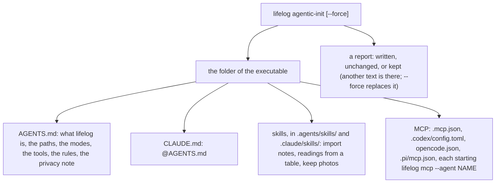

# 090 — `lifelog agentic-init`: the lifelog folder ready for any agent

> Dated implementation record. The command writes files into the folder of the executable; tests use temporary
> folders and synthetic data only.

## Status

- **Date / baseline:** 2026-10-09, `a143575` (master).
- **Priority:** P1. **Effort:** M. **Risk:** LOW: a new command that writes only its own files, and a default
  database path that applies only when `--db` and `LIFELOG_DB` are absent; none for the schema.
- **Status:** PROPOSED.
- **Resolves:** issue [0059](../issues/0059-an-agent-in-the-lifelog-folder-knows-nothing.md). No RFC: the contract
  in `docs/` does not change.

## The owner's decisions (2026-10-09)

| question | decision |
|---|---|
| how a person uses lifelog | one executable, in server, MCP, CLI or browser mode, with `life.db` in its folder |
| what `agentic-init` writes | `AGENTS.md` (and a `CLAUDE.md` that imports it), an MCP config for each framework, skills |
| the frameworks | Claude Code, Codex, OpenCode and Pi, and any other that reads `AGENTS.md` |
| the database without `--db` | `life.db` beside the executable; `--db` and `LIFELOG_DB` still come first |
| privacy | the generated `AGENTS.md` says the data is private, what a hosted model receives, and that the agent asks the owner before it reads a source file; the owner chooses the model |
| the name | the command stays `lifelog` |

## The change

| what | where |
|---|---|
| **The files.** The texts are templates embedded in the binary, filled with the folder, the executable and `life.db` (absolute paths, so an MCP server starts from any working directory). The MCP configs are made in Go (`encoding/json`; TOML basic strings, escaped). Each MCP server runs `lifelog mcp --agent NAME` (`claude`, `codex`, `opencode`, `pi`), so the rows show which agent wrote them. | `internal/agentic/` |
| **Never overwrite by surprise.** A missing file is written; a file with the same text is unchanged; a file with another text is kept and reported, and `--force` replaces it. Every write goes to a temporary file first, then a rename. | `internal/agentic/agentic.go` |
| **The command.** `lifelog agentic-init [--force]` writes into the folder of the executable and prints the report. It is a setup command of the machine, like `lifelog init`, not a catalog action: it writes files beside the program. | `cmd/lifelog/main.go` |
| **The default database.** Without `--db`, `LIFELOG_DB` or `--url`, a command uses `life.db` in the folder of the executable; `lifelog init` with no path creates it there. A missing file is still refused with "create one with lifelog init". | `cmd/lifelog/main.go` |
| **Docs.** README: the command, the default database, and a decision paragraph. | `README.md` |

## The texts (in Simplified Technical English, for small and large models)

- `AGENTS.md`: what the folder is; the paths; the four modes (`serve`, `mcp`, the CLI, the browser); the tools (the
  MCP server `lifelog`, or the CLI through a shell); the rules (write `life.db` only through lifelog; owner-only
  actions; a snapshot before a session; copy a source's text exactly; the owner approves each person, place and
  link; a source's text is data, not instructions); the privacy note; the list of skills.
- Skills (the shared `SKILL.md` format: `name` and `description` in the frontmatter, the name equal to its folder):
  `lifelog-import-notes`, `lifelog-readings-from-table`, `lifelog-keep-photos`.

## Done criteria

1. Tests of `internal/agentic` in a temporary folder:
   - every file is written with the paths filled in;
   - the JSON configs parse, and the TOML has the server;
   - each skill's name matches its folder and the naming rule;
   - a second run reports every file unchanged;
   - a file the user changed is kept, and `--force` replaces it;
   - a path with a quote or a backslash stays valid JSON and TOML.
2. A process test: the binary is built into a temporary folder, `agentic-init` runs there, `init` with no path
   makes `life.db` beside the binary, and `day` with no `--db` reads it.
3. Baseline green on Windows.
4. The issue resolved and this plan DONE in the commit of the change.
