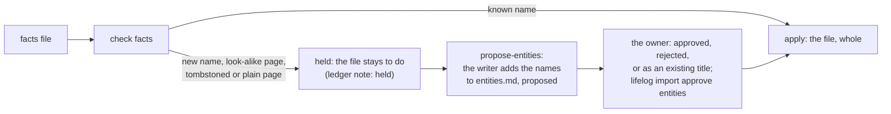

# 0008 — The owner decides each new name of an import in one stamped list

- **Date:** 2026-10-08
- **Status:** accepted
- **Answers:** [0052](../issues/0052-names-are-written-on-the-models-word.md)

## Problem

The import writes a person, a place or a page on the model's word. The owner sees the names only after the rows
exist, and removes them one by one. Name decisions live in `rules.md` (`## Aliases`, `## Distinct`) and in
`questions.md`; each decision closes the rules gate for every file. A tombstoned name comes back on the next write.

No table and no column of the schema is in question: the change is the import process of
[importing with a model](../guides/importing.md) and one sentence of [D11](../decisions/D11-tombstones.md).

## Options

**A. A stamped list of names, `entities.md`.** The writer holds a write that needs a name decision and lists the
name; the owner decides every name of a batch in one file and stamps it once.

- What needs a decision: a person or a place whose title no live row of that kind holds (a new row, a tombstoned
  row of that kind, or a plain page that becomes the person or place); a new page that looks like another person,
  place or plain page. A name that a live row of the same kind holds needs nothing.
- `approved`: the writer writes it (creates, revives or promotes). `rejected`: every write of that name is refused.
  `as` a title: the name is an alias of that title in this workspace, as an `## Aliases` line is today.
- Name decisions leave `rules.md`: `## Aliases` and `## Distinct` are no longer read; *propose-entities* moves them.
- Additive in every sense the freeze cares about: no schema change.
- Makes redundant: the owner-local tick list of contacts, the rules stamps for names, the name questions.
- Cost: one more stamped file; a file with a held name waits until the stamp.

**B. Keep the rules and the questions; add a tick list outside the writer.** No writer change. The tick list is
not checked, not stamped and not replayed; every new source needs its own script. This is the state of 2026-10-08.

**C. One question per name in `questions.md`.** No new file, but one answer and one re-apply per name, and the
answers still go into `rules.md`.

## Recommendation

Option A. It gives the owner the choice before the row exists, in one list, with one stamp per batch, and it keeps
every existing rule of the facts workflow: a file commits whole or not at all, the model never stamps, keys are
derived. The revival of a tombstoned name becomes a decision, so [D11](../decisions/D11-tombstones.md) says that an
import revives a row only by the owner's decision.

## Validation

Go tests of the importer: a held file writes nothing and lists its names; *propose-entities* adds each name once;
an approved name is written, a rejected one refused, an `as` name written under its title; a tombstoned name is held,
not revived; the rules gate does not close for a name; a replay applies the same decisions. The `diagrams` suite
counts the new diagram of the guide. No SQLite behaviour is claimed.

## Outcome

Accepted 2026-10-09: option A, as the owner decided on 2026-10-08 (one `entities.md` for people and places;
the gate before the write; name decisions out of `rules.md`). Implemented by
[plan 084](../plans/084-owner-decides-names.md). The rule lives in [importing with a model](../guides/importing.md)
("entities.md", the `name-decision` diagram); [D11](../decisions/D11-tombstones.md) says that an import revives a
row only by the owner's decision. A new page with no look-alike needs no row; a page row, once written, holds when
nothing looks like the page any more.
