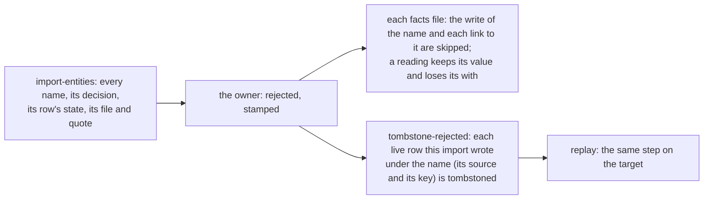

# 0009 — A rejected name is skipped, and the row the import wrote under it is tombstoned

- **Date:** 2026-10-09
- **Status:** draft
- **Answers:** [0053](../issues/0053-a-rejected-name-is-not-removed.md)

## Problem

A name that the owner rejects in `entities.md` refuses every file that writes it, and the row that the import wrote
earlier stays live. A tombstone by hand is not carried by a replay. Nothing lists the names of an import with their
evidence. No table and no column of the schema is in question: the change is the import process of
[importing with a model](../guides/importing.md) and one sentence of [D11](../decisions/D11-tombstones.md).

## Options

**A. Skip and tombstone.** A rejected name is a decision that the writer applies like an `as` row, before the checks.

- The file applies without the skipped writes; its ledger note counts them (`2 rejected`). A file is still written
  whole or not at all; the decision only removes writes before the transaction, as an `as` row changes titles.
- *tombstone rejected* binds to the rows this import wrote: its source and an import key that a done facts file
  derives. A row of another source, a row that the owner made, or a note page that the import promoted, is never
  touched. An agent may run it: it carries only the owner's stamped decisions, as *register metrics* does.
- *replay* runs the same step on its target after the facts; the rehearsal lists the rows.
- *status* says when rows of the import wait for *tombstone rejected*, and counts the rows of the import that are
  tombstoned on the trial while `entities.md` does not reject their names, since a replay writes them again.
- *import entities* (read only) lists every name: the decision, the state of its row in the database, how many done
  files write it, the first file and its quote.
- Cost: one action, one resource, one replay step. The class `rejected` goes away: a rejected name is not a refusal.

**B. Keep the refusal; add a terminal command that edits facts files.** The owner rejects a name and the command
removes its writes from every facts file. It changes the model's record of what a file states, and a facts file
is the model's. Rejected.

**C. Keep the refusal; the model removes rejected writes.** A loop or a model drops each refused write. Every replay
then depends on edits made by the model; the decision stays the owner's in name only. Rejected.

## Recommendation

Option A. The owner's decision is applied in one place, by the writer, on the trial and on every replay; the facts
files stay the model's record; a row of another source is never touched.

## Validation

Go tests of the importer: a done file whose name is rejected later applies without the name's writes and is no
mismatch; *tombstone rejected* tombstones only the rows this import wrote and writes nothing a second time; a replay
into a target that holds the row tombstones it, and into a fresh target never creates it; *status* counts the rows
to tombstone and the tombstones that a replay does not carry; *import entities* lists each name with its state and
evidence; the catalog action runs for an agent. No SQLite behaviour is claimed.

## Outcome

Filled in when it closes.
