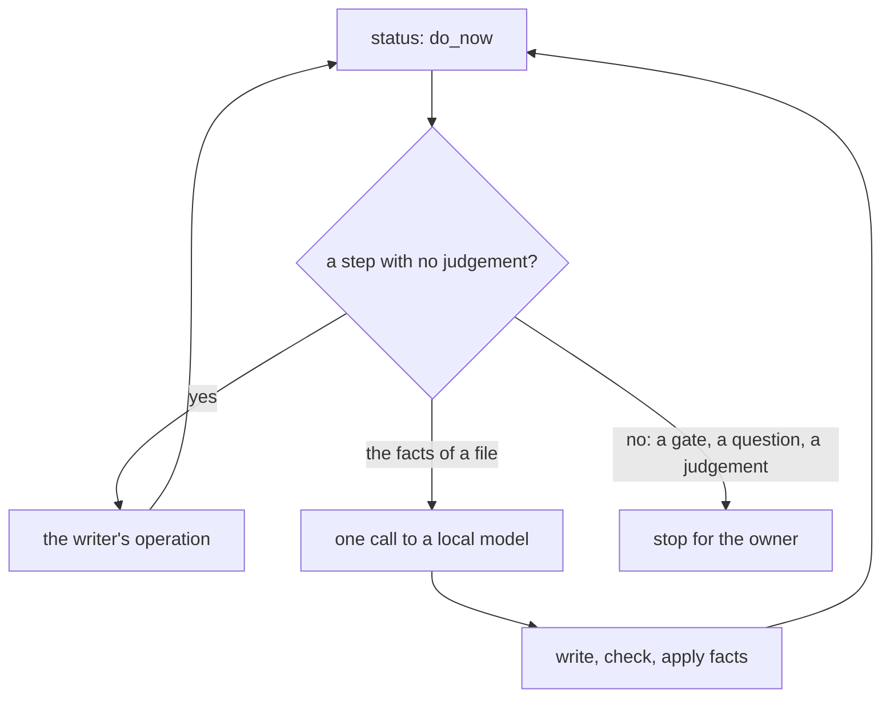

# 0010 — The writer drives a local model for the facts pass

- **Date:** 2026-10-09
- **Status:** accepted
- **Answers:** [0057](../issues/0057-the-import-loop-lives-outside-the-writer.md)

## Problem

The facts pass is a fixed loop around one narrow model call per file, but it lives in scripts outside the writer.
Those scripts leaked names to a party that must see counts only, dropped names the owner had to decide, and refused
whole files for a quote the model did not need. No schema change is in question. The questions are where the loop
lives, and whether a writer may call a model at all: the [non-goals](../architecture/non-goals.md) cut
"AI generation" from the product.

## Options

**A. A deterministic driver in the writer.** One command follows *status* and does each step that needs no judgement;
for the facts of one file it asks a model on this machine, then uses the writer's own operations.

- The model's job does not change: it reads one file and answers its facts. It never calls an operation.
- The writer sends a source's text only to a model on this machine (a loopback address); it refuses any other host.
- It is a command of the owner at a terminal, not an action of the catalog: it decides where a source's text goes.
- Cost: one package and one command in the writer, and their tests.

**B. A local agent runs the procedure.** The agent reads the guide and calls the operations itself. A small local
model is slow at it and slips; the loop stays untested. Rejected.

**C. An agent inside the writer.** The writer gives a model its tools and lets it choose the steps. It is not
deterministic and is hard to test, and a small model is weak at choosing tools. Rejected.

## Recommendation

Option A. The loop is fixed, so it belongs in tested code; the model keeps the one task it does well; the owner runs
it alone. The non-goals row keeps "AI generation" out: the model generates no content of the life log, it reports
what a source states, and the writer checks every fact against the source.

## Validation

Go tests of the writer with a fake model on a synthetic notes folder: each step the driver runs and each place it
stops; a held name stays held and is proposed; a refused write is kept as text; a `kept_as_text` quote that is not
in the file is dropped; a file of another kind never reaches the model; a host that is not loopback is refused
before any request; the command is in no catalog and no MCP tool list. No SQLite behaviour is claimed.

## Outcome

Accepted 2026-10-09: option A, as the owner decided (a driver in the writer; the model on this machine only,
with no override). Implemented by [plan 088](../plans/088-the-writer-runs-the-facts-pass.md). No decision of `docs/decisions/`
changes: the [non-goals](../architecture/non-goals.md) row on AI generation now says that a model reading a source
for an import generates nothing, and the guide's "Three parties" says that a writer may drive the model itself.
