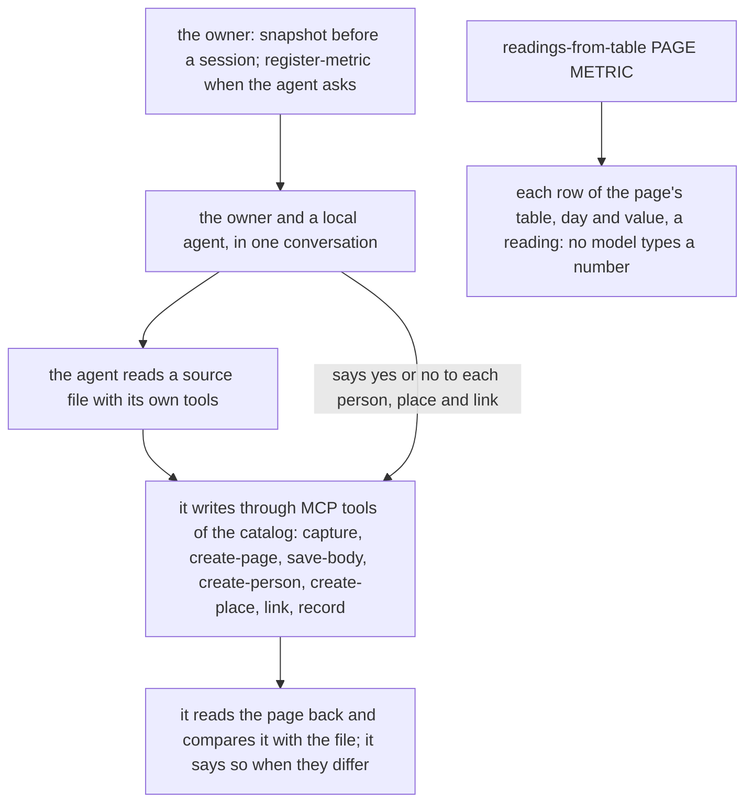

# 0011 — No import process: the owner imports with an agent, through the catalog

- **Date:** 2026-10-09
- **Status:** accepted
- **Answers:** [0058](../issues/0058-the-import-machine-outweighs-the-backfill.md)

## Problem

The import process was built so that a model's reading of every source file can be checked, approved and replayed
without the owner. For this owner the import is a backfill done once, and the owner wants to do it with an agent,
in a conversation, approving each step as it happens. The process costs more than the life log itself and fails
outside its own checks. No table or column is in question: `import_key` and `source` serve every writer that may
send a row twice. Two texts change with the process: the freeze of [D13](../decisions/D13-migrations-and-freeze.md)
and the `lifelog_meta` row `evolution`, which are defined by what an import workspace can replay.

## Options

**A. Keep the process** and add a browser page for the owner's decisions. About 12 000 lines to keep for a job done
once.

**B. Two fixed commands**: copy a folder of notes as pages, turn a page's table into readings; remove the process.
The copy is exact, but the owner's decisions about people and places still need a place to happen.

**C. Remove the process; an agent imports through the catalog, with the owner in the conversation.**

- Every write is an ordinary write of the catalog, on every surface, with the agent's provenance (`agent:<name>`).
  The owner-only actions stay the owner's: `register-metric` and `snapshot`.
- One new action, `readings-from-table`, on every surface: the owner or the agent names a page already in the
  database and a registered metric, and each row of the page's table with a day and a plain number becomes a reading,
  with a key from the page, the metric and the day, so a second run writes nothing. The unit is checked, never
  converted.
- Removed: workspaces, ledgers, facts files, the trial database, replay and rehearsal, the stamps, `entities.md`,
  `metrics.md`, `questions.md`, prepared profiles, selected photos, correction intents, `import run`, the ingest
  inventory, the Takeout inventory, the import tools of the MCP server, and the guide that describes them.
- Lost: a row's trace to a quote, replay onto another database, the exact copy of a note's text by code (the agent
  types the text, and its read-back check is the guard), Fit and contacts imports.

## Recommendation

Option C, as the owner decided on 2026-10-09: the agent works with the owner, so the owner's word replaces the
stamps. The freeze of D13 becomes "the first write to `life.db` that the owner keeps, which a schema rebuild would
lose"; an agent's import is such a write, so the freeze checklist comes before the first session that the owner
means to keep.

## Validation

Go tests of `readings-from-table` through the production writer: the unit in the cells and in the header, a unit
that is not the metric's, `<5`, a word, a comma decimal and two rows of one day reported, a re-run that writes
nothing, the action on the CLI, the API and MCP. The removed commands and actions are gone from the catalog, the CLI
help and the MCP tools. The `imports` suite changes with the contract page; the `document` suite with the removed
guide. No new SQLite behaviour is claimed.

## Outcome

Accepted 2026-10-09: option C, as the owner decided. Implemented by [plan 089](../plans/089-no-import-process.md).
It rewrites [D13](../decisions/D13-migrations-and-freeze.md) (the freeze) and [D11](../decisions/D11-tombstones.md)
(what an import revives) in place, with the `lifelog_meta.evolution` row and [imports](../contract/imports.md); it
replaces the commands of RFC [0010](0010-the-writer-drives-a-local-model.md) and of plans 083–088.
